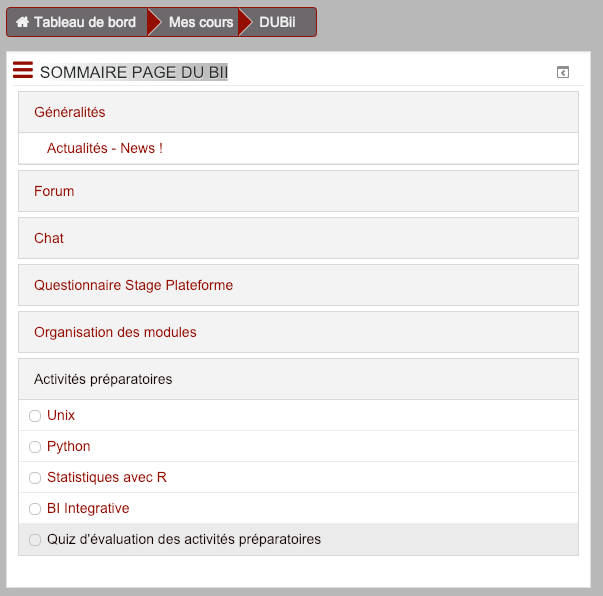
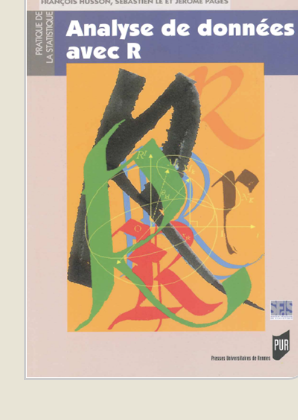
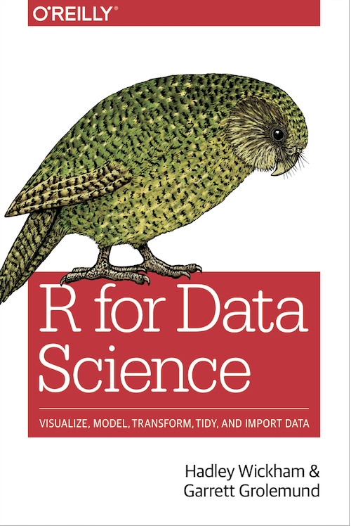
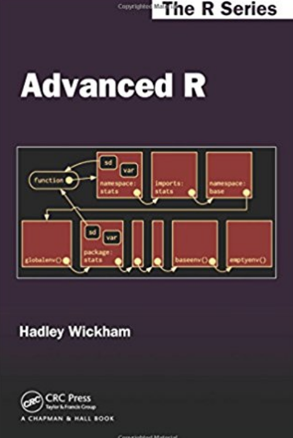
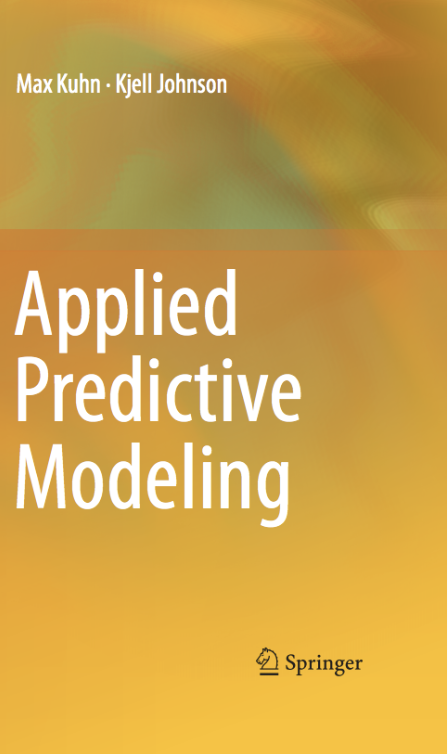

# [DUBii](https://du-bii.github.io/accueil/) - module 3 - Analyse statistique avec R

## Accès aux seances

| Séance | Contenu | Lien |
|------|-----------------------------------|------------------------|
| 1 | Premiers pas avec R | [seance_1](seance_1) |
| 2 | Analyse statistique avec R |  [seance_2](seance_2)|
| 3 | Analyse de données métagénomiques | [seance_3](seance_3) |
| 4 | Classification non supervisée (clustering) | [seance_4](seance_4) |
| 5 | Analyse différentielle de données RNA-seq | [seance_5](seance_5) |
| 6 | Classification supervisée (classement) | [seance_6](seance_6) |
|   | Travaux personnels | [travaux](travaux) |

## Table des matières

- [Accès aux séances](#acces-aux-seances)
- [Description](#description)
- [Planning 2019](#planning)
- [Prérequis](#prerequis)
- [Ressources](#ressources)
- [Synopsis](#synopsis)
    - [Séance 1. Introduction à R](#seance-1.-introduction-a-r)
    - [Séance 2; Analyse statistique avec R](#seance-2.-analyse-statistique-avec-r)
    - [Séance 3. Analyse de données métagénomiques](#seance-3.-analyse-de-donnees-metagenomiques)
    - [Séance 4. Clustering](#seance-4.-clustering)
    - [Séance 5. Analyse différentielle de données RNA-seq](#seance-5.-analyse-differentielle-de-donnees-rna-seq)
    - [Séance 6. Classification supervisée](#seance-6.-classification-supervisee)
- [Contributeurs](#contributeurs)
- [Accès aux supports de cours](#acces-aux-supports-de-cours)
- [Installation locale](#installation-locale)
- [Licence d'utilisation](#licence)


## Description

Supports du cours "Statistiques avec R" du Diplôme Universitaire en Bioinformatique Intégrative ([DUBii](https://du-bii.github.io/accueil/)).

### Prérequis

Nous demandons aux participants de suivre le premier module d'initiation à **R** sur *DataCamp*

- Connectez-vous au module "Introduction to R" sur DataCamp:  <https://www.datacamp.com/courses/free-introduction-to-r>
- Identifiez-vous (après avoir créé un compte si vous n'en avez pas)
- Faites les exercices du premier chapitre intitulé **Intro to basics**. 

En principe ceci devrait vous prendre une demi-heure. Vous pourrez prendre connaissance des éléments suivants
- syntaxe de R
- calculs de base 
- affectation de variables
- classes de variables (numériques, caractères, logiques)

Ces exercices vous permettront de vous sentir plus à l'aise lors des premières séances du cours.

### Validation des prérequis

Après avoir suivi le module d'intro à R dans DataCamp, nous vous demandons de valider l'aquisition des prérequis sur le site moodle du diplôme. 

- Connectez-vous au site Moodle de DU-Bii <https://moodlesupd.script.univ-paris-diderot.fr/enrol/index.php?id=10629> 

- Dans le sommaire, cliquez sur le lien *Activités préparatoires*. 

{:width="300px"}


### Compétences attendues à la fin du module 3 - Analyse statistique avec R

A la fin du module, les participants auront acquis les compétences suivantes.

- Maîtrise du langage R
    - charger des fichiers de données (généralement en format tabulaire), 
    - comprendre et maîtriser les structures de données courantes (vecteurs, matrices, data frames, ...),
    - exporter les résultats sous différents formats,
    - générer différents types de représentations graphiques
        - histogramme
        - box plot (boîte à moustaches)
        - violin plot
        - MA plot
        - volcano plot
        - courbes de Lorenz
        - PC plot
        - heatmap


- Analyse statistique
    - concevoir un plan d'analyse pour différents types de données biologiques à haut débit,
    - mettre en oeuvre ces analyses statistiques au moyen de scripts R, 
    - interpréter les résultats en les mettant en rapport avec les questions biologiques

    
- (Optionnel) Générer un rapport scientifique en format R markdown
    - intégration de blocs de code dans un texte formaté
    - assure la cohérence entre les résultats et figures (générés au vol), et le texte qui en fournit l'interprétation
    - assure la reproductibilité des analyses


## Planning DU-Bii 2019

<https://tinyurl.com/dubii19-planning>


## Ressources

- Serveur RStudio sur IFB core cluster: <https://rstudio.cluster.france-bioinformatique.fr/>

## Synopsis

### [Séance 1. Introduction à R](seance_1/README.md)

*Intervenants: Hugo Varet et Frédéric Guyon*

- Diapos et tutoriels: [seance_1](seance_1)

**Concepts:**
- Premiers pas avec R
- Statistiques descriptives
    - estimateurs de tendance centrale (moyenne, médiane)
    - estimateurs de dispersion (écart-type, IQR)
- Distributions théoriques de probabilité (discrètes et continues, grands principes, sachant que certaines seront approfondies dans d'autres séances)
- Quelques représentations graphiques (nuage de points, polynome des fréquences, histogramme)

**Travaux pratiques:**

- Manipulation de fonctions R
- Manipulation de distributions théoriques avec R (une discrète et une continue)
    - Poisson et Normale
    - rnorm(), dnorm(), qnorm(), pnorm(), 
    - Affichage d'histogrammes
        - superposer des distributions empiriques (rnorm) et théorique (dnorm)
        - pourquoi ne faut-il jamais utiliser density()
            - on perd les informations cruciales sur les irrégularités des classes
            - il ne s'agit pas d'un affichage de la distrib mais d'une fonction polynomiale ajustée sur les données -> dans certains cas on extrapole au-delà du domaine de définition des données
            - au mieux, une technique commerciale, au pire un outil de fraude scientifique


#### Compétences visées

- Familiarisation avec la syntaxe R
- Lecture, manipulation et écriture de tables
- Utilisation de quelques fonctions graphiques
    - plot
    - lines
    - hist
    - boîte à moustache
    - Exporter un plot dans un fichier pdf ou png
    - attirer l'attention sur la différence: vectoriel versus bitmap (zoomer à fond sur les figures produites)


### [Séance 2. Analyse statistique avec R](seance_2/README.md)

*Intervenants: Leslie Regad et Magali Berland*

Concepts:
- Echantillonnage et estimation
- Tests d'hypothèse
- Représentations graphiques

Applications: 
- Présentation d'un panorama des tests statistiques existants, exercices d'applications

- Réduction de dimensionalité, visualisation / positionnement (multidimensional scaling)
    - ACP avec factoMineR et factoextra pour les représentations graphiques
    - Choix et calcul d'une distance, représentation avec une PCoA

### [Séance 3. Analyse de données métagénomiques](seance_3/README.md)

*Intervenants: Magali Berland (& ...)*

- Concepts
    - appliquer des milliers de tests d'hypothèse en parallèle
    - problèmatique des tests multiples et corrections
          - le problème de la p-valeur "nominale" (proba de FP pour un test donné)
          - FPR = proportion de FP sur l'ensemble des tests $\hat{FPR} = pval$
          - E-valeur (mesure du problème: $E = p \cdot T$) : nb de FP attendus sur l'ensemble de la batterie de tests
          - FDR = proportionde FP attendus sur l'ensemble des cas déclarés positifs
          
 

### [Séance 4. Clustering](seance_4/README.md)

*Intervenants: Frédéric Guyon & Anne Badel & Jacques van Helden*


#### Clustering

- Concepts

    - Approches de clustering: hiérarchique, K-means
    - Hiérarchique: critères d'agglomération (single, average, complete)
    - Métrique de (dis)similarité: Euclidienne, corrélation, dot product
    - Complexité des algorithmes
    - Evaluation du clustering
        - Comment choisir le nombre de groupes  (concepts, pas de pratique) ?
    - Comparaison de résultats de clustering: table de contingence entre
        - résultats obtenus par différentes méthodes
        - clustering avec tous les gènes vs les X gènes différentiellement exprimés
        - résultats de clustering et classes de référence (données TCGA)
    - Mesures de performance (avant-goût de la séance sur la classification supervisée)
        - Pour le clustering: Adjusted Rand Index (ARI)
        - Pour comparer à des classes de référence
            - Mesures à 2 classes: FP, FN, TP, TN, Sens (coverage, recall) + PPV ("précison"), Accuracy
            - Mesures multi-groupes: hit rate, MER, f-measure
            - Courbes de ROC, AUC
            - Courves Precision-recall
    - Visualisation (heat maps, arbres, PCs)
    - Impact de la dimensionalité: 


- Applications

    - Clustering et heat-maps de densités de reads autour des pics ChIP-seq (marques épigénétiques, facteurs transcriptionnels) avec K-means
    
    - Clustering hiérarchique de données d'expression pour identifier les groupes de gènes co-exprimés
        - TCGA visualisation des profils temporels (on choisir un type de cancer et on fait des heatmaps en fonction des stades)


- Messages

    - Différentes méthodes sont appropriées pour différents types de données
    - Outre la méthode, fort impact des paramètres sur les résultats

    
### [Séance 5. Analyse différentielle de données RNA-seq](seance_5/README.md)

*Intervenants: Jacques van Helden + Claire Vandiedonck (à confirmer)*

#### Détection de gènes différentiellement exprimés

- Concepts

    - visualisation des résultats globaux  (MA plots, volcano plots, histogrammes de p-vlaeurs)
    - évaluation de l'impact des choix de logiciels et paramètres 
    - comparer les projections ACP avec tous les gènes et avec la sélection de gènes différentiellement exprimés
        - coloration des classes pour évaluer la pertinence de la sélection de variables


- Application

    - Normalisation des données RNA-seq
        - standardisation des tailles de librairies (scaling)
        - transformation log
        - visualisation des résultats par box plots + violin plots
        
        
- Cas d'étude

    - *Saccharomyces cerevisiae*: sporulationhb 


    - TCGA: 
        - détection de gènes différentiellement exprimés entre deux groupes (types de cancer, stades)
        - analyse différentielle entre plusieurs groupes (types de cancer, stades)
    - *Escherichia coli* FNR study case: détection de gènes différentiellement exprimés entre deux conditions (aérobie / anaérobie; sauvage versus mutant FNR)
    
    
### [Séance 6. Classification supervisée](seance_6/README.md)

<<<<<<< HEAD
*Intervenants:Leslie Regad et Frédéric Guyon*
=======
*Intervenants: Jacques van Helden, Frédéric Guyon et Leslie Regad*
>>>>>>> e8372d03203118bc033ac6900fb0bafdd114ff40

- Cas d'étude: transcriptome de cancer (données TCGA)

- Méthodes: Random Forest, SVM, neural networks

- Concepts:

    - Approches de classification supervisées
    - Entraînement / test
    - Evaluation des résultats (évaluation croisée, mesures de performance)

- Messages

    - SVM: importance du choix du noyau, et des paramètres
    - RF: interprétabilité des résultats, score d'importance des variables.
    - réseaux neuronaux: complexité


### Responsables

1. Anne Badel, Université Paris Diderot
2. [Jacques van Helden](https://orcid.org/0000-0002-8799-8584), Institut Français de Bioinformatique, Aix-Marseille Université

### Autres intervenants

3. Magali Berland, MetaGenoPolis, INRA
4. Frédéric Guyon, Université Paris Diderot
5. Leslie Regad, Université Paris Diderot
6. Claire Vandiedonck, Université Paris Diderot
7. Hugo Varet, Institut Pasteur

### Calendrier 2019

Calendrier du DUBii : <https://goo.gl/MVEA4q>

## Accès aux supports de cours

- Web: <https://du-bii.github.io/module-3-Stat-R/>
- Github (sources): <https://github.com/DU-Bii/module-3-Stat-R/>

## Un peu de bibliographie

{:width="100px"} "Analyse de données avec R", Husson, F., S. Lê et Pagès J. (2009) Analyse de données avec R. Presses Universitaires.

{:width="100px"} "Statistiques avec R", 3ème édition augmentée en couleurs, Cornillon P.A., Guyader A., Husson F., Jégou N., Josse J., Kloareg M., Matzner-Løber E., Rouvière L. (2012) Presses Universitaires de Rennes.

{:width="100px"} "R for Data Science", Hadley Wickham & Garrett Grolemund, O’Reilly [lien](https://r4ds.had.co.nz/index.html)

{:width="100px"} "Advanced R", Hadley Wickham, Chapman & Hall/CRC The R Series [lien](http://adv-r.had.co.nz/)

{:width="100px"} "Applied Predictive Modeling", Max Kuhn & Kjell Johnson, Springer

## Installation locale

Ces supports de cours peuvent être installés sur votre propre ordinateur en faisant un clone du dépôt git. 

### Contributeurs (membres de l'équipe)

```sh
git clone git@github.com:DU-Bii/module-3-Stat-R.git
```

### Non-membres de l'équipe

```sh
git clone https://github.com/DU-Bii/module-3-Stat-R.git
```


## Licence


Ce contenu est mis à disposition selon les termes de la licence [Creative Commons Attribution - Partage dans les Mêmes Conditions 4.0 International](https://creativecommons.org/licenses/by-sa/4.0/deed.fr) (CC BY-SA 4.0). Consultez le fichier [LICENSE](LICENSE.txt) pour plus de détails.


This content is released under the [Creative Commons Attribution-ShareAlike 4.0 ](https://creativecommons.org/licenses/by-sa/4.0/deed.en) (CC BY-SA 4.0) license. See the bundled [LICENSE](LICENSE.txt) file for details.

