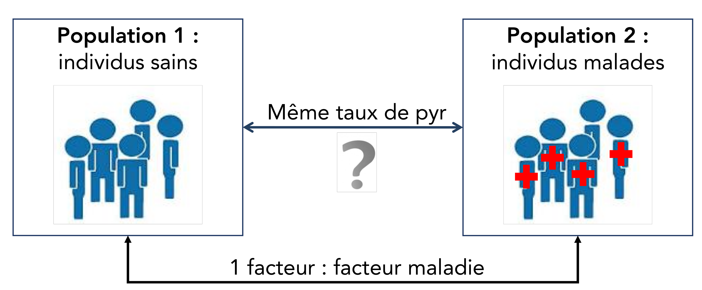
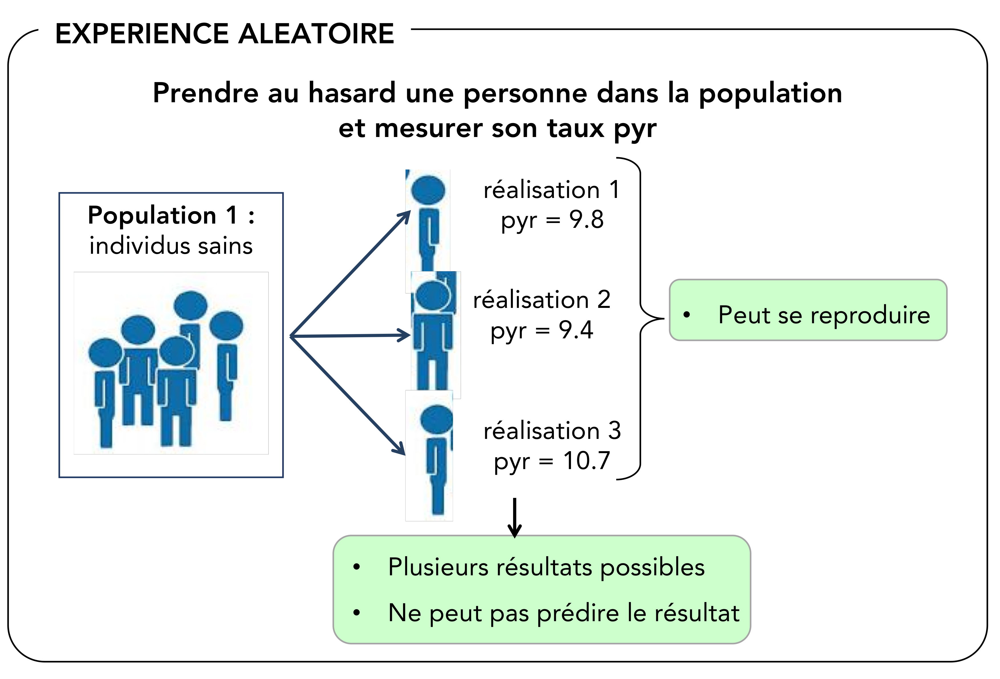
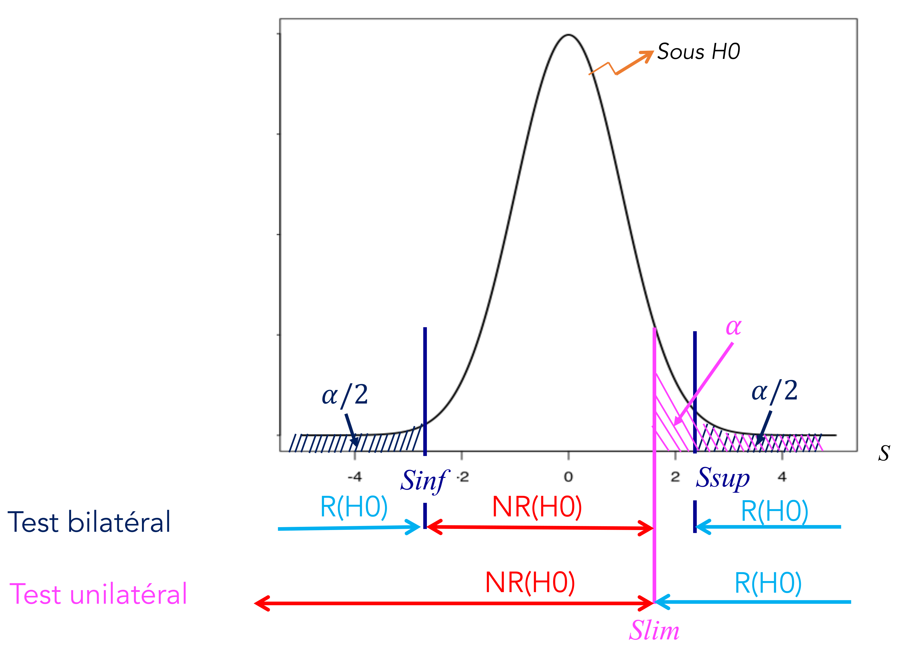

```{r include=FALSE, echo=FALSE, eval=TRUE}
library(knitr)
library(kableExtra)
library(png)
library(grid)
# library(formattable)

options(width = 300)
# options(encoding = 'UTF-8')
knitr::opts_chunk$set(
  fig.width = 7, fig.height = 5, 
  fig.path = 'figures/07_tests_multiples',
  fig.align = "center", 
  size = "tiny", 
  echo = TRUE, eval = TRUE, 
  warning = FALSE, message = FALSE, 
  results = TRUE, comment = "")

options(scipen = 12) ## Max number of digits for non-scientific notation
# knitr::asis_output("\\footnotesize")

```


## Etude de cas : le myélome multiple (MM)
<style>
  .col2 {
    columns: 2 200px;         /* number of columns and width in pixels*/
    -webkit-columns: 2 200px; /* chrome, safari */
    -moz-columns: 2 200px;    /* firefox */
  }
  .col3 {
    columns: 3 100px;
    -webkit-columns: 3 100px;
    -moz-columns: 3 100px;
  }
</style>

* Prolifération incontrôlée des plasmocytes $\rightarrow$ **Affection de la moelle osseuse** 

<div class="col2"> 
<center>
{width=72%}
</center>

* Cancer relativement **rare**
* Touche proportionnellement davantage les hommes que les femmes
* Atteint principalement les personnes âgées de plus de 60 ans et survient rarement avant 40 ans
</div>

* Symptômes 
    + plasmocytes malins prennent peu à peu la place des autres cellules sanguines :  
$\rightarrow$ **diminution de l’immunité humorale**, anémie, infections, risque d’ecchymoses, ...

    + **Destruction osseuse** qui résulte de la décalcification en certains endroits du squelette  
$\rightarrow$ **fractures** peuvent aisément se produire à ces endroits  


## Question statistique 
<div style="float:left;width:75%;">
**Est-ce le dosage molécule déoxypyridinoline (pyr) est un bon marqueur pour détecter la maladie ?**   
</div>  
<div style="float:right;width:25%;">   
{width=40%}   
</div>   


$\quad$   

$\rightarrow$ est-ce que le taux de pyr des patients malades est plus grand que celui des individus sains ?

<center>
{width=70%}    
</center>

$\quad$   

**Population** = ensemble d’individus ayant des caractéristiques qui leur sont propres 

## Experience aléatoire / variable aléatoire
<center>
{width=60%}
</center>

* Que mesure-t-on lors de l'expérience : $X$ = 'le taux de pyr' $\rightarrow$ **Variable aléatoire**
* Sur qui/quoi la variable aléatoire est mesurée : '1 patient' $\rightarrow$ **Unité statistique**


##Variables aléatoires (VA)

* Notations : 
    + Variable aléatoire : $X$
    + Ses valeurs : $x_i$ 


* Caractérisée par son **espérance** et sa **variance**
    + **Espérance** ($E(X)$) : caractérise la tendance centrale, la valeur moyenne, prise par la VA
    + **Variance** ($V(X)$) : caractérise la dispersion de la variable autour de son espérance

<center>
{width=50%}
</center>  


## Cas d'étude
<center>
**Question biologique**    

Est-ce que le taux de pyr des patients malades est plus grand que celui des individus sains ?
</center>  

$\quad$

* X ="Taux de pyr"
* US = un individu
* type = quantitative continue

<center>
{width=70%}
</center>  


## Cas d'étude : présentation des données

```{r}
dataMyelom <- read.table("data/myelom.txt", sep="\t", header=T)
dim(dataMyelom)
colnames(dataMyelom)
```


```{r}
str(dataMyelom[,c("diagn", "pyr")])
```


* `diagn` = 0 $\rightarrow$ individus non malades   
* `diagn` = 1 $\rightarrow$ patients malades  


## Description des deux échantiilons

* taille des échantillons
```{r}
table(dataMyelom[,"diagn"])
```

* échantillon 1 : `r length(which(dataMyelom[,"diagn"]==0))` individus sains
```{r}
ind.sain <- which(dataMyelom[,"diagn"]==0)
pyr0 <- dataMyelom[ind.sain,"pyr"]
```
  
* échantillon 2 : `r length(which(dataMyelom[,"diagn"]==1))` patients malades

```{r}
ind.malade <- which(dataMyelom[,"diagn"]==1)
pyr1 <- dataMyelom[ind.malade,"pyr"]
```


## Description des deux échantillons

* distribution de pyr dans les deux échantillons

```{r fig.height = 3}
par(mar=c(3,3,1,1))
boxplot(pyr~diagn, data=dataMyelom)
```


## Estimation de paramètres
<div class="col2">

* estimateur de l'espérance : 
$$ \widehat{\mu} = m = \frac{\sum_{i=1}^{n}x_i}{n}$$

* estimateur de la variance : 
$$ \widehat{\sigma^2} = s^2 = \frac{1}{n-1} \sum_{i=1}^{n}(x_i-m)^2$$
</div>


* calcul de la moyenne de pyr dans les deux échantillons
```{r}
by(dataMyelom[,"pyr"], dataMyelom["diagn"], mean)
```

## Estimation de paramètres
<div class="col2">

* estimateur de l'espérance : 
$$ \widehat{\mu} = m = \frac{\sum_{i=1}^{n}x_i}{n}$$

* estimateur de la variance : 
$$ \widehat{\sigma^2} = s^2 = \frac{1}{n-1} \sum_{i=1}^{n}(x_i-m)^2$$
</div>


* calcul de la variance de pyr dans les deux échantillons
```{r}
by(dataMyelom[,"pyr"], dataMyelom["diagn"], sd)
```


##Quelle confiance donner aux résultats ?  

* 1 population : $X \sim \mathcal{N}(\mu=14.3 ; \; \sigma^2=24.6)$
* Tire 1000 échantillons dans la population et calcule la moyenne de $X$ dans les échantillons

```{r  fig.height = 4}
nb.simul <- 1000 ; val.mean <- rep(NA, length = nb.simul)
for(i in 1: nb.simul){
  ech <- rnorm(n = 100, mean=14.3, sd = sqrt(24.6)) ;   val.mean[i] <- mean(ech)
}
hist(val.mean,xlab="estimateur de mu", main=paste(nb.simul,"simulations", sep=" "),breaks=20)
```

## Estimation d'un paramètre : Intervalle de confiance (IC) 

<div style="float:left;width:60%;"> 
* Apporte deux informations :
    + les valeurs possibles du paramètre $\theta$ à estimer
    + le degré de confiance attribué à ces valeurs  
</div>

<div style="float:right;width:40%;"> 
* Prend en compte 
    +  la **variabilité** des données     
    +  la **taille de l’échantillon**   
</div>   
$\quad$

* **IC de la moyenne** = intervalle $[m_{inf}; m_{sup}]$ dans lequel on considère que $\mu$  a une probabilité $(1-\alpha)$ de se trouver 


<div class="col2">
$$ p(m_{inf} < \mu < m_{sup}) = 1- \alpha $$  
{width=70%}
<center>
```{r echo=FALSE, fig.width = 4, fig.height=2.5, eval = FALSE }
par(mar=c(4,4,1,1))
vx <- seq(-1,5, by=0.01)
vy <- dnorm(vx, mean = 2, sd = 0.6)
plot(vx, vy, type ="l", ylab="f(m)", xlab="M", lwd=2 )
```
</center>


</div>
##IC de la moyenne : 2 cas

* si  $n > 30$: 
$$IC_{1-\alpha} = M \pm z_{1-\frac{\alpha}{2}} \times \sqrt{ \frac{s^2}{n} }$$    
    + $z_{1-\frac{\alpha}{2}}$ : quantile de la loi normale centrée réduite d'ordre $\alpha$


$\quad$

* si $n < 30$ et $X \sim \mathcal{N}(\mu; \sigma^2)$
$$IC_{1-\alpha} = M \pm t_{\alpha ; \textrm{(n-1)ddl}} \times \sqrt{\frac{s^2}{n}}$$
    + $t_{\alpha ; \textrm{(n-1)ddl}}$ : quantile de la loi de student d'ordre $\alpha$ à $(n-1)$ degrés de liberté 


  
  
## IC du taux de pyr

* **échantillon 1** : 15 patients sains 

```{r}
alpha <- 0.5
borneInf.0 <- mean(pyr0) - qt(1-alpha/2, df=(length(pyr0)-1)) * sqrt(var(pyr0)/length(pyr0)) 
borneSup.0 <- mean(pyr0) + qt(1-alpha/2, df=(length(pyr0)-1)) * sqrt(var(pyr0)/length(pyr0)) 
round(c(borneInf.0, borneSup.0),2)
```
  
* **échantillon 2** : 14 patients atteints de MM 

```{r}
borneInf.1 <- mean(pyr1) - qt(1-alpha/2, df=(length(pyr1)-1)) * sqrt(var(pyr1)/length(pyr1)) 
borneSup.1 <- mean(pyr1) + qt(1-alpha/2, df=(length(pyr1)-1)) * sqrt(var(pyr1)/length(pyr1)) 
round(c(borneInf.1, borneSup.1),2)
```


```{r echo=FALSE, fig.width=6, fig.height=2}
par(mar=c(4,2,1,2))
plot(10.5:17.5, 10.5:17.5, type = "n", yaxt="n", ylim = c(16,18.5), ylab="", xlab="Pyr values", xlim=c(5, 8))
segments(borneInf.0,17, borneSup.0, 17, lwd=2, col = 2)
segments(borneInf.1,17, borneSup.1, 17, lwd=2, col = 3)
text(5.7,17.5,"IC1", col=2)
text(7.2,17.5,"IC2", col=3)
```


## Cas d'étude : Introductions aux tests statistiques
 
<center> 
  {width=65%}
</center>


$\quad$    
  

* 2 possibilités pour expliquer les différences entre $m_1$ et $m_2$ $\rightarrow$ 2 hypothèses   
    + elles s'expliquent seulement par **le hasard** (fluctuations d'échantillonnage) : H0 (hypothèse nulle)
    + elles s'expliquent par le **hasard** et par le **facteur maladie** : H1 (hypothèse alternative)

  
## Déroulement d'un test statistique
  
* Définit deux hypothèses sur un des paramètres de la VA
    + **hypothèse nulle (H0)** : égalité des paramètres : <span style="color: #8f8f8f">$\mu_1 = \mu_2 = \mu$ </span>  
    Les différences observées sont expliquées uniquement par le hasard   
    + **hypothèse alternative (H0)** : égalité des paramètres : <span style="color: #8f8f8f">$\mu_1 < \mu_2$ </span>  
    Les différences observées sont expliquées uniquement par le hasard et par le facteur   
    
  
$\quad$
    
<center>
**Réaliser le test va consister à choisir une des deux hypothèses (H0 ou H1) en se basant sur les données des échantillons**   
</center>  

$\quad$  
$\rightarrow$ Est-ce que les données des échantillons ($m_1$ et $m_2$) sont compatibles avec H0 ?  

* si oui $\rightarrow$ non rejet de H0  
* si non $\rightarrow$ rejet de H0
    
    
## Est-ce que les données sont compatibles avec H0 ?
    
* **H0 : Hypothèse de référence** : $\mu1 = \mu_2$  
$\rightarrow$ calculer la probabilité d'obtenir sous H0 le même résultat que celui observé sur les échantillons = **p-value**  
1. Définir un **critère statistique** $S$ dont la loi sous H0 est connue  
<span style="color: #8f8f8f"> $S = M_1 - M_2$  avec $M$=moyenne de $X$ dans 1 échantillon   </span>    

2. Calculer $s_{obs}$ = valeur de $S$ calculée sur les échantillons : <span style="color: #8f8f8f"> $s_{obs} = m_1 - m_2$   </span>   

```{r echo=FALSE, fig.width = 6, fig.height=3.5 }
par(mar=c(4,4,1,1))
vx <- seq(-1,5, by=0.01)
vy <- dnorm(vx, mean = 2, sd = 0.6)
plot(vx, vy, type ="l", ylab="f(s)", xlab="S", lwd=2 )
```
  
## Est-ce que les données sont compatibles avec H0 ?

* **H0 : Hypothèse de référence** : $\mu1 = \mu_2$  
$\rightarrow$ calculer la probabilité d'obtenir sous H0 le même résultat que celui observé sur les échantillons = **p-value**  
  

1. Définir un **critère statistique** $S$ dont la loi sous H0 est connue  
<span style="color: #8f8f8f"> $S = M_1 - M_2$  avec $M$=moyenne de $X$ dans 1 échantillon   </span>    

2. Calculer $s_{obs}$ = valeur de $S$ calculée sur les échantillons : <span style="color: #8f8f8f"> $s_{obs} = m_1 - m_2$   </span>   


<div class="col2">
```{r echo=FALSE, fig.width = 5.5, fig.height=3.5 }
par(mar=c(4,4,1,1))
vx <- seq(-1,5, by=0.01)
vy <- dnorm(vx, mean = 2, sd = 0.6)
plot(vx, vy, type ="l", ylab="f(s)", xlab="S", lwd=2 )
abline(v=2.1, col = 2, lwd=2)
text(2, 0.07, "sobs", col=2, srt=90)
  
bons = which(vx > 2.1)
x.bons <- vx[bons]
y.bons <- vy[bons]
  
polycurve <- function(x, y, base.y = min(y), ...) {
polygon(x = c(min(x), x, max(x)), y = c(base.y, y, base.y), ...)
}
  
polycurve(x = x.bons, y=y.bons, base.y = 0, col = 'cyan' , border=NA)
lines(vx,vy, lwd=2)
legend("topright", "p(S> sobs)", pch=15, col="cyan", cex=1)
```
 
3. Calculer la **p-value** = $p(S>s_{obs})$  

* forte valeur de p-value $\rightarrow$ : $s_{obs}$ est fortement probable sous $H0$
 </div>
  
  


## Est-ce que les données sont compatibles avec H0 ?

* **H0 : Hypothèse de référence** : $\mu1 = \mu_2$  
$\rightarrow$ calculer la probabilité d'obtenir sous H0 le même résultat que celui observé sur les échantillons = **p-value**  
  

1. Définir un **critère statistique** $S$ dont la loi sous H0 est connue  
<span style="color: #8f8f8f"> $S = M_1 - M_2$  avec $M$=moyenne de $X$ dans 1 échantillon   </span>    

2. Calculer $s_{obs}$ = valeur de $S$ calculée sur les échantillons : <span style="color: #8f8f8f"> $s_{obs} = m_1 - m_2$   </span>   


<div class="col2">
```{r echo=FALSE, fig.width = 5.5, fig.height=3.5 }
par(mar=c(4,4,1,1))
vx <- seq(-1,5, by=0.01)
vy <- dnorm(vx, mean = 2, sd = 0.6)
plot(vx, vy, type ="l", ylab="f(s)", xlab="S", lwd=2 )
abline(v=3.5, col = 2, lwd=2)
text(3.4, 0.07, "sobs", col=2, srt=90)
  
bons = which(vx > 3.5)
x.bons <- vx[bons]
y.bons <- vy[bons]
  
polycurve <- function(x, y, base.y = min(y), ...) {
polygon(x = c(min(x), x, max(x)), y = c(base.y, y, base.y), ...)
}
  
polycurve(x = x.bons, y=y.bons, base.y = 0, col = 'cyan' , border=NA)
lines(vx,vy, lwd=2)
legend("topright", "p(S> sobs)", pch=15, col="cyan", cex=1)
```
 
3. Calculer la **p-value** = $p(S>s_{obs})$  

* très faible valeur de p-value $\rightarrow$ : $s_{obs}$ est très peu probable sous $H0$
 </div>
  
  
  
## Interprétation de la p-value :  $p(S>s_{obs})$  
  
<div style="float:left;width:70%;">
* p-value = 0.03   
$\rightarrow$ 3% de chance que la valeur $s_{obs}$ se produise sous H0  
$\rightarrow$ on a 3% de chance que 2 échantillons pris au hasard aient la même différence (ou une différence plus grande) que celle observée   
$\quad$
$\quad$

</div>  
<div style="float:right;width:30%;">  
```{r echo=FALSE, fig.width = 3.5, fig.height = 2.3 }
par(mar=c(2,2,2,2))
vx <- seq(-1,5, by=0.01)
vy <- dnorm(vx, mean = 2, sd = 0.6)
plot(vx, vy, type ="l", ylab="f(s)", xlab="S", lwd=2 )
abline(v=3.2, col = 2, lwd=2)
text(3.1, 0.07, "sobs", col=2, srt=90)
  
bons = which(vx > 3.2)
x.bons <- vx[bons]
y.bons <- vy[bons]
  
polycurve <- function(x, y, base.y = min(y), ...) {
  polygon(x = c(min(x), x, max(x)), y = c(base.y, y, base.y), ...)
}
  
polycurve(x = x.bons, y=y.bons, base.y = 0, col = 'cyan' , border=NA)
lines(vx,vy, lwd=2)
legend("topleft", "p(S> sobs)=0.03", pch=15, col="cyan", cex=0.8, bty="n")
```
 </div> 


$\quad$  
    
* on choisit un risque $\alpha$ comme valeur seuil : souvent 5%
    + si p-value > 0.05 $\rightarrow$ non rejet de H0  
    $\rightarrow$ les différences observées sur les échantillons sont expliquées uniquement par le hasard  
    $\rightarrow$ aucun effet facteur  
    
    
    + si p-value < 0.05 $\rightarrow$  rejet de H0  
    $\rightarrow$ Les différences observées ne sont pas seulement dues aux fluctuations d'échantillonnage. Il y a donc un effet du facteur  
    $\rightarrow$ les différences observées sur les échantillons sont expliquées par le hasard et par le facteur  
  
  
## les erreurs
  
Deux erreurs possibles quand on conclut au test : 

* **erreur de type I** : je conclus à 1 effet de la maladie alors qu'en réalité il n'y en a pas.   
* **erreur de type II** : je conclus à $\emptyset$ effet de la maladie alors qu'en réalité il existe.   

<div class="col2">
<center>
{width=100%}
</center>

<center>
{width=80%}
</center>

</div>

* **risque de 1ère espèce** ($\alpha$) : $p(\textrm{rejet H0 }  | \textrm{ H0 est vraie})$  
* **risque de 2ème espèce** ($\beta$) : $p(\textrm{non rejet H0 } | \textrm{ H0 est fausse})$  


* **Puissance du test** $\textrm{Puissance} = 1 - \beta = p(\textrm{rejet H0} | \textrm{H0 est fausse})$  
La probabilité de détecter une différence alors qu'il en existe une   


## Diminuer l'erreur de type II / Augmenter la puissance du test 
  
1. Augmenter la taille d'effet
2. Diminuer la variabilité des données (variance des données)
3. Augmenter la taille de l'échantillon
  
<center>
{width=75%}
</center>


## Comparaison du taux de pyr chez les patients malades et contrôles

<center>
Est-ce que le taux de pyr des patients malades est plus grand que celui des individus sains ?
</center>


* hypothèses  
<center>
H0 : $\mu_1 = \mu_2 \quad \quad \quad \quad \quad \quad$ H1 : $\mu_1 < \mu_2$   
</center>
```{r}
t.test(pyr~diagn, data=dataMyelom, var.equal=TRUE, alternative="less")
```

* p-value $< 0.05 \rightarrow$, le test est significatif au risque de 5%  
Le taux de pyr des individus contrôles est significativement plus petit de celui des patients malades  
Le dosage de pyr est un bon marqueur de la maladie. 


## Les différents types de tests : suivant H1

<center>
H0 : $\mu_1 = \mu_2$  


<div style="float:left;width:50%;">
Test unilatéral : un sens dans l'effet   
H1 : $\mu_1 \geq \mu_2$  
</div>

<div style="float:right;width:50%;">
Test bilatéral : aucun sens dans l'effet   
H1 : $\mu_1 \ne \mu_2$  
</div>


{width=65%}
</center>


## Les différents types de tests : suivant la VA

<center>
{width=80%}
</center>
  
