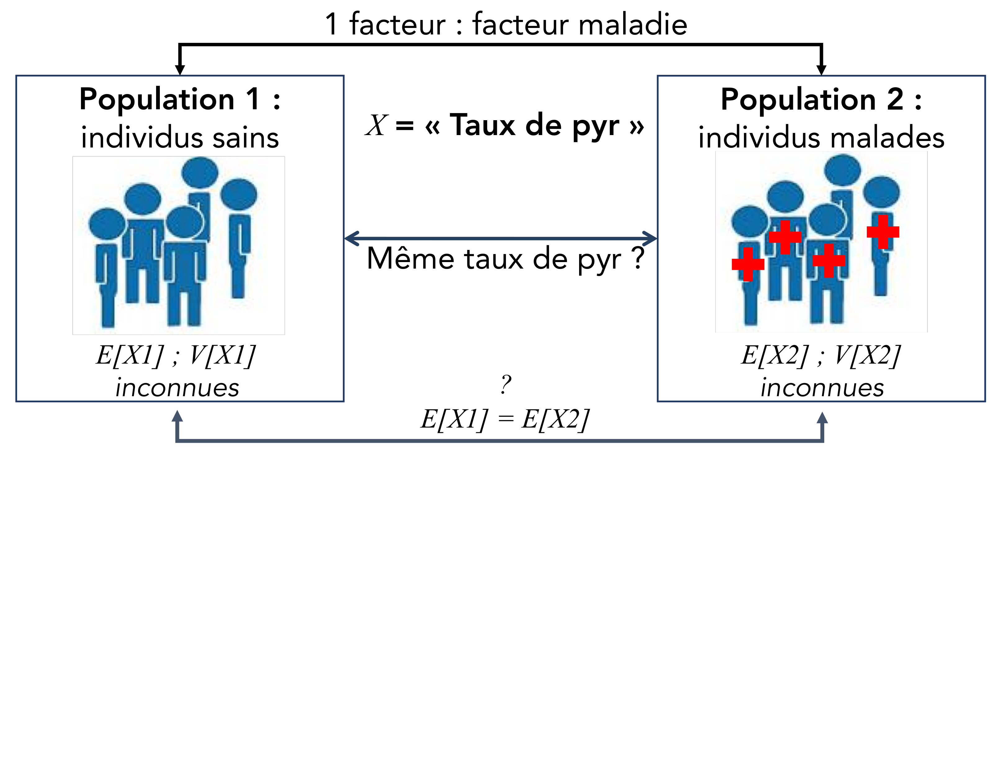
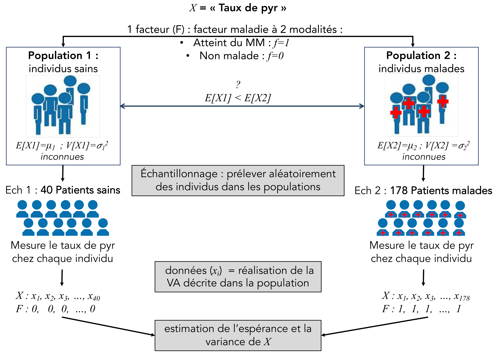
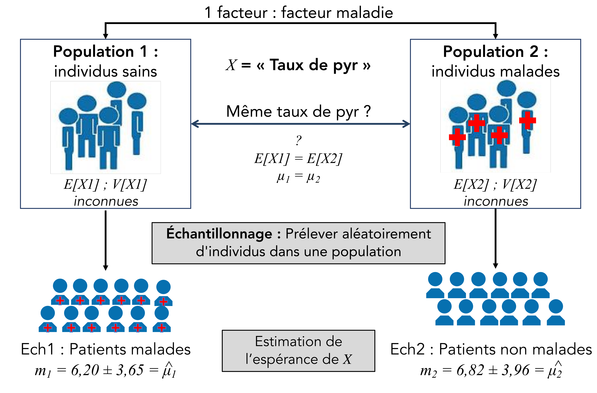
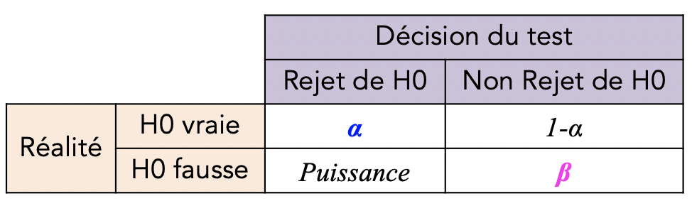

```{r include=FALSE, echo=FALSE, eval=TRUE}
library(knitr)
library(kableExtra)
library(png)
library(grid)
# library(formattable)

options(width = 300)
# options(encoding = 'UTF-8')
knitr::opts_chunk$set(
  fig.width = 7, fig.height = 5, 
  fig.path = 'figures/07_tests_multiples',
  fig.align = "center", 
  size = "tiny", 
  echo = TRUE, eval = TRUE, 
  warning = FALSE, message = FALSE, 
  results = TRUE, comment = "")

options(scipen = 12) ## Max number of digits for non-scientific notation
# knitr::asis_output("\\footnotesize")

```


## Plan

* Rappels de probabilité 
* Introduction du cas d'études
* Estimation d'un paramètre statistique
    + Estimateur ponctuel
    + Intervalle de confiance
* La thérorie des tests d'hypothèses
    + Le test de comparaison de deux moyennes
    + Les autres tests d'hypothèses
* A vous de jouer : Etude de cas


## Expérience aléatoire 

* **Phénomène déterministe** : phénomène dont on peut prévoir le résultat avec certitude lorsqu’on contrôle les causes  
*exemple* : je lâche la craie $\rightarrow$ elle tombe  

* **Expérience aléatoire** : expérience qui, répétée dans des conditions apparemment identiques, peut donner des résultats différents. Elle se définit par trois propositions :
    + l’expérience peut être répétée
    + plusieurs résultats sont possibles
    + le résultat ne peut être prédit avec certitude  
*exemple* : je lâche la craie $\rightarrow$ combien de morceaux de craie trouve-t-on par terre ?


## Variable aléatoire (VA) / Unité statistique


* **Variable aléatoire** (VA) = variable $X$ qui prend des valeurs en fonction du résultat d’une expérience aléatoire  
$\rightarrow$ elle répond à la question : Que mesure-t-on pendant l'expérience aléatoire ?  
* **Unité statistique** = unité sur laquelle est mesurée la VA


* Exemple
    + Expérience aléatoire : je lâche la craie $\rightarrow$ combien de morceaux trouve-t-on par terre?
    + variable aléatoire : nombre de morceaux obtenus
    + unité statistique (US) : 1 craie


* Notations : 
    + $X$ : la variable aléatoire
    + $x_i$ : les réalisations de $X$    

* VA réelles sont caractérisée par 2 paramètres : 
    + **Espérance** ($E(X)$) : caractérise la tendance centrale, la valeur moyenne, prise par la VA
    + **Variance** ($V(X)$) : caractérise la dispersion des valeurs de la variable autour de son espérance


    
## Deux types de VA réelles

* L'ensemble des valeurs possibles est définit sur $\mathbb{R}$

$\quad$

* **discrète** : l'ensemble des valeurs que $X$ peut prendre est fini ou infini dénombrable
    + nombres d'oeufs pondus par une poule : 2, 3, 4, ...  
    
* **continue** : les autres variables  
    + poids d'un patient : 75.3kg, 56.4kg, 87kg, ...  
    + taux de cholestérol : 2g/l, 1.8g/l, ...  

    
    
## Variable réelle discrète

* se définit par sa **loi de probabilité** : fonction  qui associe à chaque valeur de $X$ sa probabilité
$$p_i = p(X = x_i)$$   
    + avec $0<p_i<1$
    + $\sum_{i=1}^{k} p_i = 1$, avec $k$ le nombre de modalités de $X$   
    
* $X$ = "le numéro de la face d'un dé"   

```{r echo=FALSE, eval=TRUE, fig.height=4}
par(mar=c(4,4,1,1))
barplot(c(0.2, 0.1, 0.12, 0.34, 0.11, 0.13), names.arg = 1:6, xlab="Face", ylab="p(X=xi)")
```


## Variable quantitative continue

*  l'ensemble des valeurs que $X$ peut prendre est infini  
$\rightarrow p(X=x_i) = 0$

* se caractérise par sa **densité de probabilité** = la fonction $f(x)$ définie par : 
$$P[x < X \leq x + dx] = f (x) dx \textrm{   pour } x \in  \mathbb{R}$$


* la **fonction de répartition** est la fonction $F(X)$ telle que : 
$$ F(x)=P[X \leq x] = \int_{-\infty}^x f(u)du \textrm{   pour } x \in  \mathbb{R}$$


```{r echo=FALSE, fig.width = 5.5, fig.height=3.5 }
par(mar=c(4,4,1,1))
vx <- seq(-2.5,2.5, by=0.01)
vy <- dnorm(vx, mean = 0, sd = 0.6)
plot(vx, vy, type ="l", ylab="f(x)", xlab="X", lwd=2 )
abline(v=0.4, col = 2, lwd=2)

text(0.3, 0.07, "x", col=2, srt=90)
  
bons = which(vx < 0.4)
x.bons <- vx[bons]
y.bons <- vy[bons]
  
polycurve <- function(x, y, base.y = min(y), ...) {
polygon(x = c(min(x), x, max(x)), y = c(base.y, y, base.y), ...)
}
  
polycurve(x = x.bons, y=y.bons, base.y = 0, col = 'cyan' , border=NA)
lines(vx,vy, lwd=2)
abline(v=0.4, col = 2, lwd=2)
segments(0.4, dnorm(0.4, mean = 0, sd = 0.6), -7, dnorm(0.4, mean = 0, sd = 0.6), col = 2)
legend("topright", "F(x)=p(X<x)", pch=15, col="cyan", cex=1)
```
 
  

   


## Etude de cas : le myélome multiple (MM)
<style>
  .col2 {
    columns: 2 200px;         /* number of columns and width in pixels*/
    -webkit-columns: 2 200px; /* chrome, safari */
    -moz-columns: 2 200px;    /* firefox */
  }
  .col3 {
    columns: 3 100px;
    -webkit-columns: 3 100px;
    -moz-columns: 3 100px;
  }
</style>

* Prolifération incontrôlée des plasmocytes $\rightarrow$ **Affection de la moelle osseuse** 

<div class="col2"> 
<center>
{width=72%}
</center>

* Cancer relativement **rare**
* Touche proportionnellement davantage les hommes que les femmes
* Atteint principalement les personnes âgées de plus de 60 ans et survient rarement avant 40 ans
</div>

* Symptômes 
    + plasmocytes malins prennent peu à peu la place des autres cellules sanguines :  
$\rightarrow$ **diminution de l’immunité humorale**, anémie, infections, risque d’ecchymoses, ...

    + **Destruction osseuse** qui résulte de la décalcification en certains endroits du squelette  
$\rightarrow$ **fractures** peuvent aisément se produire à ces endroits  


## Cas d'étude 
<div style="float:left;width:75%;">
**Est-ce le dosage urinaire de la molécule déoxypyridinoline (pyr) est un bon marqueur pour détecter le MM ?**   
</div>  
<div style="float:right;width:25%;">   
{width=40%}   
</div>   


$\quad$   

$\rightarrow$ est-ce que le taux de pyr des patients malades est plus grand que celui des individus sains ?

* X ="Taux de pyr" (micmol/mmolcreat) 
* US = un individu $\quad \quad \rightarrow$ type = quantitative continue

<center>
{width=55%}
</center>  

**Population** = ensemble d’individus ayant des caractéristiques qui leur sont propres  


## Mise en place du protocole 

$\rightarrow$ Récolte des données

<center>
{width=70%}
</center>

## Analyse des données avec R

```{r}
dataMyelom <- read.table("data/myelom.txt", sep="\t", header=T)
dim(dataMyelom)
```

```{r eval=TRUE, echo=FALSE}
dataMyelom[,"diagn"] <- as.factor(dataMyelom[,"diagn"])
```


```{r}
table(dataMyelom[,"diagn"])
```


* `diagn` = 0 $\rightarrow$ individus non malades   
* `diagn` = 1 $\rightarrow$ patients malades  


```{r echo=FALSE, eval=TRUE}
ind.sain <- which(dataMyelom[,"diagn"]==0)
pyr0 <- dataMyelom[ind.sain,"pyr"]
ind.malade <- which(dataMyelom[,"diagn"]==1)
pyr1 <- dataMyelom[ind.malade,"pyr"]
```


## Description des deux échantillons

* distribution de pyr dans les deux échantillons

```{r}
boxplot(pyr~diagn, data=dataMyelom, ylab="Valeur de pyr (micmol/mmolcreat)", col = "steelblue3")
```


## Mise en place du protocole 

$\rightarrow$ Récolte des données

<center>
{width=65%}
</center>

## Estimation de paramètres
<div class="col2">

* estimateur de l'espérance de $X$ = moyenne de $X$ dans l'échantillon
$$ \widehat{\mu} = m = \frac{\sum_{i=1}^{n}x_i}{n}$$

* estimateur de la variance de $X$  
$$ \widehat{\sigma^2} = s^2 = \frac{1}{n-1} \sum_{i=1}^{n}(x_i-m)^2$$
</div>


* calcul de l'**estimateur de l'espérance** de $X$ dans les deux échantillons
```{r}
by(dataMyelom[,"pyr"], dataMyelom["diagn"], mean)
```


* $m_1 \ne m_2$ : Ne signifie pas que $\mu_1 \ne \mu_2$

## Les fluctuations d'échantillonnage

* 1 population où $X \sim \mathcal{N}(\mu=4; \sigma^2=12)$  

1. tire un échantillon de 20 indidivus et calcule la moyenne de $X$ dans cet échantillon
```{r}
ech1 <- rnorm(n=20, mean=4, sd=sqrt(12))
mean(ech1)
```

2. tire un deuxième échantillon de 20 indidivus et calcule la moyenne de $X$ dans cet échantillon
```{r}
ech2 <- rnorm(n=20, mean=4, sd=sqrt(12))
mean(ech2)
```

$\rightarrow$ Les différences entre les deux estimateurs sont dues aux **fluctuations d'échantillonnage**

## Estimation de paramètres
<div class="col2">

* estimateur de l'espérance de $X$ = moyenne de $X$ dans l'échantillon
$$ \widehat{\mu} = m = \frac{\sum_{i=1}^{n}x_i}{n}$$

* estimateur de la variance : 
$$ \widehat{\sigma^2} = s^2 = \frac{1}{n-1} \sum_{i=1}^{n}(x_i-m)^2$$
</div>


* calcul de l'**estimateur de la variance** de $X$ dans les deux échantillons
```{r}
by(dataMyelom[,"pyr"], dataMyelom["diagn"], var)
```


## Estimation d'un paramètre : Intervalle de confiance (IC) 


* Apporte deux informations :
    + les valeurs possibles du paramètre $\theta$ à estimer
    + le degré de confiance attribué à ces valeurs  

  
 
$\quad$

* **IC de la moyenne** = intervalle $[m_{inf}; m_{sup}]$ dans lequel on considère que $\mu$  a une probabilité $(1-\alpha)$ de se trouver 


<div class="col2">
$$ p(m_{inf} < \mu < m_{sup}) = 1- \alpha $$  
{width=70%}
<center>
```{r echo=FALSE, fig.width = 4, fig.height=2.5, eval = FALSE }
par(mar=c(4,4,1,1))
vx <- seq(-1,5, by=0.01)
vy <- dnorm(vx, mean = 2, sd = 0.6)
plot(vx, vy, type ="l", ylab="f(m)", xlab="M", lwd=2 )
```
</center>


</div>
##IC de la moyenne : 2 cas


* Prend en compte 
    +  la **variabilité** des données     
    +  la **taille de l’échantillon**  

* si  $n > 30$: 
$$IC_{1-\alpha} = \left[ m \pm z_{1-\frac{\alpha}{2}} \times \sqrt{ \frac{s^2}{n} } \right]$$    
    + $z_{1-\frac{\alpha}{2}}$ : quantile de la loi normale centrée réduite d'ordre $\alpha$


$\quad$

* si $n < 30$ et $X \sim \mathcal{N}(\mu; \sigma^2)$
$$IC_{1-\alpha} = \left[m \pm t_{\alpha ; \textrm{(n-1)ddl}} \times \sqrt{\frac{s^2}{n}} \right]$$
    + $t_{\alpha ; \textrm{(n-1)ddl}}$ : quantile de la loi de student d'ordre $\alpha$ à $(n-1)$ degrés de liberté 


  
  
## IC du taux de pyr à 95%

* **échantillon 1** : 40 patients sains 

```{r}
alpha <- 0.5
pyr0 <- dataMyelom[which(dataMyelom[,"diagn"]==0),"pyr"]
borneInf.0 <- mean(pyr0) - qnorm(1-alpha/2) * sqrt(var(pyr0)/length(pyr0)) 
borneSup.0 <- mean(pyr0) + qnorm(1-alpha/2) * sqrt(var(pyr0)/length(pyr0)) 
round(c(borneInf.0, borneSup.0),2)
```
  
* **échantillon 2** : 178 patients atteints de MM 

```{r}
pyr1 <- dataMyelom[which(dataMyelom[,"diagn"]==1),"pyr"]
borneInf.1 <- mean(pyr1) - qnorm(1-alpha/2) * sqrt(var(pyr1)/length(pyr1)) 
borneSup.1 <- mean(pyr1) + qnorm(1-alpha/2) * sqrt(var(pyr1)/length(pyr1)) 
round(c(borneInf.1, borneSup.1),2)
```


```{r echo=FALSE, fig.width=6, fig.height=2}
par(mar=c(4,2,1,2))
plot(10.5:17.5, 10.5:17.5, type = "n", yaxt="n", ylim = c(16,18.5), ylab="", xlab="Pyr values (micmol/mmolcreat)", xlim=c(5, 8))
segments(borneInf.0,17, borneSup.0, 17, lwd=2, col = 2)
segments(borneInf.1,17, borneSup.1, 17, lwd=2, col = 3)
text(5.7,17.5,"IC1", col=2)
text(7.2,17.5,"IC2", col=3)
```


## Cas d'étude : Introduction aux tests statistiques
 
<center> 
  {width=60%}
</center>


$\quad$    
  

* 2 possibilités pour expliquer les différences entre $m_1$ et $m_2$ $\rightarrow$ 2 hypothèses   
    + elles s'expliquent seulement par **le hasard** (fluctuations d'échantillonnage) : H0 (hypothèse nulle)
    + elles s'expliquent par le **hasard** et par le **facteur maladie** : H1 (hypothèse alternative)

  
  

  
## Déroulement d'un test statistique
  
* Définit deux hypothèses sur un des paramètres de la VA
    + **hypothèse nulle (H0)** : égalité des paramètres : $\mu_1 = \mu_2 = \mu$  
    Les différences observées sont expliquées uniquement par le hasard   
    + **hypothèse alternative (H1)** : inégalité des paramètres : $\mu_1 < \mu_2$  
    Les différences observées sont expliquées à la fois par le hasard et par le facteur   
    
  
$\quad$
    
<center>
**Réaliser le test va consister à choisir une des deux hypothèses (H0 ou H1) en se basant sur les données des échantillons**   
</center>  

$\quad$  
$\rightarrow$ Est-ce que les données des échantillons ($m_1$ et $m_2$) sont compatibles avec H0 ?  

* si oui $\rightarrow$ non rejet de H0  
le hasard explique à lui seul les différences entre les deux moyennes observées

* si non $\rightarrow$ rejet de H0  
le hasard et le facteur expliquent les différences entre les deux moyennes observées    
    
## Est-ce que les données sont compatibles avec H0 ?
    
1. Définir un **critère statistique** $S$ dont la loi sous H0 est connue  
 $S = M_2 - M2$  avec $M$=moyenne de $X$ dans 1 échantillon    
$\quad$  
Sous H0 ( $n_1$ et $n_2 > 30$) : $S \sim \mathcal{N} \left(0 ; \sqrt{\frac{s_1^2}{n_1} + \frac{s_2^2}{n_2} }\right)$


```{r echo=FALSE, fig.width = 6, fig.height=3.5 }
par(mar=c(4,4,1,1))
vx <- seq(-2.5,2.5, by=0.01)
vy <- dnorm(vx, mean = 0, sd = 0.6)
plot(vx, vy, type ="l", ylab="f(s)", xlab="S", lwd=2 )
abline(v=0, lty=2, col="gray80")
```
  
2. Calculer $s_{obs}$ = valeur de $S$ calculée sur les échantillons : $s_{obs} = m_1 - m_2$    

3. Regarde si la réalisation  $s_{obs}$ est fortement probable sous H0 (quand $\mu_1 = \mu_2$)


## Est-ce que les données sont compatibles avec H0 ?

* $S = M_2 - M_1$  avec $S \sim \mathcal{N} \left(0 ; \sqrt{\frac{s_1^2}{n_1} + \frac{s_2^2}{n_2} }\right)$
* $s_{obs} = m2-m1$

* Calcule la probabilité d'obtenir sous H0 le même résultat que celui observé (ou plus grand) sur les échantillons = **p-value**  $= p(S > s_{obs})$
  


<div class="col2">
```{r echo=FALSE, fig.width = 5.5, fig.height=3.5 }
par(mar=c(4,4,1,1))
vx <- seq(-2.5,2.5, by=0.01)
vy <- dnorm(vx, mean = 0, sd = 0.6)
plot(vx, vy, type ="l", ylab="f(s)", xlab="S", lwd=2 )
abline(v=0.4, col = 2, lwd=2)
text(0.3, 0.07, "sobs", col=2, srt=90)
  
bons = which(vx > 0.4)
x.bons <- vx[bons]
y.bons <- vy[bons]
  
polycurve <- function(x, y, base.y = min(y), ...) {
polygon(x = c(min(x), x, max(x)), y = c(base.y, y, base.y), ...)
}
  
polycurve(x = x.bons, y=y.bons, base.y = 0, col = 'cyan' , border=NA)
lines(vx,vy, lwd=2)
legend("topright", "p(S> sobs)", pch=15, col="cyan", cex=1)
```
 

* forte valeur de p-value $\rightarrow$ : $s_{obs}$ est fortement probable sous $H0$
 </div>
  
  


## Est-ce que les données sont compatibles avec H0 ?

* $S = M_2 - M_1$  avec $S \sim \mathcal{N} \left(0 ; \sqrt{\frac{s_1^2}{n_1} + \frac{s_2^2}{n_2} }\right)$
* $s_{obs} = m2-m1$

* Calcule la probabilité d'obtenir sous H0 le même résultat que celui observé (ou plus grand) sur les échantillons = **p-value**  $= p(S > s_{obs})$
  


<div class="col2">
```{r echo=FALSE, fig.width = 5.5, fig.height=3.5 }
par(mar=c(4,4,1,1))
vx <- seq(-2.5,2.5, by=0.01)
vy <- dnorm(vx, mean = 0, sd = 0.6)
plot(vx, vy, type ="l", ylab="f(s)", xlab="S", lwd=2 )
abline(v=1.2, col = 2, lwd=2)
text(1.1, 0.07, "sobs", col=2, srt=90)
  
bons = which(vx > 1.2)
x.bons <- vx[bons]
y.bons <- vy[bons]
  
polycurve <- function(x, y, base.y = min(y), ...) {
polygon(x = c(min(x), x, max(x)), y = c(base.y, y, base.y), ...)
}
  
polycurve(x = x.bons, y=y.bons, base.y = 0, col = 'cyan' , border=NA)
lines(vx,vy, lwd=2)
legend("topright", "p(S> sobs)", pch=15, col="cyan", cex=1)
```
 

* forte valeur de p-value $\rightarrow$ : $s_{obs}$ est fortement probable sous $H0$  
* faible valeur de p-value $\rightarrow$ : $s_{obs}$ est très peu probable sous $H0$
 </div>
  
  
  
## Interprétation de la p-value :  $p(S>s_{obs})$  
  
<div style="float:left;width:70%;">
* p-value = 0.03   
$\rightarrow$ 3% de chance que la valeur $s_{obs}$ se produise sous H0  
$\rightarrow$ on a 3% de chance que 2 échantillons pris au hasard aient la même différence (ou plus grande) que celle observée   


</div>  
<div style="float:right;width:30%;"> 
```{r echo=FALSE, fig.width = 3.5, fig.height = 2.3 }
par(mar=c(2,2,2,2))
vx <- seq(-2.5,2.5, by=0.01)
vy <- dnorm(vx, mean = 0, sd = 0.6)
plot(vx, vy, type ="l", ylab="f(s)", xlab="S", lwd=2 )
abline(v=1, col = 2, lwd=2)
text(0.9, 0.07, "sobs", col=2, srt=90)
  
bons = which(vx > 1)
x.bons <- vx[bons]
y.bons <- vy[bons]
  
polycurve <- function(x, y, base.y = min(y), ...) {
  polygon(x = c(min(x), x, max(x)), y = c(base.y, y, base.y), ...)
}
  
polycurve(x = x.bons, y=y.bons, base.y = 0, col = 'cyan' , border=NA)
lines(vx,vy, lwd=2)
legend("topleft", "p(S> sobs)=0.03", pch=15, col="cyan", cex=0.8, bty="n")
```
 </div> 

$\quad$   

* p-value = 0.67  
$\rightarrow$ 67% de chance que la valeur $s_{obs}$ se produise sous H0  
$\rightarrow$ on a 67% de chance que 2 échantillons pris au hasard aient la même différence (ou plus grande) que celle observée 


  
## Les erreurs
  
Deux erreurs possibles quand on conclut au test : 

* **erreur de type I** : je conclus à 1 effet de la maladie alors qu'en réalité il n'y en a pas.   
* **erreur de type II** : je conclus à $\emptyset$ effet de la maladie alors qu'en réalité il existe.   

<div class="col2">
<center>
{width=100%}
</center>

<center>
{width=80%}
</center>

</div>

* **risque de 1ère espèce** ($\alpha$) : $p(\textrm{rejet H0 }  | \textrm{ H0 est vraie})$  
* **risque de 2ème espèce** ($\beta$) : $p(\textrm{non rejet H0 } | \textrm{ H0 est fausse})$  


* **Puissance du test** $\textrm{Puissance} = 1 - \beta = p(\textrm{rejet H0} | \textrm{H0 est fausse})$  
La probabilité de détecter une différence alors qu'il en existe une   


  
## Interprétation de la p-value :  $p(S>s_{obs})$  
  
<div style="float:left;width:70%;">
* p-value = 0.03   
$\rightarrow$ 3% de chance que la valeur $s_{obs}$ se produise sous H0  
$\rightarrow$ on a 3% de chance que 2 échantillons pris au hasard aient la même différence (ou plus grande) que celle observée   


</div>  
<div style="float:right;width:30%;"> 
```{r echo=FALSE, fig.width = 3.5, fig.height = 2.3 }
par(mar=c(2,2,2,2))
vx <- seq(-2.5,2.5, by=0.01)
vy <- dnorm(vx, mean = 0, sd = 0.6)
plot(vx, vy, type ="l", ylab="f(s)", xlab="S", lwd=2 )
abline(v=1, col = 2, lwd=2)
text(0.9, 0.07, "sobs", col=2, srt=90)
  
bons = which(vx > 1)
x.bons <- vx[bons]
y.bons <- vy[bons]
  
polycurve <- function(x, y, base.y = min(y), ...) {
  polygon(x = c(min(x), x, max(x)), y = c(base.y, y, base.y), ...)
}
  
polycurve(x = x.bons, y=y.bons, base.y = 0, col = 'cyan' , border=NA)
lines(vx,vy, lwd=2)
legend("topleft", "p(S> sobs)=0.03", pch=15, col="cyan", cex=0.8, bty="n")
```
 </div> 

$\quad$   

* p-value = 0.67  
$\rightarrow$ 67% de chance que la valeur $s_{obs}$ se produise sous H0  
$\rightarrow$ on a 67% de chance que 2 échantillons pris au hasard aient la même différence (ou plus grande) que celle observée 

$\quad$  
    
* on choisit un risque $\alpha$ comme valeur seuil : souvent 5%
    + si p-value > 0.05 $\rightarrow$ non rejet de H0  
    $\rightarrow$ les différences observées sur les échantillons sont expliquées uniquement par le hasard  
    
    
    + si p-value < 0.05 $\rightarrow$  rejet de H0  
    $\rightarrow$ Les différences observées sont dues aux fluctuations d'échantillonnage et au facteur   
  


## Comparaison du taux de pyr chez les patients malades et contrôles

<center>
Est-ce que le taux de pyr des patients malades est plus grand que celui des individus sains ?
</center>


* hypothèses  
<center>
H0 : $\mu_1 = \mu_2 \quad \quad \quad \quad \quad \quad$ H1 : $\mu_1 < \mu_2$   
</center>
```{r}
t.test(pyr~diagn, data=dataMyelom, var.equal=TRUE, alternative="less")
```

* p-value $< 0.05 \rightarrow$, le test est significatif au risque de 5%  
Le taux de pyr des individus contrôles est significativement plus petit de celui des patients malades  
Le dosage de pyr est un bon marqueur de la maladie. 


## Les différents types de tests 

* variable réelle continue : **Tests sur les moyennes**
    + 1 échantillon et 1 population de référence  
        + grand échantillon : test espilon   
        + petit échantillon : test de student  
        $\rightarrow$ : test paramétrique : test de student  (1 conditions de validité)  
        $X$ suit doit suivre une loi normale dans la population d'où est tiré l'échantillon   
        $\rightarrow$ tests non paramétriques : test de Wilcoxon ou test de Mann-Whitney  
    + 2 échantillons    
        + grands échantillons : test espilon   
        + petits échantillons 
        $\rightarrow$ : test paramétrique : test de student  (2 conditions de validité)  
        $X$ doit suivre un loi normale dans les deux populations  
        Egalité des deux variances  
        $\rightarrow$ tests non paramétriques : test de Kruskal-Wallis
        
    + $\geq$ 3 échantillons  
        + test paramétrique ANOVA  (2 conditions de validité)
        $X$ doit suivre un loi normale dans les différentes populations   
        Egalité des $k$ variances 
        + test non paramétrique : test de Kruskal-Wallis
        
 
 
## Les différents types de tests 

* test sur les distribution : 
    + à une loi normale : test de Shapiro
    + à une distribution théorique : test du chi$^2$ d'homogénéité  
    + deux distributions  : test du Cchi$^2$hi2 d'adéquation
    

* deux variables aléatoires (lien) :  
    + réelles continues :  
        + test paramétrique : test du coefficient de corrélation de Pearson  
        binormalité de la variable $X$  
        + test non paramétrique : test du coefficient de corrélation de Pearson  
    + réelles discrètes :  
        + test du chi$^2$ d'indépendance  
  
  
## Merci de votre attention !!!

$\quad$
$\quad$

<center>
Place au TP : Etude des caractéristiques des patients atteints d'une cirrhose du foie et des individus sains.
</center>


## Diminuer l'erreur de type II / Augmenter la puissance du test 
  
1. Augmenter la taille d'effet
2. Diminuer la variabilité des données (variance des données)
3. Augmenter la taille de l'échantillon
  
<center>
{width=75%}
</center>


