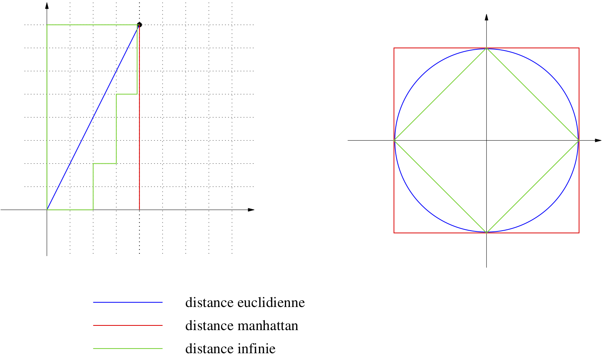
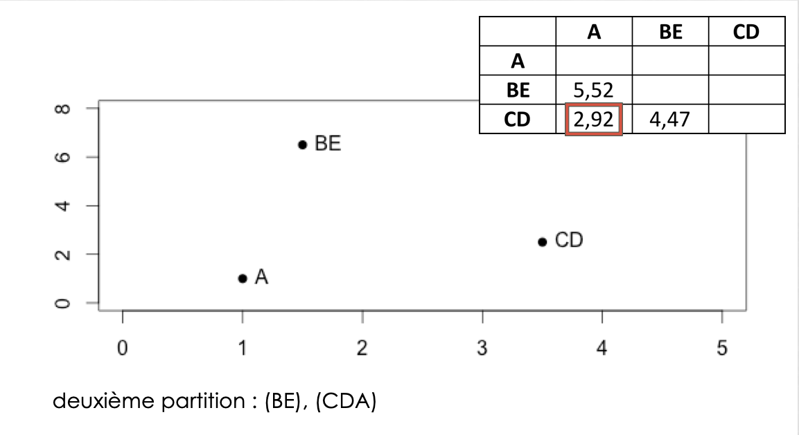
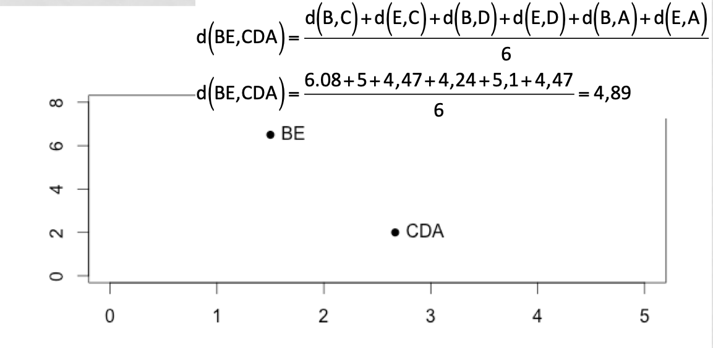

```{r include=FALSE, echo=FALSE, eval=TRUE}
library(knitr)
library(kableExtra)
library(FactoMineR)
library(clues)
library(RColorBrewer)
# library(formattable)

options(width = 300)

# options(encoding = 'UTF-8')

knitr::opts_chunk$set(
  fig.width = 5, fig.height = 5, 
  fig.path = 'figures/irisDeFisher_',
  fig.align = "center", 
  size = "tiny", 
  echo = TRUE, eval = TRUE, 
  warning = FALSE, message = FALSE, 
  results = TRUE, comment = "")

options(scipen = 12) ## Max number of digits for non-scientific notation
```

```{r  echo=F}
mes.iris <- iris[, 1:4]
mes.iris.scaled <- data.frame(scale(mes.iris, T, T))
nb.iris=nrow(mes.iris)
nb.var=ncol(mes.iris)
```

# Partionnement et apprentissage
   - On a une **représentation** des données
     + sous forme de valeurs réelles=vecteur de 
     + sous forme de catégories
   - **Clustering**: on cherche a priori des groupes dans les données
   - **Apprentissage**:
	+ on connait le partitionnement sur un jeu de données
	+ on cherche le groupe (la classe) de nouvelles données

# Partionnement=Clustering


```{r are_there_clusters, echo=FALSE, out.width="60%", fig.cap="Y a-t-il des groupes ?"}
include_graphics(path = "img/figure1.png")
```


# Partionnement=Clustering

```{r yes_there_are_4_groups, echo=FALSE, out.width="60%", fig.cap="Oui, 4 groupes. "}
include_graphics(path = "img/figure2.png")
```

# Apprentissage


# Apprentissage: Séparation linéaire


# Méthodes
Trois grands principes de méthodes basées sur:

- La géométrie
- Les probabilités (statistique)
- Les graphes

En fait, trois façons de voir les mêmes algorithmes

# Géométrie et distances
On considère les données comme des points de $R^n$:

- géométrie donnée par distances
- distances = dissimilaritées imposées par le problème
- dissimilarités $\longrightarrow$ permettent visualisation de l'ensemble des points
- Détermination visuelle des groupes

# Les données

[Ces données sont un classique des méthodes d'apprentissage](https://onlinelibrary.wiley.com/doi/epdf/10.1111/j.1469-1809.1936.tb02137.x)

Dans un premier temps, regardons les données

```{r}
dim(mes.iris)
head(mes.iris)
```

# Visualisation des données

On peut ensuite essayer de visualiser les données
  
```{r plot_iris, fig.width=7, fig.height=5, out.width="70%"}
plot(mes.iris)
```

# Géométrie et distances
Sur la base d'une distance (souvent euclidienne)

   - Partionnement:
     + Moyennes mobiles ou K-means : séparation optimale des groupes connaissant le
nombre de groupe 
       + Méthode agglomérative ouhierarchical clustering
   - Classification:
       + attribution K plus proches voisins (K Nearest Neighbor)
       + séparation linéaire ou non linéaire

# Distances
Définition d'une distance : fonction positive de deux variables

1. d(x,y) $\ge$ 0
2. d(x,y)=d(y,x)
3. d(x,y)=0 $\Longleftrightarrow$ x=y
4. inégalité triangulaire: d(x,z) $\le$ d(x,y)+d(y,z)

Si 1,2,3 : dissimilarité

# Distances utilisées dans R

- distance euclidienne ou distance $l_2$:
$d(x,y)=\sqrt{\sum_i (x_i-y_i)^2}$
  
- distance de manahattan ou distance $l_1$:
  $d(x,y)=\sum_i |x_i-y_i|$
    
- distance du maximum ou l-infini, $l_\infty$:
  $d(x,y)=\max_i |x_i-y_i|$
    
<!-- .element height="30%" width="30%" -->

# Distances utilisées dans R

- distance de Minkowski $l_p$:
$$d(x,y)=\sqrt[p]{\sum_i (|x_i-y_i|^p}$$

- distance de Canberra (x et y valeurs positives):
$$d(x,y)=\sum_i \frac{x_i-y_i}{x_i+y_i}$$

- distance binaire ou distance de Jaccard ou Tanimoto: proportion de propriétés communes

# Autres distances non géométriques (pour information)
Utilisées en bio-informatique:

- Distance de Levenshtein: nombre de subsitutions, insertions, deletions entre deux chaînes de caractères

$$d("BONJOUR", "BONSOIR")=2$$

- Distance d'alignements: distances de Levenshtein avec poids (par ex. matrices BLOSSUM)
- Distances d'arbre (Neighbor Joining)
- Distances ultra-métriques (phylogénie UPGMA)

# Distances plus classiques en génomiques

Comme vu lors de la séance 3, il y a d'autres mesures de distances :

  - Jaccard (comparaison d'ensemble)
  - Distance du $\chi^2$ (comparaison de tableau d'effectif)

ne sont pas des distances, mais indices de dissimilarité:

  - Bray-Curtis (en écologie, comparaison d'abondance d'espèce)
  - Jensen-Shannon (comparaison de distribution)
  
**rq** : lors du TP, sur les données d'expression RNA-seq, nous utiliserons le coefficient de corrélation de Spearman et la distance associée, $d = 1-r^2$

# Distances entre groupes

- Single linkage

  $D(C_1,C_2) = \min_{i \in C_1, j \in C_2} D(x_i, x_j)$
  
- Complete linkage

  $D(C_1,C_2) = \max_{i \in C_1, j \in C_2} D(x_i, x_j)$
  
- Group average

  $D(C_1,C_2) = \frac{1}{N_1 N_2} \sum_{i \in C_1, j \in C_2} D(x_i, x_j)$
  
- Ward

$d^2(C_i,C_j)= I_{intra}(C_i \cup C_j)-I_{intra}(C_i)-I_{intra}(C_j)$
$D(C_1,C_2) = \sqrt{\frac{N_1N_2}{N_1 + N_2}} \| m_1 -m_2 \|$

# Distances entre groupes


# Les données

[Ces données sont un classique des méthodes d'apprentissage](https://onlinelibrary.wiley.com/doi/epdf/10.1111/j.1469-1809.1936.tb02137.x)

Dans un premier temps, regardons les données

```{r}
dim(mes.iris)
head(mes.iris)
```

---

```{r}
str(mes.iris)
summary(mes.iris)
```


# Visualisation des données

On peut ensuite essayer de visualiser les données

  - par un `plot`
  
```{r, out.width="60%"}
plot(mes.iris)
```

# Visualisation des données

  - par une `image`
  
```{r, out.width="60%"}
image(1:nb.var, 1:nb.iris ,t(as.matrix(mes.iris)))
```

# Nettoyage des données (1)

Avant de commencer à travailler, il est nécessaire de commencer par vérifier que :

  - il n'y a pas de données manquantes

```{r}
sum(is.na(mes.iris))
```

# Nettoyage des données (2)

  - aucune  variable n'est constante
  
```{r}
iris.var <- apply(mes.iris, 2, var)
kable(iris.var, digits = 3)
sum(apply(mes.iris, 2, var) == 0)
```


# Normalisation

Afin de pouvoir considérer que toutes les variables sont à la même échelle, il est parfois nécessaire de normaliser les données.

  - soit 
    - en centrant (moyenne "0")
  
```{r}
mes.iris.centre <- scale(mes.iris, center=TRUE, scale=FALSE)
```

  - soit 
    - en centrant (moyenne "0")
    - et réduisant (variance "1")

```{r}
mes.iris.scaled <- scale(mes.iris, center=TRUE, scale=TRUE)
```


# On peut visuellement regarder l'effet de la normalisation :

  - par un plot des données 
```{r ,  out.width="60%"}
par(mfrow=c(1,2))
plot(mes.iris)
plot(mes.iris.scaled)
par(mfrow=c(1,1))
```
**!** ne pas faire si "grosses" données


#

- par une image

```{r,  out.width="60%"}
par(mfrow=c(1,2))
image(1:nb.var, 1:nb.iris, t(as.matrix(mes.iris)), main="données brutes")
image(1:nb.var, 1:nb.iris, t(as.matrix(mes.iris.scaled)), main="données normalisées")
par(mfrow=c(1,1))
```


#

  - par une projection sur une ACP

```{r,  out.width="80%"}
par(mfrow=c(1,2))
biplot(prcomp(mes.iris), main="données non normalisées")
biplot(prcomp(mes.iris, scale=T), main="données normalisées")
par(mfrow=c(1,1))
```

# La matrice de distance

Nous utilisons la distance euclidienne

```{r echo=F}
mes.iris.scaled <- scale(mes.iris, center=T, scale=F)
iris.acp <- FactoMineR::PCA(mes.iris, graph=F, scale.unit=F)
iris.scaled.acp <- FactoMineR::PCA(mes.iris.scaled, graph=F)
```

```{r}
iris.euc <- dist(mes.iris)
iris.scale.euc <- dist(mes.iris.scaled)
```

```{r, out.width="50%"}
par(mfrow=c(1,2))
image(t(as.matrix(iris.euc)), main="données brutes")
image(t(as.matrix(iris.scale.euc)), main="données normalisées")
par(mfrow=c(1,1))
```

# La classification hiérarchique

## Principe

  - classification hiérarchique : mettre en évidence des liens hiérachiques entre les individus
  - classification hiérarchique **ascendante** : partir des individus pour arriver à des classes / cluster
  - classification hiérarchique **descendante** : partir d'un groupe qu'on subdivise en sous-groupes /cluster jusqu'à arriver à des individus.

## Notion importante, cf distances

  - ressemblance entre individus = distance
  - ressemblance entre groupes d'invidus = critère d'aggrégation
    - lien complet
    - lien moyen
    - critère de Ward

# L'algorithme

### étape 1 :
  - départ : n individus = n clusters distincts
  - calcul des distances entre tous les individus
    - choix de la métrique à utiliser en fonction du type de données
  - regroupement des 2 individus les plus proches => (n-1) clusters


#
### au départ 

 

---

### identification des individus les plus proches


---

### construction du dendrogramme


---

### étape j :

  - calcul des dissemblances entre chaque groupe obtenu à l'étape (j-1)
  - regroupement des deux groupes les plus proches => (n-j) clusters
  
### calcul des nouveaux représentants `BE` et `CD`


---

### calcul des distances de l'individu restant `A` aux points moyens


---

### A est plus proche de ...


---

### dendrogramme


---

### pour finir


---

  - à l'étape (n-1), tous les individus sont regroupés dans un même cluster

### dendrogramme final


---

## Je ne fais pas attention à ce que je fais

```{r}
iris.hclust <- hclust(iris.euc)
plot(iris.hclust, hang=-1, cex=0.5)
```

c'est à dire aux options des fonctions `dist` et `hclust`

---

## Sur données normalisées

```{r }
iris.scale.hclust <- hclust(iris.scale.euc)
plot(iris.scale.hclust, hang=-1, cex=0.5)
```

---

```{r}
par(mfrow=c(1,2))
plot(iris.hclust, hang=-1, cex=0.5)
plot(iris.scale.hclust, hang=-1, cex=0.5)
par(mfrow=c(1,1))
```

---

## En utilisant une autre métrique

```{r, out.width="60%"}
iris.scale.max <- dist(mes.iris.scaled, method="max")
iris.scale.hclust.max <- hclust(iris.scale.max)
par(mfrow=c(1,2))
plot(iris.scale.hclust, hang=-1, cex=0.5)
plot(iris.scale.hclust.max, hang=-1, cex=0.5)
par(mfrow=c(1,1))
```

---

## En utilisant un autre critère d'aggrégation

```{r}
iris.scale.hclust.ward <- hclust(iris.scale.euc, method="ward.D2")
par(mfrow=c(1,2))
plot(iris.scale.hclust, hang=-1, cex=0.5)
plot(iris.scale.hclust.ward, hang=-1, cex=0.5)
par(mfrow=c(1,1))
```

# Les k-means

Les individus dans le plan

 


# L'algorithme

### étape 1 :

  - k centres provisoires tirés au hasard
  - k clusters créés à partir des centres en regroupant les individus les plus proches de chaque centre
  - obtention de la partition P0 

---

#### choix des centres provisoires 

 

---

### calcul des distances aux centres provisoires 


---

### et affectation à un cluster


---

### calcul des nouveaux centres de classes

### étape j :

  - construction des centres de gravité des k clusters construits à l’étape (j-1)
  - k nouveaux clusters créés à partir des nouveaux centres suivant la même règle qu’à l’étape 0
obtention de la partition Pj


---

### fin : 

  - l’algorithme converge vers une partition stable

### arrêt : 

  - lorsque la partition reste la même, ou lorsque la variance intra-cluster ne décroit plus, ou lorsque le nombre maximal d’itérations est atteint.


---

## Un premier k-means en 5 groupes
```{r results = TRUE}
iris.scale.kmeans5 <- kmeans(mes.iris.scaled, center=5)
iris.scale.kmeans5
```

---

```{r}
iris.scale.kmeans5$cluster
table(iris.scale.kmeans5$cluster)
```

---

## Visualisation des clusters
```{r}
plot(iris.scaled.acp, col.ind=iris.scale.kmeans5$cluster, choix="ind")
```

---

# Combien de clusters ?

Quand une partition est-elle bonne ?
  
  - si les individus d’un même cluster sont proches
    - homogénéité maximale à l’intérieur de chaque cluster
  - si les individus de 2 clusters différents sont éloignés
    - hétérogénéité maximale entre chaque cluster

---

## Classification hiérarchique

La coupure de l’arbre à un niveau donné construit une partition. la coupure doit se faire :

  - après les agrégations correspondant à des valeurs peu élevées de l’indice
  - avant les agrégations correspondant à des niveaux élevés de l’indice, qui dissocient les groupes bien distincts dans la population.

---

```{r}
plot(iris.scale.hclust.ward, hang=-1, cex=0.5)
```

---

## K-means
```{r}
I.intra = numeric(length=10)
I.intra[1] = kmeans(mes.iris.scaled, centers=2)$totss
for (i in 2:10) {
  kmi <- kmeans(mes.iris.scaled, centers=i)
  I.intra[i] <- kmi$tot.withinss
}
```

---

```{r}
plot(1:10, I.intra, type="l")
```

---

```{r}
iris.scale.kmeans3 <- kmeans(mes.iris.scaled, center=3)
plot(iris.scaled.acp, col.ind=iris.scale.kmeans3$cluster, choix="ind")
```

# Heatmap

```{r, }
heatmap(mes.iris.scaled)
```

---

```{r echo=F}
variete <- iris[,5]
```

```{r}
my_group=as.numeric(as.factor(substr(variete, 1 , 2)))
my_col=brewer.pal(3, "Set1")[my_group]
heatmap(mes.iris.scaled, RowSideColors=my_col)
```

# Comparaison de clustering: Rand Index

Mesure de similarité entre deux clustering

à partir du nombre de fois que les classifications sont d'accord

$$R=\frac{m+s}{t}$$

- m=nombre de paires dans la même classe dans les deux classifications
- s=nombre de paires séparées dans les deux classifications
- t=nombre de paires totales

# Comparaison de clustering: Adjusted Rand Index

$$ ARI=\frac{RI-Expected RI}{Max RI -Expected RI}$$

- ARI=RI normalisé
- Prend en compte la taille des classes
- ARI=1 pour classification identique
- ARI $\simeq$ 0 pour classification aléatoire (peut être <0)
- Adapté pour nombre de classe différent entre les deux classifications
et taille de classe différente

# Comparaison des résultats des deux classifications

  - par une table de confusion
```{r results = TRUE}
cluster.kmeans3 <- iris.scale.kmeans3$cluster
cluster.hclust5 <- cutree(iris.scale.hclust.ward, k=5)
table(cluster.hclust5, cluster.kmeans3)
```

---

  - par une visualisation
```{r}
par(mfrow=c(1,2))
plot(iris.scaled.acp, col.ind=cluster.kmeans3, choix="ind", title="kmeans en 3 groupes", cex=0.6)
plot(iris.scaled.acp, col.ind=cluster.hclust5, choix="ind", title="hclust en 5 groupes", cex=0.6)
par(mfrow=c(1,1))
```


# Comparaison avec la réalité

## La réalité

```{r}
variete <- iris[,5]
table(variete)
```

---

```{r}
plot(iris.scaled.acp, col.ind=variete, choix="ind")
```

---

## Comparer k-means avec la réalité

```{r results = TRUE}
conf.kmeans <- table(variete, cluster.kmeans3)
kable(conf.kmeans)
```

---

### Setosa vs !Setosa

#### Visualisation

```{r  results=TRUE}
variete2 <- rep("notSetosa", 150)
variete2[variete=="setosa"] <- "setosa"
variete2 = factor(variete2)
table(variete2)
```

---

```{r}
par(mfrow=c(1,2))
plot(iris.scaled.acp, col.ind=variete2, title="variétés observés")
cluster.kmeans2 <- kmeans(mes.iris.scaled, center=2)$cluster
plot(iris.scaled.acp, col.ind=cluster.kmeans2, title="kmeans en 2 groupes")
par(mfrow=c(1,1))
```


---

#### Table de confusion et calcul de performances

```{r}
conf.kmeans <- table(variete2, cluster.kmeans2)
kable(conf.kmeans)
```

---

  - table de confusion, taux de bien prédits, spécificité, sensibilité, ...
```{r}
TP <- conf.kmeans[1,1]
FP <- conf.kmeans[1,2]
FN <- conf.kmeans[2,1]
TN <- conf.kmeans[2,2]
P <- TP + FN          # nb positif dans la réalité
N <- TN + FP          # nb négatif dans la réalité
FPrate <- FP / N      # = false alarm rate
Spe <- TN / N      # = spécificité 
Sens <- recall <- TPrate <- TP / P      # = hit rate ou recall ou sensibilité ou coverage
PPV <- precision <- TP / (TP + FP)
accuracy <- (TP + TN) / (P + N)
F.measure <- 2 / (1/precision + 1/recall)
performance <- c(FPrate, TPrate, precision, recall, accuracy, F.measure, Spe, PPV)
names(performance) <- c("FPrate", "TPrate", "precision", "recall", "accuracy", "F.measure", "Spe", "PPV")
```

---

```{r}
kable(performance, digits=3)
```

---

  - rand index et adjusted rand index
```{r}
clues::adjustedRand(as.numeric(variete2), cluster.kmeans2)
```

---

### Versicolor vs !Versicolor

#### Visualisation

```{r results = TRUE}
variete2 <- rep("notVersicolor", 150)
variete2[variete=="versicolor"] <- "versicolor"
variete2 = factor(variete2)
table(variete2)
```
```{r}
par(mfrow=c(1,2))
plot(iris.scaled.acp, col.ind=variete2)
cluster.kmeans2 <- kmeans(mes.iris.scaled, center=2)$cluster
plot(iris.scaled.acp, col.ind=cluster.kmeans2)
par(mfrow=c(1,1))
```
---

#### Table de confusion et calcul de performances

```{r}
conf.kmeans <- table(variete2, cluster.kmeans2)
kable(conf.kmeans)
TP <- conf.kmeans[1,1]
FP <- conf.kmeans[1,2]
FN <- conf.kmeans[2,1]
TN <- conf.kmeans[2,2]
P <- TP + FN          # nb positif dans la réalité
N <- TN + FP          # nb négatif dans la réalité
FPrate <- FP / N      # = false alarm rate
Spe <- TN / N      # = spécificité 
Sens <- recall <- TPrate <- TP / P      # = hit rate ou recall ou sensibilité ou coverage
PPV <- precision <- TP / (TP + FP)
accuracy <- (TP + TN) / (P + N)
F.measure <- 2 / (1/precision + 1/recall)
performance <- c(FPrate, TPrate, precision, recall, accuracy, F.measure, Spe, PPV)
names(performance) <- c("FPrate", "TPrate", "precision", "recall", "accuracy", "F.measure", "Spe", "PPV")
```

---

```{r}
kable(performance, digits=3)
clues::adjustedRand(as.numeric(variete2), cluster.kmeans2)
```

---

Contact: <anne.badel@univ-paris-diderot.fr>
