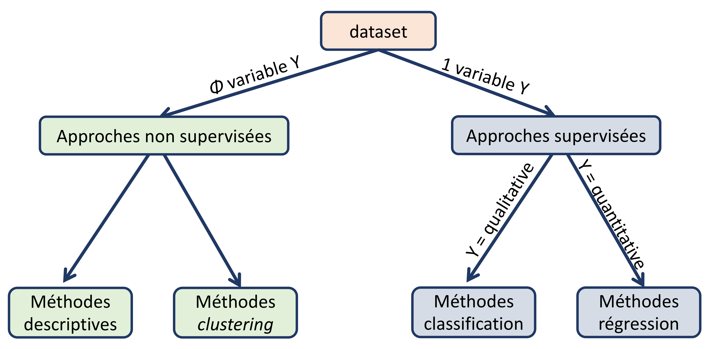
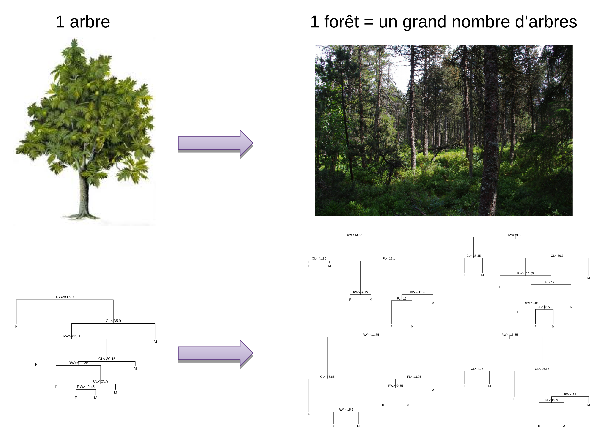

```{r include=FALSE, echo=FALSE, eval=TRUE}
library(knitr)
library(kableExtra)
library(png)
library(grid)
library(rpart.plot)
library(rpart)
library(randomForest)
library(FactoMineR)
library(corrplot)
library(pheatmap)

# library(formattable)

options(width = 600)
# options(encoding = 'UTF-8')
knitr::opts_chunk$set(
  fig.width = 7, fig.height = 5, 
  fig.path = 'figures/07_tests_multiples',
  fig.align = "center", 
  size = "tiny", 
  echo = TRUE, eval = TRUE, 
  warning = FALSE, message = FALSE, 
  results = TRUE, comment = "")

options(scipen = 12) ## Max number of digits for non-scientific notation
# knitr::asis_output("\\footnotesize")

```


## Plan


## Méthodes multivariées



## Prédire la variété des iris en fonction de leur description  

* Travaille avec les données d'iris
```{r}
str(iris)
```

* Variable à prédire ($Y$) : `Species`   
* Variables descriptives ($X_i$) : `Sepal.Length`, `Sepal.Width`, `Petal.Length` et `Petal.Width     


## Construction du modèle de prédiction

{width=60%}


## Propriétés d'un bon modèle de prédiction  

* Bonnes performances  
* Reproductible sur de nouvelles données  
* Simple  
* Facile à interpréter  
    

## Protocole général


## Méthodes
* Arbres de décision : CART (Classification and Regression Trees)
* Forêts aléatoires  
* *Support Vector Machines* (SVM)  
* Réseaux de neurones


## Qu'est qu'un arbre de décision 

 **Classification par une série de tests** 

* Diviser récursivement les individus à l'aide de tests définis à partir des variables jusqu'à ce qu'on obtienne des sous-ensembles d'individus n'appartenant qu'à une seule classe
* partitionnement de l'espace des données en sous-régions homogènes en termes de classes 

```{r echo=FALSE, fig.width=15}
ind.app <- sample(1:nrow(iris), size = nrow(iris)*2/3)
mat.app <- iris[ind.app,]
rpart.fit <- rpart(Species ~ . , data = iris)
nf<-layout(matrix(c(1,2), 1, 2))
prp(rpart.fit, type=0, extra=1, nn=TRUE, box.col = "lightblue2", split.box.col="wheat1")
#image(1:ncol(iris[,-5]), 1:nrow(iris) ,t(as.matrix(iris[, -5])), ylab = "flowers", las = 1,xaxt="n", xlab="")
#axis(1, 1:4, colnames(iris[,-5]), las=2, cex=0.5)
plot(iris[,3], iris[,4], col = as.numeric(iris[,5]), pch=19, xlab=colnames(iris)[3], ylab=colnames(iris)[4])
abline(v=2.5, h=1.8, lty=2, col="gray80")
```


## Création des échantillons d'apprentissage et de test

* Echantillon d'apprentissage : 2/3 des individus choisis aléatoirement 

```{r}
ind.app <- sample(1:nrow(iris), size = nrow(iris)*2/3)
mat.app <- iris[ind.app,]
summary(mat.app)
```


## Création des échantillons d'apprentissage et de test
* Echantillon test : le 1/3 des individus restant

```{r}
mat.test <- iris[-ind.app,]
summary(mat.test)
```


## Validation des échantillons d'apprentissage et test

* Création d'un vecteur couleur :  
    + en rouge les individus appartenant au jeu d'apprentissage  
    + en vert les individus appartenant au jeu test
    
```{r}
vcol.set <- rep("green", length <- nrow(iris))
vcol.set[ind.app] <- "red"
```

* calcul de l'ACP en utilisant les 4 descripteurs
```{r size="small"}
pca.res <- PCA(iris[,-5], graph = FALSE)
```


## Validation des échantillons d'apprentissage et test

```{r fig.height=4, size="tiny"}
plot(pca.res,choix="ind",col.ind=vcol.set,label="none")
legend("topleft",c("training set","test set"),col=c(2,3),lty=1)
```


## Apprentissage du modèle sur l'échantillon d'apprentissage
```{r fig.height=3, fig.width=2}
rpart.fit<-rpart(Species ~ . , data = mat.app)
prp(rpart.fit, type=0, extra=1, nn=TRUE)
```


##Evaluation du modèle sur le jeu d'apprentissage

* Table de confusion 

```{r}
pred.app<-predict(rpart.fit,newdata=mat.app,type="class")
(tc <- table(mat.app[,"Species"],pred.app))
```

* *Accuracy* (taux de bien prédit) = $\frac{VN+VP}{VN+VP+FN+FP}$
```{r}
(acc <- sum(diag(tc))/sum(tc))
```

##Evaluation du modèle sur le jeu test

* Table de confusion 
```{r}
pred.test<-predict(rpart.fit,newdata=mat.test,type="class")
(tc<-table(mat.test[,"Species"], pred.test))
```

* *Accuracy*
```{r}
(acc <- sum(diag(tc))/sum(tc))
```


## Etude de l'importance des descripteurs

* Deux descripteurs `Petal.Length` et `Petal.Width` sont nécéssaires pour prédire l'espèce.

```{r fig.height=2}
prp(rpart.fit,type=0,extra=1,nn=TRUE)
```

$\quad$  
$\rightarrow$ Sélection de variables souvent drastique


## Différents algorithmes d'arbres de décision

* ID3 (Inductive Decision Tree, Quinlan 1979)   
    + arbres « de discrimination » (variables uniquement qualitatives)  
    + critère d’hétérogénéité = entropie  
* C4.5 (Quinlan 1993)  
    + amélioration des ID3  
    + gestion des valeurs manquantes  
* CART (Classification And Regression Tree, Breiman et al. 1984)  
    + critère d’hétérogénéité = Gini  


## Avantages et inconvénients des arbres de décision  

* Avantages :   
    + Pas besoin de normaliser les données  
    + La variable à prédire peut être muti-classe  
    + Facilité d'interprétation   
    + Sélection de variables  
* Inconvénients :   
    + Sensibles au bruit et points abérrants  
    + Sélection des variables drastique
    + Sur-apprentissage  


## Forêts aléatoires : Principe

<center>
{width=50%}
</center>

* Apprendre un grand nombre d'arbres permettant de voter pour la classe la plus populaire   
* Double randomisation sur les variables et sur les individus  

## Construction d'une forêt aléatoire  

* But : prédire l'espèce des iris
* Les données :  échantillon d'apprentissage :  
    + $p$ = nombre de variables ($p=4$)
    + $n$ = nombre de fleurs ($n=100$)

## Construction du $k^{ème}$ arbre - randomisation sur les individus

<center> **Double randomisation sur les individus et sur les variables**</center>

* Création d'un **échantillon bootstrap** contenant $n$ fleurs = tirage aléatoire avec remise de $n$ fleurs dans le jeu d'apprentissage
```{r}
ech.B1<-sample(1:nrow(mat.app),size=nrow(mat.app),replace=T)
sort(ech.B1)
```

## Construction du $k^{ème}$ arbre - randomisation sur les individus

* Génération de deux échantillons différents à partir de la matrice d'apprentissage :   
    + échantillon de bootstrap  $\rightarrow$ Construction d'un arbre
    + échantillon OOB (Out-Of-Bag) : contient les individus qui ne sont pas présents dans l'échantillon bootstrap $\rightarrow$ Calcul de l'erreur du modèle

```{r}
ech.OOB1 <- setdiff(1:nrow(mat.app), ech.B1)
ech.OOB1
```

* Chaque arbre de la forêt va être construit sur un jeu bootstrap différent


## Construction du $k^{ème}$ arbre - randomisation sur les variables

<center> **Double randomisation sur les individus et sur les variables**</center>

* Pour la construction d'un noeud de l'arbre : Sélectionne aléatoirement $q$ variables parmi les $p$

```{r}
nbr.var <- 2
list.var <- colnames(iris)[-5]
var.sel <- sample(list.var, size = nbr.var)
var.sel
```


## Construction du $k^{ème}$ arbre - randomisation sur les variables

* Le 1er noeud du $k^{ème}$ arbre se construit avec le jeu suivant :   
```{r}
random.data1 <- mat.app[ech.B1, var.sel]
head(random.data1)
```

* pour les noeud suivant : sélectionne à chaque fois $q$ variable  

* nouvel arbre : création d'un nouvel échantillon bootstrap  


## Deux paramètres à définir 

* **Nombre d'arbres** dans la forêt (*ntree*)  
    + **assez grand**  pour que chaque observation soit prédite suffisamment de fois

* **Nombre de variables tirées aléatoirement** (*mtry*) :
    + permet de gérer la corrélation et la force de la forêt :   
        + **Corrélation** : ressemblance entre les arbres  
        + **Force** : capacité de chaque arbre à ne pas faire d'erreur
    + idéal : Faible corrélation et une grande force
    + quand *mtry* augmente : la corrélation et la force augmente $\rightarrow$ Trouver un juste milieu.


## Performance du modèle  

* Calcul de la performance non biaisée du modèle  
$\rightarrow$ : utilisation des données des échantillons OOB


## Prédiction de l'espèce d'iris - Construction du modèle
```{r}
library(randomForest)
rf.fit<-randomForest(Species~.,data=mat.app,mtree=500,
                     mtry=2,importance=TRUE)
rf.fit
```

## Prédiction de l'espèce d'iris - Estimation des performances du modèle
```{r echo=FALSE}
par(mar=c(3,2,1,1))
```
```{r fig.height=4}
plot(rf.fit, main="")
```

## Etude de l'importance des variables 
<center>
{width=60%}
</center>


* Importance de la variable $j$ dans l'arbre $i$ : $Imp(j,i)=b-a$  
* Importance globale de la variable $j$ = moyenne des importances sur les $k$ arbres impliquant la variable $j$  
$$Imp(j) = \sum\limits_{i=1}^{k}Imp(j,i)$$


## Etude de l'importance des variables 
```{r echo=FALSE}
par(mar=c(2,1,1,1))
```
```{r}
varImpPlot(rf.fit, main="")
```

## Merci de votre attention !!!

* Prédiction du type de tumeur sur les données 
    + apprentissage d'un modèle de CART
    + apprentissage d'une forêt aléatoire
$\quad$
$\quad$


