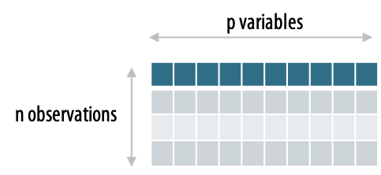

```{r install_packages, echo=FALSE, eval=TRUE}
#### Load required packages and install them if required ####
packages <- c("knitr", 
              "png", 
              "grid", 
              "FactoMineR", 
              "factoextra", 
              "corrplot",
              "tidyverse",
              "gridExtra")

for (pkg in packages) {
  if (!require(pkg, character.only = TRUE)) {
    install.packages(pkg)
    require(pkg, character.only = TRUE)
  }
}

```


```{r settings, include=FALSE, echo=FALSE, eval=TRUE}

options(width = 300)
knitr::opts_chunk$set(
  fig.width = 7, fig.height = 5, 
  fig.path = 'figures/PCA_PCoA_intro_',
  fig.align = "center", 
  size = "tiny", 
  echo = TRUE, eval = TRUE, 
  warning = FALSE, message = FALSE, 
  results = FALSE, comment = "")

options(scipen = 12) ## Max number of digits for non-scientific notation

```

## Analyse en Composantes Principales

Objectif : décrire sans a priori un tableau de données constitué exclusivement de variables quantitatives. 

<!-- {height=300px} {height=300px} -->

{height=400px} 


Cette méthode permet de résumer l'information et d'en réduire la dimensionnalité. 

## Analyse en Composantes Principales

* L’ACP permet de déterminer les espaces de dimension inférieure à l’espace initial :

    + où la projection du nuage de points initial est la moins déformée possible, 
    + qui conserve le plus d’information c’est-à-dire de variabilité.

* L'ACP permet de conserver au mieux la structure de corrélation entre les variables initiales

    + Lorsque plusieurs variables sont corrélées, les composantes principales = combinaison de ces variables 
    + Permet de représenter les observations avec une perte d’information minimale 
    + L’ACP est particulièrement utile lorsque les variables sont fortement corrélées (réduction de dimension)

## Analyse en Composantes Principales

Le principe de l'ACP : 

- Trouver un axe ( = la première composante principale), 
- Issu d'une combinaison linéaire des variables initiales, 
- Tel que la variance du nuage autour de cet axe soit maximale. 
- Réitérer ce processus dans des directions orthogonales pour déterminer les composantes principales suivantes.

{width=600px}

## Analyse en Composantes Principales

{width=900px}


- L’ACP suppose que les directions avec les plus grandes variances sont les plus “importantes”
- La quantité de variance expliquée par chaque composante principale est mesurée par ce que l’on appelle valeur propre.


## Standardisation des données

- Pour faire une ACP, les variables sont souvent normalisées 
- Particulièrement recommandé lorsque les variables sont mesurées dans différentes unités 
- L’objectif est de rendre les variables comparables. 

```{r, echo=FALSE, fig = TRUE}
decathlon2 %>% 
  select(-Points, -Rank, -Competition) %>%
  gather(key = Disciplines, value = Performances) %>%
  ggplot(mapping = aes(x = Disciplines, y = Performances, fill = Disciplines)) + 
  geom_boxplot() + 
  theme(axis.text.x = element_text(angle = 90, hjust = 1))
```


## Standardisation des données

- **Centrer** = soustraire à chaque valeur la moyenne de la variable
- **Réduire** = diviser par l’écart-type
- fonction `scale()` : $\frac{x_{i} - mean(x)}{sd(x)}$


```{r, echo=FALSE, fig = TRUE}
decathlon2 %>% 
  select(-Points, -Rank, -Competition) %>%
  scale() %>%
  as.data.frame() %>%
  gather(key = Disciplines, value = Performances) %>%
  ggplot(mapping = aes(x = Disciplines, y = Performances, fill = Disciplines)) + 
  geom_boxplot() + 
  theme(axis.text.x = element_text(angle = 90, hjust = 1))
```

- L’ACP appliquée à ces données transformées est appelée **ACP normée**.


## Code R

```{r}
library("FactoMineR")
library("factoextra")
```


```{r, eval=FALSE}
PCA(X, scale.unit = TRUE, ncp = 5, graph = TRUE)
```


- X : jeu de données de type data frame. Les lignes sont des individus et les colonnes sont des variables numériques
- scale.unit : une valeur logique. Si TRUE, les données sont standardisées/normalisées avant l’analyse.
- ncp : nombre de dimensions conservées dans les résultats finaux.
- graph : une valeur logique. Si TRUE un graphique est affiché.

```{r, echo = TRUE}
data(decathlon2)
res.pca = PCA(decathlon2[, 1:10], graph = FALSE)
```

## Code R
Le résultat de la fonction PCA() est une liste, contenant les éléments suivants :

```{r, eval=TRUE, results=TRUE}
res.pca
```

## Valeurs propres / Variances

- Les valeurs propres (eigenvalues en anglais) mesurent la quantité de variance expliquée par chaque axe principal. 
- Elles sont grandes pour les premiers axes et petites pour les axes suivants. 
- Les premiers axes correspondent aux directions portant la quantité maximale de variation contenue dans le jeu de données. 
- On peut examiner les valeurs propres pour déterminer le nombre de composantes principales à prendre en compte. 

## Valeurs propres / Variances

```{r}
eig.val = get_eigenvalue(res.pca)
eig.val
```

Les valeurs propres peuvent être utilisées pour déterminer le nombre d’axes principaux à conserver.

- Une valeur propre > 1 : la composante principale (PC) concernée représente plus de variance par rapport à une seule variable d’origine, lorsque les données sont standardisées. 
- On peut regarder le nombre d’axes qui représente une certaine fraction de la variance totale. Par exemple, le nombre d’axe qui permet de parvenir à 70% de la variance totale expliquée. 

## Valeurs propres / Variances

```{r}
fviz_eig(res.pca, addlabels = TRUE, ylim = c(0, 50))
```

## Étude des variables

L'ACP permet d'étudier les liaisons linéaires entre les variables. 

Les objectifs sont de résumer la matrice des corrélations et de chercher des variables synthétiques : peut-on résumer les observations par un petit nombre de variables ?
    
> Dans notre exemple : les variables représentent les performances des athlètes dans chaque discipline

## Graphiques des variables
```{r, results=TRUE}
var = get_pca_var(res.pca)
var
```

Les composants de get_pca_var() peuvent être utilisés dans le graphique des variables comme suit :

- var$coord : coordonnées des variables pour représenter le nuage de points.
- var\$cos2 : cosinus carré des variables. Représente la qualité de représentation des variables sur le graphique de l’ACP. Il est calculé comme étant les coordonnées au carré : $var.cos^2 = var.coord * var.coord$.
- var\$contrib : contient les contributions (en pourcentage), des variables, aux composantes principales. La contribution d’une variable (var) à une composante principale donnée : $(var.cos^2 \times 100) / (\sum_{composante} cos^2)$.

## Graphiques des variables
```{r, results=TRUE}
# Coordonnées
var$coord[1:3, 1:4]
# Cos2: qualité de répresentation
var$cos2[1:3, 1:4]
# Contributions aux composantes principales
var$contrib[1:3, 1:4]
```

## Le cercle de corrélation
```{r}
fviz_pca_var(res.pca, col.var = "black")
```

- Plus une variable est proche du cercle de corrélation, meilleure est sa représentation et elle est plus importante pour interpréter les composantes principales en considération 
- Les variables qui sont proche du centre du graphique sont moins importantes pour interpréter les composantes. 

## Qualité de représentation
```{r}
corrplot(var$cos2, is.corr=FALSE)
```

- Un $cos^2$ élevé = bonne représentation de la variable sur les axes principaux     
$\rightarrow$ la variable est positionnée à proximité du bord du cercle de corrélation. 
- Un faible $cos^2$ =  la variable n’est pas bien représentée par les axes principaux    
$\rightarrow$ la variable est proche du centre du cercle. 

## Qualité de représentation
```{r}
# Cos2 total des variables sur Dim.1 et Dim.2
fviz_cos2(res.pca, choice = "var", axes = 1:2)
```

  + Si une variable est parfaitement représentée par les deux 1ères composantes principales, les variables seront positionnées sur le cercle de corrélation.
  + Pour certaines des variables, plus de 2 axes peuvent être nécessaires pour représenter parfaitement les données.

## Qualité de représentation
```{r}
# Cos2 total des variables sur Dim.1 et Dim.2
fviz_cos2(res.pca, choice = "var", axes = 1:5)
```

- Pour une variable donnée, la somme des $cos^2$ sur toutes les composantes principales est égale à 1.


## Qualité de représentation
```{r}
# Colorer en fonction du cos2 : qualité de représentation
fviz_pca_var(res.pca, col.var = "cos2",
             gradient.cols = c("#00AFBB", "#E7B800", "#FC4E07"),
             repel = TRUE # Évite le chevauchement de texte
             )
```


## Contributions des variables aux axes principaux
```{r, results=TRUE}
head(var$contrib, 4)
```

- Plus la valeur de la contribution est importante, plus la variable contribue à la composante principale en question.
- Les contributions des variables sont exprimées en pourcentage. 
- Les variables corrélées avec PC1 (i.e., Dim.1) et PC2 (i.e., Dim.2) sont les plus importantes pour expliquer la variabilité dans le jeu de données.
- Les variables qui ne sont pas en corrélation avec un axe ou qui sont corrélées avec les derniers axes sont des variables à faible apport et peuvent être supprimées pour simplifier l’analyse globale.

## Contributions des variables aux axes principaux
```{r}
corrplot(var$contrib, is.corr=FALSE)
```


## Contributions des variables aux axes principaux
```{r, eval = FALSE}
# Contributions des variables à PC1
fviz_contrib(res.pca, choice = "var", axes = 1, top = 10)
# Contributions des variables à PC2
fviz_contrib(res.pca, choice = "var", axes = 2, top = 10)
```

```{r, echo = FALSE, fig.show='hold', fig.width=10}
# Contributions des variables à PC1
p1 = fviz_contrib(res.pca, choice = "var", axes = 1, top = 10)
# Contributions des variables à PC2
p2 = fviz_contrib(res.pca, choice = "var", axes = 2, top = 10)
grid.arrange(p1, p2, ncol = 2)
```


Contribution moyenne attendue : Une variable avec une contribution supérieure à ce seuil pourrait être considérée comme importante pour contribuer à la composante.

## Contributions des variables aux axes principaux

La contribution totale à PC1 et PC2 est obtenue avec le code R suivant :

```{r}
fviz_contrib(res.pca, choice = "var", axes = 1:2, top = 10)
```


## Contributions des variables aux axes principaux
```{r}
fviz_pca_var(res.pca, col.var = "contrib",
             gradient.cols = c("#00AFBB", "#E7B800", "#FC4E07")
             )
```


## Description des dimensions
La fonction dimdesc() peut être utilisée pour identifier les variables les plus significativement associées avec une composante principale donnée :
```{r, results=TRUE}
res.desc = dimdesc(res.pca, axes = c(1,2), proba = 0.05)
# Description de la dimension 1
res.desc$Dim.1
# Description de la dimension 2
res.desc$Dim.2
```

Les variables sont triées en fonction de la p-value de la corrélation.

## Ajout de variables supplémentaires pour aider à l'interprétation
```{r}
res.pca = PCA(decathlon2[, 1:12], quanti.sup = 11:12, graph = FALSE)
fviz_pca_var(res.pca, col.var = "cos2",
             gradient.cols = c("#00AFBB", "#E7B800", "#FC4E07"),
             col.quanti.sup = "blue",
             repel = TRUE # Évite le chevauchement de texte
             )
```


## Étude des individus

On peut également étudier la variabilité entre individus. 

Y a-t-il des similarités entre les individus pour toutes les variables ? Peut-on établir des profils d'individus ? Peut-on opposer un groupe d'individus à un autre ?

> Dans notre exemple : les individus sont les athlètes : deux athlètes sont proches s'ils ont des résultats similaires.

## Graphique des individus
```{r}
ind = get_pca_ind(res.pca)
ind
```

Pour accéder aux différents éléments, utilisez ceci :
```{r, results=TRUE}
# Coordonnées des individus
ind$coord[1:3, 1:4]
# Qualité des individus
ind$cos2[1:3, 1:4]
# Contributions des individus
ind$contrib[1:3, 1:4]
```

## Graphique : qualité et contribution
```{r}
fviz_pca_ind (res.pca, col.ind = "cos2",
             gradient.cols = c("#00AFBB", "#E7B800", "#FC4E07"),
             repel = TRUE) # Évite le chevauchement de texte
```

## Graphique : qualité et contribution
```{r}
fviz_pca_ind (res.pca, pointsize = "cos2",
             pointshape = 21, fill = "#E7B800",
             repel = TRUE) # Évite le chevauchement de texte
```

## Graphique : qualité et contribution
```{r, fig.width=10}
# Contribution totale sur PC1 et PC2
fviz_contrib(res.pca, choice = "ind", axes = 1:2)
```

## Lien entre les variables et les observations

Permet de répondre à la question : peut-on caractériser des groupes d'individus par des variables ?


## Le biplot : représenter les individus et les variables en même temps
```{r}
fviz_pca_biplot(res.pca, repel = TRUE,
                col.var = "#2E9FDF", # Couleur des variables
                col.ind = "#696969") # Couleur des individues
```

  > Le biplot n’est utile que s’il existe un faible nombre de variables et d’individus dans le jeu de données
  
  > Les coordonnées des individus et des variables ne sont pas construites dans le même espace.    
  $\rightarrow$ se concentrer sur la direction des variables mais pas sur leurs positions absolues sur le graphique. 
  
## Le biplot : représenter les individus et les variables en même temps
```{r}
fviz_pca_biplot(res.pca, repel = TRUE,
                col.var = "#2E9FDF", # Couleur des variables
                col.ind = "#696969") # Couleur des individues
```

  > Un individu qui se trouve du même côté d’une variable donnée a une valeur élevée pour cette variable ; 
  
  > Un individu qui se trouve sur le côté opposé d’une variable donnée a une faible valeur pour cette variable. 


## Colorer par groupes (variable qualitative)
```{r}
fviz_pca_ind(res.pca,
             geom.ind = "point", # Montre les points seulement (mais pas le label)
             col.ind = decathlon2$Competition, # colorer by groups
             addEllipses = TRUE, # Ellipses de concentration
             ellipse.level = 0.5,
             legend.title = "Compétition")
```

## Colorer par groupes (variable qualitative)

```{r}
fviz_pca_ind(res.pca,
             col.ind = decathlon2$Competition, # colorer by groups
             addEllipses = TRUE, # Ellipses de concentration
             ellipse.level = 0.5,
             legend.title = "Compétition")
```
