# Les données

- Comment sont représentées les données dans l'ordinateur ?
- Comment représenter les données dans l'espace ?
- Comment découvrir des "clusters" dans les données ?
  - classification hiérarchique
  - kmeans
- comment déterminer le nombre de groupe optimal ?
- comment comparer deux classifications ?

# Les données dans l'ordinateur (1)

## Les iris de Fisher 
[Ces données sont un classique des méthodes d'apprentissage](https://onlinelibrary.wiley.com/doi/epdf/10.1111/j.1469-1809.1936.tb02137.x)


# Les données dans l'ordinateur (2)


```
  Sepal.Length Sepal.Width Petal.Length Petal.Width
1          5.1         3.5          1.4         0.2
2          4.9         3.0          1.4         0.2
3          4.7         3.2          1.3         0.2
4          4.6         3.1          1.5         0.2
5          5.0         3.6          1.4         0.2
6          5.4         3.9          1.7         0.4
```

# Les données dans l'ordinateur (2)


```
  Sepal.Length Sepal.Width Petal.Length Petal.Width
1          5.1         3.5          1.4         0.2
2          4.9         3.0          1.4         0.2
3          4.7         3.2          1.3         0.2
4          4.6         3.1          1.5         0.2
5          5.0         3.6          1.4         0.2
6          5.4         3.9          1.7         0.4
```

- 1 ligne = 1 fleur = 1 vecteur

- 1 colonne = 1 variable = 1 vecteur

- l'ensemble des données = 1 échantillon = 1 data.frame

# Représentons ces données : une fleur (1)


```r
mes.iris[1,]
```

```
  Sepal.Length Sepal.Width Petal.Length Petal.Width
1          5.1         3.5          1.4         0.2
```


Comment représenter cette fleur ?

- par un point !

Dans quel espace de réprésentation ?

# Représentons ces données : une fleur (2)


```r
plot(mes.iris[1,1:2])
```

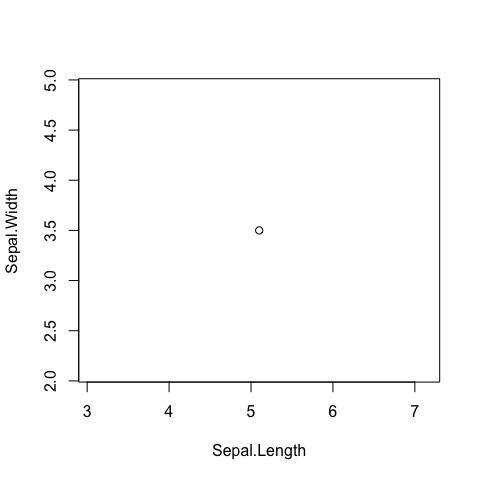

Dans le plan, un point de coordonnées :

- x = 5.1
- y = 3.5

représenté par un vecteur $v2 = ($ 5.1 $,$ 3.5$)$ dans $\mathbb{R}^2$

# Représentons ces données : une fleur (3) 


Dans l'espace, un point de coordonnées :

- x = 5.1
- y = 3.5
- z = 1.4

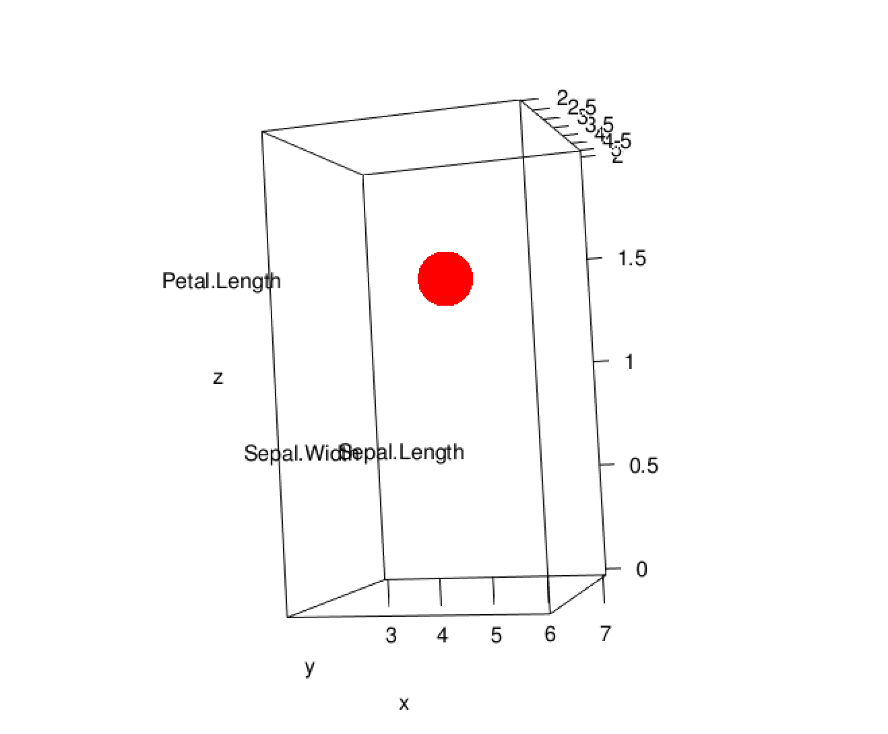

représenté par un vecteur $v3 = ($ 5.1 $,$ 3.5 $,$ 1.4$)$ dans $\mathbb{R}^3$

# Représentons ces données : toutes les fleurs (4)

= un nuage de points dans un espace à 4 dimensions

  - chaque point est représenté par un vecteur dans $\mathbb{R}^4$
  - le nuage de points est représenté par une matrice à n et p (= 4 dimensions)
    + n = nombre de lignes = nombre d'individus = taille de l'échantillon
    + p = nombre de colonnes = nombre de variables décrivant l'échantillon

= PAS de représentation possible (pour l'instant)


# Représentons ces données : une variable à la fois (1)

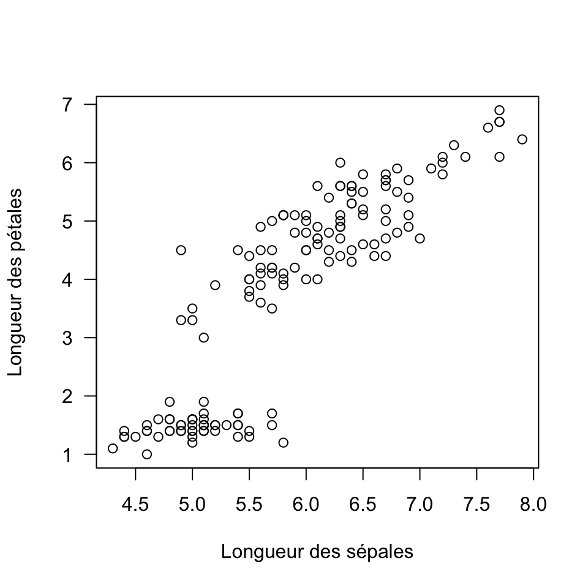

# Représentons ces données : deux variables à la fois (2)

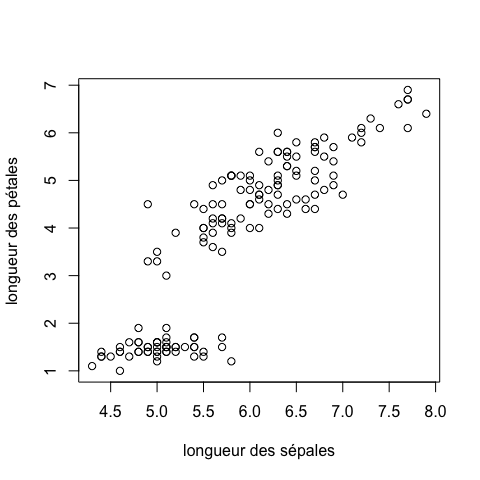

# Il faut tenir compte de toutes les dimensions

c'est à dire de toutes les variables à notre disposition

# Clustering et classification (termes anglais)

On a une **information** sur nos données

- variables quantitatives = vecteur de réels
 
**Clustering** : on cherche à mettre en évidence des groupes dans les données

- le clustering appartient aux méthodes dites **non supervisées**, ou descriptives

# Clustering et classification (termes anglais)

On a une **information** sur nos données

**Clustering** : on cherche à mettre en évidence des groupes dans les données

**Classification** :

- on connaît le partitionnement de notre jeu de données
    
  + variables quantitatives = vecteur de réels
  + ET
  + variable qualitative = groupe (cluster) d'appartenance = vecteurs de entiers / niveau d'un facteur
  + on cherche à prédire le groupe (la classe) de nouvelles données

- la classification appartient aux méthodes dites **supervisées**, ou prédictives

# Clustering

<div class="figure" style="text-align: center">

<p class="caption">Y a-t-il des groupes ?</p>
</div>


# Géométrie et distances (1)

On considère les données comme des points de $\mathbb{R}^n$ 

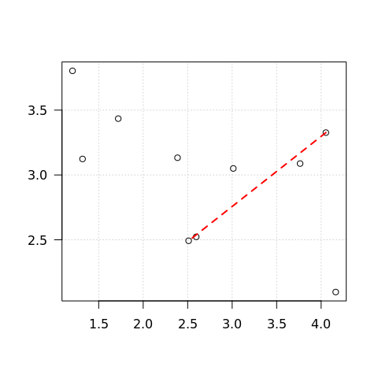

$\mathbb{R}^n$ : espace Euclidien à $n$ dimensions, où 

- chaque dimension représente une des variables observées;
- un individu est décrit comme un vecteur à $n$ valeurs, qui correspond à un point dans cet espace. 

# Géométrie et distances (2)

On considère les données comme des points de $R^n$ (*)

- géométrie donnée par distances
- distances = dissimilarités imposées par le problème
- dissimilarités $\longrightarrow$ permettent visualisation de l'ensemble des points

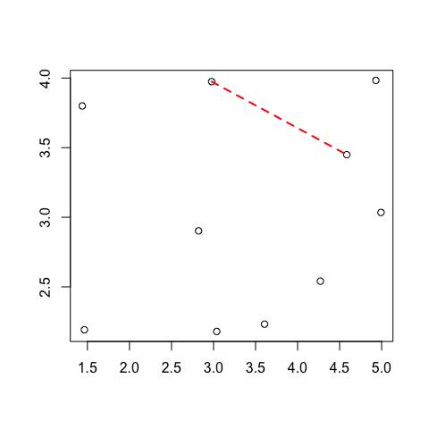

# Géométrie et distances (3)

Sur la base d'une distance (souvent euclidienne)

- Clustering :

  + Méthode agglomérative ou hierarchical clustering
  + Moyennes mobiles ou K-means : séparation optimale des groupes connaissant le nombre de groupes

# Distances

Définition d'une distance : fonction positive de deux variables

1. $d(x,y) \ge 0$
2. $d(x,y) = d(y,x)$
3. $d(x,y) = 0 \Longleftrightarrow x = y$
4. **Inégalité triangulaire :** $d(x,z) \le$ d(x,y)+d(y,z)

Si 1,2,3 : dissimilarité

# Distances utilisées dans R (1)

- distance euclidienne ou distance $L_2$:
  $d(x,y)=\sqrt{\sum_i (x_i-y_i)^2}$
  
- distance de manahattan ou distance $L_1$:
  $d(x,y)=\sum_i |x_i-y_i|$
    
- distance du maximum ou L-infinis, $L_\infty$:
  $d(x,y)=\max_i |x_i-y_i|$
    


# Distances utilisées dans R (2)

- distance de Minkowski $l_p$:
$$d(x,y)=\sqrt[p]{\sum_i (|x_i-y_i|^p}$$

- distance de Canberra (x et y valeurs positives):
$$d(x,y)=\sum_i \frac{x_i-y_i}{x_i+y_i}$$

- distance binaire ou distance de Jaccard ou Tanimoto: proportion de propriétés communes


# Autres distances non géométriques (pour information)

Utilisées en bio-informatique:

- Distance de **Hamming**: nombre de remplacements de caractères (substitutions)

- Distance de **Levenshtein**: nombre de substitutions, insertions, deletions entre deux chaînes de caractères

$$d("BONJOUR", "BONSOIR")=2$$

- Distance d'**alignements**: distances de Levenshtein avec poids (par ex. matrices BLOSSUM)

- Distances d'**arbre** (Neighbor Joining)

- Distances **ultra-métriques** (phylogénie UPGMA)


# Distances plus classiques en génomique

Il existe d'autres mesures de distances, plus ou moins adaptées à chaque problématique :

- **Jaccard** (comparaison d'ensembles): $J_D = \frac{A \cap B}{A \cup B}$

- Distance du $\chi^2$ (comparaison de tableau d'effectifs)

Ne sont pas des distances, mais indices de dissimilarité :

- **Bray-Curtis** (en écologie, comparaison d'abondance d'espèces)
- **Jensen-Shannon** (comparaison de distributions)
  
**Note** : lors du TP, sur les données d'expression RNA-seq, nous utiliserons le **coefficient de corrélation de Spearman** et la distance dérivée, $d_c = 1-r$ ou $d_c = \sqrt{2 \times (1 - r)}$

# Avec R (1)

- on utilise la fonction `dist()` avec l'option `method = "euclidean", "manhattan", ...` 

<table>
<tbody>
  <tr>
   <td style="text-align:right;"> 3.61 </td>
   <td style="text-align:right;"> 2.56 </td>
   <td style="text-align:right;"> 3.91 </td>
   <td style="text-align:right;"> 4.74 </td>
   <td style="text-align:right;"> 4.11 </td>
  </tr>
  <tr>
   <td style="text-align:right;"> 2.04 </td>
   <td style="text-align:right;"> 2.39 </td>
   <td style="text-align:right;"> 3.42 </td>
   <td style="text-align:right;"> 2.83 </td>
   <td style="text-align:right;"> 2.40 </td>
  </tr>
</tbody>
</table>

distance euclidienne : 4.33

distance de manhattan = 12.14


# Avec R (2)

- ou pour des distances particulières, par exemple l'indice de Jaccard :
<table>
<tbody>
  <tr>
   <td style="text-align:left;"> v.a </td>
   <td style="text-align:center;"> 0 </td>
   <td style="text-align:center;"> 1 </td>
   <td style="text-align:center;"> 0 </td>
   <td style="text-align:center;"> 0 </td>
   <td style="text-align:center;"> 0 </td>
   <td style="text-align:center;"> 0 </td>
   <td style="text-align:center;"> 0 </td>
  </tr>
  <tr>
   <td style="text-align:left;"> v.b </td>
   <td style="text-align:center;"> 0 </td>
   <td style="text-align:center;"> 1 </td>
   <td style="text-align:center;"> 0 </td>
   <td style="text-align:center;"> 0 </td>
   <td style="text-align:center;"> 0 </td>
   <td style="text-align:center;"> 1 </td>
   <td style="text-align:center;"> 0 </td>
  </tr>
  <tr>
   <td style="text-align:left;"> v.c </td>
   <td style="text-align:center;"> 0 </td>
   <td style="text-align:center;"> 1 </td>
   <td style="text-align:center;"> 0 </td>
   <td style="text-align:center;"> 0 </td>
   <td style="text-align:center;"> 0 </td>
   <td style="text-align:center;"> 0 </td>
   <td style="text-align:center;"> 0 </td>
  </tr>
</tbody>
</table>

```
          v.a       v.b
v.b 0.3333333          
v.c 0.0000000 0.3333333
```

# Distances entre groupes (1)

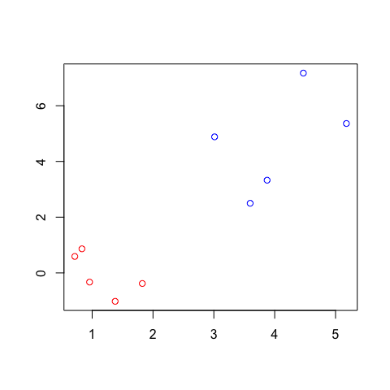

# Distances entre groupes (2)

- **Single linkage** : élements les plus proches des 2 groupes

$$D(C_1,C_2) = \min_{i \in C_1, j \in C_2} D(x_i, x_j)$$
  
- **Complete linkage** : éléments les plus éloignés des 2 groupes

$$D(C_1,C_2) = \max_{i \in C_1, j \in C_2} D(x_i, x_j)$$

# Distances entre groupes (3)
  
- **Group average** : distance moyenne

$$D(C_1,C_2) = \frac{1}{N_1 N_2} \sum_{i \in C_1, j \in C_2} D(x_i, x_j)$$
  
- **Ward**

$d^2(C_i,C_j) = I_{intra}(C_i \cup C_j)-I_{intra}(C_i)-I_{intra}(C_j)$

$D(C_1,C_2) = \sqrt{\frac{N_1N_2}{N_1 + N_2}} \| m_1 -m_2 \|$

# Distances entre groupes (4)


# Les données

[Ces données sont un classique des méthodes d'apprentissage](https://onlinelibrary.wiley.com/doi/epdf/10.1111/j.1469-1809.1936.tb02137.x)

Dans un premier temps, regardons les données


```r
dim(mes.iris)
```

```
[1] 150   4
```

```r
head(mes.iris)
```

```
  Sepal.Length Sepal.Width Petal.Length Petal.Width
1          5.1         3.5          1.4         0.2
2          4.9         3.0          1.4         0.2
3          4.7         3.2          1.3         0.2
4          4.6         3.1          1.5         0.2
5          5.0         3.6          1.4         0.2
6          5.4         3.9          1.7         0.4
```

---


```r
str(mes.iris)
```

```
'data.frame':	150 obs. of  4 variables:
 $ Sepal.Length: num  5.1 4.9 4.7 4.6 5 5.4 4.6 5 4.4 4.9 ...
 $ Sepal.Width : num  3.5 3 3.2 3.1 3.6 3.9 3.4 3.4 2.9 3.1 ...
 $ Petal.Length: num  1.4 1.4 1.3 1.5 1.4 1.7 1.4 1.5 1.4 1.5 ...
 $ Petal.Width : num  0.2 0.2 0.2 0.2 0.2 0.4 0.3 0.2 0.2 0.1 ...
```

```r
summary(mes.iris)
```

```
  Sepal.Length    Sepal.Width     Petal.Length    Petal.Width   
 Min.   :4.300   Min.   :2.000   Min.   :1.000   Min.   :0.100  
 1st Qu.:5.100   1st Qu.:2.800   1st Qu.:1.600   1st Qu.:0.300  
 Median :5.800   Median :3.000   Median :4.350   Median :1.300  
 Mean   :5.843   Mean   :3.057   Mean   :3.758   Mean   :1.199  
 3rd Qu.:6.400   3rd Qu.:3.300   3rd Qu.:5.100   3rd Qu.:1.800  
 Max.   :7.900   Max.   :4.400   Max.   :6.900   Max.   :2.500  
```


# Visualisation des données

On peut ensuite essayer de visualiser les données

  - par un `plot`
  

```r
plot(mes.iris)
```

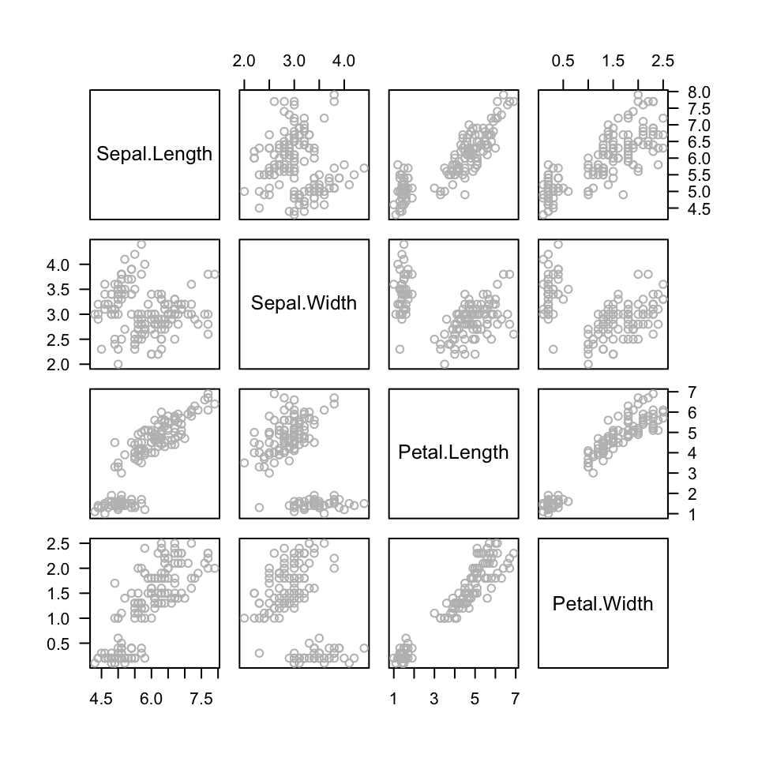

# Visualisation des données - coloration par espèces


```r
species.colors <- c(setosa = "#BB44DD", virginica = "#AA0044", versicolor = "#4400FF")
plot(mes.iris, col = species.colors[iris$Species], cex = 0.7)
```

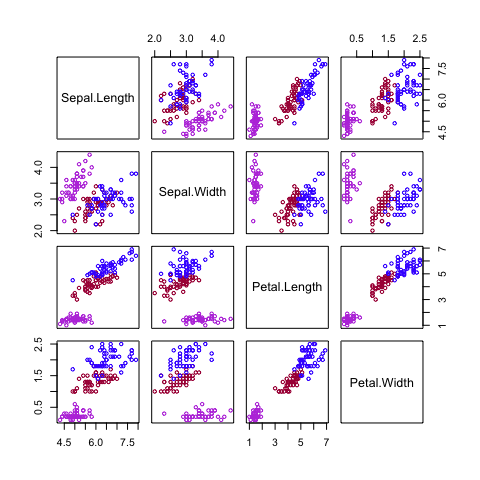


# Visualisation des données

- par la fonction `image()`
  

```r
image(1:nb.var, 1:nb.iris ,t(as.matrix(mes.iris)), xlab = "variables", ylab = "Observation nb", las = 1)
```

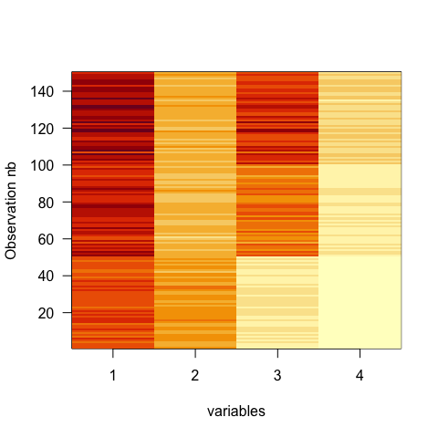

# Nettoyage des données (1) : données manquantes

Avant de commencer à travailler, il est nécessaire de commencer par vérifier que :

- il n'y a pas de données manquantes


```r
sum(is.na(mes.iris))
```

```
[1] 0
```

# Nettoyage des données (2) : variables constantes

- aucune  variable n'est constante (aucune variable n'a une variance nulle)
  

```r
iris.var <- apply(mes.iris, 2, var)
kable(iris.var, digits = 3, col.names = "Variance")
```

<table>
 <thead>
  <tr>
   <th style="text-align:left;">   </th>
   <th style="text-align:right;"> Variance </th>
  </tr>
 </thead>
<tbody>
  <tr>
   <td style="text-align:left;"> Sepal.Length </td>
   <td style="text-align:right;"> 0.686 </td>
  </tr>
  <tr>
   <td style="text-align:left;"> Sepal.Width </td>
   <td style="text-align:right;"> 0.190 </td>
  </tr>
  <tr>
   <td style="text-align:left;"> Petal.Length </td>
   <td style="text-align:right;"> 3.116 </td>
  </tr>
  <tr>
   <td style="text-align:left;"> Petal.Width </td>
   <td style="text-align:right;"> 0.581 </td>
  </tr>
</tbody>
</table>

```r
sum(apply(mes.iris, 2, var) == 0)
```

```
[1] 0
```


# Normalisation

Afin de pouvoir considérer que toutes les variables sont à la même échelle, il est parfois nécessaire de normaliser les données.

- soit 

    - en centrant (ramener la moyenne de chaque variable à $0$)
  

```r
mes.iris.centre <- scale(mes.iris, center=TRUE, scale=FALSE)
```

- soit 

    - en centrant (ramener la moyenne de chaque variable $0$)
    - et mettant à l'échelle (ramener la variance de chaque variable à $1$)


```r
mes.iris.scaled <- scale(mes.iris, center=TRUE, scale=TRUE)
```


# On peut visuellement regarder l'effet de la normalisation :

## par un plot des données 


```r
plot(mes.iris, main = "Raw variables")
```

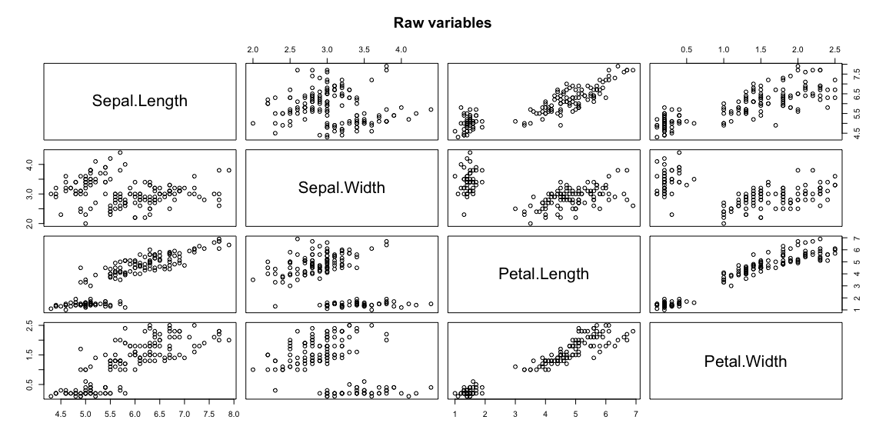

**!** ne pas faire si "grosses" données


# ... par une boîte à moustaches (boxplot)


```r
par(mfrow = c(1,2))
par(mar = c(7, 4.1, 4.1, 1.1)) # adapt margin sizes for the labels
boxplot(mes.iris, main = "Raw data", las = 2)
boxplot(mes.iris.scaled, main = "scaled", las = 2)
```

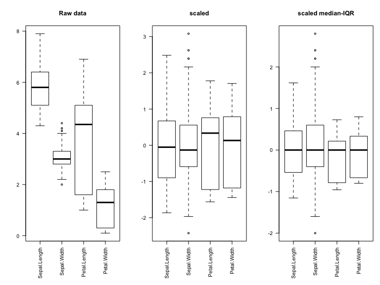

```r
par(mar = c(5.1, 4.1, 4.1, 2.1)) # Restore original margin sizes
```

# ... par une image


```r
par(mfrow=c(1,2))
image(1:nb.var, 1:nb.iris, t(as.matrix(mes.iris)), main="Raw data")
image(1:nb.var, 1:nb.iris, t(as.matrix(mes.iris.scaled)), main="Scaled data")
```

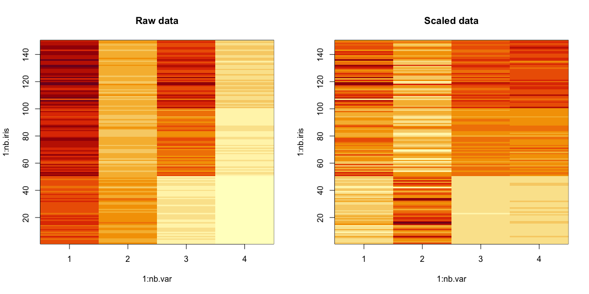

# La matrice de distances

Nous utilisons ici la distance euclidienne sur données **normalisées**. 


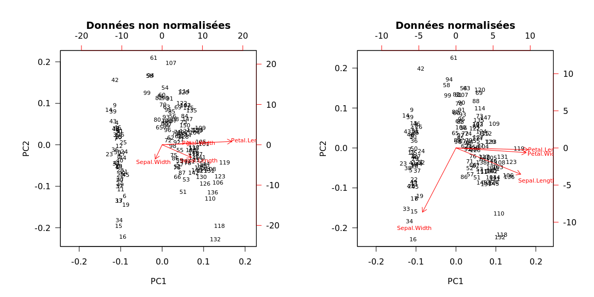

# La classification hiérarchique : principe

**classification hiérarchique** : mettre en évidence des liens hiérachiques entre les individus

- classification hiérarchique **ascendante** : partir des individus pour arriver à des classes / cluster
- classification hiérarchique **descendante** : partir d'un groupe qu'on subdivise en sous-groupes /clusters jusqu'à arriver à des individus.

# Notion importante, cf distances

- ressemblance entre individus = distance
- ressemblance entre groupes d'invidus = critère d'aggrégation

  - lien simple
  - lien complet
  - lien moyen
  - critère de Ward

# L'algorithme : étape 1

- départ : n individus = n clusters distincts
- calcul des distances entre tous les individus

  +  choix de la métrique à utiliser en fonction du type de données

- regroupement des 2 individus les plus proches => (n-1) clusters

# au départ

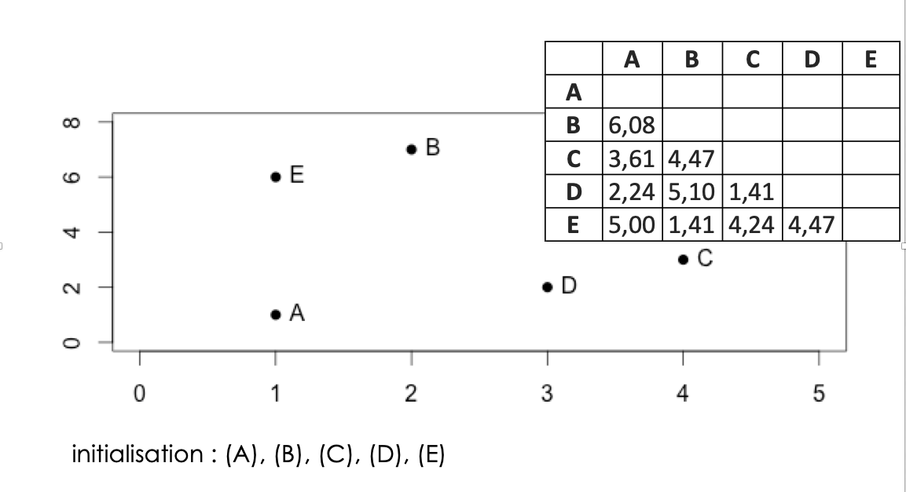


# identification des individus les plus proches


# construction du dendrogramme


# étape j :

- calcul des dissemblances entre chaque groupe obtenu à l'étape $(j-1)$

- regroupement des deux groupes les plus proches => $(n-j)$ clusters
  
# calcul des nouveaux représentants 'BE' et 'CD'


# calcul des distances de l'individu restant 'A' aux points moyens


# A est plus proche de ...


# dendrogramme


# pour finir


---

- à l'étape $(n-1)$, tous les individus sont regroupés dans un même cluster

# dendrogramme final

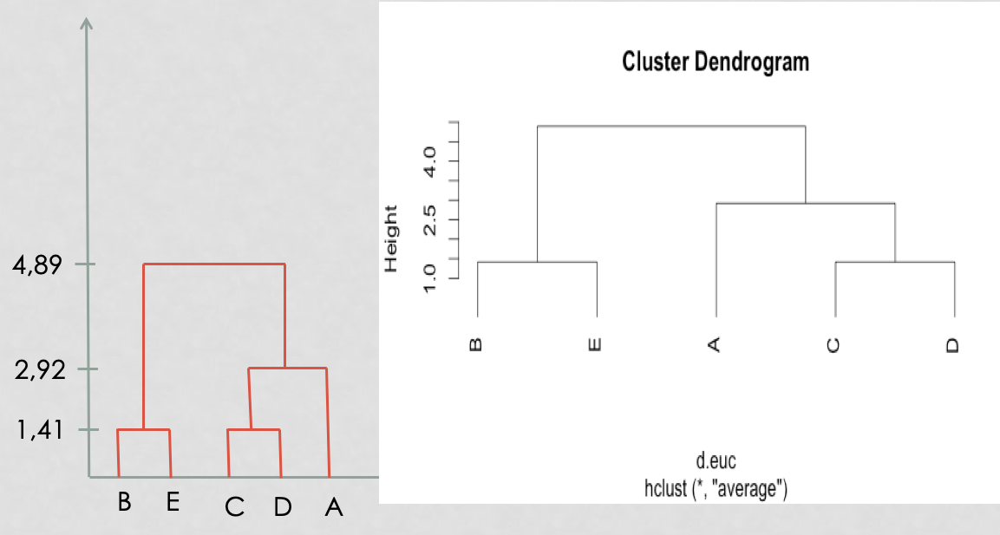

# Je ne fais pas attention à ce que je fais ...

... c'est à dire aux options des fonctions `dist()` et `hclust()`

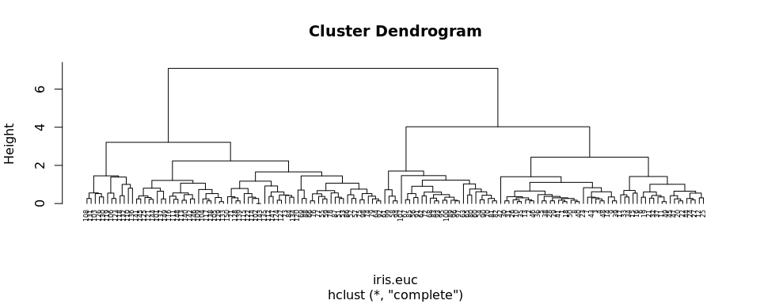

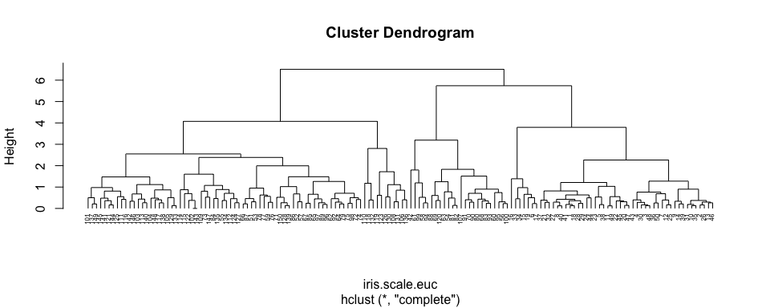


```r
par(mfrow = c(2, 1))
plot(iris.hclust, hang = -1, cex = 0.5, main = "Données brutes")
plot(iris.scale.hclust, hang = -1, cex = 0.5, main = "Normalisées")
```

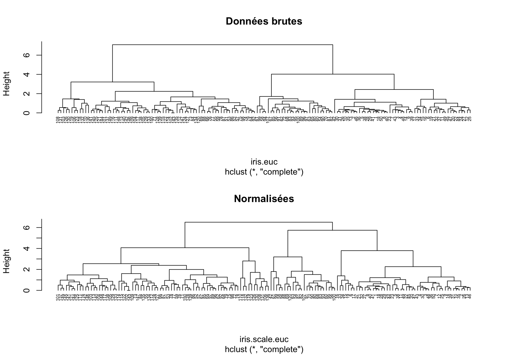

# En utilisant une autre métrique

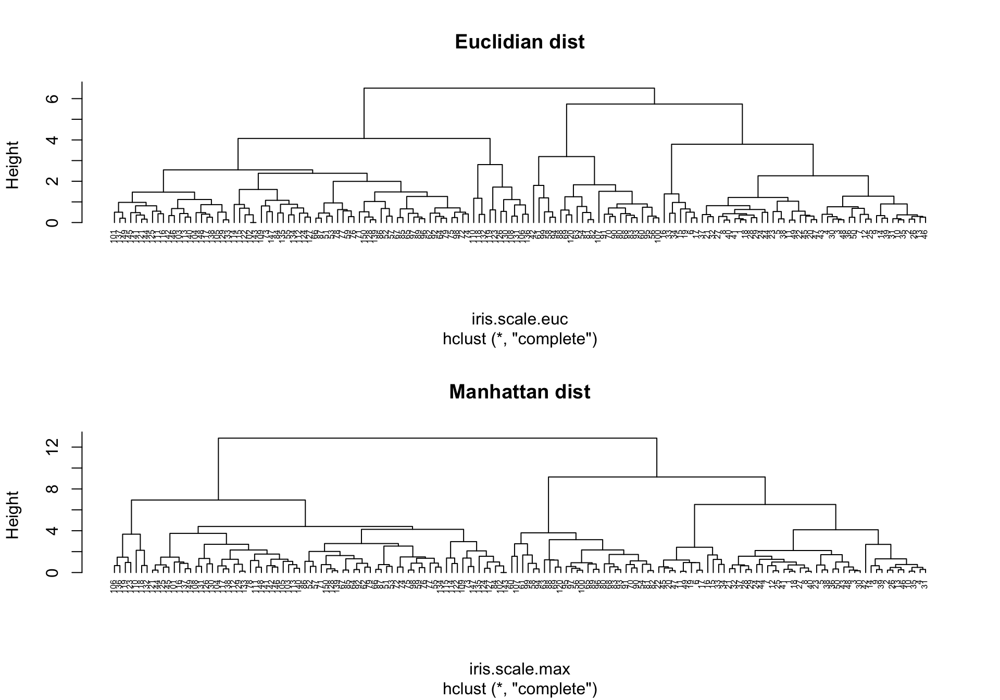

# En utilisant un autre critère d'aggrégation

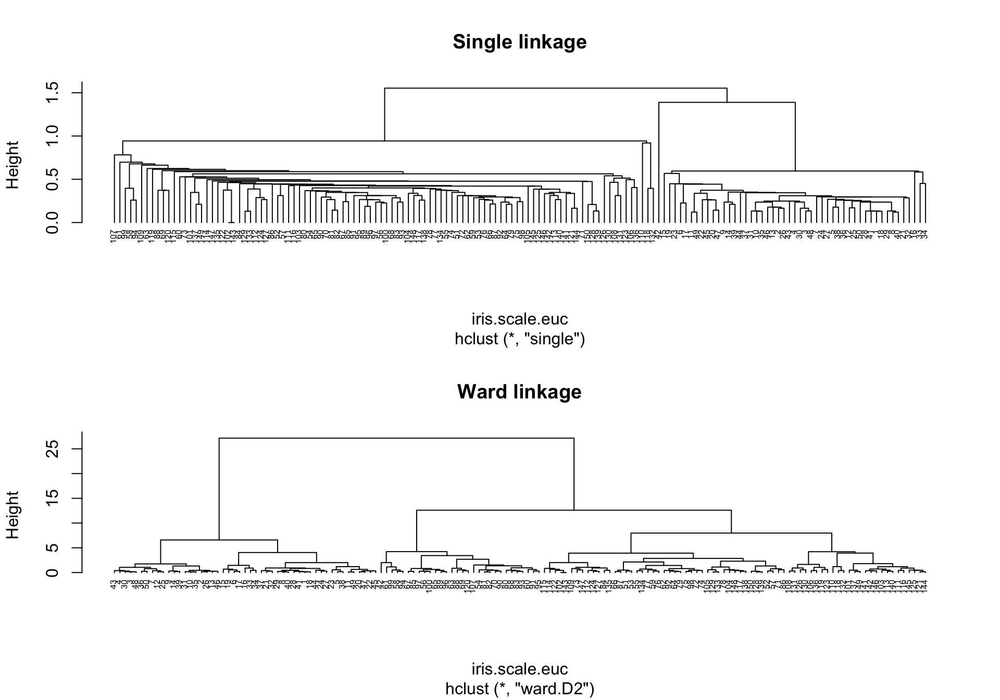

---

# En conclusion

- Faire attention au données

  + données manquantes
  + données invariantes
  + données normalisées
  
- Choisir la distance et le critère d'aggrégation adaptés à nos données

---

# Les heatmap


```r
pheatmap::pheatmap(mes.iris.scaled)
```

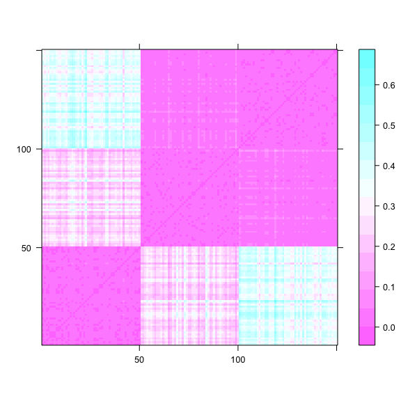

# Les k-means

Les individus dans le plan


=> faire apparaitres des classes / des clusters

# L'algorithme

## étape 1 :

- $k$ centres provisoires tirés au hasard
- $k$ clusters créés à partir des centres en regroupant les individus les plus proches de chaque centre
- obtention de la partition $P_0$ 

---

## Choix des centres provisoires 

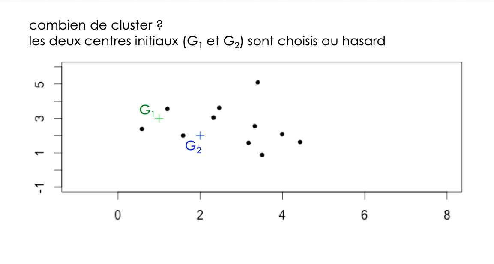


---

## Calcul des distances aux centres provisoires 


---

## Affectation à un cluster


---

## Calcul des nouveaux centres de classes

## Etape j :

- construction des centres de gravité des k clusters construits à l’étape $(j-1)$

- $k$ nouveaux clusters créés à partir des nouveaux centres suivant la même règle qu’à l’étape $0$

- obtention de la partition $P_j$

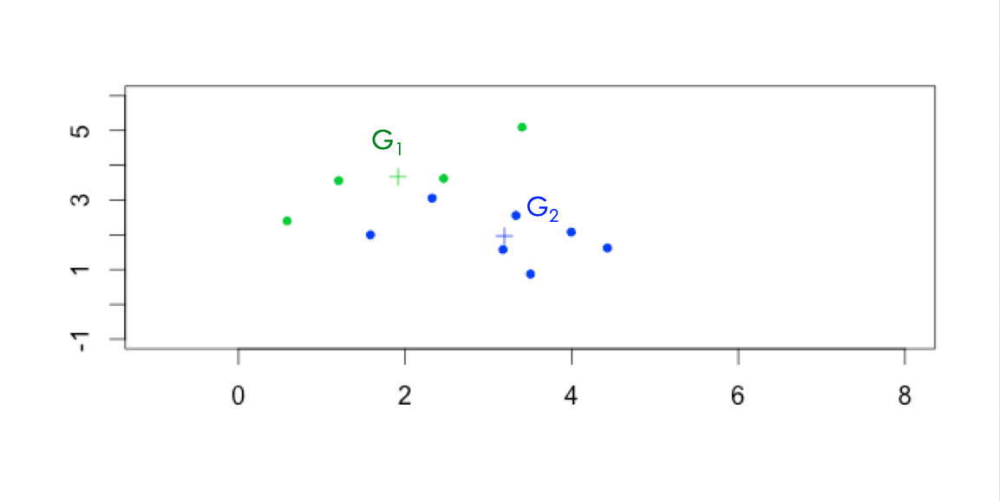

---

## Fin : 

- l’algorithme converge vers une partition stable

## Arrêt : 

- lorsque la partition reste la même, ou lorsque la variance intra-cluster ne décroit plus, ou lorsque le nombre maximal d’itérations est atteint.


---

## Un premier k-means en 5 groupes


```r
iris.scale.kmeans5 <- kmeans(mes.iris.scaled, center=5)
iris.scale.kmeans5
```

```
K-means clustering with 5 clusters of sizes 20, 50, 22, 9, 49

Cluster means:
  Sepal.Length Sepal.Width Petal.Length Petal.Width
1    1.1734168   0.4879172   1.06894119  1.31280138
2    0.3606797  -0.3655555   0.57440719  0.53876459
3   -0.4201099  -1.4246794   0.03924137 -0.05279511
4    1.8530458  -0.4884271   1.40851240  1.03583907
5   -0.9987207   0.9032290  -1.29875725 -1.25214931

Clustering vector:
  [1] 5 5 5 5 5 5 5 5 5 5 5 5 5 5 5 5 5 5 5 5 5 5 5 5 5 5 5 5 5 5 5 5 5 5 5 5 5 5 5 5 5 3 5 5 5 5 5 5 5 5 1 2 2 3 2 2 2 3 2 3 3 2 3 2 2 2 2 3 3 3 2 2 2 2 2 2 2 2 2 3 3 3 3 2 2 2 2 3 2 3 3 2 3 3 3 2 2 2 3 2 1 2 4 2 1 4 3 4 4 1 1 2 1 2 2 1 2 1 4 3 1 2 4 2 1 1 2 2 2 4 4 1 2 2 2 4 1 2 2 1 1 1 2 1 1 1 2
[148] 2 1 2

Within cluster sum of squares by cluster:
[1] 14.417633 29.027415 17.046407  4.046836 40.121722
 (between_SS / total_SS =  82.4 %)

Available components:

[1] "cluster"      "centers"      "totss"        "withinss"     "tot.withinss" "betweenss"    "size"         "iter"         "ifault"      
```

# Comment déterminer le nombre de clusters ? (1)

Ces méthodes non supervisées, sont sans *a priori* sur la structure, le nombre de groupe, des données.

rappel : un cluster est composé

- d'individus qui se ressemblent
- d'individus très différents des individus de ceux des autres clusters


# Comment déterminer le nombre de clusters ? (2)
  
- si les individus d’un même cluster sont proches

  - homogénéité maximale à l’intérieur de chaque cluster => variance intra faible

- si les individus de 2 clusters différents sont éloignés => variance inter forte

  - hétérogénéité maximale entre chaque cluster
    
# Comment déterminer le nombre de clusters ? avec la classification hiérarchique

La coupure de l’arbre à un niveau donné construit une partition. la coupure doit se faire :

- après les agrégations correspondant à des valeurs peu élevées de l’indice

- avant les agrégations correspondant à des niveaux élevés de l’indice, qui dissocient les groupes bien distincts dans la population.

---


```r
plot(iris.scale.hclust.ward, hang=-1, cex=0.5)
```

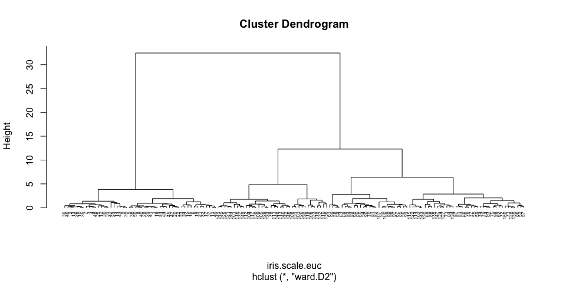

# Comment déterminer le nombre de clusters ? avec les kmeans

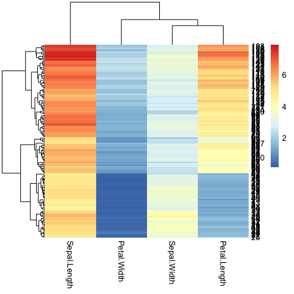

# Comparaison de clustering: Rand Index

Mesure de similarité entre deux clustering

à partir du nombre de fois que les classifications sont d'accord

$$R=\frac{m+s}{t}$$

- m=nombre de paires dans la même classe dans les deux classifications
- s=nombre de paires séparées dans les deux classifications
- t=nombre de paires totales

# Comparaison de clustering: Adjusted Rand Index

$$ ARI=\frac{RI-Expected RI}{Max RI -Expected RI}$$

- ARI=RI normalisé
- Prend en compte la taille des classes
- ARI=1 pour classification identique
- ARI $\simeq$ 0 pour classification aléatoire (peut être <0)
- Adapté pour nombre de classe différent entre les deux classifications
et taille de classe différente

# Comparaison des résultats des deux clustering

- par une table de confusion

<table>
<tbody>
  <tr>
   <td style="text-align:center;"> 29 </td>
   <td style="text-align:center;"> 0 </td>
   <td style="text-align:center;"> 0 </td>
  </tr>
  <tr>
   <td style="text-align:center;"> 20 </td>
   <td style="text-align:center;"> 0 </td>
   <td style="text-align:center;"> 0 </td>
  </tr>
  <tr>
   <td style="text-align:center;"> 1 </td>
   <td style="text-align:center;"> 0 </td>
   <td style="text-align:center;"> 29 </td>
  </tr>
  <tr>
   <td style="text-align:center;"> 0 </td>
   <td style="text-align:center;"> 21 </td>
   <td style="text-align:center;"> 24 </td>
  </tr>
  <tr>
   <td style="text-align:center;"> 0 </td>
   <td style="text-align:center;"> 26 </td>
   <td style="text-align:center;"> 0 </td>
  </tr>
</tbody>
</table>

# Comparaison de clustering: Rand Index

Mesure de similarité entre deux clustering

à partir du nombre de fois que les classifications sont d'accord

$$R=\frac{m+s}{t}$$

- m = nombre de paires dans la même classe dans les deux classifications
- s = nombre de paires séparées dans les deux classifications
- t = nombre de paires totales

# Comparaison de clustering: Adjusted Rand Index

$$ ARI=\frac{RI-Expected RI}{Max RI -Expected RI}$$

- ARI=RI normalisé
- Prend en compte la taille des classes
- ARI=1 pour classification identique
- ARI $\simeq$ 0 pour classification aléatoire (peut être <0)
- Adapté pour nombre de classe différent entre les deux classifications
et taille de classe différente

# Comparaison des résultats des deux classifications

- rand index et adjusted rand index

```r
clues::adjustedRand(cluster.hclust5, cluster.kmeans3)
```

```
     Rand        HA        MA        FM   Jaccard 
0.7848770 0.4637776 0.4730527 0.6167001 0.4299265 
```

# Pros et cons des différents algorithmes

| Algorithme | Pros | Cons |
|-------------|------------------------------|------------------------|
| **Hiérarchique** | L'arbre reflète la nature imbriquée de tous les sous-clusters | Complexité quadratique (mémoire et temps de calcul) $\rightarrow$ quadruple chaque fois qu'on double le nombre d'individus  |
| | Permet une visualisation couplée dendrogramme (groupes) + heatmap (profils individuels) | |
| | Choix a posteriori du nombre de clusters | |

---

| Algorithme | Pros | Cons |
|-------------|------------------------------|------------------------|
| **K-means** | Rapide (linéaire en temps), peut traiter des jeux de données énormes (centaines de milliers de pics ChIP-seq) | Positions initiales des centres est aléatoire $\rightarrow$ résultats changent d'une exécution à l'autre |
| | | Distance euclidienne (pas appropriée pour transcriptome par exemple) |

---


```r
## Print the complete list of libraries + versions used in this session
sessionInfo()
```

```
R version 3.6.1 (2019-07-05)
Platform: x86_64-apple-darwin15.6.0 (64-bit)
Running under: macOS Mojave 10.14.6

Matrix products: default
BLAS:   /Library/Frameworks/R.framework/Versions/3.6/Resources/lib/libRblas.0.dylib
LAPACK: /Library/Frameworks/R.framework/Versions/3.6/Resources/lib/libRlapack.dylib

locale:
[1] en_US.UTF-8/en_US.UTF-8/en_US.UTF-8/C/en_US.UTF-8/en_US.UTF-8

attached base packages:
[1] stats     graphics  grDevices utils     datasets  methods   base     

other attached packages:
 [1] pheatmap_1.0.12    vegan_2.5-6        lattice_0.20-38    permute_0.9-5      rgl_0.100.30       RColorBrewer_1.1-2 clues_0.6.2.2      FactoMineR_2.3     kableExtra_1.1.0   knitr_1.28        

loaded via a namespace (and not attached):
 [1] ggrepel_0.8.1           Rcpp_1.0.2              assertthat_0.2.1        zeallot_0.1.0           digest_0.6.21           mime_0.7                R6_2.4.0                backports_1.1.5         evaluate_0.14           highr_0.8               httr_1.4.1              ggplot2_3.2.1          
[13] pillar_1.4.2            rlang_0.4.0             lazyeval_0.2.2          rstudioapi_0.10         miniUI_0.1.1.1          Matrix_1.2-17           rmarkdown_1.16          splines_3.6.1           webshot_0.5.1           readr_1.3.1             stringr_1.4.0           htmlwidgets_1.5.1      
[25] munsell_0.5.0           shiny_1.4.0             compiler_3.6.1          httpuv_1.5.2            xfun_0.10               pkgconfig_2.0.3         mgcv_1.8-29             htmltools_0.4.0         flashClust_1.01-2       tidyselect_0.2.5        tibble_2.1.3            viridisLite_0.3.0      
[37] crayon_1.3.4            dplyr_0.8.3             later_1.0.0             MASS_7.3-51.4           leaps_3.1               grid_3.6.1              nlme_3.1-141            jsonlite_1.6            xtable_1.8-4            gtable_0.3.0            magrittr_1.5            scales_1.0.0           
[49] stringi_1.4.3           promises_1.1.0          scatterplot3d_0.3-41    xml2_1.2.2              vctrs_0.2.0             tools_3.6.1             manipulateWidget_0.10.0 glue_1.3.1              purrr_0.3.2             hms_0.5.1               crosstalk_1.0.0         parallel_3.6.1         
[61] fastmap_1.0.1           yaml_2.2.0              colorspace_1.4-1        cluster_2.1.0           rvest_0.3.4            
```


----

## ... par une projection sur une ACP


```r
par(mfrow = c(1,2))
biplot(prcomp(mes.iris), las = 1, cex = 0.7,
       main = "Données non normalisées")
biplot(prcomp(mes.iris, scale = TRUE), las = 1, cex = 0.7,
       main = "Données normalisées")
```


*****

# Cas d'étude : TCGA Breast Invasive Cancer (BIC)

- Présentation du cas d'étude (Jacques van Helden A COMPLETER)

# TP : analyse de données d'expression

- TP clustering : 
[[html](TP_clustering.html)]
[[pdf](TP_clustering.pdf)]
[[Rmd](https://raw.githubusercontent.com/DU-Bii/module-3-Stat-R/master/seance_4/TP_clustering.Rmd)]

- Première partie : chargement des données

---

Contact: <anne.badel@univ-paris-diderot.fr>
