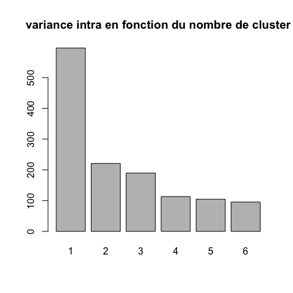
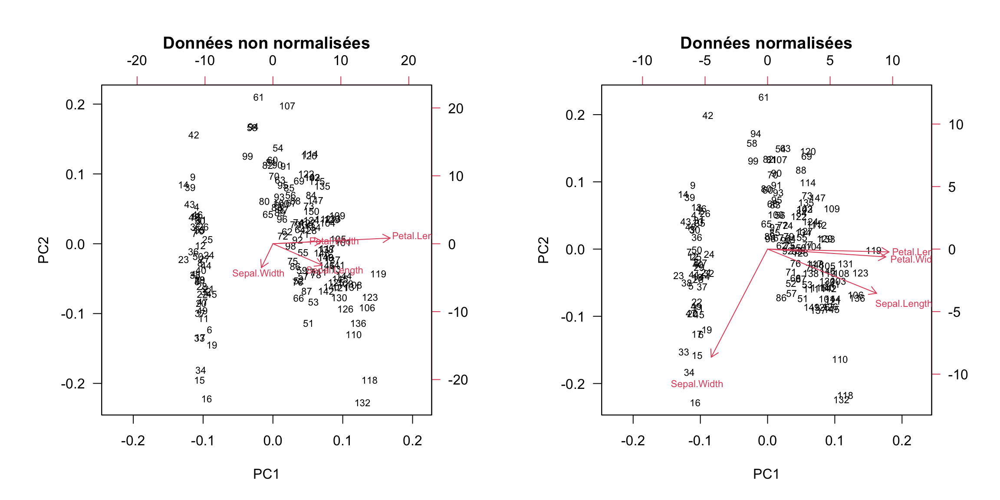

# Questions abordées dans ce cours

1. Comment sont représentées les données dans l'ordinateur ?
2. Comment représenter les données dans l'espace ?
3. Comment découvrir des "clusters" dans les données ?

    - classification hiérarchique
    - kmeans

4. Comment déterminer le nombre de groupe optimal ?
5. Comment comparer deux classifications ?

# Les données dans l'ordinateur (1)

## Les iris de Fisher 

Ces données sont un classique des méthodes d'apprentissage [Fisher](https://onlinelibrary.wiley.com/doi/epdf/10.1111/j.1469-1809.1936.tb02137.x)


# Les données dans l'ordinateur (2)


```
  Sepal.Length Sepal.Width Petal.Length Petal.Width
1          5.1         3.5          1.4         0.2
2          4.9         3.0          1.4         0.2
3          4.7         3.2          1.3         0.2
4          4.6         3.1          1.5         0.2
5          5.0         3.6          1.4         0.2
6          5.4         3.9          1.7         0.4
```

# Les données dans l'ordinateur (2)


```
  Sepal.Length Sepal.Width Petal.Length Petal.Width
1          5.1         3.5          1.4         0.2
2          4.9         3.0          1.4         0.2
3          4.7         3.2          1.3         0.2
4          4.6         3.1          1.5         0.2
5          5.0         3.6          1.4         0.2
6          5.4         3.9          1.7         0.4
```

- 1 ligne = 1 fleur = 1 individu = 1 vecteur

- 1 colonne = 1 variable = 1 feature = 1 vecteur

- l'ensemble des données = 1 échantillon = 1 data.frame

**!** : convention différente en RNA-seq

# Représentons ces données : une fleur (1)


```r
mes.iris[1,]
```

```
  Sepal.Length Sepal.Width Petal.Length Petal.Width
1          5.1         3.5          1.4         0.2
```


Comment représenter cette fleur ?

- par un point !

Dans quel espace de réprésentation ?

# Représentons ces données : une fleur (2)


```r
plot(mes.iris[1,1:2])
```


Dans le plan, un point de coordonnées : $x = 5.1$, $y = 3.5$

représenté par un vecteur $v2 = (5.1, 3.5)$ dans $\mathbb{R}^2$

# Représentons ces données : une fleur (3) 


Dans l'espace, un point de coordonnées :

- $x = 5.1$
- $y = 3.5$
- $z = 1.4$


représenté par un vecteur $v3 = ($ 5.1 $,$ 3.5 $,$ 1.4$)$ dans $\mathbb{R}^3$

# Représentons ces données : toutes les fleurs (4)

= un nuage de points dans un espace à 4 dimensions

  - chaque point est représenté par un vecteur dans $\mathbb{R}^4$
  - le nuage de points est représenté par une matrice à n et p (= 4 dimensions)
    + n = nombre de lignes = nombre d'individus = taille de l'échantillon
    + p = nombre de colonnes = nombre de variables décrivant l'échantillon

= PAS de représentation possible (pour l'instant)


# Représentons ces données : une variable à la fois (1)


# Représentons ces données : deux variables à la fois (2)


# Il faut tenir compte de toutes les dimensions

c'est à dire de toutes les variables à notre disposition

# Clustering et classification (termes anglais)

On a une **information** sur nos données

- variables quantitatives = vecteur de réels
 
**Clustering** : on cherche à mettre en évidence des groupes dans les données

- le clustering appartient aux méthodes dites **non supervisées**, ou descriptives

# Clustering et classification (termes anglais)

On a une **information** sur nos données

**Clustering** : on cherche à mettre en évidence des groupes dans les données

**Classification** :

- on connaît le partitionnement de notre jeu de données
    
  + variables quantitatives = vecteur de réels
  + ET
  + variable qualitative = groupe (cluster) d'appartenance = vecteurs de entiers / niveau d'un facteur
  + on cherche à prédire le groupe (la classe) de nouvelles données

- la classification appartient aux méthodes dites **supervisées**, ou prédictives

# Clustering

<div class="figure" style="text-align: center">

<p class="caption">données simulées : y a-t-il des groupes ?</p>
</div>


# Géométrie et distances (1)

On considère les données comme des points de $\mathbb{R}^n$ 


$\mathbb{R}^n$ : espace Euclidien à $n$ dimensions, où 

- chaque dimension représente une des variables observées;
- un individu est décrit comme un vecteur à $n$ valeurs, qui correspond à un point dans cet espace. 

# Géométrie et distances (2)

On considère les données comme des points de $R^n$ (*)

- géométrie donnée par distances
- distances = dissimilarités imposées par le problème
- dissimilarités $\longrightarrow$ permettent visualisation de l'ensemble des points


# Géométrie et distances (3)

Sur la base d'une distance (souvent euclidienne)

- Clustering :

  + Méthode agglomérative ou hierarchical clustering
  + Moyennes mobiles ou K-means : séparation optimale des groupes connaissant le nombre de groupes

# Distances

Définition d'une distance : fonction positive de deux variables

1. $d(x,y) \ge 0$
2. $d(x,y) = d(y,x)$
3. $d(x,y) = 0 \Longleftrightarrow x = y$
4. **Inégalité triangulaire :** $d(x,z) \le$ d(x,y)+d(y,z)

Si 1,2,3 : dissimilarité

# Distance euclidienne

- distance euclidienne ou distance $L_2$:
  $d(x,y)=\sqrt{\sum_i (x_i-y_i)^2}$

# Représentation des vecteurs-individus


# Distance euclidienne et distance de corrélation


         distance euclidienne    coefficient de corrélation    distance de corrélation 
------  ----------------------  ----------------------------  -------------------------
A - B            4.85                       0.93                        0.07           
A - C            5.59                      -0.53                        1.53           
B - C            1.03                      -0.67                        1.67           


# Avec R (1) : distance entre deux individus 

- on utilise la fonction `dist()` avec l'option `method = "euclidean", "manhattan", ...` 


                t1     t2     t3     t4     t5     SUM
-----------  -----  -----  -----  -----  -----  ------
X             1.28   4.72   1.05   3.13   4.26   14.45
Y             2.81   3.98   2.44   3.88   3.36   16.46
abs(Y - X)    1.53   0.75   1.39   0.75   0.90    5.32
(Y - X)^2     2.34   0.56   1.94   0.56   0.81    6.20
Eucl          1.53   0.75   1.39   0.75   0.90    2.49

distance euclidienne : 2.49

distance de manhattan = 5.32

# Avec R (2) : distance entre individus d'un nuage de points 

- distance euclidienne

```
      45    5  115   17
5   0.58               
115 3.97 4.45          
17  0.68 0.55 4.45     
78  3.81 4.30 1.16 4.23
```

- distance de corrélation : $d = 1-r$

```
        45      5    115     17
5   0.0025                     
115 0.4445 0.4800              
17  0.0098 0.0024 0.5217       
78  0.2811 0.3105 0.0228 0.3464
```

# Avec R (3) : distance entre variables décrivant le nuage de points 


```
             Sepal.Length Sepal.Width Petal.Length
Sepal.Width         1.723                         
Petal.Length        0.164       1.960             
Petal.Width         0.275       1.949        0.035
```

# Distances entre groupes (1)


# Distances entre groupes (2)

- **Single linkage** : élements les plus proches des 2 groupes

$$D(C_1,C_2) = \min_{i \in C_1, j \in C_2} D(x_i, x_j)$$
  
- **Complete linkage** : éléments les plus éloignés des 2 groupes

$$D(C_1,C_2) = \max_{i \in C_1, j \in C_2} D(x_i, x_j)$$

- **Average linkage** : distance moyenne

$$D(C_1,C_2) = \frac{1}{N_1 N_2} \sum_{i \in C_1, j \in C_2} D(x_i, x_j)$$
  
- **Ward**

$d^2(C_i,C_j) = I_{intra}(C_i \cup C_j)-I_{intra}(C_i)-I_{intra}(C_j)$

$D(C_1,C_2) = \sqrt{\frac{N_1N_2}{N_1 + N_2}} \| m_1 -m_2 \|$

# Distances entre groupes (4)


# Les données

Revenons à nos iris de Fisher


# Visualisation des données

On peut ensuite essayer de visualiser les données

  - par un `plot` (**!** ne pas faire si "grosses" données)
  

```r
plot(mes.iris, col = "grey", las = 1)
```


# Préparation des données (1) : variables de variance nulle


```r
iris.var <- apply(mes.iris, 2, var)
kable(iris.var, digits = 3, col.names = "Variance")
```

                Variance
-------------  ---------
Sepal.Length       0.686
Sepal.Width        0.190
Petal.Length       3.116
Petal.Width        0.581

```r
sum(apply(mes.iris, 2, var) == 0)
```

```
[1] 0
```

# Préparation des données (2) : "Normalisation"

Afin de pouvoir considérer que toutes les variables sont à la même échelle, il est parfois nécessaire de standardiser les données.

- soit 

  - en centrant (ramener la moyenne de chaque variable à $0$)
  

```r
mes.iris.centre <- scale(mes.iris, center = TRUE, scale = FALSE)
```

- soit 

  - en centrant (ramener la moyenne de chaque variable $0$)
  - et mettant à l'échelle (ramener la variance de chaque variable à $1$)


```r
mes.iris.scaled <- scale(mes.iris, center = TRUE, scale = TRUE)
```

- soit en effectuant une transformation des variables, par exemple transformation logarithmique

# On peut visuellement regarder l'effet de la standardisation

- par des boîtes à moustaches (boxplot)

# Centrage sur la moyenne ou la médiane


# Mise à l'échelle écart-type ou intervalle interquartile


# Standardisation : centrage et mise à l'échelle


# La matrice de distance euclidienne


# La matrice de distance de corrélation


# La classification hiérarchique : principe

**classification hiérarchique** : mettre en évidence des liens hiérachiques entre les individus

- classification hiérarchique **ascendante** : partir des individus pour arriver à des classes / cluster
- classification hiérarchique **descendante** : partir d'un groupe qu'on subdivise en sous-groupes /clusters jusqu'à arriver à des individus.

# Notion importante, cf distances

- ressemblance entre individus = distance

  - euclidienne
  - corrélation
- ressemblance entre groupes d'invidus = critère d'aggrégation

  - lien simple
  - lien complet
  - lien moyen
  - critère de Ward

# L'algorithme : étape 1

- départ : n individus = n clusters distincts
- calcul des distances entre tous les individus

  +  choix de la métrique à utiliser en fonction du type de données

- regroupement des 2 individus les plus proches => (n-1) clusters

# Au départ


# Identification des individus les plus proches


# Construction du dendrogramme


# Etape j :

- calcul des dissemblances entre chaque groupe obtenu à l'étape $(j-1)$

- regroupement des deux groupes les plus proches => $(n-j)$ clusters
  
# Calcul des nouveaux représentants 'BE' et 'CD'


# Calcul des distances de l'individu restant 'A' aux points moyens


# A est plus proche de ...


# dendrogramme


# pour finir


---

- à l'étape $(n-1)$, tous les individus sont regroupés dans un même cluster

# dendrogramme final


# Je ne fais pas attention à ce que je fais ...

... c'est à dire aux options des fonctions `dist()` et `hclust()`


```r
par(mfrow = c(2, 1))
plot(iris.hclust, hang = -1, cex = 0.5, main = "Données brutes")
plot(iris.scale.hclust, hang = -1, cex = 0.5, main = "Normalisées")
```


# En utilisant une autre métrique


# En utilisant un autre critère d'aggrégation


---

# En conclusion

- Faire attention au données

  + données manquantes
  + données invariantes
  + données normalisées
  
- Choisir la distance et le critère d'aggrégation adaptés à nos données

---

# Les heatmap - donnes brutes


```r
pheatmap::pheatmap(mes.iris, clustering.method = "ward.D2")
```


# Les heatmap - mise à l'échelle


```r
pheatmap::pheatmap(mes.iris.scaled, clustering.method = "ward.D2")
```


# Les heatmap - échelle de couleur standardisée par colonne


```r
pheatmap::pheatmap(mes.iris, scale = "column", clustering.method = "ward.D2")
```


# Les heatmap - échelle de couleur standardisée par ligne


```r
pheatmap::pheatmap(mes.iris, scale = "row", clustering.method = "ward.D2")
```


# Les k-means

Les individus dans le plan


=> faire apparaitres des classes / des clusters

# L'algorithme

## étape 1 :

- $k$ centres provisoires tirés au hasard
- $k$ clusters créés à partir des centres en regroupant les individus les plus proches de chaque centre
- obtention de la partition $P_0$ 

---

## Choix des centres provisoires 


---

## Calcul des distances aux centres provisoires 


---

## Affectation à un cluster


---

## Calcul des nouveaux centres de classes

## Etape j :

- construction des centres de gravité des k clusters construits à l’étape $(j-1)$

- $k$ nouveaux clusters créés à partir des nouveaux centres suivant la même règle qu’à l’étape $0$

- obtention de la partition $P_j$


---

## Fin : 

- l’algorithme converge vers une partition stable

## Arrêt : 

- lorsque la partition reste la même, ou lorsque la variance intra-cluster ne décroit plus, ou lorsque le nombre maximal d’itérations est atteint.


---

## Un premier k-means en 5 groupes


```r
iris.scale.kmeans5 <- kmeans(mes.iris.scaled, center=5)
iris.scale.kmeans5
```

```
K-means clustering with 5 clusters of sizes 24, 9, 50, 49, 18

Cluster means:
  Sepal.Length Sepal.Width Petal.Length Petal.Width
1   -0.4045571  -1.3455962   0.04031425 -0.03738991
2    1.9201365  -0.3099829   1.42110076  1.03583907
3    0.4186461  -0.3655555   0.60612988  0.55450771
4   -0.9987207   0.9032290  -1.29875725 -1.25214931
5    1.1351750   0.5057616   1.08750903  1.40026317

Clustering vector:
  [1] 4 4 4 4 4 4 4 4 4 4 4 4 4 4 4 4 4 4 4 4 4 4 4 4 4 4 4 4 4 4 4 4 4 4 4 4 4 4 4 4 4 1 4 4 4 4 4 4 4 4 3 3 3 1 3 3 3 1 3 1 1 3 1 3 1 3 3 1 1 1 3 3 3 3 3 3 3 3 3 1 1 1 1 3 3 3 3 1 3 1 1 3 1 1 1 3 3 3 1 1 5 3 2 3 5 2 1 2 3 5 5 3 5 3 3 5 3 5 2 1 5 3 2 3 5 2 3 3 3 2 2 5 3 3 3 2 5 3 3 5 5 5 3 5 5 5 3
[148] 3 5 3

Within cluster sum of squares by cluster:
[1] 18.898041  3.091184 30.436677 40.121722 12.220084
 (between_SS / total_SS =  82.4 %)

Available components:

[1] "cluster"      "centers"      "totss"        "withinss"     "tot.withinss" "betweenss"    "size"         "iter"         "ifault"      
```

# Comment déterminer le nombre de clusters ? (1)

Ces méthodes non supervisées, sont sans *a priori* sur la structure, le nombre de groupe, des données.

rappel : un cluster est composé

- d'individus qui se ressemblent
- d'individus très différents des individus de ceux des autres clusters


# Comment déterminer le nombre de clusters ? (2)
  
- si les individus d’un même cluster sont proches

  - homogénéité maximale à l’intérieur de chaque cluster => variance intra faible

- si les individus de 2 clusters différents sont éloignés => variance inter forte

  - hétérogénéité maximale entre chaque cluster
    
# Comment déterminer le nombre de clusters ? avec la classification hiérarchique

La coupure de l’arbre à un niveau donné construit une partition. la coupure doit se faire :

- après les agrégations correspondant à des valeurs peu élevées de l’indice

- avant les agrégations correspondant à des niveaux élevés de l’indice, qui dissocient les groupes bien distincts dans la population.

---


```r
plot(iris.scale.hclust.ward, hang = -1, cex = 0.5)
```


# Comment déterminer le nombre de clusters ? avec les kmeans



# Comparaison des résultats des deux clustering

- par une table


      k1    k2    k3 
---  ----  ----  ----
c1    0     29    0  
c2    0     20    0  
c3    0     1     29 
c4    21    0     24 
c5    26    0     0  

# Pros et cons des différents algorithmes

| Algorithme | Pros | Cons |
|-------------|------------------------------|------------------------|
| **Hiérarchique** | L'arbre reflète la nature imbriquée de tous les sous-clusters | Complexité quadratique (mémoire et temps de calcul) $\rightarrow$ quadruple chaque fois qu'on double le nombre d'individus  |
| | Permet une visualisation couplée dendrogramme (groupes) + heatmap (profils individuels) | |
| | Choix a posteriori du nombre de clusters | |
| **K-means** | Rapide (linéaire en temps), peut traiter des jeux de données énormes (centaines de milliers de pics ChIP-seq) | Positions initiales des centres est aléatoire $\rightarrow$ résultats changent d'une exécution à l'autre |
| | | Distance euclidienne (pas appropriée pour transcriptome par exemple) |

# Visualisation des données - coloration par espèces


```r
species.colors <- c(setosa = "#BB44DD", virginica = "#AA0044", versicolor = "#4400FF")
plot(mes.iris, col = species.colors[iris$Species], cex = 0.7)
```


# Supplementary materials

POUR ALLER PLUS LOIN

# Distances utilisées dans R (1)

- distance euclidienne ou distance $L_2$:
  $d(x,y)=\sqrt{\sum_i (x_i-y_i)^2}$
  
- distance de manahattan ou distance $L_1$:
  $d(x,y)=\sum_i |x_i-y_i|$
    
- distance du maximum ou L-infinis, $L_\infty$:
  $d(x,y)=\max_i |x_i-y_i|$
    


# Distances utilisées dans R (2)

- distance de Minkowski $l_p$:
$$d(x,y)=\sqrt[p]{\sum_i (|x_i-y_i|^p}$$

- distance de Canberra (x et y valeurs positives):
$$d(x,y)=\sum_i \frac{x_i-y_i}{x_i+y_i}$$

- distance binaire ou distance de Jaccard ou Tanimoto: proportion de propriétés communes


  
**Note** : lors du TP, sur les données d'expression RNA-seq, nous utiliserons le **coefficient de corrélation de Spearman** et la distance dérivée, $d_c = 1-r$

# Autres distances non géométriques (pour information)

Utilisées en bio-informatique:

- Distance de **Hamming**: nombre de remplacements de caractères (substitutions)

- Distance de **Levenshtein**: nombre de substitutions, insertions, deletions entre deux chaînes de caractères

$$d("BONJOUR", "BONSOIR")=2$$

- Distance d'**alignements**: distances de Levenshtein avec poids (par ex. matrices BLOSSUM)

- Distances d'**arbre** (Neighbor Joining)

- Distances **ultra-métriques** (phylogénie UPGMA)


# Distances plus classiques en génomique

Il existe d'autres mesures de distances, plus ou moins adaptées à chaque problématique :

- **Jaccard** (comparaison d'ensembles): $J_D = \frac{A \cap B}{A \cup B}$

- Distance du $\chi^2$ (comparaison de tableau d'effectifs)

Ne sont pas des distances, mais indices de dissimilarité :

- **Bray-Curtis** (en écologie, comparaison d'abondance d'espèces)
- **Jensen-Shannon** (comparaison de distributions)
# Distance avec R : indice de Jaccard

- ou pour des distances particulières, par exemple l'indice de Jaccard :

----  ---  ---  ---  ---  ---  ---  ---
v.a    0    1    0    0    0    0    0 
v.b    0    1    0    0    0    1    0 
v.c    0    1    0    0    0    0    0 
----  ---  ---  ---  ---  ---  ---  ---

```
          v.a       v.b
v.b 0.3333333          
v.c 0.0000000 0.3333333
```

# Comparaison de clustering: Rand Index

Mesure de similarité entre deux clustering

à partir du nombre de fois que les classifications sont d'accord

$$R=\frac{m+s}{t}$$

- $m$ = nombre de paires dans la même classe dans les deux classifications
- $s$ = nombre de paires séparées dans les deux classifications
- $t$ = nombre total de paires

# Comparaison de clustering: Adjusted Rand Index

$$ \text{ARI} = \frac{\text{RI}-\text{E(RI)}}{\text{Max RI} - \text{E(RI)}}$$

- $\text{ARI}$ = adjusted Rand Index = RI normalisé
- $E(RI)$ = expected RI, espérance aléatoire (en assignant les groupes au hasard)
- Prend en compte la taille des classes
- $\text{ARI}= 1$ pour classification identique
- $\text{ARI} \simeq  0$ pour classification aléatoire (peut être <0)
- Adapté même si les nombres de classes diffèrent entre les deux classifications
- Adapé à des tailles de classes différentes


# Comparaison des résultats des deux classifications

- rand index et adjusted rand index


```r
## Compute adjusted Rand index
(ARI <- aricode::ARI(cluster.hclust5, cluster.kmeans3))
```

```
[1] 0.4637776
```


----

## ... par une projection sur une ACP


```r
par(mfrow = c(1,2))
biplot(prcomp(mes.iris), las = 1, cex = 0.7,
       main = "Données non normalisées")
biplot(prcomp(mes.iris, scale = TRUE), las = 1, cex = 0.7,
       main = "Données normalisées")
```




# Supplément : analyse de données d'expression 2019

- TP clustering : 
[[html](TP_clustering.html)]
[[pdf](TP_clustering.pdf)]
[[Rmd](https://raw.githubusercontent.com/DU-Bii/module-3-Stat-R/master/seance_4/TP_clustering.Rmd)]

- Première partie : chargement des données


---
# R environment used for this analysis


```r
## Print the complete list of libraries + versions used in this session
sessionInfo()
```

```
R version 4.0.0 (2020-04-24)
Platform: x86_64-apple-darwin17.0 (64-bit)
Running under: macOS Mojave 10.14.6

Matrix products: default
BLAS:   /Library/Frameworks/R.framework/Versions/4.0/Resources/lib/libRblas.dylib
LAPACK: /Library/Frameworks/R.framework/Versions/4.0/Resources/lib/libRlapack.dylib

locale:
[1] en_US.UTF-8/en_US.UTF-8/en_US.UTF-8/C/en_US.UTF-8/en_US.UTF-8

attached base packages:
[1] stats     graphics  grDevices utils     datasets  methods   base     

other attached packages:
[1] pheatmap_1.0.12    vegan_2.5-6        lattice_0.20-41    permute_0.9-5      rgl_0.100.54       RColorBrewer_1.1-2 aricode_0.1.2      FactoMineR_2.3     knitr_1.28        

loaded via a namespace (and not attached):
 [1] tidyselect_1.1.0        xfun_0.14               purrr_0.3.4             splines_4.0.0           colorspace_1.4-1        vctrs_0.3.0             generics_0.0.2          miniUI_0.1.1.1          htmltools_0.4.0         yaml_2.2.1              mgcv_1.8-31             rlang_0.4.6            
[13] manipulateWidget_0.10.1 pillar_1.4.4            later_1.0.0             glue_1.4.1              lifecycle_0.2.0         stringr_1.4.0           munsell_0.5.0           gtable_0.3.0            htmlwidgets_1.5.1       leaps_3.1               evaluate_0.14           fastmap_1.0.1          
[25] httpuv_1.5.2            crosstalk_1.1.0.1       parallel_4.0.0          highr_0.8               Rcpp_1.0.4.6            xtable_1.8-4            scales_1.1.1            promises_1.1.0          flashClust_1.01-2       scatterplot3d_0.3-41    webshot_0.5.2           jsonlite_1.6.1         
[37] mime_0.9                ggplot2_3.3.0           digest_0.6.25           stringi_1.4.6           dplyr_1.0.0             ggrepel_0.8.2           shiny_1.4.0.2           grid_4.0.0              tools_4.0.0             magrittr_1.5            tibble_3.0.1            cluster_2.1.0          
[49] crayon_1.3.4            pkgconfig_2.0.3         MASS_7.3-51.6           ellipsis_0.3.1          Matrix_1.2-18           rmarkdown_2.1           R6_2.4.1                nlme_3.1-147            compiler_4.0.0         
```


---

Contact: <anne.badel@univ-paris-diderot.fr>
