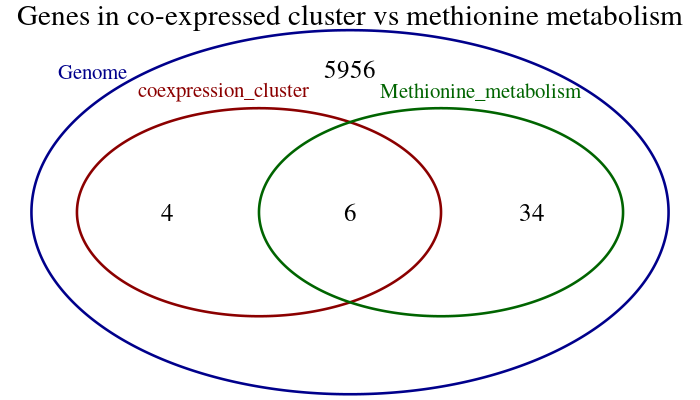
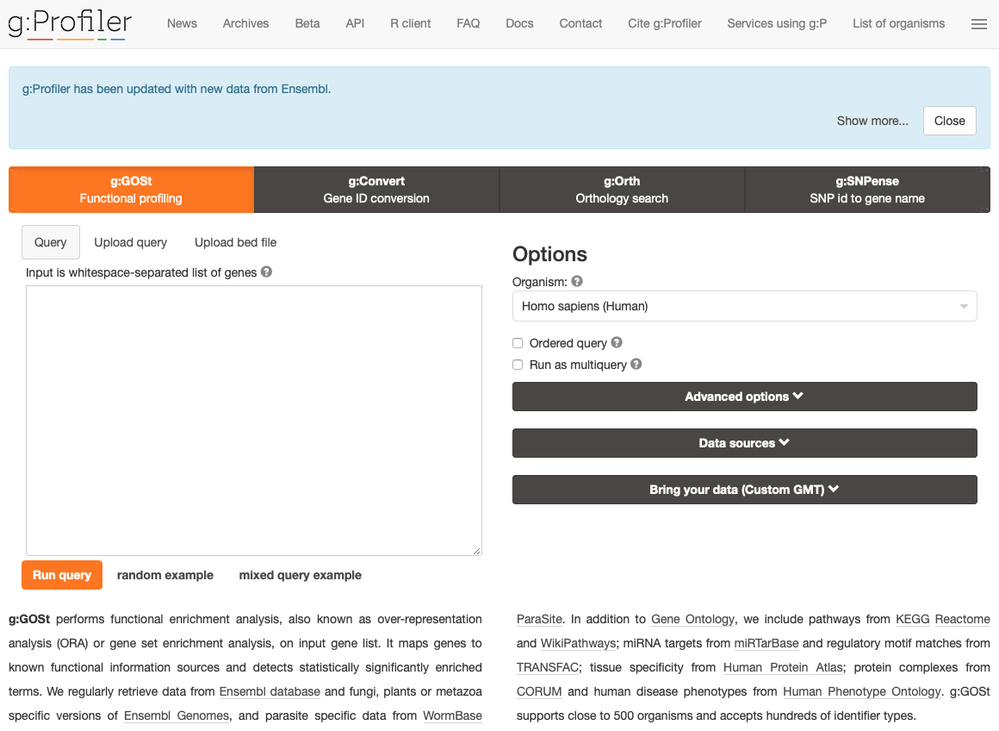
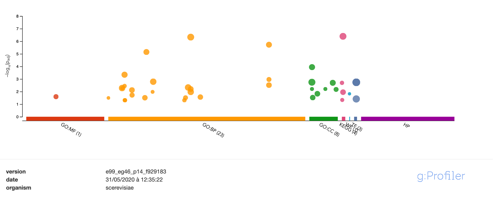
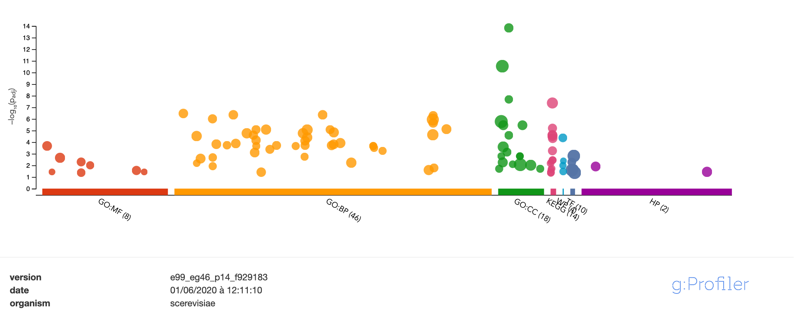
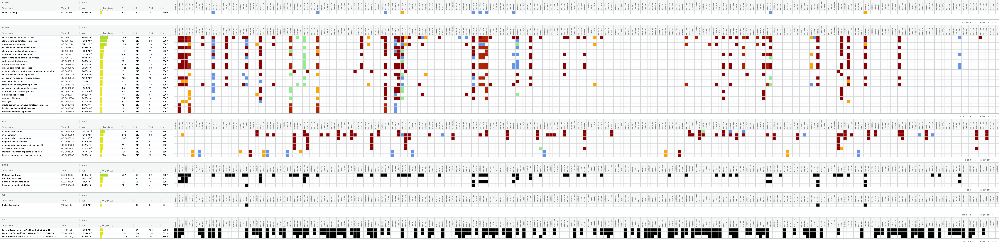
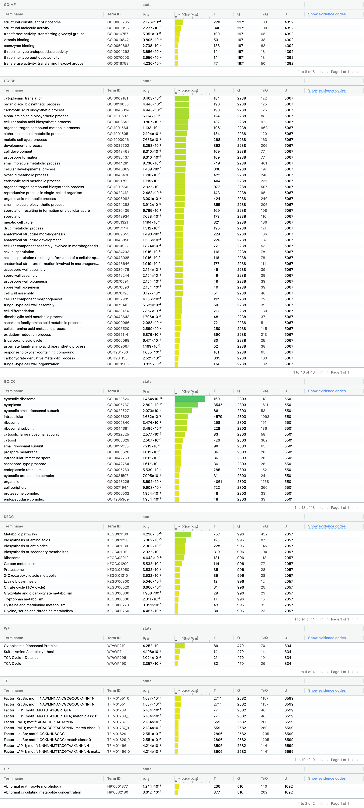
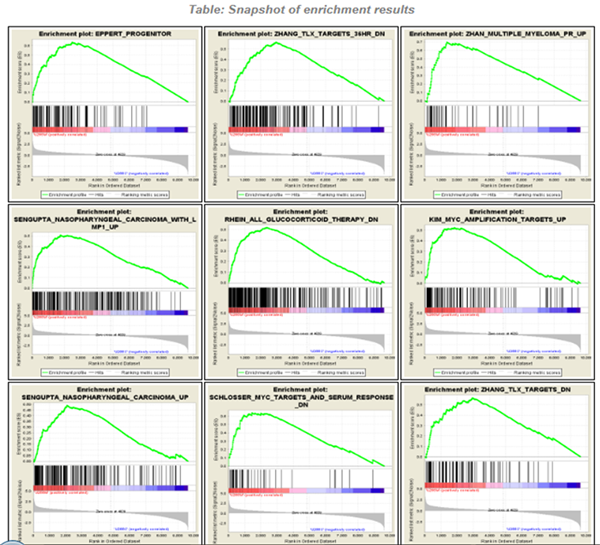

```{r settings, include=FALSE, echo=FALSE, eval=TRUE}
## Install required packages
packages <- c("knitr", "kableExtra", "stringr", "limma", "gprofiler2")

for (pkg in packages) {
  if (!require(pkg, character.only = TRUE)) {
    install.packages(pkg)
    require(pkg, character.only = TRUE)
  }
}

options(width = 300)

# options(encoding = 'UTF-8')

knitr::opts_chunk$set(
  fig.width = 5, fig.height = 5, 
  fig.path = 'images/enrichment_',
  fig.align = "center", 
  size = "tiny", 
  echo = TRUE, eval = TRUE, 
  warning = FALSE, message = FALSE, 
  results = TRUE, comment = "")

options(scipen = 12) ## Max number of digits for non-scientific notation
```

# Two main approches

- Gene set comparison or over-representation analysis (ORA)
  - Input: a set of functionally related genes
  - Reference: a database of annotated gene functions (GO, pathways, TF targets…)
  - Approach: evaluate the significance of the intersection (over-represented?)
  - Stat: hypergeometric test
- Gene Set Enrichment analysis
  - Input: a sorted list of genes
  - Reference: a database of annotated gene functions (GO, pathways, TF targets…)
  - Approach: evaluate the significance of the rank of the genes belonging to a reference class in the ordered list.
  - Stat: enrichment scores (alternative)

# Gene set comparison (over-representation of the intersection)

- A given organism has 6000 genes, 40 of which are involved in methionine metabolism. 
- A set of 10 genes were reported as co-expressed in an RNAseq experiment. Among them, 6 are related to methionine metabolism. 
- How significant is this observation ? More precisely, what would be the probability to observe such a correspondence by chance alone ?

```{r venn_diagram, include=FALSE, results=TRUE, echo=FALSE, eval=TRUE, out.width="50%"}
#### Venn diagram ####
# Draw a venn diagram indicating the number of genes in a 
# co-expression cluster that are involved in methionine metobolism
VennDiagram::venn.diagram(
  list(Genome = 1:6000, Methionine_metabolism = 1:40, coexpression_cluster = 35:44),
  height = 400,
  width = 700,
  main.cex = 0.35,
  cex=0.3,
  cat.cex  = 0.25,
  lwd = c(0.5,0.5,0.5),
  cat.pos = c(-10,-45,10),
  filename = "images/venn_yeast_methionine.png", 
  main = "Genes in co-expressed cluster vs methionine metabolism", 
  imagetype = "png", 
  col = c("darkblue", "darkgreen", "darkred"), 
  cat.col = c("darkblue", "darkgreen", "darkred"))

#include_graphics(path = "images/venn_yeast_methionine.png")
```



# The hypergeometric test

| Symbol | Meaning |
|:--------|:---------------------------|
| $g = 6000$	| number of genes |
| $m = 40$ | genes involved in methionine metabolism |
| $n = 5960$ |	genes not involved in methionine metabolism |
| $k = 10$ |	number of genes in the cluster |
| $x = 6$ |  number of methionine genes in the cluster |

- We calculate the number of possibilities for the following selections

| Symbol | Meaning | Formula |
|:------|:-----------------|:--------------------------|
| $C_1$ | choose 10 distinct genes among 6000 | $C_1 = C_{m+n}^{k} = \frac{6000!}{10!5990!} = 1.65e^{31}$ |
| $C_2$ | choose 6 distinct genes among the 40 involved in methionine | $C_2 = C_{m}^{x} = \frac{40!}{6!34!} = 3.8e^{6}$ |
| $C_3$ | choose 4 genes among the 5960 which are not involved in methionine |$C_3 = C_{n}^{k-x} = \frac{5960!}{4!5956!} = 5.2e^{13}$ |
| $C_4$ | choose 6 methionine and 4 non-methionine genes | $C_4 = C2 \cdot C3 = C_{m}^{x}C_{n}^{k-x} = 2.0e^{20}$ |

# The hypergeometric test - probabilities

- Probability to have exactly 6 methionine genes within a selection of 10

  $$P(X=6) = \frac{C4}{C1} = \frac{C_{m}^{x}C_{n}^{k-x}}{C_{m+n}^{k}} = \frac{C_{40}^{6}C_{5960}^{4}}{C_{6000}^{10}} = 1.219e^{-11}$$

- Probability to have at least 6 methionine genes within a selection of 10

  $$P(X \ge 6) = \sum_{i=x}^{k}\frac{C_{m}^{i}C_{n}^{k-i}}{C_{m+n}^{k}} = 1.222e^{-11}$$

# ORA - precautions to take

- Define your universe (background)
  - set with all the genes susceptible to be part of your analysis

- Not so simple
  - all genes in genomic annotations ?
  - all genes with at least one annotation in the ontology you used ?
  - all coding genes ?
  - genes on a biochip ?
  - genes / proteins detected by an experimental approach (RNAseq, proteomics)
  - genes reachable by your approach (ex : miRNA targets, Godard et al., 2015)

- Multiple-test corrections
  - correction choice (adjusted P-values : Bonferroni correction, Benjamini-Hochberg FDR...)
  - inter-test dependancies corrections (gSCS in gProfiler)

# Practical - Annotating a group of differentially expressed genes (DEG)

- tool: g:GOSt from gProfiler <https://biit.cs.ut.ee/gprofiler/gost>
- documentation: <https://biit.cs.ut.ee/gprofiler/page/docs>
- Goal:
    - detect functions (biological process, pathways, regulation...) associated with the set of DEG
    - interpret the resuls
- What about a negative control ?



# Practical - DEG

- Organism: *Saccharomyces cerevisiae*

- Data source: <https://www.ncbi.nlm.nih.gov/geo/query/acc.cgi?acc=GSE89530>

- The aim of this study is to compare NGS-derived yeast transcriptome profiling (RNA-seq) of wild-type and bdf1-Y187F-Y354F mutant strains after sporulation induction (time points: 0h 4h and 8h)

- design: *S. cerevisiae* wild-type and bdf1-Y187F-Y354F mutant strains were collected 0h, 4h and 8h after sporulation induction in triplicates. mRNA were purified, prepared and sequenced using Illumina HiSeq 2000 sequencer

- WT vs mutant at 0h: [bdf1_Y187F_Y354F_mutant_0__vs__Wild_type_0_DESeq2_positive_geneIDs.txt](https://raw.githubusercontent.com/DU-Bii/module-3-Stat-R/master/stat-R_2019/seance_5/results/bdf1_Y187F_Y354F_mutant_0__vs__Wild_type_0_DESeq2_positive_geneIDs.txt)

- WT vs mutant at 4h: [bdf1_Y187F_Y354F_mutant_4__vs__Wild_type_4_DESeq2_positive_geneIDs.txt](https://raw.githubusercontent.com/DU-Bii/module-3-Stat-R/master/stat-R_2019/seance_5/results/bdf1_Y187F_Y354F_mutant_4__vs__Wild_type_4_DESeq2_positive_geneIDs.txt)

# Practical - Results

- t0:



- t4:



# Practical - detailled results t0



# Practical - detailled results t4



# gProfiler in R

- Package: https://cran.r-project.org/web/packages/gprofiler2/index.html
- Manual: https://cran.r-project.org/web/packages/gprofiler2/gprofiler2.pdf
- Vignettes: https://cran.r-project.org/web/packages/gprofiler2/vignettes/gprofiler2.html

```{r outdirs, include=FALSE, echo=FALSE, eval=TRUE}
#### Output directories ####
outdirs <- list()
outdirs$main <- getwd()

## Data directory, where the data will be downloaded and uncompressed
outdirs$data <- file.path(outdirs$main, "data")
#dir.create(outdirs$data, recursive = TRUE, showWarnings = FALSE)

## Main result directory
outdirs$results <- file.path(outdirs$main, "results")
dir.create(outdirs$data, recursive = TRUE, showWarnings = FALSE)
```

```{r download_deg, include=FALSE, echo=FALSE, eval=TRUE}
#### Download DEG data ####
t4_geneIDsFile <- "bdf1_Y187F_Y354F_mutant_4__vs__Wild_type_4_DESeq2_positive_geneIDs.txt"
t4URL <- file.path("https://raw.githubusercontent.com/DU-Bii/module-3-Stat-R/master/stat-R_2019/seance_5/results", t4_geneIDsFile)

local_t4Data <- file.path(outdirs$data, t4_geneIDsFile)

if (file.exists(local_t4Data)) {
  message("t4 data already downloaded:\n\t", local_t4Data)
} else {
  message("Downloading t4 data from github: ", t4URL)
  download.file(url = t4URL, destfile =  local_t4Data)
}
#### Download background data ####
bkgdFile <- "bdf1_Y187F_Y354F_mutant_4__vs__Wild_type_4_DESeq2_all_genes.tsv"
bkgdURL <- file.path("https://raw.githubusercontent.com/DU-Bii/module-3-Stat-R/master/stat-R_2019/seance_5/results", bkgdFile)

local_bkgdData <- file.path(outdirs$data, bkgdFile)

if (file.exists(local_bkgdData)) {
  message("background data already downloaded:\n\t", local_bkgdData)
} else {
  message("Downloading background data from github: ", bkgdURL)
  download.file(url = bkgdURL, destfile =  local_bkgdData)
}
```

```{r data_vectors, include=FALSE, echo=FALSE, eval=TRUE}
#### Data in vectors ####
t4DEG <- scan(file = local_t4Data,   # puts file content in a vector
                    what = "character"
                    )
bkgd_df <- read.table(local_bkgdData,
                   header = TRUE
                    )
bkgd <- as.vector(bkgd_df$ID)  # puts column ID of dataframe in a vector
```

```{r gost, include=FALSE, echo=FALSE, eval=TRUE}
#### GOSt ####
gostres <- gost( t4DEG,
                organism = "scerevisiae",
                ordered_query = FALSE,
                multi_query = FALSE,
                significant = TRUE,
                exclude_iea = FALSE,
                measure_underrepresentation = FALSE,
                evcodes = FALSE,
                user_threshold = 0.05,
                correction_method = "fdr",
                domain_scope = "annotated",
                custom_bg = NULL,
                numeric_ns = "",
                sources = NULL,
                #sources = c("GO:BP", "KEGG", "REAC", "WP"),
                as_short_link = FALSE
              )

```


```{r gost_custom, include=FALSE, echo=FALSE, eval=TRUE}
#### GOSt with custom background ####
gostres2 <- gost( t4DEG,
                organism = "scerevisiae",
                ordered_query = FALSE,
                multi_query = FALSE,
                significant = TRUE,
                exclude_iea = FALSE,
                measure_underrepresentation = FALSE,
                evcodes = FALSE,
                user_threshold = 0.05,
                correction_method = "fdr",
                domain_scope = "custom_annotated",
                custom_bg = bkgd,
                numeric_ns = "",
                sources = NULL,
                as_short_link = FALSE
              )

```

```{r gostplot, include=FALSE, echo=FALSE, eval=TRUE, fig.width=8, fig.height=6, out.width="80%", fig.cap = "blab bla"}
#### Plot the results ####
png(filename = "images/enrichment_gostplot.png")
gostplot(gostres, capped = FALSE, interactive = TRUE)
dev.off()

## Include the saved file in the knitr-generated report
#include_graphics(path = "images/enrichment_gostplot.png", auto_pdf = TRUE)

png(filename = "images/enrichment_gostplot_2.png")
gostplot(gostres2, capped = FALSE, interactive = TRUE)
dev.off()

## Include the saved file in the knitr-generated report
#include_graphics(path = "images/enrichment_gostplot_2.png", auto_pdf = TRUE)
```


# Gene Set Enrichment Analysis

- GSEA
- Broad Institute
- since 2006
- determines whether an a priori defined set of genes shows statistically significant, concordant differences between two biological states
- <http://software.broadinstitute.org/gsea/index.jsp>
- MSigDB (The Molecular Signatures Database) : collection of annotated gene sets (https://www.gsea-msigdb.org/gsea/msigdb/index.jsp)
- R package : <https://bioconductor.org/packages/release/bioc/html/GSEABase.html>


# GSEA principle

- All genes are sorted according to some criterion (e.g. differential expression p-value, correlation of expression with other variables, …).

- Each graph compares the ranked gene list with one reference class (e.g. one biological process).

- Black bars denote genes belonging to the reference class.

- The green curve estimates, at each level i, the degree of over-representation of the reference genes in the i top-ranking genes.


