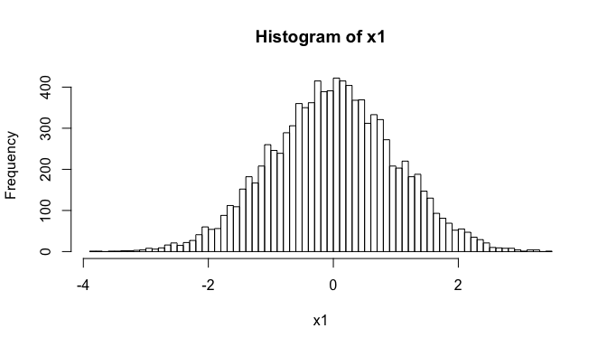
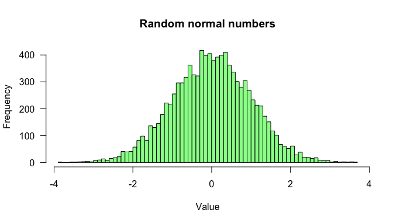
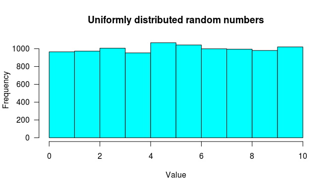

## Exercice 1

- Créez la matrice identité `matIdentite` de dimension 10 lignes x 10 colonnes contenant uniquement le chiffre 0. Puis remplacez uniquement les valeurs de la diagonale par le chiffre $1$. Imprimez la matrice à l'écran.

- Créez une matrice `matAleatoire` contenant des valeurs tirées aléatoirement de dimension 10 lignes x 10 colonnes, dont les éléments suivent une loi normale de moyenne 0 et de variance $5$. Imprimez la matrice à l'écran en arrondissant à 2 décimales. 


### Astuce

- Fonctions: `matrix()`, `diag()`, `print()`, rnorm()`, `round() 

### Solutions

En cas d'urgence poussez sur **Code** pour révéler la solution.


```r
matIdentite <- matrix(ncol = 10, nrow = 10, data = 0)
diag(matIdentite) <- 1
print(matIdentite)
```

```
      [,1] [,2] [,3] [,4] [,5] [,6] [,7] [,8] [,9] [,10]
 [1,]    1    0    0    0    0    0    0    0    0     0
 [2,]    0    1    0    0    0    0    0    0    0     0
 [3,]    0    0    1    0    0    0    0    0    0     0
 [4,]    0    0    0    1    0    0    0    0    0     0
 [5,]    0    0    0    0    1    0    0    0    0     0
 [6,]    0    0    0    0    0    1    0    0    0     0
 [7,]    0    0    0    0    0    0    1    0    0     0
 [8,]    0    0    0    0    0    0    0    1    0     0
 [9,]    0    0    0    0    0    0    0    0    1     0
[10,]    0    0    0    0    0    0    0    0    0     1
```

#### Matrice de nombres aléatoires


```r
## Generatre a 10x10 matrix with random normal numbers
matAleatoire <- matrix(
  nrow = 10, 
  ncol = 10, 
  data = rnorm(n = 100, 
               mean = 0, 
               sd = sqrt(5)))

## Print the results rounded at 2 decimals
print(round(matAleatoire, digits = 2))
```

```
       [,1]  [,2]  [,3]  [,4]  [,5]  [,6]  [,7]  [,8]  [,9] [,10]
 [1,]  0.87 -0.25 -2.98  0.61  1.45  2.25 -0.06 -2.34 -3.67  1.81
 [2,] -3.24  1.64  0.06 -0.76  1.74 -2.34  0.80 -0.60  2.74 -1.39
 [3,]  2.72 -1.07  0.27 -1.81 -1.61 -1.78  1.89 -0.05 -2.21  0.56
 [4,]  1.30 -1.10  1.54 -0.12 -1.05 -4.50 -2.01  0.93 -1.21  1.34
 [5,]  4.09  3.02  1.10 -2.15  1.69  0.16  5.31  2.03 -0.32  0.58
 [6,]  2.96 -2.06 -0.91  2.99 -2.24  0.95  0.37  0.01  1.72  1.87
 [7,]  1.45  1.98  0.19  2.00 -0.37 -3.24  0.45 -0.67  2.66  0.55
 [8,]  2.30 -2.67 -2.43 -0.23 -2.16  1.61 -0.61 -1.06 -3.23  1.70
 [9,]  0.40 -0.96 -0.65 -2.86 -2.01 -0.45 -2.21  0.02 -0.74 -1.19
[10,]  0.07 -0.88  0.45 -0.45  1.30  6.52  1.52  2.51 -0.42 -2.46
```


## Exercice 2.1

Créez deux vecteurs aléatoires nommés `x1` et `x2`, contenant chacun $n = 10.000$ valeurs aléatoires respectivement compatibles:

a. avec une loi normale centrée réduite pour `x1`;
b. avec une loi uniforme définie sur l’intervalle $[0, 10]$ pour `x2`.

Vérifiez la distribution empirique de ces échantillons en dessinant des histogrammes. 

Vérifiez si les paramètres de vos échantillons aléatoires correspondent à vos attentes (et à leur *espérance statistique*). 


**Fonctions à utiliser :** `rnorm()`, `runif()`, `cbind()`, `rbind()`, `dim()`, `mean()`, `var()`, `min()`, `max()`, `summary()`, ...

### Solutions


```r
n <- 10000 ## define vector sizes
x1 <- rnorm(n = n, mean = 0, sd = 1) ## normal random
x2 <- runif(n = n, min = 0, max = 10) ## uniform random 
```


```r
hist(x = x1, breaks = 100)
```

<div class="figure" style="text-align: center">

<p class="caption">(too) simple istogram of normally distributed random numbers.</p>
</div>


```r
hist(x = x1, breaks = 100, 
     las = 1, 
     col = "palegreen",
     main = "Random normal numbers",
     xlab = "Value"
     )
```

<div class="figure" style="text-align: center">

<p class="caption">Histogram of normally distributed random numbers. </p>
</div>


```r
hist(x = x2, breaks = 10, 
     las = 1, 
     col = "cyan",
     main = "Uniformly distributed random numbers",
     xlab = "Value"
     )
```

<div class="figure" style="text-align: center">

<p class="caption">Histogram of uniformly distributed random numbers. </p>
</div>


```r
summary(x1)
```

```
     Min.   1st Qu.    Median      Mean   3rd Qu.      Max. 
-3.355711 -0.674173  0.005888  0.009847  0.690854  3.721343 
```

## Exercice 2.2

Créez une matrice `m1` qui contient les 10 premières valeurs de `x1` (colonne 1 de `m1`) et les 10 dernières valeurs de `x2` (colonne 2 de `m1`).

### Solution


```r
## Prepare an empty matrix
m1 <- matrix(nrow = 10, ncol = 2)

## Assign values to the first column
m1[, 1] <- head(x = x1, n = 10)

## Assign values to the second column
m1[, 2] <- tail(x = x1, n = 10)

## Print the result rounded to 3 decimals
print(round(m1, digits = 3))
```

```
        [,1]   [,2]
 [1,] -0.061  0.632
 [2,]  0.659  0.997
 [3,] -0.718 -0.355
 [4,]  1.540 -1.685
 [5,]  0.214 -0.595
 [6,] -0.246  0.047
 [7,] -1.224 -1.079
 [8,] -0.854  0.619
 [9,] -0.241 -0.777
[10,] -1.393  0.265
```


## Exercice 2.3

Créez une matrice `m2` qui contient 

- les 16ème, 51ème, 79ème, 31ème et 27ème valeurs de `x1` (colonne 1 de `m2`) et
- les 30ème, 70ème, 12ème, 49ème et 45ème de `x2` (colonne 2 de `m2`).

### Solutions


```r
m2 <- matrix(nrow = 5, ncol = 2)

## Assign values
m2[, 1] <- x1[c(16, 51, 79, 31, 27)]
m2[, 2] <- x2[c(30, 70, 12, 49, 45)]

## Print the result
print(m2)
```

```
           [,1]      [,2]
[1,]  0.5152093 0.8033432
[2,]  1.5090420 1.5278477
[3,] -0.3309752 1.2795750
[4,] -0.2718170 2.7289499
[5,]  0.1990590 7.8830609
```

## Exercice 2.4

Concaténez à la suite (l’une en dessous-de l’autre) les matrices `m1` et `m2`, afin d’obtenir une nouvelle matrice `m3`. Quelles sont les dimensions (nombre de lignes et de colonnes) de `m3` ?

**Fonctions : ** `rbind()`, `cbind()`, `dim()`, `ncol()`, `nrow()`

### Solutions


```r
m3 <- rbind(m1, m2)
dim(m3)
```

```
[1] 15  2
```

```r
nrow(m3)
```

```
[1] 15
```

```r
ncol(m3)
```

```
[1] 2
```


## Exercice 3

3.1. Importez dans votre session R les données nommées `WorldPhones` (pré-existantes dans R). Affichez le contenu de la variable `WorldPhones`. Quelle est sa structure et sa classe ?

3.2. Calculez le nombre total de numéros de téléphone attribués :

a. au cours des différentes années (vecteur `nbrTelAn`)
b. pour chaque continent (vecteur `nbrTelCont`)


3.3. Quel est le continent qui a le plus / moins de numéros attribués ?

3.4. Dans combien de continents y a-t-il plus de : 20 000, 50 000 et 200 000 numéros de téléphone attribués ? 


**Fonctions à utiliser :** `data(WorldPhones)`, `str()`, `sum()`, `apply()`, `names()`, `which()`, `max()`, `min()` ...


## Exercice 4

Téléchargez le fichier `test.txt` présent sur moodle. Ouvrez-le avec un éditeur de texte ou un calculateur pour identifier sa structure et les cases non remplies.


- Importez le dans R dans un objet `test.data` et vérifiez sa structure et son contenu.

- Comment les données manquantes ont-elles été lues ? Remplacez-les par NA si elles n’ont pas été lues comme une donnée manquante.

- Déplacer la colonne 1 en dernière colonne

- Renommez les colonnes colA, colB, colC, colD, colE etc…dans le nouvel ordre obtenu

- Supprimez la deuxième ligne

- Ajoutez une colonne de valeurs numériques obtenues en divisant les valeurs de la `colE` par les valeurs de la `colA`

- Dans la `colC`, remplacez les valeurs `toto` par `tata` et vice-versa

- Dans la `colC`, remplacez les lettres `t` par des `m`

- Triez le dataframe par ordre croissant de la colonne `colE`

- Convertissez la colonne `colB` en valeurs numériques

- Dans un vecteur sumcolA, calculer la somme de la `colA`

- Faites un sous-dataframe `test.data2` contenant les lignes pour lesquelles les éléments de la `colE` sont inférieurs ou égaux à ceux de la `colA` 

- Sauvegardez le dataframe test.data2 en fichier texte avec des `;` comme séparateurs de champs.

**Fonctions à utiliser dans l’ordre :** `read.table()`, `str()`, `is.na()`, `paste()`, `gsub()`, `order()`, `as.integer()`, `sum()`, `subset()`, `write.table()`

## Exercice 5

Sauvegardez dans une liste `session2_list` tous les objets créés pendant les exercices 1 à 4 en les mettant dans des sous-listes correspondant à chaque exercice que vous nommerez `exo1`, `exo2`, `exo3` et `exo4`.

**Fonctions à utiliser :** `list()`, `names()`


## Á la maison


- Revoyez toutes les fonctions vues en cours attentivement des sessions 1 et 2.

- Les corrections des exercices de la session 2 seront disponibles le vendredi soir.

- Vous devez terminer l’ensemble des exercices avant la prochaine session, lire et comprendre les corrections, puis refaire par vous-même les exercices sans les corrections.

- Une évaluation QCM aura lieu à la prochaine séance


