## Avant de démarrer, je crée un repertoire pour cette activité:

```r
## Define the directory for this course
courseDir <- file.path("~", "dubii20", "stat-R", "session2")
print(courseDir) ## Check the result
## Create the directory with the recursive option
dir.create(path = courseDir, 
           recursive = TRUE, ## Create the parent directories
           showWarnings = FALSE) ## Don't shout it already exists

## Go to this directory
setwd(courseDir)
getwd() ## Chec
```


## Exercice 1 : personnalisation d’un graphique

1.	Représentez trois points en positions (x, y) : (1, 2), (2, 2) et (3, 3). 

    - Ajoutez le titre "Mon graphique" avec l’argument `main`
    - Sauvegardez ce graphique en format .jpeg sous le nom `initial_graph.jpeg` avec la fonction jpeg() suivie de dev.off()

2. Recommencez ce graphique en personnalisant l’affichage avec les options ou fonctions suivantes pas à pas (faites un nouveau graphique à chaque étape en ajoutant le nouveau paramètre) :

- `xlim` et `ylim` : délimitez l’affichage des échelles des deux axes entre 0 et 4
- `cex` : doublez la taille des points
- `pch` : donnez d’abord une forme de cercle plein à chaque point ;

Recommencez ensuite en spécifiant une forme différente pour chaque point :

- le 1er sous forme d’une croix (comme un +)
- le 2ème sous forme d’un triangle pointé vers le bas vide
- le 3ème sous forme d’un losange plein
- palette() : trouvez les couleurs de votre session et identifiez l’indice de la couleur grise
- `col` : mettez tous les points en gris 
puis donnez une couleur différente à chaque point :

    - rouge pour le 1er
    - bleu pour le 2nd 
    - contour en magenta et fond en cyan pour le 3ème (avec l’option `bg` en plus)

- `lwd` : doublez la largeur des traits tracés (ici des points)
- `bty` : retirez la cadre entourant le graphique pour ne conserver que les axes
- `xlab` et `ylab` = nommez les axes `Axe des  abscisses` et `Axe Y`.

3.	Ajoutez un 4ème point sous forme d’un cercle plein gris aux coordonnées (1.5, 3) avec la fonction points()

4.	Ajoutez une ligne pointillée de couleur verte en position horizontale à l’ordonnée 1 avec la fonction abline() et en particulier l’option `lty`

5.	Ajoutez une légende avec la fonction `legend()à dans le coin en haut à droite et aidez-vous des arguments :
- `col`, `pt.bg`,  `pt.lwd` et `pt.cex`: pour respecter les couleurs, formes des points que vous mettrez à la taille 1.5 
- `legend` : pour nommer vos points `A`, `B`, `C` et `D`
- `title` : pour donner un nom `Mes 4 points` à la légende 
- `horiz` : pour positionner les points côte à côte plutôt que les uns en dessous des autres
6.	Donnez le titre `Mon graphique personnalisé` à votre figure
7.	Sauvegardez-la en format pdf avec le nom "cutom_graph.pdf"


###	Fonctions à utiliser

- `jpeg()`
- `pdf()`
- `dev.off()`
- `plot()`
- `palette()`
- `grep()`
- `points()`
- `abline()`
- `legend()`
- `title()`


En cas d'urgence poussez sur **Code** pour révéler la solution.

### Solution de l'exercice 1:

```r
# 1.graphique initial:
plot(c(1,2,3), c(2,2,3))
```

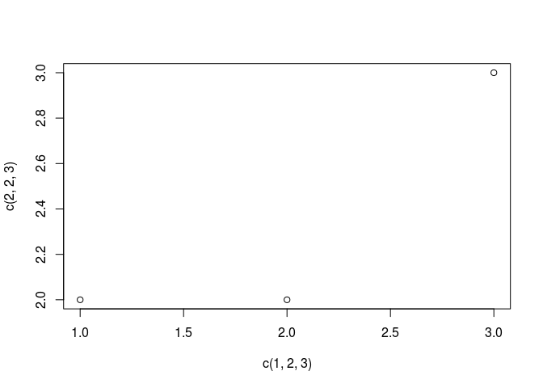

```r
plot(c(1,2,3), c(2,2,3), main = "Mon graphique")
```

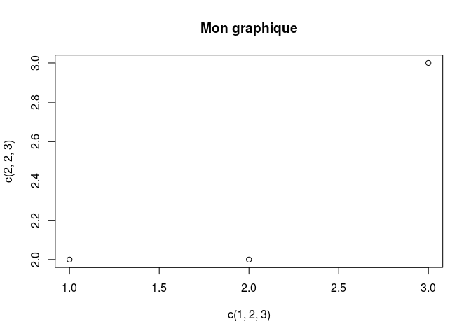

```r
jpeg("initial.graph.jpeg")
plot(c(1,2,3), c(2,2,3))
dev.off()
```

```
png 
  2 
```

```r
#2.graphique personnalise
plot(c(1,2,3), c(2,2,3),xlim = c(0,4), ylim = c(0,4))
```

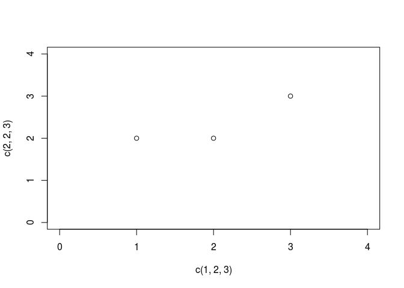

```r
plot(c(1,2,3), c(2,2,3), cex = 2, xlim = c(0,4), ylim = c(0,4))
```

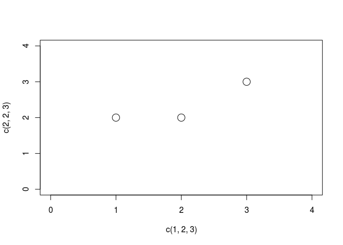

```r
plot(c(1,2,3), c(2,2,3),
     cex = 2, pch = 16,
     xlim = c(0,4), ylim = c(0,4))# ou pch=19 ou 20 selon la taille choisie
```

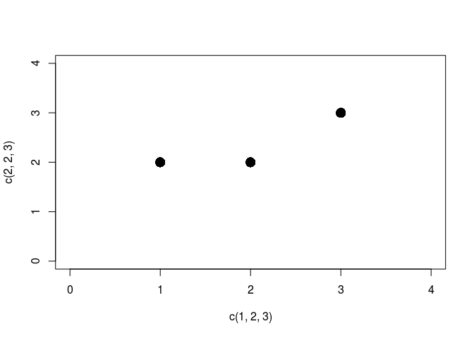

```r
plot(c(1,2,3), c(2,2,3),
     cex = 2, pch = c(3,6,18),
     xlim = c(0,4), ylim = c(0,4))
```

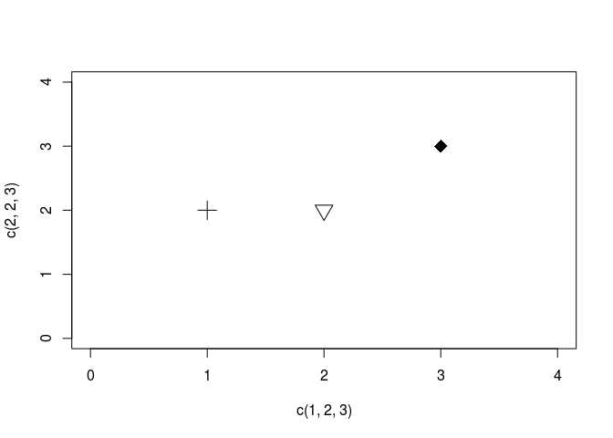

```r
palette() # le nom des couleurs de base est affiche
```

```
[1] "black"   "red"     "green3"  "blue"    "cyan"    "magenta" "yellow"  "gray"   
```

```r
index_grey <- grep("gray", palette())#gray=grey dans R!!!
plot(c(1,2,3), c(2,2,3),
     cex = 2, pch = c(3,6,18),
     xlim = c(0,4), ylim = c(0,4),
     col = index_grey)# vous pouvez ecrire col="gray" ou col=8  ou col=grep("gray", palette()) indifferemment
```


```r
plot(c(1,2,3), c(2,2,3),
     cex = 2, pch = c(3,6,23),
     xlim = c(0,4), ylim = c(0,4),
     col = c("red", "blue", "magenta"),
     bg = "cyan")
```

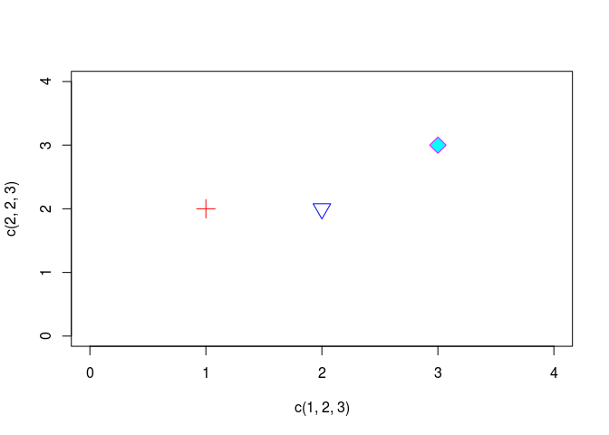

```r
plot(c(1,2,3), c(2,2,3),
     cex = 2, pch = c(3,6,23),
     xlim = c(0,4), ylim = c(0,4),
     col = c("red", "blue", "magenta"),
     bg = "cyan",
     lwd = 2)
```

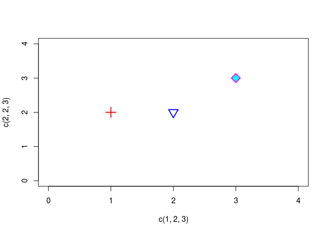

```r
plot(c(1,2,3), c(2,2,3),
     cex = 2, pch = c(3,6,23),
     xlim = c(0,4), ylim = c(0,4),
     col = c("red", "blue", "magenta"),
     bg = "cyan", lwd = 2, bty = "n")
```

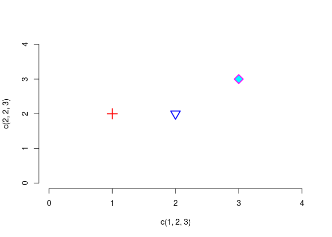

```r
# et enfin, cette fois-ci avec le nom des axes et en ecrivant chaque argument l'un en dessous de l'autre pour plus de lisibilite (sans oublier la virgule entre chaque!!!)
plot(c(1,2,3), c(2,2,3),
     cex = 2,
     pch = c(3,6,23),
     xlim = c(0,4),
     ylim = c(0,4),
     col = c("red", "blue", "magenta"),
     bg = "cyan",
     lwd = 2,
     bty = "n",
     xlab = "Axe des abcisses",
     ylab = "Axe Y")

#3.graphique personnalise suite...
points(1.5, 3, pch = 16, col = "gray", cex = 2) # points() est une fonction graphique secondaire

#4.graphique personnalise suite...
abline(h = 1, col = "green3", lty = 2) # abline() est aussi une fonction secondaire

#5.graphique personnalise suite...
legend("topright",
       legend = c("A","B","C","D"),
       col = c("red", "blue", "magenta", "gray"),
       pch = c(3,6,23, 16),
       pt.bg = "cyan",
       pt.cex = 1.5,
       pt.lwd = 1.5,
       title = "mes 4 points",
       bty = "n",
       horiz = T)

#6.graphique personnalise suite...
title("Mon graphique personnalise")
```

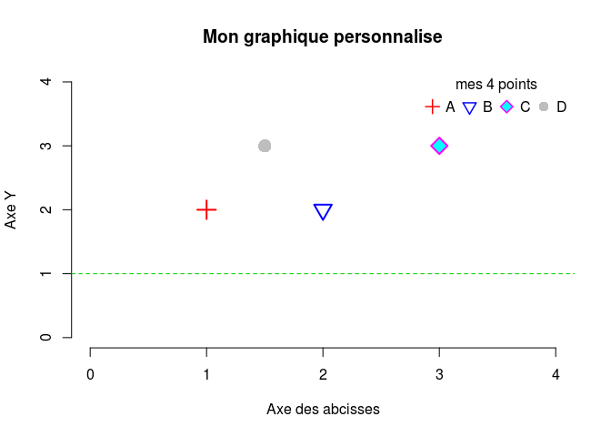

```r
# ici j'ai utilise la fonction secondaire title() pour ajouter un titre, mais j'aurais pu utiliser l'argument "main" lors de la fonction plot:
# plot(c(1,2,3), c(2,2,3),
#      cex = 2, pch = c(3,6,23),
#      xlim = c(0,4), ylim = c(0,4),
#      col = c("red", "blue", "magenta"),
#      bg = "cyan",
#      lwd = 2,
#      bty = "n",
#      xlab = "Axe des abcisses",
#      ylab = "Axe Y",
#      main="Mon graphique personnalise")


#7.sauvegarder le graphique personnalise  au format pdf
pdf("custom_graph.pdf")
plot(c(1,2,3), c(2,2,3),
     cex = 2,
     pch = c(3,6,23),
     xlim = c(0,4),
     ylim = c(0,4),
     col = c("red", "blue", "magenta"),
     bg = "cyan",
     lwd = 2,
     bty = "n",
     xlab = "Axe des abcisses",
     ylab = "Axe Y",
     main = "Mon graphique personnalis?")
points(1.5, 3, pch = 16, col = "gray", cex = 2)
abline(h = 1, col = "green3", lty = 2)
legend("topright",
       legend = c("A","B","C","D"),
       col = c("red", "blue", "magenta", "gray"),
       pch = c(3,6,23, 16),
       pt.bg = "cyan",
       pt.cex = 1.5,
       pt.lwd = 1.5,
       title = "mes 4 points",
       bty = "n",
       horiz = T)
dev.off()
```

```
png 
  2 
```
### Pour aller plus loin:
Jouez avec l'affichage des axes

```r
plot(c(1,2,3), c(2,2,3),
     cex = 2,
     pch = c(3,6,23),
     xlim = c(0,4),
     ylim = c(0,4),
     col = c("red", "blue", "magenta"),
     bg = "cyan",
     lwd = 2,
     bty = "n",
     xlab = "Axe des abcisses",
     ylab = "Axe Y",
     xaxt = "n",
     yaxt = "n" )
axis(1, at = 0:4,labels = F )
mtext(0:4,side = 1,at = 0:4, line = 1,col = "blue")
axis(2, at = 0:4, tcl = -0.2, cex = 0.7, labels = F )
mtext(0:4,side = 2,at = 0:4, line = 1, cex = 0.7)
abline(h = 1, col = "green3", lty = 2)
legend("topright",
       legend = c("A","B","C","D"), 
       col = c("red", "blue", "magenta", "gray"),
       pch = c(3,6,23, 16),
       pt.bg = "cyan",
       pt.cex = 1.5,
       pt.lwd = 1.5,
       title = "mes 4 points",
       bty = "n",
       horiz = T)
title("Mon graphique personnalise")
```

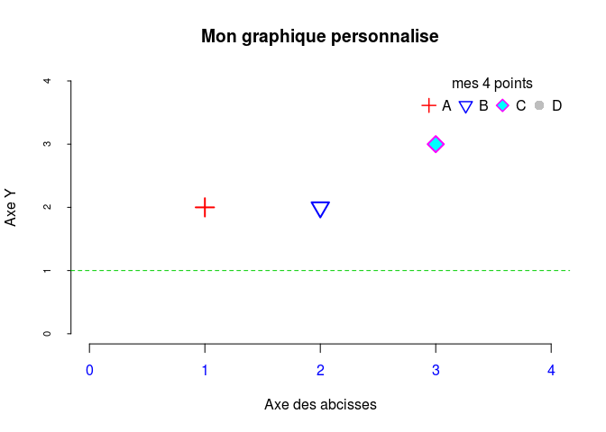


## Exercice 2: représentations graphiques de données qualitatives

- Importez dans R le fichier [`motorisation.txt`](https://du-bii.github.io/module-3-Stat-R/stat-R_2020/data/motorisation.txt) dans votre repertoire de travail. Le fichier est egalement present dans: `/shared/projects/dubii2020/data/module3/seance2/`
- Générez un camembert de la répartition des différentes motorisations et choisissez vous-mêmes des couleurs.
- Générez également un diagramme en bâtons avec les proportions (fréquences relatives) des différentes motorisations colorées comme dans le camembert.
- Disposez les deux graphes côte à côte sur un même graphique.

### Fonctions à utiliser

- `read.table()`
- `table()`
- `pie()`
- `barplot()`
- `par()`avec l’agument `mfrow`


### Solutions exercice 2:

Etape 1: lire le fichier dans R
--------------------------------

```r
# avant de lire ce fichier et de l'assigner dans un objet R, ouvrez le dans Unix ou avec un editeur de texte pour voir s'il y a une en-tete, combien il contient de lignes, de colonnes et quel est leur separateur (espace, tabulation, virgule, point virgule, etc...)
# ici motorisation.txt est un fichier texte de 22 lignes, avec une seule colonne (donc vous pouvez garder le separateur de champs "espace" par defaut dans la commande read.table qui suit), et sans en-tete (donc il faut le specifier avec l'argument header sinon votre premiere valeur serait lue comme un nom de colonne par defaut)
motorisation <- read.table("/shared/projects/dubii2020/data/module3/seance2/motorisation.txt", header = F, stringsAsFactors = F) # nommez votre objet R present dans votre session R sans extension! Attention, n'oubliez pas l'argument stringsAsFactors=F sinon vous factorisez la variable

# Alternativement, si le fichier motorisation n'est pas dans votre repertoire de travail, donnez son chemin absolu ou relatif a la place de myPath dans la commande ci-dessous:
#motorisation <- read.table("myPath/motorisation.txt",header=F, stringAsFactors=F)
str(motorisation)# toujours verifier la structure des objets importes et se demander si elle est conforme a ce que vous souhaitez!
```

```
'data.frame':	22 obs. of  1 variable:
 $ V1: chr  "Hybride" "Diesel" "Diesel" "Essence" ...
```

```r
names(motorisation) <- "type_de_motorisation" #non demande dans l'enonce mais il est bon de nommer vos variables
```

Etape 2: Faire les figures
--------------------------

Essayez dans une premier temps de faire chaque graphique independamment avec les bonnes commandes avant de les afficher sur une meme fenetre graphique

**Note: lorsque vous utilisez Rstudio: une erreur peur se produire si votre fenetre graphique est trop petite, compte tenu des marges et de la taille de votre ecran-> pensez alors a redimensionner la fenetre graphique avant de lancer vos commandes graphiques**

- Pour le pie chart:


```r
pie(table(motorisation$type_de_motorisation), col = c("green3","blue","magenta","orange"))
```


N'hesitez pas à decomposer la commande ci-dessus élement par élement pour bien la comprendre en tapant successivement:

```r
? pie
table(motorisation$type_de_motorisation) #cette commande vous retourne un tableau de contingence comptant le nombre d'observationns de chaque valeur de la variable "type de motorisation". C'est ce qui est le plus pratique! Il s'agit d'un objet R a une seule dimension.
```

```

    Diesel Electrique    Essence    Hybride 
         9          1          7          5 
```

```r
# Si besoin, vous pouvez extraire les noms attribues a ces valeurs avec la commande
names(table(motorisation$type_de_motorisation))
```

```
[1] "Diesel"     "Electrique" "Essence"    "Hybride"   
```

```r
palette() # n'est pas incluse dans la fonction pie() mais vous sert a connaitre les couleurs utilisees par defaut dans votre session R
```

```
[1] "black"   "red"     "green3"  "blue"    "cyan"    "magenta" "yellow"  "gray"   
```

```r
c("green3","blue","magenta","orange")# vous definissez ici le vecteur pour l'argument col avec 4 elements: une couleur par type possible de motorisation; les couleurs seront affichees dans l'odre alphabetique de chacune des 4 valeurs de la variable "type de motorisation"
```

```
[1] "green3"  "blue"    "magenta" "orange" 
```

Alternativement: vous pouviez utiliser la commande pie sans utiliser de tableau de contingence en donnant comme argument x un vecteur avec les comptes de chaque valeur comme ci-dessous


```r
pie(c(9,1,7,5), labels = c("Diesel","Electrique", "Essence", "Hybride"),
    col = c("green3","blue","magenta","orange"))
```

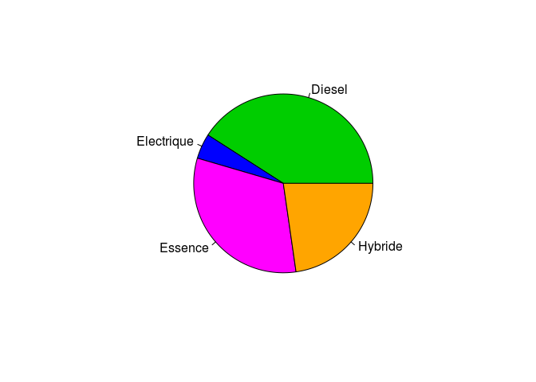

```r
# vous pouvez ajouter l'argument clocwise=T pour changer l'orientation des parts
# ici, j'ai ecrit labels=c("Diesel","Electrique", "Essence", "Hybride") mais on aurait pu ecrire egalement labels = names(table(motorisation$type_de_motorisation)) ou labels = sort(unique(motorisation$type_de_motorisation) car unique() retourne chaque occurence/valeur possible de la variable et la fonction sort() les trie par ordre alphanumerique
```
Enfin, si vous voulez afficher les parts du camembert par ordre croissant, vous pouvez appliquer la fonction `sort()` sur la valeur obtenue par la commande `(table(motorisation$type_de_motorisation))`

```r
pie(sort(table(motorisation$type_de_motorisation)), col = c("green3","blue","magenta","orange")) # les couleurs sont attribuees dans le nouvel ordre...qui est peut etre mieux car diesel n'est plus en vert!
```

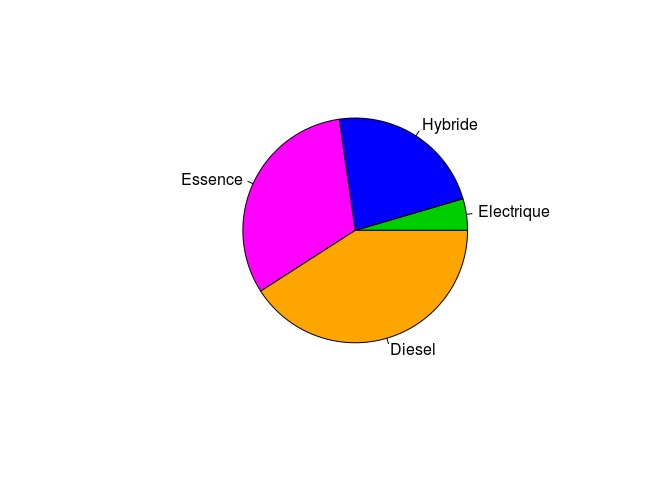


- Pour le barplot:


```r
barplot(table(motorisation$type_de_motorisation)/length(motorisation$type_de_motorisation),
        col = c("green3","blue","magenta","orange"))
```

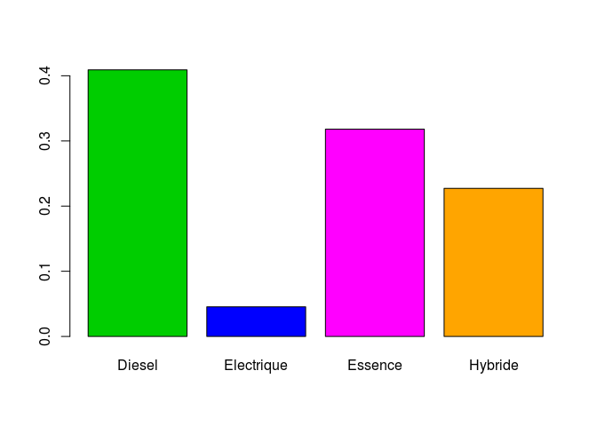

```r
# il s'agit bien d'un barplot (diagramme en batons) adapte a des donnees qualitatives et non d'un histogramme adapte a des variables continues
```

N'hesitez pas a aggrandir votre fenetre d'affichage pour voir les noms sous les batons...ou reduisez leur taille en utilisant l'argument cex.names:


```r
barplot(table(motorisation$type_de_motorisation)/length(motorisation$type_de_motorisation),
        cex.names = 0.8,
        col = c("green3","blue","magenta","orange"))
```


Il est aussi possible d'utiliser barplot avec une matrice comme argument x. Dans ce cas, par defaut avec l'argument beside=F, les elements du diagramme en baton seront empilés.


```r
barplot(matrix(table(motorisation$type_de_motorisation)/length(motorisation$type_de_motorisation)),
        col = c("green3","blue","magenta","orange"),
        legend.text = unique(sort(motorisation$type_de_motorisation)),
        args.legend = list(x = "topright", cex = 0.8, bty = "n"),
        width = 1,
        xlim = c(0,5) )
```

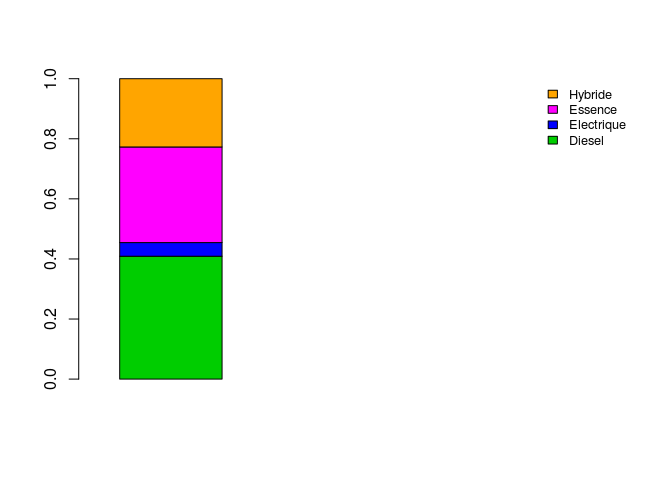


Si vous voulez les afficher du plus grand au plus petit effectif, ajouter `sort()` en precisant `decreasing=T`


```r
barplot(matrix(sort(table(motorisation$type_de_motorisation)/length(motorisation$type_de_motorisation),decreasing = T)),
        col = c("green3","blue","magenta","orange"),
        legend.text = unique(sort(motorisation$type_de_motorisation)),
        args.legend = list(x = "topright", cex = 0.8, bty = "n"),
        width = 1,
        xlim = c(0,5) )
```

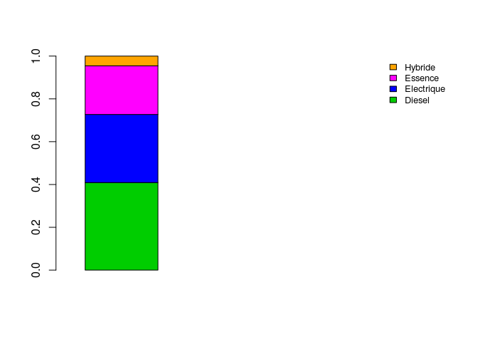


- Pour afficher les 2 plots dans une meme fenetre graphique:


Version attendue dans l'exrecice:


```r
opar <- par()
par(mfrow = c(1,2)) 
pie(table(motorisation$type_de_motorisation), col = c("green3","blue","magenta","orange"))
barplot(table(motorisation$type_de_motorisation)/length(motorisation$type_de_motorisation),col = c("green3","blue","magenta","orange"))
```

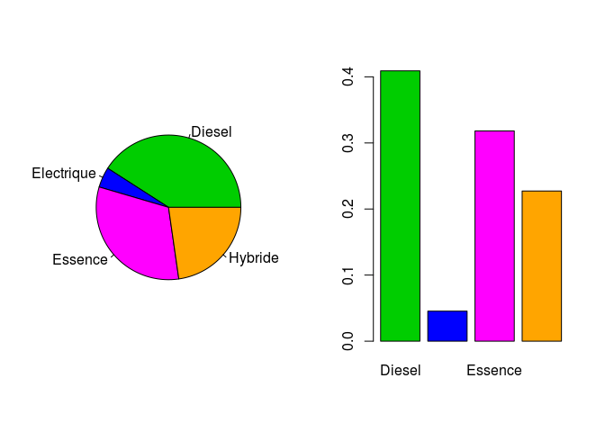

```r
par(opar)
```
Version finale pour aller plus loin en integrant des alternatives decrites pour chaque figure et avec les bonnes regles d'affichage du script R:

```r
opar <- par()
par(mfrow = c(1,2)) 
pie(sort(table(motorisation$type_de_motorisation)),
    col = c("green3","blue","magenta","orange"),
    clockwise = T)  
barplot(matrix(sort(table(motorisation$type_de_motorisation)/length(motorisation$type_de_motorisation),
                     decreasing = T)),
         col = c("orange","magenta","blue","green3"),
         legend.text = names(sort(table(motorisation$type_de_motorisation)
                                  ,decreasing = T)),
         args.legend = list(x = "topright", cex = 0.8, bty = "n"),
         width = 1,
         xlim = c(0,5))
```

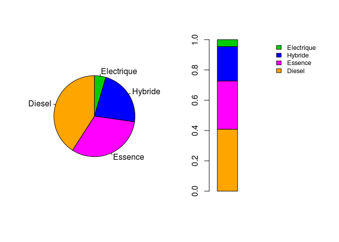

```r
par(opar)
```
Vous noterez qu'il est prefable de visualiser les donnees qualitatives, comme ici le type de motorisation, au moyen d'un diagramme en batons. Cela vous ai rappele en 'Note' dans la fenetre d'aide de la fonction pie!


##	Exercice 3 représentation graphique de la distribution d’une variable quantitative continue

- Tirez aléatoirement un ensemble de 100 nombres compatibles avec une distribution normale de moyenne 10 et d’écart type 5. 
- Sauvegardez-les dans un objet R.
- Tracez la représentation histogramme des valeurs obtenues.
- Changez le nombre d’intervalles de l’histogramme : 5, 50 et 100. 
- Tracez également une boite à moustache horizontale de ces data.
- Affichez les 3 histogrammes et le boxplot les uns en dessous des autres dans une même fenêtre graphique.

### Fonctions recommandées:

- `rnorm()`
- `hist()` avec l’argument `breaks`
- `boxplot`
- `par()` avec l’argument `mfrow`

### Solutions pour l'exercice 3:

```r
myrandomdata <- rnorm(100, mean = 10, sd = 5)# bien penser a assigner le resultat de votre tirage dans un objet, sinon, les valeurs changent a chaque fois que vous effectuez un tirage avec la commande rnorm!

# je ne vous detaille pas ici chaque graphique, je les supperpose tout de suite
opar <- par()
par(mfrow = c(4,1))
hist(myrandomdata, breaks = 5)
hist(myrandomdata, breaks = 50)
hist(myrandomdata, breaks = 100)
boxplot(myrandomdata, horizontal = T)
```

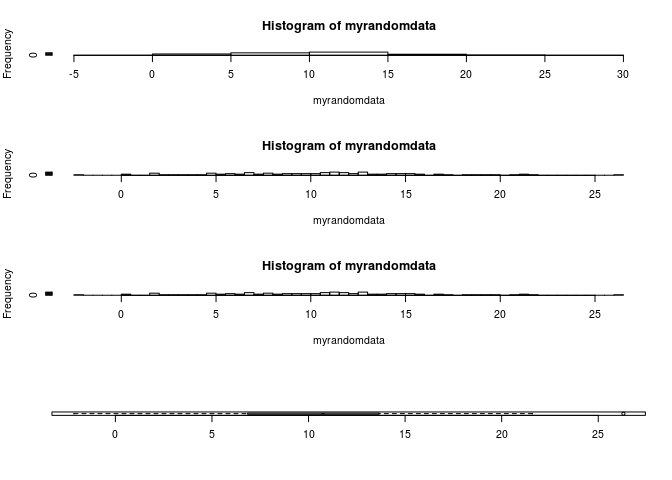

```r
par(opar) 
```


##	Exercice 4: lois de probabilité

-	Si $X$ suit une loi normale de moyenne 10 et d’écart type 55, quelle est la probabilité $P(7 \le X \le 15)$ ?

-	Si $X$ suit une loi normale de moyenne $\mu=10$ et d’écart type $\sigma=55$, quelle est la valeur de $k$ telle que $P( X \ld k) = 0.67$ ?

-	Soit un test de Chi2 à 3 degrés de libertés avec une valeur de la statistique de `Chi2=16.26$. Quelle est la p-value de ce test ?

### Fonctions recommandées:

- `pnorm()`
- `qnorm()`
- `pchisq`


### Solutions pour l'exercice 4:


```r
pnorm(15, 10, 5) - pnorm(7, 10, 5)# il faut calculer d'abord la probabilite que X<15, cad l'aire sous la courbe de la loi de probabilite de la loi normale, puis soustraire la probabilite que x<7!
```

```
[1] 0.5670916
```

```r
qnorm(0.67, 10, sd=5)
```

```
[1] 12.19957
```

```r
pchisq(6.26,3, lower.tail=F)
```

```
[1] 0.09962354
```


## Exercice 5: représentations graphiques de données quantitatives

- Récupérez le jeu de données airquality disponible sous R. 
- Créez les graphes de la figure ci-après avec ce jeu de données. 
 
 

```r
knitr::include_graphics(path = "img/airquality.png")
```

<div class="figure" style="text-align: center">

<p class="caption">Examples of graphical representations. </p>
</div>

 
###	Fonctions à utiliser
- `data()`
- ` par()` avec les arguments `mfrow` et `mar``
- `plot()`
- `hist()`
- `lines()`
- `boxplot()`
- `abline()`
- `lm()`
- `title()`


### Solutions de l'exercice 6:


```r
data(airquality)
str(airquality)
```

```
'data.frame':	153 obs. of  6 variables:
 $ Ozone  : int  41 36 12 18 NA 28 23 19 8 NA ...
 $ Solar.R: int  190 118 149 313 NA NA 299 99 19 194 ...
 $ Wind   : num  7.4 8 12.6 11.5 14.3 14.9 8.6 13.8 20.1 8.6 ...
 $ Temp   : int  67 72 74 62 56 66 65 59 61 69 ...
 $ Month  : int  5 5 5 5 5 5 5 5 5 5 ...
 $ Day    : int  1 2 3 4 5 6 7 8 9 10 ...
```

```r
opar <- par()
par(mfrow = c(2,2),
    mar = c(4.1, 2.1, 5.1, 2.1))
stripchart(airquality$Temp~airquality$Month,
           pch = 22,
           xlab = "Temperature", ylab = "Month",
           main = "A. stripchart of temperatures",
           col = 6)
hist(airquality$Temp,
     xlab = "Temp",
     freq = FALSE,
     main = "B. histogram of temperatures")
lines(density(airquality$Tem), col = 5)
boxplot(airquality$Ozone~airquality$Month,
        names = c("May", "June", "July", "August", "September"),
        cex.axis = 0.7,
        col = 4,
        pch = "'",
        main = "C. boxplot of ozon level per month")
plot(airquality$Ozone~airquality$Wind,
     xlab = "Wind",
     ylab = "Ozone",
     xlim = c(5,14),
     pch = "'",
     main = "D. ozone level versus wind")
abline(lm(airquality$Ozone~airquality$Wind),
       col = 2, lty = 2, lwd = 1.5)
title("Graphs from the airquality dataset", outer = T, line = -1)
```

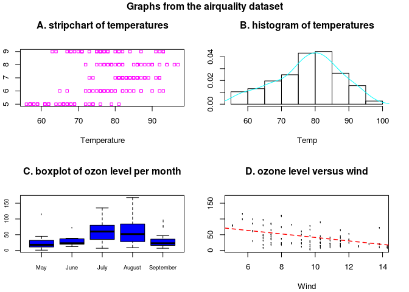

```r
par(opar)
```

For the boxplots, you could also have generated a factor with names to each level:


```r
fmonth <- factor(airquality$Month,levels = 5:9)
levels(fmonth) <- c("May","June","July","August","September")
boxplot(airquality$Ozone ~ fmonth ,
        col = "blue",
        ylab = "Ozone",
        main = "C. boxplot of ozon level per month")
```


**IMPORTANT NOTE ON NAMES OF VARIABLES:***
Here for boxplot as for most R functions, you may enter the argument data="", and then just put the name of the variables without repeating the name of the dataframe:

```r
boxplot(data = airquality, Ozone~fmonth , col = "blue", ylab = "Ozone", main = "C. boxplot of ozon level per month")
```


Alternatively, you may use `attach()` to access to the variables of the dataset directly by their name, then enter your commands, and then `detach()` once finsihed


```r
attach(airquality)
boxplot(Ozone ~ fmonth , col = "blue", ylab = "Ozone", main = "C. boxplot of ozon level per month")
```

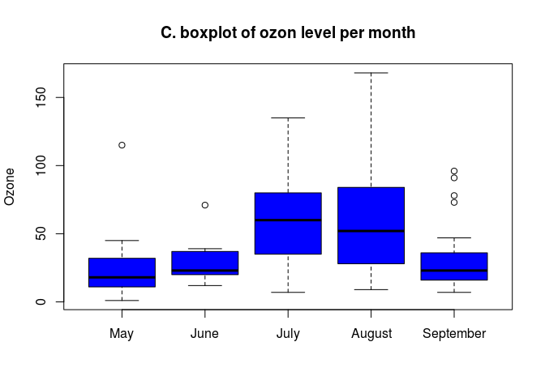

```r
detach(airquality)
```


##	Exercice 6 : analyse de données

Importez dans R le fichier [`poisson.txt`](data/poisson.txt)  R. Il s’agit d’un jeu de données de l’espèce de poisson "grand corégone" du lac Nathalie dans le territoire de la baie James (province du Québec) (d'après B. Scherrer). En 1977, Dumont a cherché les relations existantes entre le potentiel reproducteur (nombre d'œufs) de cette espèce de poisson (grand Corégone) et plusieurs caractères morphologiques. L'étude a été menée afin de déterminer une éventuelle relation entre le nombre d'œufs, révélant le potentiel reproducteur des poissons, et les variables morphologiques caractérisant ces poissons.


### 1. 	Statistiques descriptives

    a.	Identifier les variables et le nombre d’observations de l’échantillon.

    **Fonctions recommandées :**
    - `read.table()`
    - `head()`
    - `dim()`
    - `str()`
    - `names()`
    

```r
coregone <- read.table("/shared/projects/dubii2020/data/module3/seance2/poisson.txt", stringsAsFactors=F, header=T)
str(coregone)
```

```
'data.frame':	41 obs. of  5 variables:
 $ longueur_mm     : int  420 442 397 421 464 436 424 440 420 421 ...
 $ poids_total_g   : int  785 850 655 790 965 880 840 1030 770 890 ...
 $ poids_gonades_mg: num  74.1 54.5 49.6 71.6 69.4 ...
 $ age_annee       : int  12 10 9 9 11 9 8 12 10 10 ...
 $ oeufs_nombre    : int  10676 9461 8328 10281 14028 4984 13697 17206 13485 14055 ...
```
    

b.	Calculer la moyenne, la variance et l’écart-type de chaque variable aléatoire.

    **Fonctions recommandées**
    - `mean()`
    - `var()`
    - `sd()`
    - `apply()`
    - `summary()`
    

```r
summary(coregone)
```

```
  longueur_mm    poids_total_g    poids_gonades_mg   age_annee      oeufs_nombre  
 Min.   :397.0   Min.   : 655.0   Min.   : 31.30   Min.   : 8.00   Min.   : 4984  
 1st Qu.:421.0   1st Qu.: 825.0   1st Qu.: 77.70   1st Qu.:10.00   1st Qu.:13139  
 Median :434.0   Median : 855.0   Median : 97.70   Median :10.00   Median :14606  
 Mean   :435.3   Mean   : 901.6   Mean   : 92.84   Mean   :10.39   Mean   :15071  
 3rd Qu.:443.0   3rd Qu.: 975.0   3rd Qu.:101.90   3rd Qu.:11.00   3rd Qu.:16950  
 Max.   :487.0   Max.   :1310.0   Max.   :170.30   Max.   :13.00   Max.   :25834  
```

```r
apply(coregone, 2, mean)# apply est une fonction qui permet d'appliquer des fonctions par colonne ou ligne d'un dataframe
```

```
     longueur_mm    poids_total_g poids_gonades_mg        age_annee     oeufs_nombre 
       435.29268        901.58537         92.84390         10.39024      15070.75610 
```

```r
apply(coregone, 2, sd)
```

```
     longueur_mm    poids_total_g poids_gonades_mg        age_annee     oeufs_nombre 
       19.755055       141.264110        25.247169         1.180636      4173.765062 
```
    

c.	Réaliser les représentations des distributions de chaque variable aléatoire.

    **Fonctions à utiliser**
    - `hist()`
    - `par(mfrow = c(-,-))`
    - `curve()`
    - `dnorm()
    
d.	Ces variables vous semblent-elles distribuées selon une loi Normale ? Pour le vérifier, superposez sur chaque histogramme les courbes de densité des lois normales correspondantes (les moyennes et les variances sont estimées à partir des données de l’échantillon). Vous pouvez tracer par superposition la loi normale de même moyenne et écart type sur chaque histogramme. Vous pouvez également tracer le qqplot pour comparer la distribution de chaque variable à celle d’une loi normale. Enfin, vous pouvez tester l’hypothèse nulle de la normalité par un test de Shapiro.

    **Fonctions à utiliser**
    - `curve()`
    - `dnorm()`
    - `qqplot()`
    - `qqline()`
    

```r
##histogrammes avec densite des donnees en rouge et loi normale supperposee en cyan
opar <- par()
par(mfrow = c(3, 2))

hist(coregone$longueur_mm,prob=T,
     main = "Histogramme de la longueur totale",
     xlab = colnames(coregone)[1],
     ylab = "Densit?")
lines(density(coregone$longueur_mm),col="red" )
curve(dnorm(x,mean(coregone$longueur_mm), sd(coregone$longueur_mm)), col="cyan", add=T)

hist(coregone$poids_g,prob=T,
     main = "Histogramme du poids",
     xlab = colnames(coregone)[2],
     ylab = "Densit?", ylim=c(0,0.02))
lines(density(coregone$poids_g), col="red" )
curve(dnorm(x,mean(coregone$poids_g),sd(coregone$poids_g)), col="cyan", add=T)

hist(coregone$poids_gonades_mg,prob=T,
     main = "Histogramme du nombre de gonades",
     xlab = colnames(coregone)[3],
     ylab = "Densit?", ylim=c(0,0.02))
lines(density(coregone$poids_gonades_mg),col="red" )
curve(dnorm(x,mean(coregone$poids_gonades_mg), sd(coregone$poids_gonades_mg)), col="cyan",add=T)

hist(coregone$age_annee,prob=T,
     main = "Histogramme de l'age",
     xlab = colnames(coregone)[4],
     ylab = "Densit?", ylim=c(0,0.4))
lines(density(coregone$age_annee),col="red" )
curve(dnorm(x,mean(coregone$age_annee), sd(coregone$age_annee)), col="cyan",add=T)

hist(coregone$oeufs_nombre,prob=T,
     main = "Histogramme du nombre d'oeufs",
     xlab = colnames(coregone)[5],
     ylab = "Densit?", ylim=c(0,1.4e-04))
lines(density(coregone$oeufs_nombre),col="red" )
curve(dnorm(x,mean(coregone$oeufs_nombre), sd(coregone$oeufs_nombre)),col="cyan",add=T)
par(opar)
```

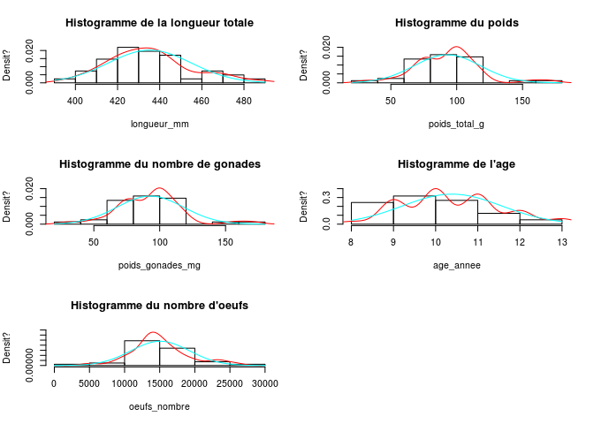
  
Pour note: vous pouvez rechercher la valeur maximale sur l'axe des y en regardant le max de la densite et l'utiliser comme valeur dans l'argument ylim.
Pour la distribution normale theorique, la moyenne est aussi le mode donc la valeur Y maximale, il suffit donc de recuperer la valeur Y à cette moyenne donnée par la fonction `dnorm()` : 

```r
dnorm(mean(coregone$oeufs_nombre),mean(coregone$oeufs_nombre),sd(coregone$oeufs_nombre))
```

```
[1] 9.558331e-05
```

Pour les valeurs de la variable avec `max(hist(variable)$density)` reagardez la structure de l'histogramme avec `str()` et recuperez le max de la densite:

```r
str(hist(coregone$oeufs_nombre,prob=T))
```

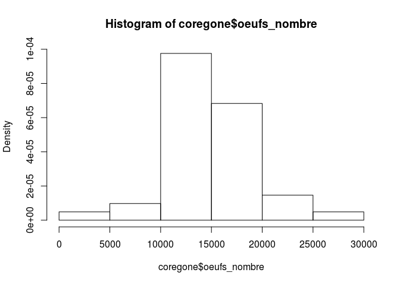

```
List of 6
 $ breaks  : num [1:7] 0 5000 10000 15000 20000 25000 30000
 $ counts  : int [1:6] 1 2 20 14 3 1
 $ density : num [1:6] 4.88e-06 9.76e-06 9.76e-05 6.83e-05 1.46e-05 ...
 $ mids    : num [1:6] 2500 7500 12500 17500 22500 27500
 $ xname   : chr "coregone$oeufs_nombre"
 $ equidist: logi TRUE
 - attr(*, "class")= chr "histogram"
```

```r
max(hist(coregone$oeufs_nombre)$density) # la valeur la plus grande sur l'axe des Y
```


```
[1] 9.756098e-05
```

On peut aussi representer des qqplot: comparaison de la distribution des donnees a une distribution connue, ici a celle d'une loi normale


```r
opar <- par()
par(mfrow = c(3, 2))
qqnorm(coregone$longueur_mm,main="QQ Plot Longueur")
qqline(coregone$longueur_mm)
qqnorm(coregone$poids_g,main="QQ Plot Poids")
qqline(coregone$poids_g)
qqnorm(coregone$poids_gonades_mg,main="QQ Plot Gonades")
qqline(coregone$poids_gonades_mg)
qqnorm(coregone$age_annee,main="QQ Plot Age")
qqline(coregone$age_annee)
qqnorm(coregone$oeufs_nombre,main="QQ Plot Oeufs")
qqline(coregone$oeufs_nombre)            
par(opar)
```

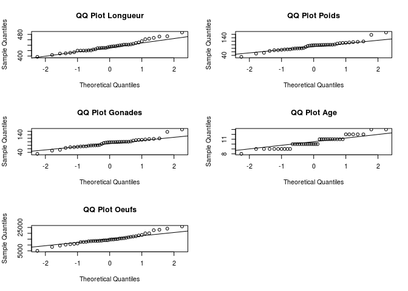

Pour aller plus loin, on peut tester la normalite de la distribution avec le test de shapiro:


```r
shapiro.test(coregone$longueur_mm)
```

```

	Shapiro-Wilk normality test

data:  coregone$longueur_mm
W = 0.97165, p-value = 0.3896
```

```r
shapiro.test(coregone$poids_g)
```

```

	Shapiro-Wilk normality test

data:  coregone$poids_g
W = 0.93983, p-value = 0.031
```

```r
shapiro.test(coregone$poids_gonades_mg)
```

```

	Shapiro-Wilk normality test

data:  coregone$poids_gonades_mg
W = 0.93983, p-value = 0.031
```

```r
shapiro.test(coregone$age_annee)
```

```

	Shapiro-Wilk normality test

data:  coregone$age_annee
W = 0.92799, p-value = 0.01239
```

```r
shapiro.test(coregone$oeufs_nombre)
```

```

	Shapiro-Wilk normality test

data:  coregone$oeufs_nombre
W = 0.96143, p-value = 0.1765
```


### 2.	Comparaison des potentiels reproducteurs selon l’âge :
Existe-t-il une différence du nombre d’œufs produits entre les poissons jeunes (âge inférieur à 10 ans) et âgés (âge supérieur ou égal à 10)?

    a.	Créez une nouvelle variable qualitative pour identifier les deux groupes : les individus `jeunes` et les individus `âgés`

    **Fonction à utiliser**
    - `which()`
    

```r
coregone$classe_age <- NA
coregone[which(coregone[,4] <= 10),"classe_age"] <- "jeune"
coregone[which(coregone[,4] > 10),"classe_age"] <- "vieux" 
```
    
    
b.	Représentez la distribution de la variable `œufs` en fonction de la variable `âge`.

    **Fonctions à utiliser**
    - ` boxplot()`
    - `stripchart`
    

```r
boxplot(coregone$oeufs_nombre~coregone$classe_age) 
stripchart(coregone$oeufs_nombre~coregone$classe_age, col="blue", add=T, vertical=T, pch=20) 
```

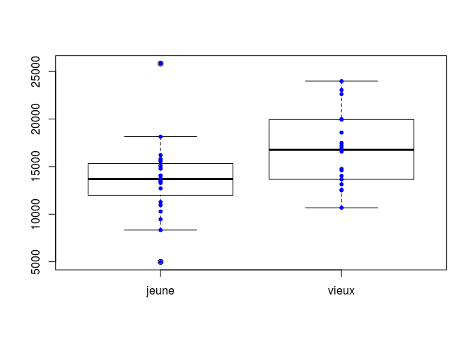

Extraction of boxplot data: add argument plot=F -> the boxplot is not displayed but info are provided including for example stats
for example:


```r
boxplot(coregone$oeufs_nombre~coregone$classe_age, plot=F)$stats
```

```
        [,1]    [,2]
[1,]  8328.0 10676.0
[2,] 11993.0 13659.0
[3,] 13697.0 16760.5
[4,] 15320.5 19942.0
[5,] 18147.0 23982.0
attr(,"class")
    jeune 
"integer" 
```
En plus: representation des donnees par age

```r
opar <- par()
par(mfrow=c(2,2))
boxplot(coregone$longueur_mm~coregone$age_annee) 
boxplot(coregone$poids_g~coregone$age_annee)
boxplot(coregone$poids_gonades_mg~coregone$age_annee)
boxplot(coregone$oeufs_nombre~coregone$age_annee)
```


```r
par(opar)
```


c.	Calculez les moyennes dans chaque groupe du nombre d’œufs

    **Fonctions à utiliser**
    - `apply()`
    - `mean()`


```r
tapply(coregone$oeufs_nombre, coregone$classe_age, mean, na.rm=T) # la fonction tapply permet d'appliquer une fonction comme la moyenne en fonction d'une variable categorique prise comme un facteur
```

```
   jeune    vieux 
13721.83 16794.39 
```

```r
# ou par vecteur en deux lignes:
mean(coregone$oeufs_nombre[which(coregone$classe_age == "jeune")]) # ou avec subset au lieu de [which(),]
```

```
[1] 13721.83
```

```r
mean(coregone$oeufs_nombre[which(coregone$classe_age == "vieux")])
```

```
[1] 16794.39
```


d.	Existe-t-il une différence entre ces moyennes ?

    **Fonctions à utiliser** 
    - `t.test()`
    - `wilcox.test()`
    

```r
t.test(coregone$oeufs_nombre~coregone$classe_age)
```

```

	Welch Two Sample t-test

data:  coregone$oeufs_nombre by coregone$classe_age
t = -2.4862, df = 36.672, p-value = 0.01759
alternative hypothesis: true difference in means is not equal to 0
95 percent confidence interval:
 -5577.3332  -567.7924
sample estimates:
mean in group jeune mean in group vieux 
           13721.83            16794.39 
```

```r
wilcox.test(coregone$oeufs_nombre~coregone$classe_age)
```

```

	Wilcoxon rank sum test with continuity correction

data:  coregone$oeufs_nombre by coregone$classe_age
W = 124, p-value = 0.0302
alternative hypothesis: true location shift is not equal to 0
```

    
e.	Existe-t-il une relation linéaire entre le poids des gonades et le nombre d’oeufs produits ?

    **Fonctions à utiliser**
    - `plot()`
    - `cor()`
    - `lm()`
    - `or.test()`


```r
plot(coregone$oeufs_nombre ~ coregone$poids_gonades_mg, xlab = "Poids des gonades", ylab = "Nombre d'oeufs",pch = 20, main = "Relation entre le poids des gonades et le nombre d'oeufs")
abline(lm(coregone$oeufs_nombre ~ coregone$poids_gonades_mg),col="red")
```

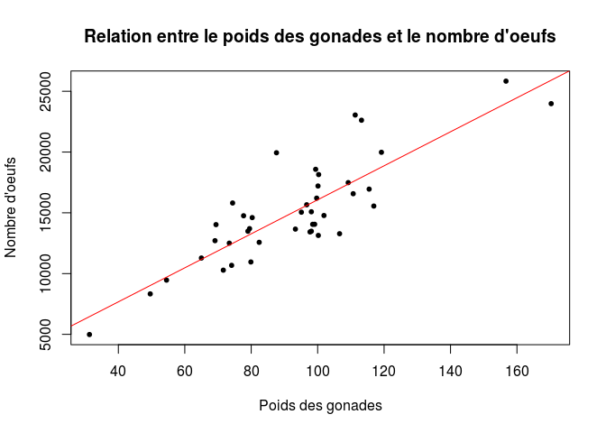

```r
cor.test(coregone$oeufs_nombre, coregone$poids_gonades_mg)
```

```

	Pearson's product-moment correlation

data:  coregone$oeufs_nombre and coregone$poids_gonades_mg
t = 9.9292, df = 39, p-value = 3.128e-12
alternative hypothesis: true correlation is not equal to 0
95 percent confidence interval:
 0.7285804 0.9156779
sample estimates:
      cor 
0.8464914 
```

```r
summary(lm(coregone$oeufs_nombre ~ coregone$poids_gonades_mg))
```

```

Call:
lm(formula = coregone$oeufs_nombre ~ coregone$poids_gonades_mg)

Residuals:
   Min     1Q Median     3Q    Max 
 -3717  -1772   -244   1221   5605 

Coefficients:
                          Estimate Std. Error t value Pr(>|t|)    
(Intercept)                2078.30    1354.89   1.534    0.133    
coregone$poids_gonades_mg   139.94      14.09   9.929 3.13e-12 ***
---
Signif. codes:  0 '***' 0.001 '**' 0.01 '*' 0.05 '.' 0.1 ' ' 1

Residual standard error: 2250 on 39 degrees of freedom
Multiple R-squared:  0.7165,	Adjusted R-squared:  0.7093 
F-statistic: 98.59 on 1 and 39 DF,  p-value: 3.128e-12
```

    **Facultatif :** Vous pouvez ensuite tester l’effet d’autres variables sur la variable `oeufs`.

## Conclusion : 
Les poissons ages ont tendance a pondre plus d'oeufs que les jeunes, ce qui est en relation avec le poids de leurs gonades.


