# Objectifs

Ce tutoriel vous montre comment représenter et analyser des variables qualitatives et quantitatives, et effectuer les principaux tests statistiques.

Le jeu de données `diabdata` est extrait d'une cohorte de patients diabétiques de type 2 suivis par le Dr Louis Potier à l'hopital Bichat. Il comporte, entre autres, des informations morphométriques (taille, poids) et biologiques (lipides sériques). Il inclut 1732 patients. 


#### Solutions

En cas d'urgence poussez sur **Code** pour révéler la solution.


## 1. Importation des données

Le fichier à importer s'appelle `diabdata.txt`. Il est présent dans le répertoire `/shared/projects/dubii2020/data/module3/seance2/`

Ouvrez-le d'abord dans un éditeur de texte pour voir comment il est structuré.
Importez-le dans votre session R ouverte dans votre répertoire de travail.
Attention à la décimale!

**Fonctions : ** `setwd(),read.table(), str(), head(), tail()`


```r
setwd("~")
info_samples <- read.table("/shared/projects/dubii2020/data/module3/seance2/diabdata.txt", header=TRUE, sep=";", dec = "," , stringsAsFactors = FALSE)
```

Regardez la structure de l'objet importé pour vérifier son format. Il s'agit d'un dataframe. Affichez également les premières lignes puis les dernières lignes de ce dataframe.


```r
str(info_samples)
```

```
'data.frame':	1732 obs. of  7 variables:
 $ identifiant: int  1 3 6 11 13 15 16 19 22 23 ...
 $ genre      : chr  "M" "M" "M" "F" ...
 $ origine    : chr  "AFRIQUE" "AFRIQUE" "AFRIQUE" "AFRIQUE" ...
 $ tabac      : chr  "NON" "NON" "OUI" "OUI" ...
 $ poids      : num  86 65.8 96 58 53.2 71 61 64 51 90 ...
 $ taille     : int  181 169 186 161 180 175 175 160 165 170 ...
 $ TG         : num  0.74 1.22 1.79 1.21 1.19 1.15 0.48 0.93 0.49 1.16 ...
```

```r
head(info_samples)
```

```
  identifiant genre origine tabac poids taille   TG
1           1     M AFRIQUE   NON  86.0    181 0.74
2           3     M AFRIQUE   NON  65.8    169 1.22
3           6     M AFRIQUE   OUI  96.0    186 1.79
4          11     F AFRIQUE   OUI  58.0    161 1.21
5          13     M AFRIQUE   OUI  53.2    180 1.19
6          15     F AFRIQUE   NON  71.0    175 1.15
```

```r
tail(info_samples)
```

```
     identifiant genre origine     tabac poids taille   TG
1727        1748     F  EUROPE       NON  70.0    162 2.32
1728        1749     M  EUROPE       NON  54.9    169 0.97
1729        1750     F  EUROPE       NON  68.5    167 2.04
1730        1751     F  EUROPE       NON  50.9    150 0.71
1731        1752     M  EUROPE EX +5 ANS  72.0    174 1.90
1732        1754     M  EUROPE EX +5 ANS  55.2    153 1.09
```

## 2. Variables qualitatives

### 2.1 L'identifiant

Que pensez-vous de l'identifiant des sujets? S'agit-il d'une variable qualitative ou quantitative?
Si nécessaire, transformez le type de données de cette variable `ìdentifiant` pour qu'il s'agisse d'une chaîne de caractères et vérifiez le résultat.

**Fonctions : ** `as.character(), str()`


```r
info_samples$identifiant <- as.character(info_samples$identifiant)
str(info_samples)
```

```
'data.frame':	1732 obs. of  7 variables:
 $ identifiant: chr  "1" "3" "6" "11" ...
 $ genre      : chr  "M" "M" "M" "F" ...
 $ origine    : chr  "AFRIQUE" "AFRIQUE" "AFRIQUE" "AFRIQUE" ...
 $ tabac      : chr  "NON" "NON" "OUI" "OUI" ...
 $ poids      : num  86 65.8 96 58 53.2 71 61 64 51 90 ...
 $ taille     : int  181 169 186 161 180 175 175 160 165 170 ...
 $ TG         : num  0.74 1.22 1.79 1.21 1.19 1.15 0.48 0.93 0.49 1.16 ...
```

### 2.2 Description des variables qualititatives

Quelles sont les valeurs possibles des variables qualitatives?

**Fonctions : ** `unique()`

```r
unique(info_samples$genre)
```

```
[1] "M" "F"
```

```r
unique(info_samples$origine)
```

```
[1] "AFRIQUE"          "AMERIQUE DU NORD" "AMERIQUE LATINE"  "ASIE"             "EUROPE"          
```

```r
unique(info_samples$tabac)
```

```
[1] "NON"       "OUI"       "EX +5 ANS"
```

Combien d'occurences observe-t-on pour chaque valeur de ces varaibles?

**Fonctions : ** `table()`

```r
table(info_samples$genre)
```

```

   F    M 
 712 1020 
```

```r
table(info_samples$tabac)
```

```

EX +5 ANS       NON       OUI 
      299       997       436 
```

```r
table(info_samples$origine)
```

```

         AFRIQUE AMERIQUE DU NORD  AMERIQUE LATINE             ASIE           EUROPE 
             657                3               23               78              971 
```

Compte-tenu des effectifs moindres pour les sujets d'origine d'Amérique du Nord et d'Amérique latine, regroupez ces deux catégories en une seule que vous appellerez `AMERIQUE`


```r
info_samples$origine[which(info_samples$origine == "AMERIQUE DU NORD")] <- "AMERIQUE"
info_samples$origine[which(info_samples$origine == "AMERIQUE LATINE")] <- "AMERIQUE"
```

### 2.3 Représentation graphique des distributions des variables qualititatives

Il existe deux principales fonctions graphiques primaires pour représenter les données qualitatives: 

Une première représentation est celle en camembert.
Faites un camembert des données concernant la consommation de tabac, le genre et l'origine.
Vous pouvez jouer sur la couleur, l'orientation et modifier l'affichage des valeurs, ajouter un titre.

**Fonctions : ** `pie(), table()`


```r
pie(table(info_samples$tabac), main="Tabac")
```

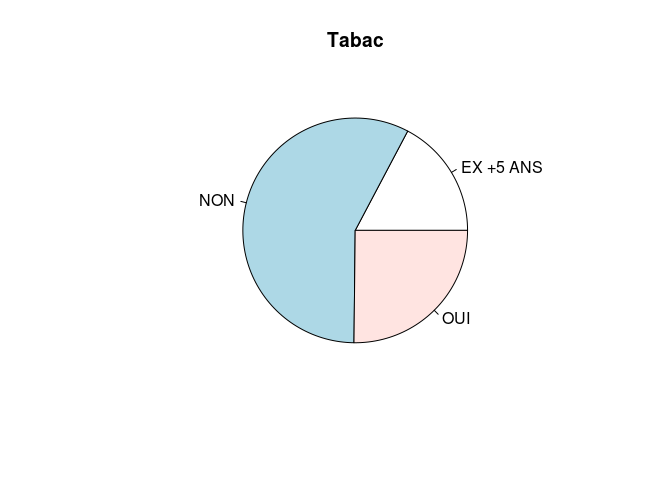

```r
pie(table(info_samples$genre), col=c("pink", "blue"),
    labels = c("Femmes", "Hommes"), main="Pie chart of the gender variable in the sample")
```

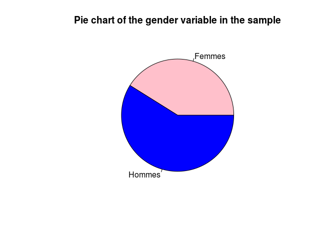

```r
pie(table(info_samples$origine), main="Pie chart of the origine variable in the sample", cex=0.5, clockwise = T)
```

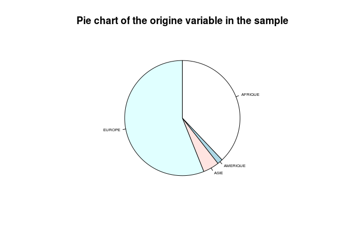

Ceendant, la représentation sous forme de camembert n'est pas recommandée car l'oeil a souvent du mal à comparer des aires différentes.

Une deuxième représentation qui est préférée pour celle des variables qualitatives est celle des diagrammes en bâtons. En ordonnées vous pouvez indiquer l'effectif ou la fréquence dans l'échantillon.


```r
barplot(table(info_samples$origine)/length(info_samples$origine), main="Distribution of the origine variable", ylab="frequency")
```

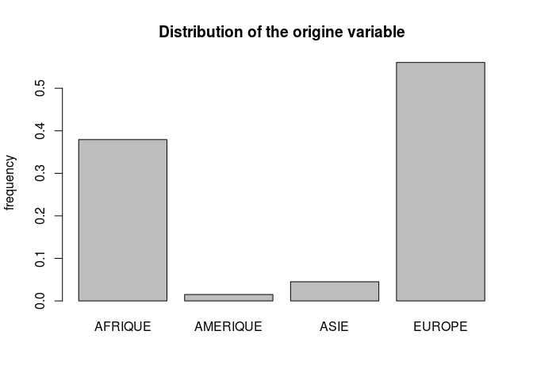


On peut également générer des tableaux de contingence de deux variables qualitatives et les représenter ensemble graphiquement dans des diagrammes en bâtons empilés.


```r
table(info_samples$genre, info_samples$origine)
```

```
   
    AFRIQUE AMERIQUE ASIE EUROPE
  F     293       11   35    373
  M     364       15   43    598
```

```r
barplot(table(info_samples$genre, info_samples$origine), main="Distribution de la variable origine avec la répartition des genres empilée", col = c("pink", "blue") )
```

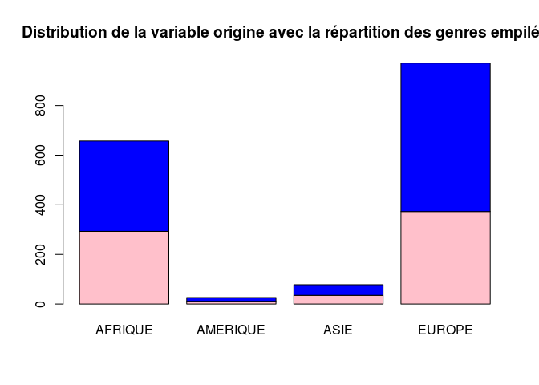

```r
barplot(table(info_samples$origine, info_samples$genre), main="Distribution de la variable genre avec la répartition de l'origine empilée") 
```

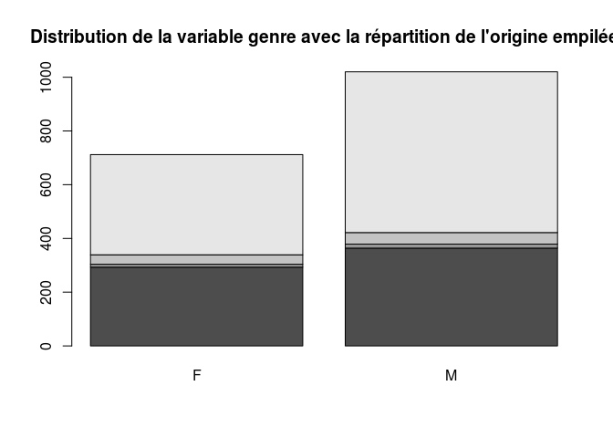

```r
table(info_samples$genre, info_samples$tabac)
```

```
   
    EX +5 ANS NON OUI
  F        67 504 141
  M       232 493 295
```

```r
barplot(table(info_samples$tabac, info_samples$genre)/dim(info_samples)[1], main="Distribution de la variable tabac avec la variable genre empilée", ylim=c(0,1)) 
```

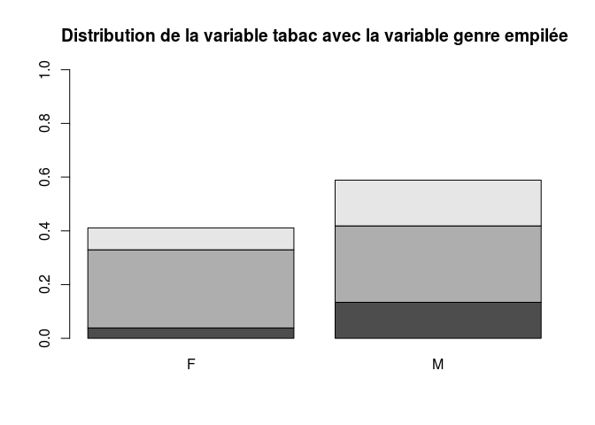

### 2.4 Tests statistiques sur variables qualitatives

On peut effectuer des tests de comparaison des proportions ou des distributions avec un test de Chi2 de Pearson.

Testez à présent si la distribution de la variable `tabac` est indépendante de celle du `genre` par un test de Chi2 à 2 degrés de libertés. L'hypothèse nulle est celle de distributions indépendantes, l'hypothèse alternative celle de variables liées.
Extraire la p-value du test.


```r
chisq.test(info_samples$tabac, info_samples$genre)
```

```

	Pearson's Chi-squared test

data:  info_samples$tabac and info_samples$genre
X-squared = 93.763, df = 2, p-value < 2.2e-16
```

```r
str(chisq.test(info_samples$tabac, info_samples$genre))
```

```
List of 9
 $ statistic: Named num 93.8
  ..- attr(*, "names")= chr "X-squared"
 $ parameter: Named int 2
  ..- attr(*, "names")= chr "df"
 $ p.value  : num 4.36e-21
 $ method   : chr "Pearson's Chi-squared test"
 $ data.name: chr "info_samples$tabac and info_samples$genre"
 $ observed : 'table' int [1:3, 1:2] 67 504 141 232 493 295
  ..- attr(*, "dimnames")=List of 2
  .. ..$ info_samples$tabac: chr [1:3] "EX +5 ANS" "NON" "OUI"
  .. ..$ info_samples$genre: chr [1:2] "F" "M"
 $ expected : num [1:3, 1:2] 123 410 179 176 587 ...
  ..- attr(*, "dimnames")=List of 2
  .. ..$ info_samples$tabac: chr [1:3] "EX +5 ANS" "NON" "OUI"
  .. ..$ info_samples$genre: chr [1:2] "F" "M"
 $ residuals: 'table' num [1:3, 1:2] -5.04 4.65 -2.86 4.21 -3.89 ...
  ..- attr(*, "dimnames")=List of 2
  .. ..$ info_samples$tabac: chr [1:3] "EX +5 ANS" "NON" "OUI"
  .. ..$ info_samples$genre: chr [1:2] "F" "M"
 $ stdres   : 'table' num [1:3, 1:2] -7.23 9.3 -4.3 7.23 -9.3 ...
  ..- attr(*, "dimnames")=List of 2
  .. ..$ info_samples$tabac: chr [1:3] "EX +5 ANS" "NON" "OUI"
  .. ..$ info_samples$genre: chr [1:2] "F" "M"
 - attr(*, "class")= chr "htest"
```

```r
chisq.test(info_samples$tabac, info_samples$genre)$p.value
```

```
[1] 4.361162e-21
```


## 3. Variables quantitatives

### 3.1 Description des variables quantitatives

Le jeu de données comprend 3 variables quantitatives continues: la `taille`, le `poids` et le taux de triglycérides sériques `TG`

Définissez une nouvelle variable `ìmc` correspondant à l'indice de masse corporelle. On rappelle qu'il s'agit du poids en kg divisé par le carré de la taille en m². Arrondissez cette valeur à deux décimales.


```r
info_samples$imc <- round(info_samples$poids/(info_samples$taille/100)^2,2)
```


### 3.2 Distribution des variables quantitatives

Affichez les valeurs de dispersion de ces variables.


```r
summary(info_samples[,5:8])
```

```
     poids            taille            TG              imc       
 Min.   : 36.80   Min.   :138.0   Min.   : 0.099   Min.   :14.02  
 1st Qu.: 68.50   1st Qu.:162.0   1st Qu.: 0.960   1st Qu.:24.17  
 Median : 81.00   Median :169.0   Median : 1.350   Median :28.36  
 Mean   : 82.80   Mean   :168.9   Mean   : 1.746   Mean   :29.06  
 3rd Qu.: 94.83   3rd Qu.:175.0   3rd Qu.: 1.990   3rd Qu.:32.91  
 Max.   :171.00   Max.   :200.0   Max.   :96.000   Max.   :56.93  
```


Il existe plusieurs représentations possibles de ces distributions:

- un histogramme auquel vous pouvez superposer la courbe de densité si vous avez affiché l'axe des ordonnées en fréquences plutôt qu'en effectifs.

- une boîte à moustaches

- des nuages de points à une dimension (`stripcharts`)

Dessinez un histogramme pour chacune des variables taille et poids.

```r
hist(info_samples$taille)
```

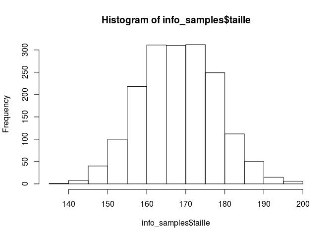

```r
hist(info_samples$poids, freq=F)
lines(density(info_samples$poids), col="red")
```

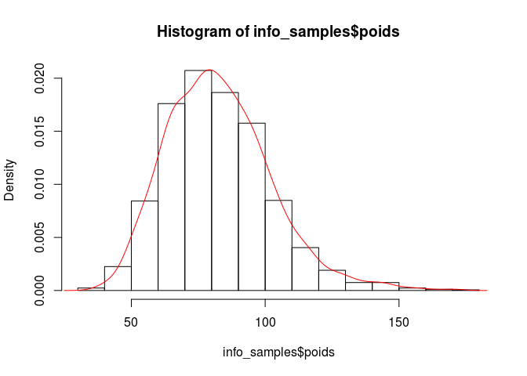

Dessinez ensuite dans une même fenêtre graphique côte à côte les boxplots des variables tailles et poids.


```r
opar <- par() # pour sauvegardez les paramètres graphiques
par(mfrow=c(1,2)) # pour dessiner les deux boxplots sur une ligne et deux colonnes de la fenêtre graphique
boxplot(info_samples$taille, main="taille")
boxplot(info_samples$poids, main="poids")
```

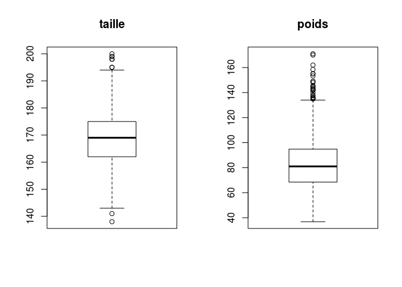

```r
par(opar)# pour restaurer les paramètres graphiques
```

Dans une même fenêtre graphique, dessinez à présent l'un en dessous de l'autre un stripchart horizontal, un histogramme et un boxplot horizontal de la variable `poids`


```r
opar <- par()
par(mfrow=c(3,1))
stripchart(info_samples$poids, vertical = F, axes=F, main="Distribution du poids")
hist(info_samples$poids, freq=F, xlab="", main="")
boxplot(info_samples$poids, horizontal = T, frame.plot=F, xlab="Poids")
```

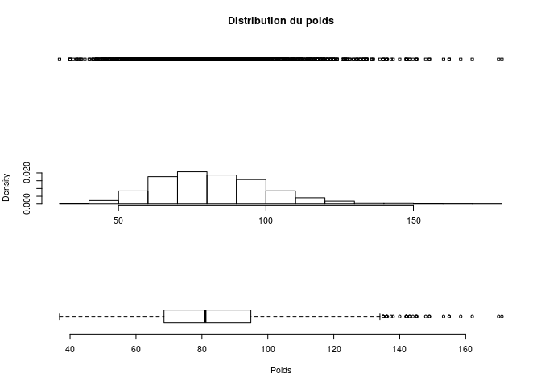

```r
par(opar)
```


__Quelle est l'influence des variables qualitatives sur ces distributions?__

Nous allons explorer l'impact du facteur origine et de celui du genre sur la taille et le poids.
Une première analyse exploratoire consiste à représenter ces distributions selon le facteur considéré.

Dessinez 4 boxplots de ces distributions dans une même fenêtre graphique.


```r
opar <- par()
par(mfrow=c(2,2))
boxplot (info_samples$taille ~ info_samples$origine, xlab="Region", ylab="taille", col = "steelblue3")
boxplot (info_samples$poids ~ info_samples$origine, xlab="Region", ylab="poids", col = "steelblue3")
boxplot(info_samples$taille ~ info_samples$genre, xlab="Genre", ylab="taille", col = "steelblue3")
boxplot(info_samples$poids ~ info_samples$genre, xlab="Genre", ylab="poids", col = "steelblue3")
```

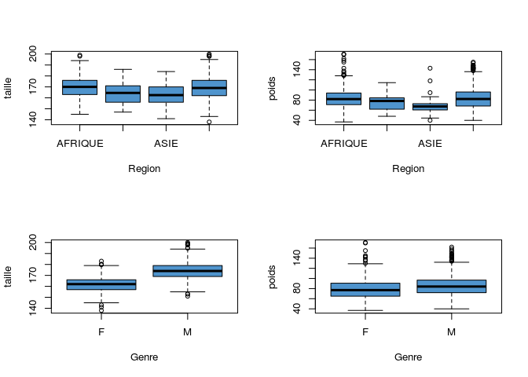

```r
par(opar)
```

### 3.3 Tests statistiques sur des variables quantitatives

#### 3.3.1 Tests de comparaison de 2 moyennes
Après avoir regardé les boxplots ci-dessus, on souhaite tester si le genre a effectivement un impact sur les variables `taille` et `poids`

Une première étape est de calculer les moyennes dans ces échantillons pour estimer les moyennes dans la population.

Commençons par la variable `poids`:


```r
by(info_samples$poids, info_samples$genre, mean)
```

```
info_samples$genre: F
[1] 78.68933
--------------------------------------------------------------------------------------------------------------------------------------------------------------------------------------------------------------------------------- 
info_samples$genre: M
[1] 85.66723
```
Les valeurs entre les échantillons sont différentes: m1≠m2
Cela ne signifie pas que μ1≠μ2

On doit réaliser un test statistique de comparaison de moyennes.

On teste d'abord l'homoscédasticité, cad l'égalité des variances dans les deux groupes.


```r
by(info_samples$poids, info_samples$genre, var)
```

```
info_samples$genre: F
[1] 364.0523
--------------------------------------------------------------------------------------------------------------------------------------------------------------------------------------------------------------------------------- 
info_samples$genre: M
[1] 375.7704
```

```r
var.test(info_samples$poids[info_samples$genre=="F"],info_samples$poids[info_samples$genre=="M"])
```

```

	F test to compare two variances

data:  info_samples$poids[info_samples$genre == "F"] and info_samples$poids[info_samples$genre == "M"]
F = 0.96882, num df = 711, denom df = 1019, p-value = 0.65
alternative hypothesis: true ratio of variances is not equal to 1
95 percent confidence interval:
 0.8467144 1.1103638
sample estimates:
ratio of variances 
         0.9688158 
```
Le test de comparaison des variances ne permet pas de rejeter l'hypothèse nulle de leur égalité.

Nous pouvons donc réaliser un test de Student.


```r
t.test(info_samples$poids ~ info_samples$genre, var.equal=T)
```

```

	Two Sample t-test

data:  info_samples$poids by info_samples$genre
t = -7.4187, df = 1730, p-value = 1.844e-13
alternative hypothesis: true difference in means is not equal to 0
95 percent confidence interval:
 -8.822686 -5.133113
sample estimates:
mean in group F mean in group M 
       78.68933        85.66723 
```

Comparez à présent les moyennes et les variances de la variable `taille` en fonction du genre:


```r
#estimation des moyennes:
by(info_samples$taille, info_samples$genre, mean)
```

```
info_samples$genre: F
[1] 161.6236
--------------------------------------------------------------------------------------------------------------------------------------------------------------------------------------------------------------------------------- 
info_samples$genre: M
[1] 173.9716
```

```r
# comparaison des variances
by(info_samples$taille, info_samples$genre, var)
```

```
info_samples$genre: F
[1] 49.37992
--------------------------------------------------------------------------------------------------------------------------------------------------------------------------------------------------------------------------------- 
info_samples$genre: M
[1] 59.53305
```

```r
var.test(info_samples$taille[info_samples$genre=="F"],info_samples$taille[info_samples$genre=="M"])
```

```

	F test to compare two variances

data:  info_samples$taille[info_samples$genre == "F"] and info_samples$taille[info_samples$genre == "M"]
F = 0.82945, num df = 711, denom df = 1019, p-value = 0.007272
alternative hypothesis: true ratio of variances is not equal to 1
95 percent confidence interval:
 0.7249166 0.9506406
sample estimates:
ratio of variances 
         0.8294539 
```

```r
## l'égalité des variances ne peut être rejetée. On conduit donc un test de Welsh qui est proposé par défaut dans R avec la fonction t.test()

t.test(info_samples$taille ~ info_samples$genre) # le test est significatif avec une p-value < 2.2e-16
```

```

	Welch Two Sample t-test

data:  info_samples$taille by info_samples$genre
t = -34.552, df = 1613.8, p-value < 2.2e-16
alternative hypothesis: true difference in means is not equal to 0
95 percent confidence interval:
 -13.04895 -11.64700
sample estimates:
mean in group F mean in group M 
       161.6236        173.9716 
```

```r
t.test(info_samples$taille ~ info_samples$genre)$p.value # pour extraire la p-value
```

```
[1] 2.723553e-196
```


#### 3.3.2 Tests de comparaison de plus de 2 moyennes

Générons une nouvelle variable aléatoire en discrétisant la variable `imc` pour définir la variable `ìmc_cat` indiquant si les sujets sont maigres (imc < 18.5), de corpulence normale (entre 18.5 et 25), en surpoids (entre 25 et 30) ou obèses (au delà de 30).
Transformez cette variable en facteur à 4 niveaux en attribuant le niveau 1 à une corpulence normale.


```r
info_samples$imc_cat <- NA
info_samples$imc_cat[info_samples$imc<18.5] <- "maigreur"
info_samples$imc_cat[info_samples$imc>=18.5 & info_samples$imc<25] <- "normal"
info_samples$imc_cat[info_samples$imc>=25 & info_samples$imc<30] <- "surpoids"
info_samples$imc_cat[info_samples$imc>=30] <- "obesite"

info_samples$imc_cat <- factor(info_samples$imc_cat, levels=c("normal", "maigreur", "surpoids", "obesite"))
```

Testons à présent si le poids moyen est bien différent entre ces 4 niveaux d'imc_cat.
On procède d'abord à la vérification de l'homoscédasticité.


```r
by(info_samples$poids, info_samples$imc_cat, mean)
```

```
info_samples$imc_cat: normal
[1] 65.2202
--------------------------------------------------------------------------------------------------------------------------------------------------------------------------------------------------------------------------------- 
info_samples$imc_cat: maigreur
[1] 50.13077
--------------------------------------------------------------------------------------------------------------------------------------------------------------------------------------------------------------------------------- 
info_samples$imc_cat: surpoids
[1] 80.23193
--------------------------------------------------------------------------------------------------------------------------------------------------------------------------------------------------------------------------------- 
info_samples$imc_cat: obesite
[1] 99.00958
```

```r
by(info_samples$poids, info_samples$imc_cat, var)
```

```
info_samples$imc_cat: normal
[1] 77.90714
--------------------------------------------------------------------------------------------------------------------------------------------------------------------------------------------------------------------------------- 
info_samples$imc_cat: maigreur
[1] 45.00692
--------------------------------------------------------------------------------------------------------------------------------------------------------------------------------------------------------------------------------- 
info_samples$imc_cat: surpoids
[1] 105.3408
--------------------------------------------------------------------------------------------------------------------------------------------------------------------------------------------------------------------------------- 
info_samples$imc_cat: obesite
[1] 276.1399
```

```r
bartlett.test(poids~imc_cat, data=info_samples)
```

```

	Bartlett test of homogeneity of variances

data:  poids by imc_cat
Bartlett's K-squared = 283.58, df = 3, p-value < 2.2e-16
```

Les variances diffèrent significativement entre les groupes.
On ne peut pas effectuer une analyse paramétrique (ANOVA).
On effectue donc un test non paramétrique de Kruskal-Wallis:


```r
kruskal.test(log(info_samples$TG) ~ info_samples$imc_cat)
```

```

	Kruskal-Wallis rank sum test

data:  log(info_samples$TG) by info_samples$imc_cat
Kruskal-Wallis chi-squared = 92.929, df = 3, p-value < 2.2e-16
```

#### 3.3.3 Tests de corrélation entre deux variables continues

Les variables `taille` et `poids` sont-elles corrélées ?


```r
cor.test(info_samples$taille, info_samples$poids)
```

```

	Pearson's product-moment correlation

data:  info_samples$taille and info_samples$poids
t = 13.809, df = 1730, p-value < 2.2e-16
alternative hypothesis: true correlation is not equal to 0
95 percent confidence interval:
 0.2720314 0.3568991
sample estimates:
     cor 
0.315095 
```

```r
plot(data=info_samples, taille~poids)
abline(lm(data=info_samples, taille~poids), col="red")
```

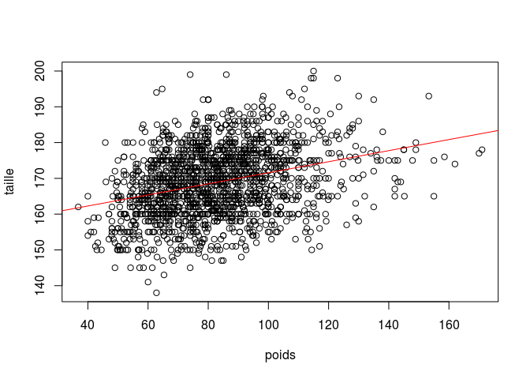

Les variables `poids` et `imc` sont-elles corrélées ?


```r
cor.test(info_samples$poids, info_samples$imc)
```

```

	Pearson's product-moment correlation

data:  info_samples$poids and info_samples$imc
t = 75.488, df = 1730, p-value < 2.2e-16
alternative hypothesis: true correlation is not equal to 0
95 percent confidence interval:
 0.8644082 0.8863841
sample estimates:
      cor 
0.8758494 
```

```r
plot(data=info_samples, poids~imc)
abline(lm(data=info_samples, poids~imc), col="red")
```

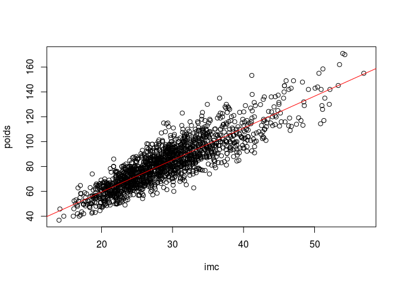


Le taux de triglycérides après transformation logarithmique est-il également corrélé à l'IMC?


```r
cor.test(log(info_samples$TG), info_samples$imc)
```

```

	Pearson's product-moment correlation

data:  log(info_samples$TG) and info_samples$imc
t = 9.8042, df = 1730, p-value < 2.2e-16
alternative hypothesis: true correlation is not equal to 0
95 percent confidence interval:
 0.1843193 0.2735730
sample estimates:
      cor 
0.2294284 
```

```r
plot(data=info_samples, log(TG)~imc)
abline(lm(data=info_samples, log(TG)~imc), col="red")
```

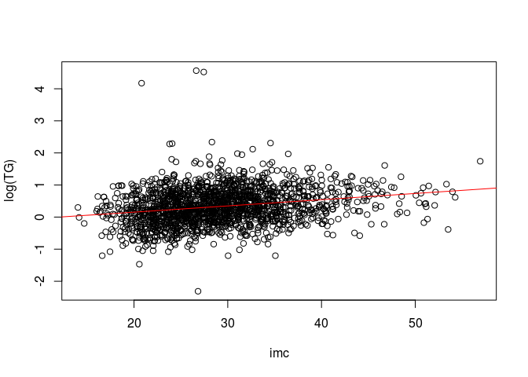

Il y a donc aussi une corrélation positive significative, bien que plus modeste en amplitude.


#### 3.3.4 Tests de régression linéaire entre deux variables

Testons à présent l'impact des modalités d'imc (variable explicative) sur le taux de triglycérides en log (variable expliquée):


```r
summary(lm(log(info_samples$TG) ~ info_samples$imc_cat))
```

```

Call:
lm(formula = log(info_samples$TG) ~ info_samples$imc_cat)

Residuals:
    Min      1Q  Median      3Q     Max 
-2.6477 -0.3707 -0.0316  0.3547  4.2293 

Coefficients:
                             Estimate Std. Error t value Pr(>|t|)    
(Intercept)                   0.16223    0.02487   6.522 9.09e-11 ***
info_samples$imc_catmaigreur -0.02523    0.09161  -0.275    0.783    
info_samples$imc_catsurpoids  0.17283    0.03480   4.967 7.48e-07 ***
info_samples$imc_catobesite   0.29467    0.03252   9.061  < 2e-16 ***
---
Signif. codes:  0 '***' 0.001 '**' 0.01 '*' 0.05 '.' 0.1 ' ' 1

Residual standard error: 0.5506 on 1728 degrees of freedom
Multiple R-squared:  0.04795,	Adjusted R-squared:  0.0463 
F-statistic: 29.01 on 3 and 1728 DF,  p-value: < 2.2e-16
```

On constate un impact significatif du surpoids et de l'obésité sur ce taux de triglycérides!
