```r
## Install required packages
packages <- c("knitr", 
              "FactoMineR", # for PCA
              "aricode",  # for adjusted Rand Index,
              "RColorBrewer", 
              "vegan", 
              "pheatmap",
              "scales", ## to draw plot with semi-transparent points
              "tinytex")
# library(formattable)

for (pkg in packages) {
  if (!require(pkg, character.only = TRUE)) {
    install.packages(pkg)
    require(pkg, character.only = TRUE)
  }
}
```


<!-- ```{r  echo=F} -->
<!-- ## Define data folder -->
<!-- data.folder <- "../../data/TCGA_BIC_subset" -->

<!-- ## File containing subset of the expression table -->
<!-- bic_expr_labels_file <- file.path( -->
<!--   data.folder, -->
<!--   "BIC_log2-norm-counts_edgeR_DEG_top_1000.tsv.gz") -->

<!-- ## Load expression table -->
<!-- message("Loading expression file\t", bic_expr_labels_file) -->
<!-- bic_expr_labels <- read.table(file = bic_expr_labels_file, header = TRUE) -->
<!-- message("Loaded BIC expression table with ", nrow(bic_expr_labels), " rows (genes) x ", ncol(bic_expr_labels), " columns (samples)") -->

<!-- ``` -->

<!-- ```{r, echo = F, eval=FALSE} -->
<!-- ## ANNE: JE RECOMMANDE VRAIMENT D'EVITER CE TRONQUAGE DES NOMS -->
<!-- ## LES BIOLOGISTES N'Y RETROUVENT PAS LEUR LATIN -->
<!-- ## De plus cela génère des messages " duplicate 'row.names' are not allowed" -->
<!-- reduc_name <- function(nom_long) { -->
<!--   temp <- unlist(strsplit(nom_long, split = ""))[11:18] -->
<!--   nom_court <- paste(temp, collapse = "") -->
<!--   return(nom_court) -->
<!-- } -->
<!-- # rownames(bic_expr_labels) <- sapply(rownames(bic_expr_labels), reduc_name) -->
<!-- # colnames(bic_expr_labels) <- sapply(colnames(bic_expr_labels), reduc_name) -->

<!-- ``` -->


## Data reloading

We reload here the memory image saved at the end of the tutorial [Data loading and exploration](https://du-bii.github.io/module-3-Stat-R/stat-R_2021/tutorials/machine-learning_TCGA-BIC/01_data-loading_TCGA-BIC.html).


```r
#### Reload memory image from github repository ####
github_mem_img <- "https://github.com/DU-Bii/module-3-Stat-R/blob/master/stat-R_2021/data/TCGA_BIC_subset/bic_data.Rdata?raw=true"

## Define local destination folder
bic_folder <- "~/m3-stat-R/TCGA-BIC_analysis"
## Create it if required
dir.create(bic_folder, showWarnings = FALSE, recursive = TRUE)

## Define local destination for the memory image
mem_image <- file.path(bic_folder, "bic_data.Rdata")
if (file.exists(mem_image)) {
  message("Memory image already there, skipping download")
} else {
  message("Downloading memory image from\n", github_mem_img)
  download.file(url = github_mem_img, destfile = mem_image)
  message("Local memory image\t", mem_image)
}

## Load the memory image
message("Loading memory image", mem_image)
load(mem_image)
```

# Questions abordées dans ce cours

1. Les données, leurs représentations

    - data BIC issue de la base TCGA
  
2. Comment comparer deux individus

    - notion de distance
  
3. Comment découvrir des "clusters" dans les données ?

    - classification hiérarchique
    - kmeans

4. Comment déterminer le nombre de groupe optimal ?

5. Comment comparer deux classifications ?

# Les données : TCGA (1)

Les données sont issues de la base [Recount2](https://jhubiostatistics.shinyapps.io/recount/). 
Nous avons sélectionné l'étude [**TCGA : The Cancer Genome Atlas**](https://cancergenome.nih.gov/), regroupant des données RNA-seq pour plus de 12.000 patients souffrant de différents types de cancer. Nous nous intéressons ici uniquement aux données **Breast Invasive Cancer** (**BIC**) concernant le cancer du sein.

Les données ont été préparées pour vous, selon la procédure détaillée au cours sur l'analyse différentielle de données RNA-seq.

1. Filtrage des gènes à variance nulle et de ceux contenant trop de zéros.

2. Normalisation (méthode robuste aux outliers)

3. Analyse différentielle multi-groupes (en utilisant le package Bioconductor `edgeR`).

4. Correction des P-valeurs pour tenir compte des tests multiples (nous avons testé ici ~20.000 gènes). Nous estimons le False Discovery Rate (FDR) selon la méthode de Benjamini-Hochberg (fonction R `p.adjust(all.pvalues, method="fdr")`). 

5. Sélection de gènes différentiellement exprimés sur base d'un seuil $\alpha = 0.05$ appliqué au FDR.

# TCGA (2)


|         | Luminal.A.83| Luminal.B.99| Luminal.A.417| Luminal.A.318|
|:--------|------------:|------------:|-------------:|-------------:|
|TSPAN6   |     18.98338|     18.51158|      16.48997|      18.47712|
|DPM1     |     17.94254|     17.06309|      17.85425|      17.20569|
|SCYL3    |     18.95936|     17.00965|      17.47549|      16.82820|
|C1orf112 |     18.31903|     15.89376|      17.18320|      15.71367|
|FGR      |     13.76168|     17.43222|      15.12968|      16.33244|
|CFH      |     16.60954|     20.49160|      18.63168|      19.63751|

Pour des raisons historiques, en analyse transcriptomique les données sont toujours fournies avec

- 1 ligne = 1 gène 
- 1 échantillon biologique = 1 colonne 

Cette convention a été établie en 1997, lors des toutes premières publications sur le transcriptome de la levure. Dans ces études, l'objet d'intérêt (l'"individu") était le gène, et les variables étaient ses mesures d'expression dans les différentes conditions testées.

Pour le prochain TP sur la classification supervisée de tissus cancéreux, on considèrera au contraire que l'"objet" d'intérêt  est l'échantillon prélevé sur le patient, et les variables sont les mesures d'expression des différents gènes chez un patient.


# TCGA (3)

**Classiquement**, en analyse de données, les individus sont les lignes du tableau de données, les colonnes sont les variables. 

Ce qui implique de faire attention, et éventuellement de travailler sur la matrice transposée (fonction `t()` en R) pour utiliser correctement les fonctions classiques.


```r
t(bic_expr_labels[1:6, 1:4])
```

```
               TSPAN6     DPM1    SCYL3 C1orf112      FGR      CFH
Basal.like   16.84036 17.64740 17.93260 17.63825 16.67788 18.04494
Basal.like.1 18.52655 18.14431 16.79884 17.34841 15.56100 17.03132
Basal.like.2 19.14367 17.32173 17.05726 16.02602 17.61965 18.19628
Basal.like.3 17.93844 17.83135 17.37199 16.86000 14.62704 18.53828
```


- 1 ligne = 1 gène = 1 individu = 1 vecteur

- 1 colonne = 1 feature = 1 vecteur

- l'ensemble des données = 1 data.frame


```
[1]  819 1000
```


# Représentons ces données (1)

- extrait des données
  * chaque individu est représenté par un vecteur de mesures
  

```
               TSPAN6     DPM1    SCYL3 C1orf112      FGR
Basal.like   16.84036 17.64740 17.93260 17.63825 16.67788
Basal.like.1 18.52655 18.14431 16.79884 17.34841 15.56100
Basal.like.2 19.14367 17.32173 17.05726 16.02602 17.61965
Basal.like.3 17.93844 17.83135 17.37199 16.86000 14.62704
```

- Comment représenter / visualiser ces données ?
- Dans quel espace de réprésentation ?


# Représentons ces données : un individu à la fois (2)


# Représentons ces données : deux individu à la fois (3)


# Représentons ces données : une variable à la fois (4)

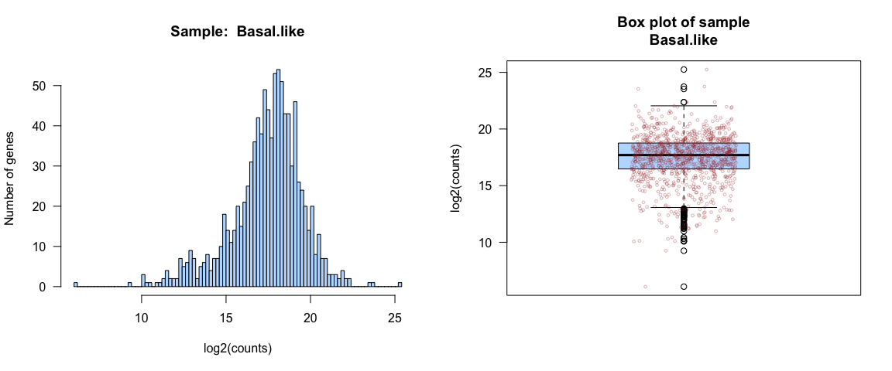

# Représentons ces données : deux variables à la fois (5)

L'intensité des couleurs reflète la densité locale des points


# Représentons ces données : toutes les variables (6)

en tenant compte de l'ensemble des individus/ lignes et variables / colonnes = un nuage de points dans un espace à 1000 dimensions

  - chaque point est représenté par un vecteur dans $\mathbb{R}^{1000}$
  - le nuage de points est représenté par une matrice à n (= 819) et p (= 1000 dimensions)
    + n = nombre de lignes = nombre d'individus = taille de l'échantillon
    + p = nombre de colonnes = nombre de variables décrivant l'échantillon

= PAS de représentation possible (pour l'instant)

# On a cependant

- ACP
- heatmap


# ACP


# heatmap

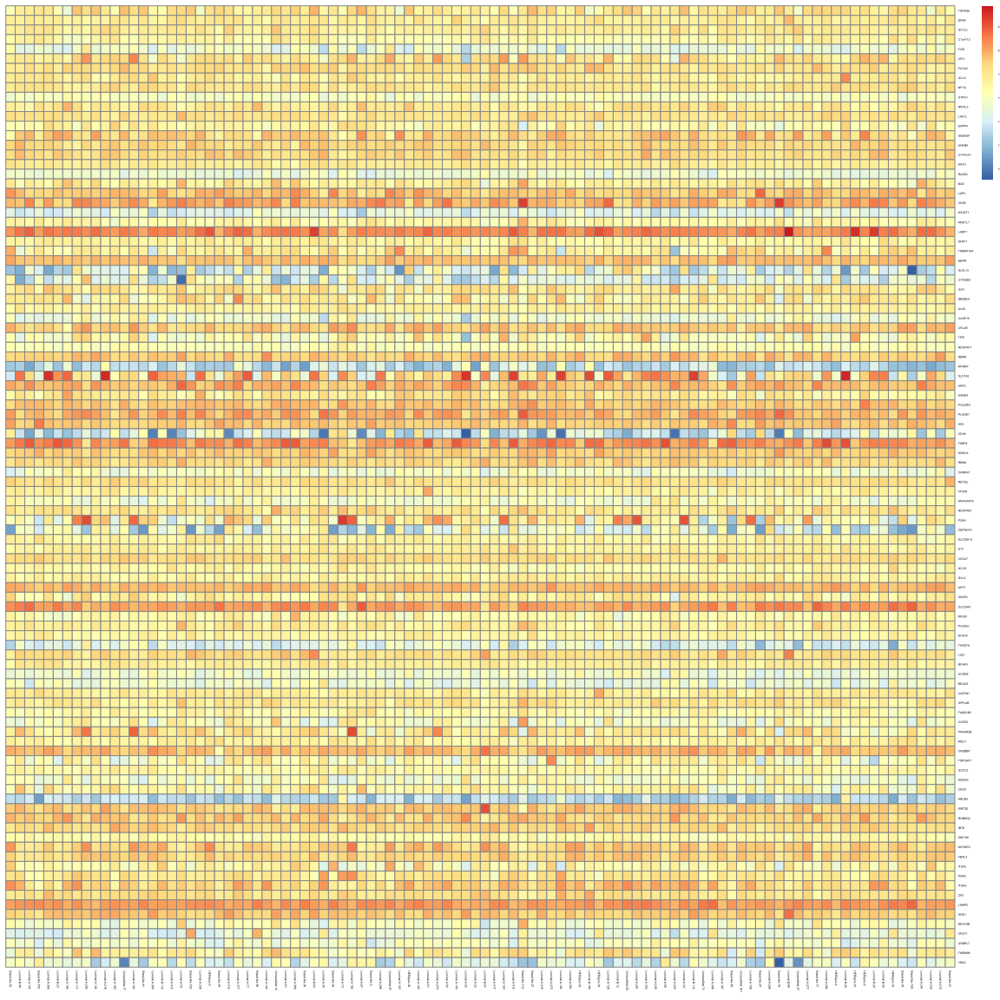

# Clustering et classification : définition

Nous utiliserons les termes anglais

en français :

- clustering = classification non supervisée, découverte de classe
- supervised classification = classement

# Clustering

On n'a **pas d'information** supplémentaire sur nos données, juste le `data.frame` contenant

- variables quantitatives = vecteur de réels
 
**Clustering** : on cherche à mettre en évidence des groupes (/ des clusters) dans les données

- un groupe = 
  * des individus qui se ressemblent et 
  * qui sont différents des autres groupes
  
- le clustering appartient aux méthodes dites **non supervisées**, ou descriptives


# Classification

On a **une information supplémentaire** : on connaît le partitionnement de notre jeu de données

- variables quantitatives = vecteur de réels
- ET
- variable qualitative = groupe (cluster)

**Classification** : on cherche un algorithme / un modèle permettant de prédire la classe, le groupe de tout individu dont on connait les caractéristiques

- la classification appartient aux méthodes dites **supervisées**, ou prédictives

# Clustering


- y a t'il des groupes ? si oui, combien ?

  + Méthode agglomérative ou hierarchical clustering
  + Moyennes mobiles ou K-means : séparation optimale des groupes connaissant le nombre de groupes


# Comment comparer des vecteurs-individus ?


# Distances

Définition d'une distance : fonction positive de deux variables

1. $d(x,y) \ge 0$
2. $d(x,y) = d(y,x)$
3. $d(x,y) = 0 \Longleftrightarrow x = y$
4. **Inégalité triangulaire :** $d(x,z) \le$ d(x,y)+d(y,z)

Si 1,2,3 seulement: dissimilarité

# Distance euclidienne et distance de corrélation

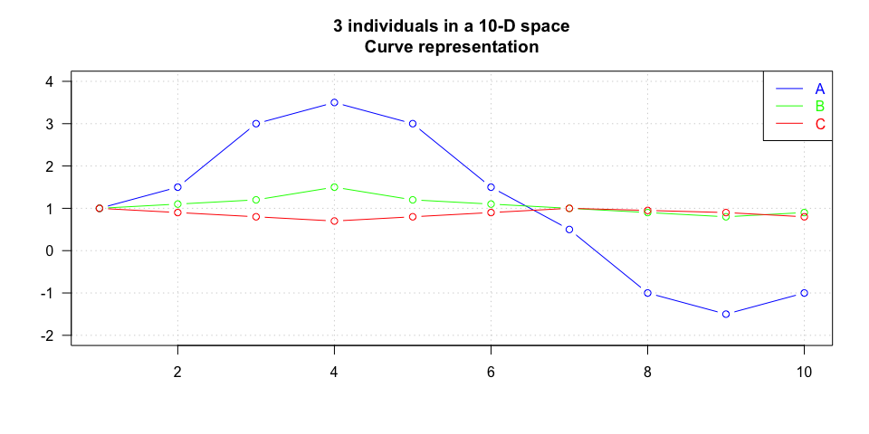


|      | Euclidian distance | Correlation coefficient | Correlation distance |
|:-----|:------------------:|:-----------------------:|:--------------------:|
|A - B |        4.85        |          0.93           |         0.07         |
|A - C |        5.59        |          -0.53          |         1.53         |
|B - C |        1.03        |          -0.67          |         1.67         |

# Avec R (1) : distance entre deux individus 

- on utilise la fonction `dist()` avec l'option `method = "euclidean", "manhattan", ...` 


|   |   t1|   t2|   t3|   t4|   t5|
|:--|----:|----:|----:|----:|----:|
|X  | 2.32| 4.20| 3.43| 4.09| 4.50|
|Y  | 3.43| 2.49| 2.56| 2.04| 2.26|

distance euclidienne : `dist(mat.xy) = ` 3.76

distance de manhattan = `dist(mat.xy, method = "manhattan")` 7.97

- on utilise la fonction `1 - cor()` avec l'option `method = "pearson", "spearman", ...` 

distance de corrélation = `1-cor(t(mat.xy)` 1.91

# Avec R (2) : distance entre individus d'un nuage de points 

- distance euclidienne, de 5 individus choisis au hasard

```
       KLHL13 TFPI SEMA3F GGCT
TFPI       71                 
SEMA3F    132   81            
GGCT      132   82     34     
DHX33      87   44     58   57
```

- distance de corrélation : $d = 1-r$

```
       KLHL13 TFPI SEMA3F GGCT
TFPI     0.57                 
SEMA3F   1.26 1.24            
GGCT     1.25 1.22   0.87     
DHX33    0.85 1.08   1.33 1.15
```

# Avec R (3) : distance entre variables décrivant le nuage de points 


```
             Basal.like Basal.like.1 Basal.like.2 Basal.like.3 Basal.like.4
Basal.like.1      0.300                                                    
Basal.like.2      0.290        0.828                                       
Basal.like.3      0.042        0.277        0.461                          
Basal.like.4      0.645        0.140        1.330        0.547             
Basal.like.5      0.049        0.341        0.218        0.082        0.767
```

# Distances entre groupes (1)

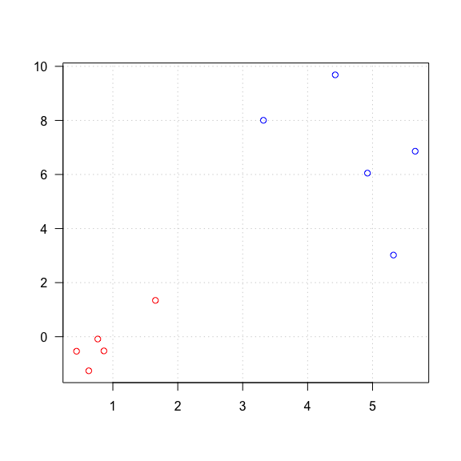


# Distances entre groupes (2)


# Les données

Revenons à nos données


# Visualisation des données (1)

On peut ensuite essayer de visualiser les données

  - par un `plot` (**!** ne pas faire si "grosses" données)
  
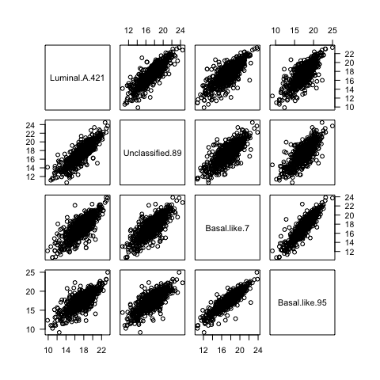


# Visualisation des données (2)

  - par un `boxplot` (**!** ne pas faire si "grosses" données)


```r
boxplot(bic_expr_labels[, sample(1:ncol(bic_expr_labels), 30)], las = 2)
```

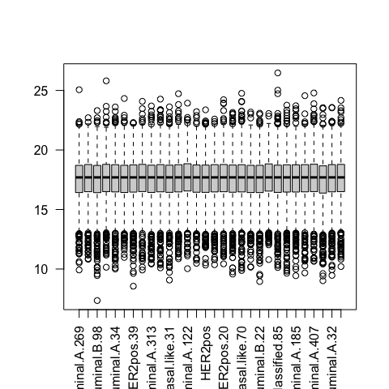


# Préparation des données (1) : variables de variance nulle


```r
BIC.var <- apply(bic_expr_labels, 2, var)
sum(apply(bic_expr_labels, 2, var) == 0)
```

```
[1] 0
```

# Préparation des données (2) : Mise à l'échelle

Afin de pouvoir considérer que toutes les variables sont à la même échelle, il est parfois nécessaire de standardiser les données.

- soit 

  - en centrant (ramener la moyenne / médiane de chaque variable à $0$)
  

```r
bic_expr_labels.centre <- scale(bic_expr_labels, center = TRUE, scale = FALSE)
```

- soit 

  - en centrant (ramener la moyenne de chaque variable $0$)
  - et mettant à l'échelle (ramener la variance de chaque variable à $1$)


```r
bic_expr_labels.scaled <- scale(bic_expr_labels, center = TRUE, scale = TRUE)
```

- soit en effectuant une transformation des variables, par exemple transformation logarithmique

# On peut visuellement regarder l'effet de la standardisation

- par des boîtes à moustaches (boxplot)

# Centrage sur la moyenne ou la médiane

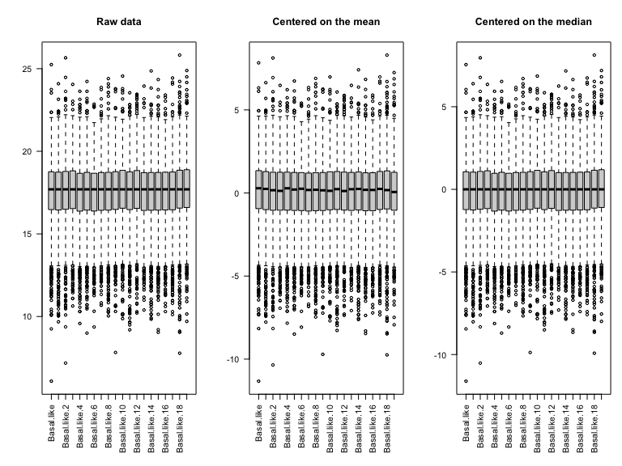

# Mise à l'échelle écart-type ou intervalle interquartile

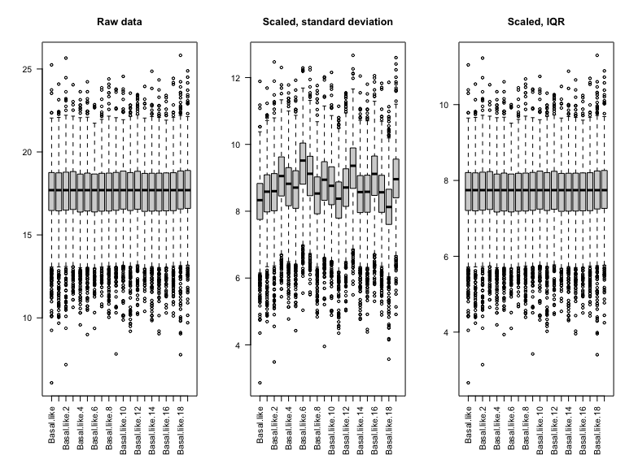

# Standardisation : centrage et mise à l'échelle

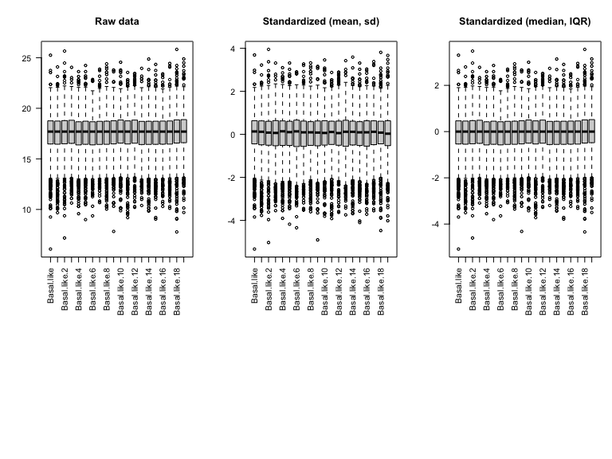


# La classification hiérarchique : principe

**classification hiérarchique** : mettre en évidence des liens hiérachiques entre les individus

- classification hiérarchique **ascendante** : partir des individus pour arriver à des classes / cluster
- classification hiérarchique **descendante** : partir d'un groupe qu'on subdivise en sous-groupes /clusters jusqu'à arriver à des individus.

# Notion importante, cf distances

- ressemblance entre individus = distance

  - euclidienne
  - corrélation
- ressemblance entre groupes d'invidus = critère d'aggrégation

  - lien simple
  - lien complet
  - lien moyen
  - critère de Ward

# L'algorithme : étape 1

- départ : n individus = n clusters distincts
- calcul des distances entre tous les individus

  +  choix de la métrique à utiliser en fonction du type de données

- regroupement des 2 individus les plus proches => (n-1) clusters

# Au départ


# Identification des individus les plus proches


# Construction du dendrogramme


# Etape j :

- calcul des dissemblances entre chaque groupe obtenu à l'étape $(j-1)$

- regroupement des deux groupes les plus proches => $(n-j)$ clusters
  
# Calcul des nouveaux représentants 'BE' et 'CD'


# Calcul des distances de l'individu restant 'A' aux points moyens


# A est plus proche de ...


# dendrogramme


# pour finir


---

- à l'étape $(n-1)$, tous les individus sont regroupés dans un même cluster

# dendrogramme final


# Sur nos données (1) : deux métriques différentes


# Sur nos données (2) : deux critères d'aggrégation différents

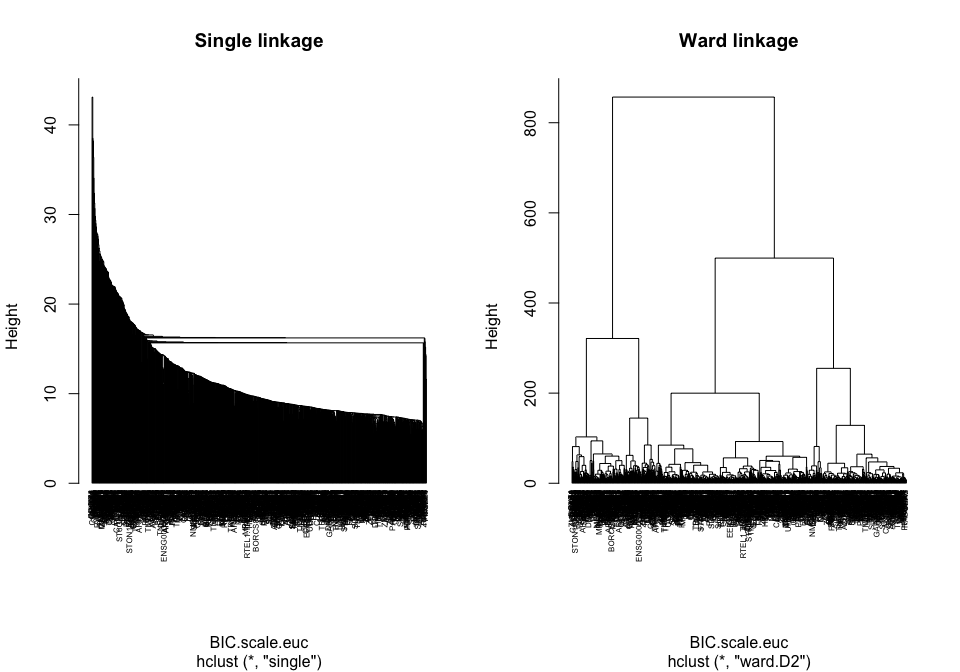

---

# En conclusion

- Faire attention au données

  + données manquantes
  + données invariantes
  + données normalisées
  
- **Choisir** 

  * la distance (entre individus) et 
  * le critère d'aggrégation (entre cluster)
  
adaptés à nos données

# Visualisation à l'aide de heatmap : données brutes


```r
pheatmap::pheatmap(bic_expr_labels, clustering.method = "ward.D2")
```

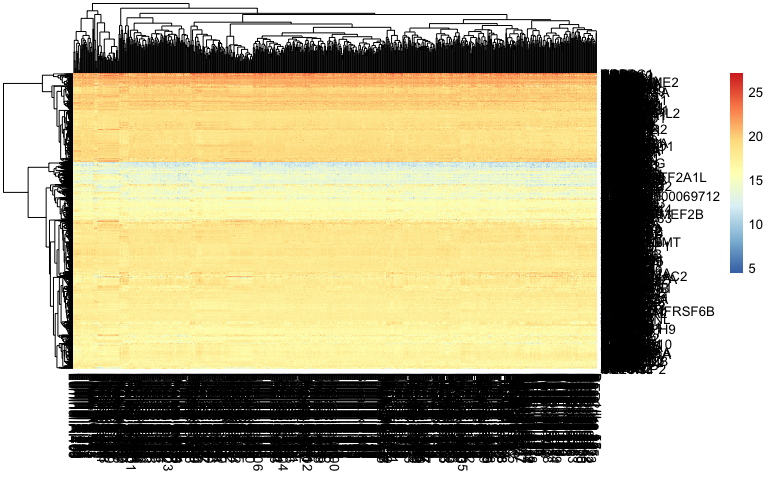

# Visualisation à l'aide de heatmap : données mise à l'échelle


```r
pheatmap::pheatmap(bic_expr_labels.scaled, clustering.method = "ward.D2")
```


# Les k-means

Les individus dans le plan

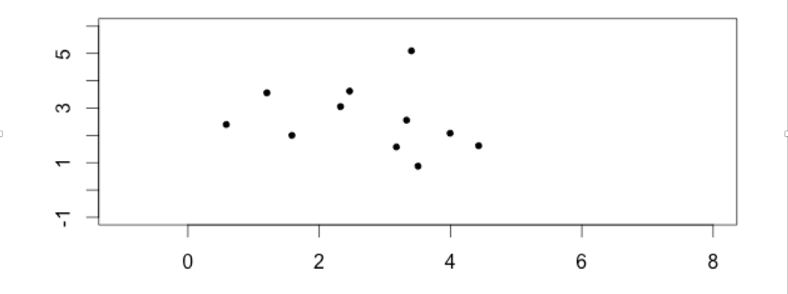

=> faire apparaitres des classes / des clusters

# L'algorithme

## étape 1 :

- $k$ centres provisoires tirés au hasard
- $k$ clusters créés à partir des centres en regroupant les individus les plus proches de chaque centre
- obtention de la partition $P_0$ 

# Choix des centres provisoires 


# Calcul des distances aux centres provisoires 


# Affectation à un cluster


# Calcul des nouveaux centres de classes

## Etape j :

- construction des centres de gravité des k clusters construits à l’étape $(j-1)$

- $k$ nouveaux clusters créés à partir des nouveaux centres suivant la même règle qu’à l’étape $0$

- obtention de la partition $P_j$


# Fin : 

- l’algorithme converge vers une partition stable

## Arrêt : 

- lorsque la partition reste la même, ou lorsque la variance intra-cluster ne décroit plus, ou lorsque le nombre maximal d’itérations est atteint.


# Un premier k-means en 5 groupes


```r
iris.scale.kmeans5 <- kmeans(bic_expr_labels.scaled, center = 5)
iris.scale.kmeans5$cluster[1:20]
```

```
  TSPAN6     DPM1    SCYL3 C1orf112      FGR      CFH    FUCA2     GCLC     NFYA    STPG1   NIPAL3    LAS1L    ENPP4   SEMA3F   ANKIB1  CYP51A1    KRIT1    RAD52      BAD     LAP3 
       5        5        5        5        4        2        2        5        2        4        5        2        5        2        2        2        5        4        5        2 
```

# Comment déterminer le nombre de clusters ? (1)

Ces méthodes non supervisées, sont sans *a priori* sur la structure, le nombre de groupe, des données.

rappel : un cluster est composé

- d'individus qui se ressemblent
- d'individus très différents des individus de ceux des autres clusters


# Comment déterminer le nombre de clusters ? (2)
  
- si les individus d’un même cluster sont proches

  - homogénéité maximale à l’intérieur de chaque cluster => variance intra faible

- si les individus de 2 clusters différents sont éloignés => variance inter forte

  - hétérogénéité maximale entre chaque cluster
    
    
# Comment déterminer le nombre de clusters ? avec la classification hiérarchique

La coupure de l’arbre à un niveau donné construit une partition. la coupure doit se faire :

- après les agrégations correspondant à des valeurs peu élevées de l’indice

- avant les agrégations correspondant à des niveaux élevés de l’indice, qui dissocient les groupes bien distincts dans la population.

---


```r
plot(BIC.scale.hclust.ward, hang = -1, cex = 0.5)
```


# Comment déterminer le nombre de clusters ? avec les kmeans

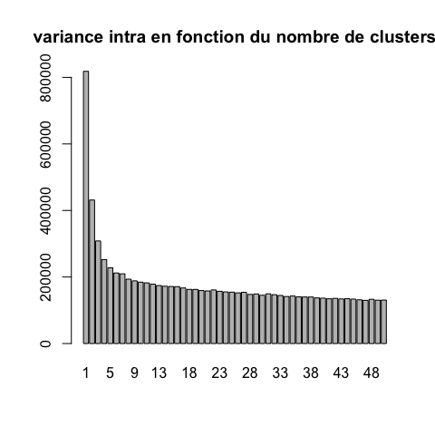

# Comparaison des résultats des deux clustering

- par une table


|   | k1  | k2  | k3 |
|:--|:---:|:---:|:--:|
|c1 | 398 | 57  | 0  |
|c2 | 98  |  0  | 61 |
|c3 |  3  | 293 | 0  |
|c4 |  0  |  0  | 90 |

# Pros et cons des différents algorithmes

| Algorithme | Pros | Cons |
|-------------|------------------------------|------------------------|
| **Hiérarchique** | L'arbre reflète la nature imbriquée de tous les sous-clusters | Complexité quadratique (mémoire et temps de calcul) $\rightarrow$ quadruple chaque fois qu'on double le nombre d'individus  |
| | Permet une visualisation couplée dendrogramme (groupes) + heatmap (profils individuels) | |
| | Choix a posteriori du nombre de clusters | |
| **K-means** | Rapide (linéaire en temps), peut traiter des jeux de données énormes (centaines de milliers de pics ChIP-seq) | Positions initiales des centres est aléatoire $\rightarrow$ résultats changent d'une exécution à l'autre |
| | | Distance euclidienne (pas appropriée pour transcriptome par exemple) |


# Comparaison de clustering: Rand Index

Mesure de similarité entre deux clustering

à partir du nombre de fois que les clustering sont d'accord

$$R=\frac{m+s}{t}$$

- $m$ = nombre de paires dans la même classe dans les deux classifications
- $s$ = nombre de paires séparées dans les deux classifications
- $t$ = nombre total de paires


```r
## Compute Rand index
(RI <- aricode::RI(cluster.hclust4, cluster.kmeans3))
```

```
[1] 0.8153634
```

# Comparaison de clustering: Adjusted Rand Index

$$ \text{ARI} = \frac{\text{RI}-\text{E(RI)}}{\text{Max RI} - \text{E(RI)}}$$

- $\text{ARI}$ = adjusted Rand Index = RI normalisé
- $E(RI)$ = expected RI, espérance aléatoire (en assignant les groupes au hasard)
- Prend en compte la taille des classes
- $\text{ARI}= 1$ pour classification identique
- $\text{ARI} \simeq  0$ pour classification aléatoire (peut être <0)
- Adapté même si les nombres de classes diffèrent entre les deux classifications
- Adapé à des tailles de classes différentes


# Comparaison des résultats des deux classifications

- rand index et adjusted rand index


```r
## Compute adjusted Rand index
(ARI <- aricode::ARI(cluster.hclust4, cluster.kmeans3))
```

```
[1] 0.601469
```

# Supplementary materials

POUR ALLER PLUS LOIN

# Distances utilisées dans R (1)

- distance euclidienne ou distance $L_2$:
  $d(x,y)=\sqrt{\sum_i (x_i-y_i)^2}$
  
- distance de manahattan ou distance $L_1$:
  $d(x,y)=\sum_i |x_i-y_i|$
    
- distance du maximum ou L-infinis, $L_\infty$:
  $d(x,y)=\max_i |x_i-y_i|$
    
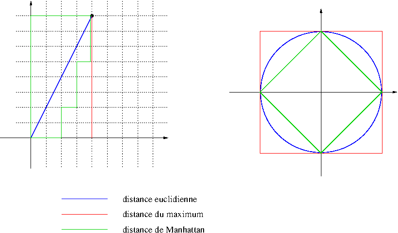


# Distances utilisées dans R (2)

- distance de Minkowski $l_p$:
$$d(x,y)=\sqrt[p]{\sum_i (|x_i-y_i|^p}$$

- distance de Canberra (x et y valeurs positives):
$$d(x,y)=\sum_i \frac{x_i-y_i}{x_i+y_i}$$

- distance binaire ou distance de Jaccard ou Tanimoto: proportion de propriétés communes


  
**Note** : lors du TP, sur les données d'expression RNA-seq, nous utiliserons le **coefficient de corrélation de Spearman** et la distance dérivée, $d_c = 1-r$

# Autres distances non géométriques (pour information)

Utilisées en bio-informatique:

- Distance de **Hamming**: nombre de remplacements de caractères (substitutions)

- Distance de **Levenshtein**: nombre de substitutions, insertions, deletions entre deux chaînes de caractères

$$d("BONJOUR", "BONSOIR")=2$$

- Distance d'**alignements**: distances de Levenshtein avec poids (par ex. matrices BLOSSUM)

- Distances d'**arbre** (Neighbor Joining)

- Distances **ultra-métriques** (phylogénie UPGMA)


# Distances plus classiques en génomique

Il existe d'autres mesures de distances, plus ou moins adaptées à chaque problématique :

- **Jaccard** (comparaison d'ensembles): $J_D = \frac{A \cap B}{A \cup B}$

- Distance du $\chi^2$ (comparaison de tableau d'effectifs)

Ne sont pas des distances, mais indices de dissimilarité :

- **Bray-Curtis** (en écologie, comparaison d'abondance d'espèces)
- **Jensen-Shannon** (comparaison de distributions)
# Distance avec R : indice de Jaccard

- ou pour des distances particulières, par exemple l'indice de Jaccard :

|    |   |   |   |   |   |   |   |
|:---|:-:|:-:|:-:|:-:|:-:|:-:|:-:|
|v.a | 0 | 1 | 0 | 0 | 0 | 0 | 0 |
|v.b | 0 | 1 | 0 | 0 | 0 | 1 | 0 |
|v.c | 0 | 1 | 0 | 0 | 0 | 0 | 0 |

```
          v.a       v.b
v.b 0.3333333          
v.c 0.0000000 0.3333333
```


----

## ... par une projection sur une ACP


```r
par(mfrow = c(1,2))
biplot(prcomp(bic_expr_labels), las = 1, cex = 0.7,
       main = "Données non normalisées")
biplot(prcomp(bic_expr_labels, scale = TRUE), las = 1, cex = 0.7,
       main = "Données normalisées")
```


# Géométrie et distances (1)

On considère les données comme des points de $\mathbb{R}^n$ 

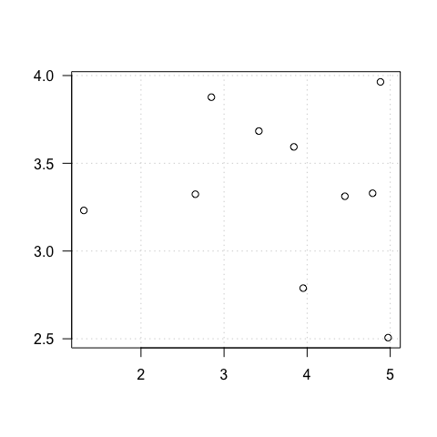

$\mathbb{R}^n$ : espace Euclidien à $n$ dimensions, où 

- chaque dimension représente une des variables observées;
- un individu est décrit comme un vecteur à $n$ valeurs, qui correspond à un point dans cet espace. 

# Géométrie et distances (2)

On considère les données comme des points de $R^n$ (*)

- géométrie donnée par distances
- distances = dissimilarités imposées par le problème
- dissimilarités $\longrightarrow$ permettent la visualisation de l'ensemble des points

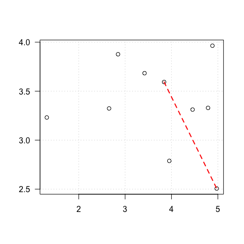

# Géométrie et distances (3)

Sur la base d'une distance

- Clustering :


```r
## Plot distances between 3 points in a 2D Euclidian space
plot(x = 0, y = 0, type = "n", xlim = c(0, 5), ylim = c(0, 5), 
    xlab = "", ylab = "", las = 1, 
     main = "3 individuals in a 2-D space\nDot plot representation",
     panel.first = grid())
points(x = 1, y = 1, col = "blue", pch = 19)
text(x = 1, y = 1, col = "blue", label = "A", pos = 2)
points(x = 2, y = 0, col = "green", pch = 19)
text(x = 2, y = 0, col = "green", label = "B", pos = 4)
points(x = 4, y = 4, col = "red", pch = 19)
text(x = 4, y = 4, col = "red", label = "C", pos = 4)
```


# Distance euclidienne

- distance euclidienne ou distance $L_2$:
  $d(x,y)=\sqrt{\sum_i (x_i-y_i)^2}$

# Distances entre groupes (2)

- **Single linkage** : élements les plus proches des 2 groupes

$$D(C_1,C_2) = \min_{i \in C_1, j \in C_2} D(x_i, x_j)$$
  
- **Complete linkage** : éléments les plus éloignés des 2 groupes

$$D(C_1,C_2) = \max_{i \in C_1, j \in C_2} D(x_i, x_j)$$

- **Average linkage** : distance moyenne

$$D(C_1,C_2) = \frac{1}{N_1 N_2} \sum_{i \in C_1, j \in C_2} D(x_i, x_j)$$
  
- **Ward**

$d^2(C_i,C_j) = I_{intra}(C_i \cup C_j)-I_{intra}(C_i)-I_{intra}(C_j)$

$D(C_1,C_2) = \sqrt{\frac{N_1N_2}{N_1 + N_2}} \| m_1 -m_2 \|$


# La matrice de distance euclidienne


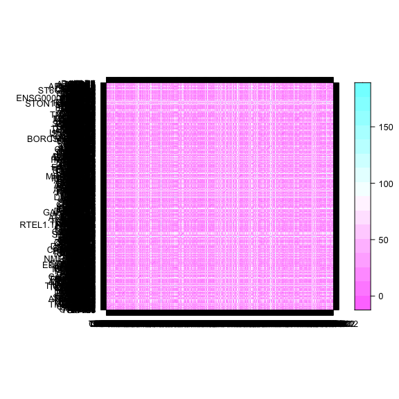

# La matrice de distance de corrélation


# Les heatmap - échelle de couleur standardisée par colonne


```r
pheatmap::pheatmap(bic_expr_labels, scale = "column", clustering.method = "ward.D2")
```


# Les heatmap - échelle de couleur standardisée par ligne


```r
pheatmap::pheatmap(bic_expr_labels, scale = "row", clustering.method = "ward.D2")
```


# Avec R (1) : distance entre deux individus 

- on utilise la fonction `dist()` avec l'option `method = "euclidean", "manhattan", ...` 


|           |   t1|   t2|   t3|   t4|   t5|   SUM|
|:----------|----:|----:|----:|----:|----:|-----:|
|X          | 2.27| 2.73| 1.47| 4.65| 3.27| 14.39|
|Y          | 2.64| 3.99| 3.78| 2.61| 2.02| 15.03|
|abs(Y - X) | 0.37| 1.25| 2.31| 2.04| 1.25|  7.23|
|(Y - X)^2  | 0.14| 1.57| 5.34| 4.18| 1.57| 12.80|
|Eucl       | 0.37| 1.25| 2.31| 2.04| 1.25|  3.58|

distance euclidienne : 3.58

distance de manhattan = 7.23

- on utilise la fonction `1 - cor()` avec l'option `method = "pearson", "spearman", ...` 

distance de corrélation = 1.52

# Je ne fais pas attention à ce que je fais ...

... c'est à dire aux options des fonctions `dist()` et `hclust()`


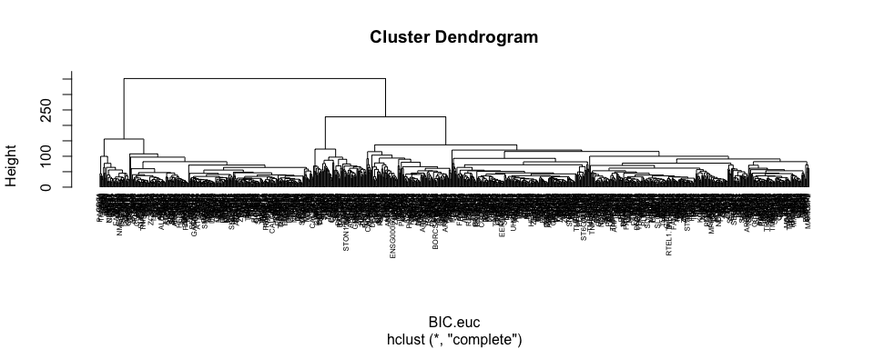


```r
par(mfrow = c(2, 1))
plot(BIC.hclust, hang = -1, cex = 0.5, main = "Données brutes")
plot(BIC.scale.hclust, hang = -1, cex = 0.5, main = "Normalisées")
```

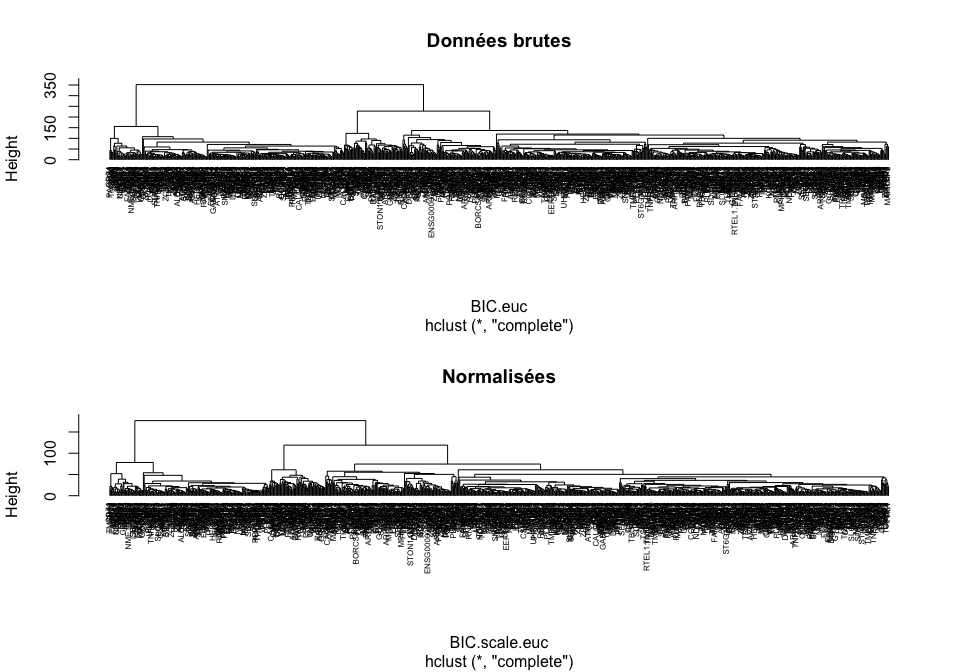

# Supplément : analyse de données d'expression 2019

- TP clustering : 
[[html](TP_clustering.html)]
[[pdf](TP_clustering.pdf)]
[[Rmd](https://raw.githubusercontent.com/DU-Bii/module-3-Stat-R/master/seance_4/TP_clustering.Rmd)]

- Première partie : chargement des données


---
# R environment used for this analysis


```r
## Print the complete list of libraries + versions used in this session
sessionInfo()
```

```
R version 4.0.2 (2020-06-22)
Platform: x86_64-apple-darwin17.0 (64-bit)
Running under: macOS Mojave 10.14.6

Matrix products: default
BLAS:   /Library/Frameworks/R.framework/Versions/4.0/Resources/lib/libRblas.dylib
LAPACK: /Library/Frameworks/R.framework/Versions/4.0/Resources/lib/libRlapack.dylib

locale:
[1] en_US.UTF-8/en_US.UTF-8/en_US.UTF-8/C/en_US.UTF-8/en_US.UTF-8

attached base packages:
[1] stats     graphics  grDevices utils     datasets  methods   base     

other attached packages:
 [1] tinytex_0.30       scales_1.1.1       pheatmap_1.0.12    vegan_2.5-7        lattice_0.20-41    permute_0.9-5      RColorBrewer_1.1-2 aricode_1.0.0      FactoMineR_2.4     knitr_1.31        

loaded via a namespace (and not attached):
 [1] tidyselect_1.1.0     xfun_0.22            bslib_0.2.4          purrr_0.3.4          splines_4.0.2        colorspace_2.0-0     vctrs_0.3.6          generics_0.1.0       htmltools_0.5.1.1    mgcv_1.8-34          yaml_2.2.1           utf8_1.2.1           rlang_0.4.10         jquerylib_0.1.3     
[15] pillar_1.5.1         glue_1.4.2           DBI_1.1.1            lifecycle_1.0.0      stringr_1.4.0        munsell_0.5.0        gtable_0.3.0         htmlwidgets_1.5.3    leaps_3.1            evaluate_0.14        labeling_0.4.2       parallel_4.0.2       fansi_0.4.2          highr_0.8           
[29] Rcpp_1.0.6           KernSmooth_2.23-18   flashClust_1.01-2    DT_0.17              scatterplot3d_0.3-41 jsonlite_1.7.2       farver_2.1.0         ggplot2_3.3.3        digest_0.6.27        stringi_1.5.3        dplyr_1.0.5          ggrepel_0.9.1        grid_4.0.2           tools_4.0.2         
[43] magrittr_2.0.1       sass_0.3.1           tibble_3.1.0         cluster_2.1.1        crayon_1.4.1         pkgconfig_2.0.3      ellipsis_0.3.1       MASS_7.3-53.1        Matrix_1.3-2         assertthat_0.2.1     rmarkdown_2.7        R6_2.5.0             nlme_3.1-152         compiler_4.0.2      
```


---

Contact: <anne.badel@univ-paris-diderot.fr>
