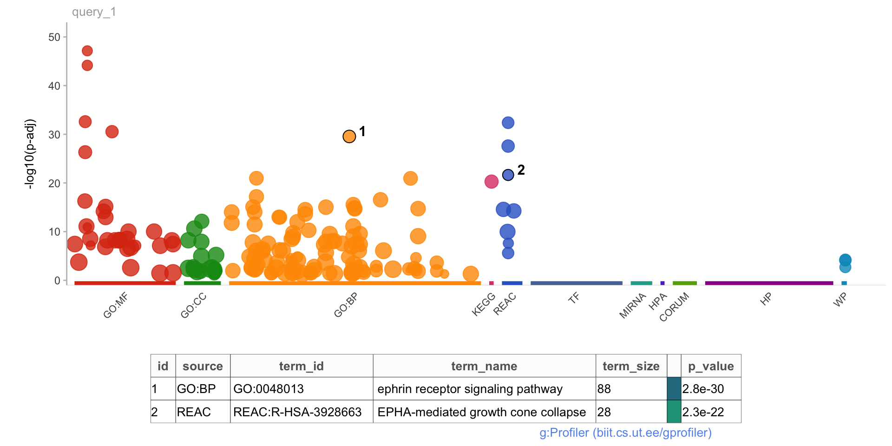
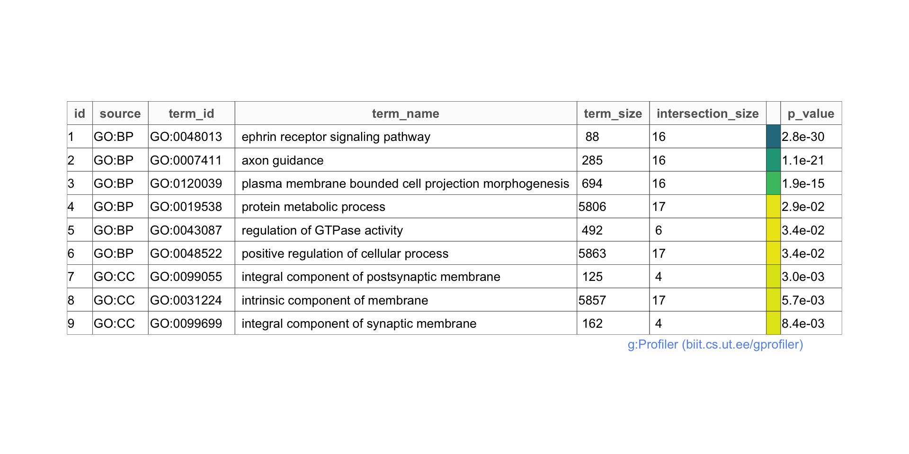
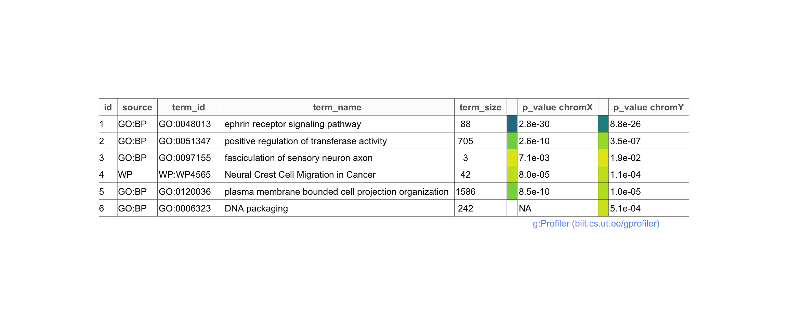

## Goal of this tutorial

This tutorial aims at showing how to use the `gProfiler2` R package. It is more or less a Rmd version of the vignette. You can refer to the vignette and reference manual (links below) for more details.

## References

- R package : <https://cran.r-project.org/web/packages/gprofiler2>

- Reference manual: <https://cran.r-project.org/web/packages/gprofiler2/gprofiler2.pdf>

- Vignette: <https://cran.r-project.org/web/packages/gprofiler2/vignettes/gprofiler2.html>

## g:GOSt - functional enrichment analysis of gene lists

Here is an example in *Homo sapiens* with various types of gene identifiers, a SNP ID, chromosomal intervals and a term ID from the Gene Ontology (*GO*). Parameters are described in the vignette. The result is a named list where "result" is a `data.frame` with the enrichment analysis results and "meta" contains a named list with all the metadata for the query.


```r
## Example of gene list functional enrichment analysis with gost
gostres <- gost(
  query = c("X:1000:1000000", 
            "rs17396340", 
            "GO:0005005",
            "ENSG00000156103", 
            "NLRP1"), 
  organism = "hsapiens", 
  ordered_query = FALSE, 
  multi_query = FALSE, 
  significant = TRUE, 
  exclude_iea = FALSE, 
  measure_underrepresentation = FALSE, 
  evcodes = FALSE, 
  user_threshold = 0.05, 
  correction_method = "g_SCS", 
  domain_scope = "annotated", 
  custom_bg = NULL, 
  numeric_ns = "", 
  sources = NULL, 
  as_short_link = FALSE)

names(gostres)
```

```
[1] "result" "meta"  
```

```r
summary(gostres)
```

```
       Length Class      Mode
result 14     data.frame list
meta    5     -none-     list
```

```r
names(gostres$meta)
```

```
[1] "query_metadata"  "result_metadata" "genes_metadata"  "timestamp"       "version"        
```

```r
# head(gostres$result)
kable(head(gostres$result))
```


|query   |significant | p_value| term_size| query_size| intersection_size| precision|    recall|term_id    |source |term_name                                             | effective_domain_size| source_order|parents                            |
|:-------|:-----------|-------:|---------:|----------:|-----------------:|---------:|---------:|:----------|:------|:-----------------------------------------------------|---------------------:|------------:|:----------------------------------|
|query_1 |TRUE        |       0|        88|         22|                16| 0.7272727| 0.1818182|GO:0048013 |GO:BP  |ephrin receptor signaling pathway                     |                 18092|        14554|GO:0007169                         |
|query_1 |TRUE        |       0|       285|         22|                16| 0.7272727| 0.0561404|GO:0007411 |GO:BP  |axon guidance                                         |                 18092|         3305|GO:0007409, GO:0097485             |
|query_1 |TRUE        |       0|       286|         22|                16| 0.7272727| 0.0559441|GO:0097485 |GO:BP  |neuron projection guidance                            |                 18092|        21970|GO:0006928, GO:0006935, GO:0048812 |
|query_1 |TRUE        |       0|       489|         22|                16| 0.7272727| 0.0327198|GO:0007409 |GO:BP  |axonogenesis                                          |                 18092|         3304|GO:0048667, GO:0048812, GO:0061564 |
|query_1 |TRUE        |       0|       534|         22|                16| 0.7272727| 0.0299625|GO:0061564 |GO:BP  |axon development                                      |                 18092|        18331|GO:0031175                         |
|query_1 |TRUE        |       0|       617|         22|                16| 0.7272727| 0.0259319|GO:0048667 |GO:BP  |cell morphogenesis involved in neuron differentiation |                 18092|        15031|GO:0000904, GO:0048666             |


With the parameter `evcodes = TRUE`, the result will include the evidence codes. In addition, a column "intersection" will appear showing the input gene IDs that intersect with the corresponding functional term. Note that this parameter can decrease the performance and make the query slower.


```r
# Example with intersection (can be time consuming)
gostres2 <- gost(
  query = c("X:1000:1000000", 
            "rs17396340",
            "GO:0005005", 
            "ENSG00000156103", 
            "NLRP1"), 
  organism = "hsapiens", 
  ordered_query = FALSE, 
  multi_query = FALSE, 
  significant = TRUE, 
  exclude_iea = FALSE, 
  measure_underrepresentation = FALSE, 
  evcodes = TRUE, 
  user_threshold = 0.05, 
  correction_method = "g_SCS", 
  domain_scope = "annotated", 
  custom_bg = NULL, 
  numeric_ns = "", sources = NULL)

# head(gostres2$result)
kable(head(gostres2$result))
```


|query   |significant | p_value| term_size| query_size| intersection_size| precision|    recall|term_id    |source |term_name                                             | effective_domain_size| source_order|parents                            |evidence_codes                                                                                                                                                                      |intersection                                                                                                                                                                                                                                                    |
|:-------|:-----------|-------:|---------:|----------:|-----------------:|---------:|---------:|:----------|:------|:-----------------------------------------------------|---------------------:|------------:|:----------------------------------|:-----------------------------------------------------------------------------------------------------------------------------------------------------------------------------------|:---------------------------------------------------------------------------------------------------------------------------------------------------------------------------------------------------------------------------------------------------------------|
|query_1 |TRUE        |       0|        88|         22|                16| 0.7272727| 0.1818182|GO:0048013 |GO:BP  |ephrin receptor signaling pathway                     |                 18092|        14554|GO:0007169                         |IDA TAS IEA,ISS TAS IEA,TAS IEA,IDA IBA TAS,IGI TAS IEA,ISS TAS IEA,IDA TAS IEA,IDA TAS IEA,IGI ISS IBA TAS IEA,ISS TAS IEA,TAS,IDA TAS IEA,IDA TAS,TAS IEA,IDA TAS IEA,IBA TAS IEA |ENSG00000044524,ENSG00000070886,ENSG00000080224,ENSG00000108947,ENSG00000116106,ENSG00000133216,ENSG00000135333,ENSG00000142627,ENSG00000143590,ENSG00000145242,ENSG00000146904,ENSG00000154928,ENSG00000182580,ENSG00000183317,ENSG00000196411,ENSG00000243364 |
|query_1 |TRUE        |       0|       285|         22|                16| 0.7272727| 0.0561404|GO:0007411 |GO:BP  |axon guidance                                         |                 18092|         3305|GO:0007409, GO:0097485             |IBA,ISS IBA IEA,IBA,IBA IEA,ISS IBA IEA,ISS IBA IEA,IBA IEA,IBA,IBA,ISS IBA IEA,IBA,ISS IBA IEA,ISS IBA IEA,IBA,IBA,IBA                                                             |ENSG00000044524,ENSG00000070886,ENSG00000080224,ENSG00000108947,ENSG00000116106,ENSG00000133216,ENSG00000135333,ENSG00000142627,ENSG00000143590,ENSG00000145242,ENSG00000146904,ENSG00000154928,ENSG00000182580,ENSG00000183317,ENSG00000196411,ENSG00000243364 |
|query_1 |TRUE        |       0|       286|         22|                16| 0.7272727| 0.0559441|GO:0097485 |GO:BP  |neuron projection guidance                            |                 18092|        21970|GO:0006928, GO:0006935, GO:0048812 |IBA,ISS IBA IEA,IBA,IBA IEA,ISS IBA IEA,ISS IBA IEA,IBA IEA,IBA,IBA,ISS IBA IEA,IBA,ISS IBA IEA,ISS IBA IEA,IBA,IBA,IBA                                                             |ENSG00000044524,ENSG00000070886,ENSG00000080224,ENSG00000108947,ENSG00000116106,ENSG00000133216,ENSG00000135333,ENSG00000142627,ENSG00000143590,ENSG00000145242,ENSG00000146904,ENSG00000154928,ENSG00000182580,ENSG00000183317,ENSG00000196411,ENSG00000243364 |
|query_1 |TRUE        |       0|       489|         22|                16| 0.7272727| 0.0327198|GO:0007409 |GO:BP  |axonogenesis                                          |                 18092|         3304|GO:0048667, GO:0048812, GO:0061564 |IBA,ISS IBA IEA,IBA,ISS IBA IEA,ISS IBA IEA,ISS IBA IEA,IBA IEA,IBA,IBA,ISS IBA IEA,IBA,ISS IBA IEA,ISS IBA IEA,IBA,IBA,IBA                                                         |ENSG00000044524,ENSG00000070886,ENSG00000080224,ENSG00000108947,ENSG00000116106,ENSG00000133216,ENSG00000135333,ENSG00000142627,ENSG00000143590,ENSG00000145242,ENSG00000146904,ENSG00000154928,ENSG00000182580,ENSG00000183317,ENSG00000196411,ENSG00000243364 |
|query_1 |TRUE        |       0|       534|         22|                16| 0.7272727| 0.0299625|GO:0061564 |GO:BP  |axon development                                      |                 18092|        18331|GO:0031175                         |ISS IBA,ISS IBA IEA,IBA,ISS IBA IEA,ISS IBA IEA,ISS IBA IEA,IBA IEA,IBA,IBA,ISS IBA IEA,IBA,ISS IBA IEA,ISS IBA IEA,IBA,IBA,IBA                                                     |ENSG00000044524,ENSG00000070886,ENSG00000080224,ENSG00000108947,ENSG00000116106,ENSG00000133216,ENSG00000135333,ENSG00000142627,ENSG00000143590,ENSG00000145242,ENSG00000146904,ENSG00000154928,ENSG00000182580,ENSG00000183317,ENSG00000196411,ENSG00000243364 |
|query_1 |TRUE        |       0|       617|         22|                16| 0.7272727| 0.0259319|GO:0048667 |GO:BP  |cell morphogenesis involved in neuron differentiation |                 18092|        15031|GO:0000904, GO:0048666             |IBA,ISS IBA IEA,IBA,ISS IBA IEA,ISS IBA IEA,ISS IBA IEA,IBA IEA,IBA,IBA,ISS IBA IEA,IBA,ISS IBA IEA,ISS IBA IEA,IBA,IBA,IBA                                                         |ENSG00000044524,ENSG00000070886,ENSG00000080224,ENSG00000108947,ENSG00000116106,ENSG00000133216,ENSG00000135333,ENSG00000142627,ENSG00000143590,ENSG00000145242,ENSG00000146904,ENSG00000154928,ENSG00000182580,ENSG00000183317,ENSG00000196411,ENSG00000243364 |


The query results can also be gathered into a short-link to the `g:Profiler` web tool.


```r
# Get a web link
gostres_link <- gost(
  query = c("X:1000:1000000", 
            "rs17396340", 
            "GO:0005005", 
            "ENSG00000156103", 
            "NLRP1"), 
  as_short_link = TRUE)
gostres_link
```

```
[1] "https://biit.cs.ut.ee/gplink/l/b_zgbFBdQR"
```


The function `gost` also allows to perform enrichment on multiple input gene lists. If the parameter `multiquery = TRUE` is used, then the results from all of the input queries are grouped according to term IDs for better comparison.


```r
# Multiple gene lists
multi_gostres1 <- gost(
  query = list("chromX" = c("X:1000:1000000", 
                            "rs17396340", 
                            "GO:0005005", 
                            "ENSG00000156103", 
                            "NLRP1"),
               "chromY" = c("Y:1:10000000", 
                            "rs17396340", 
                            "GO:0005005", 
                            "ENSG00000156103", 
                            "NLRP1")), 
  multi_query = FALSE)

# head(multi_gostres1$result)
kable(head(multi_gostres1$result))
```


|query  |significant | p_value| term_size| query_size| intersection_size| precision|    recall|term_id    |source |term_name                                             | effective_domain_size| source_order|parents                            |
|:------|:-----------|-------:|---------:|----------:|-----------------:|---------:|---------:|:----------|:------|:-----------------------------------------------------|---------------------:|------------:|:----------------------------------|
|chromX |TRUE        |       0|        88|         22|                16| 0.7272727| 0.1818182|GO:0048013 |GO:BP  |ephrin receptor signaling pathway                     |                 18092|        14554|GO:0007169                         |
|chromX |TRUE        |       0|       285|         22|                16| 0.7272727| 0.0561404|GO:0007411 |GO:BP  |axon guidance                                         |                 18092|         3305|GO:0007409, GO:0097485             |
|chromX |TRUE        |       0|       286|         22|                16| 0.7272727| 0.0559441|GO:0097485 |GO:BP  |neuron projection guidance                            |                 18092|        21970|GO:0006928, GO:0006935, GO:0048812 |
|chromX |TRUE        |       0|       489|         22|                16| 0.7272727| 0.0327198|GO:0007409 |GO:BP  |axonogenesis                                          |                 18092|         3304|GO:0048667, GO:0048812, GO:0061564 |
|chromX |TRUE        |       0|       534|         22|                16| 0.7272727| 0.0299625|GO:0061564 |GO:BP  |axon development                                      |                 18092|        18331|GO:0031175                         |
|chromX |TRUE        |       0|       617|         22|                16| 0.7272727| 0.0259319|GO:0048667 |GO:BP  |cell morphogenesis involved in neuron differentiation |                 18092|        15031|GO:0000904, GO:0048666             |

```r
multi_gostres2 <- gost(
  query = list("chromX" = c("X:1000:1000000", 
                            "rs17396340",
                            "GO:0005005", 
                            "ENSG00000156103", "NLRP1"),
               "chromY" = c("Y:1:10000000", 
                            "rs17396340", 
                            "GO:0005005", 
                            "ENSG00000156103", "NLRP1")), 
  multi_query = TRUE)

# head(multi_gostres2$result)
kable(head(multi_gostres2$result))
```


|term_id            |p_values                   |significant | term_size|query_sizes |intersection_sizes |source |term_name                                               | effective_domain_size| source_order|parents                |
|:------------------|:--------------------------|:-----------|---------:|:-----------|:------------------|:------|:-------------------------------------------------------|---------------------:|------------:|:----------------------|
|GO:0005005         |7.162616e-48, 4.090780e-44 |TRUE, TRUE  |        16|23, 33      |16, 16             |GO:MF  |transmembrane-ephrin receptor activity                  |                 18694|         1548|GO:0005003             |
|GO:0005003         |6.933232e-45, 3.953788e-41 |TRUE, TRUE  |        19|23, 33      |16, 16             |GO:MF  |ephrin receptor activity                                |                 18694|         1546|GO:0004714             |
|GO:0004714         |2.581144e-33, 1.439607e-29 |TRUE, TRUE  |        63|23, 33      |16, 16             |GO:MF  |transmembrane receptor protein tyrosine kinase activity |                 18694|         1295|GO:0004713, GO:0019199 |
|REAC:R-HSA-3928665 |4.164481e-33, 1.836785e-32 |TRUE, TRUE  |        49|20, 21      |16, 16             |REAC   |EPH-ephrin mediated repulsion of cells                  |                 10531|          747|REAC:R-HSA-2682334     |
|GO:0019199         |2.920627e-31, 1.613380e-27 |TRUE, TRUE  |        82|23, 33      |16, 16             |GO:MF  |transmembrane receptor protein kinase activity          |                 18694|         4539|GO:0004672, GO:0004888 |
|GO:0048013         |2.813706e-30, 8.827603e-26 |TRUE, TRUE  |        88|22, 34      |16, 16             |GO:BP  |ephrin receptor signaling pathway                       |                 18092|        14554|GO:0007169             |


The enrichment results can be visualized with a Manhattan-like-plot.


```r
# Visualization
gostplot(gostres, capped = TRUE, interactive = TRUE)
```

<!--html_preserve--><div id="htmlwidget-200ebceba400e106da95" style="width:672px;height:480px;" class="plotly html-widget"></div>
<script type="application/json" data-for="htmlwidget-200ebceba400e106da95">{"x":{"data":[{"x":[72.4519715764462,48.6315618718681,88.1557815479238,48.6294443138892,80.4499880627287,73.4620467323786,47.7570104265849,66.4508122642607,73.7521521754871,90.0764066347806,73.8474422845373,61.1505646430892,48.174169348427,42.2937108410385,61.1484470851103,54.4061424803119,54.5988402563913,59.1050036354776,42.2894757250807,48.1699342324692,73.4599291743997,62.052644342098,58.0758704577351,75.2026793910294,67.4312416084886,90.0742890768017,73.5276910297243,57.9615223268749,57.6820046736609,68.502725945809,67.9966295888533,66.4486947062818,47.7421875207327,70.658399968323,51.6575522237076,74.2180149308438,75.1836213692194,65.9997724147563,73.1168847818189,50.1900845443341,54.5586066547923,55.4098649623077,74.8977510420687,81.2080738191727,50.0969119932627,48.6125038500581,66.444459590324,49.0953070692459,46.8528131695972,59.1706479328233,72.1576310173799,89.5321942342048,48.6357969878259,57.5634214268428,48.1678166744903,50.5987732342606,59.1981761865489,57.5697741007795,66.344934365316,94.8663227830387,53.9275743770819,73.5954528850489,49.093189511267,79.363680819556,63.4375272602946,75.1793862532616,87.7788562276806,74.1862515611603,47.5007859111387,47.4944332372021,48.3795724723797,89.0938597325738,53.6480567238679,58.0462246460306,87.6772134446937,57.5676565428006,83.6517357268163,73.8686178643262,48.1445235367225,57.8048230364367,89.527959118247,89.208207863434,87.7767386697017,63.5116417895559,74.2476607425483,79.3615632615772,42.583816284147,73.8432071685795,94.8705578989965,74.2391905106327,76.1280522278061,90.0721715188228,59.236292230169,62.5650933729903,73.1909993110802,76.1216995538694,52.4622242556873,73.1825290791646,62.5672109309692,56.0387796820392,67.4354767244464,73.1994695429958,58.0483422040095,57.7900001305845,56.8921555475334,52.4664593716451,60.3628330749406,68.6509550043315,103.597014330018,96.8441219353256,73.754269733466],"y":[17,17,17,17,17,15.545691865792,15.0674828871059,15.0256394927069,14.8709935620165,14.7297821330642,14.6899723889561,14.5040174172236,14.0288366712376,14.0198464309152,13.6357195644224,12.9949482820347,12.9509262948021,11.982428772163,11.7929907754276,11.4662822039438,11.1083058253197,10.2776391623188,9.70190358849521,9.59012978208307,9.51704909966971,9.07242959342922,9.01735468625525,8.90030155356678,8.5182776335496,8.05881565751871,8.05570510491676,7.97964396943604,7.77015488453055,7.56116336893841,7.56116336893841,7.49893248830289,7.41835792688717,7.33485070141894,7.00021628505517,6.33067163188047,6.18506362609947,6.12643498830833,6.12295439085671,6.08056409529139,6.02885721977512,6.02075349824326,5.65914942148333,5.25488591106657,4.85468830683321,4.79234441568347,4.78638903968841,4.62291192575461,4.62291192575461,4.39649721285585,4.34362211130981,4.26267144243935,4.11195604941387,3.80444624386381,3.74587402224965,3.62756105620722,3.55740930506319,3.28738907438601,3.28402626460819,2.89480930139568,2.79035529595693,2.71036183904354,2.62845842753173,2.62558474322695,2.61421061880104,2.56706240208539,2.5415319005927,2.53720863901372,2.49852996330804,2.35609073081716,2.34771524711636,2.28517971453973,2.28198883749159,2.24856421724677,2.21347653104607,2.19508046734129,2.16669075249224,2.15165738995609,2.15165738995609,2.10811984104393,2.03558916089956,1.98612745916364,1.97970554723418,1.96008295227247,1.93555690564376,1.9319725706006,1.88647568300873,1.8683538535764,1.79523839970127,1.69797198772328,1.67850308628356,1.64359710959434,1.62753123071632,1.57569648649679,1.54854975695656,1.53560730768139,1.47275878948353,1.47259620081052,1.46504555926867,1.45704299480401,1.45364793946706,1.40086146146547,1.38638142412608,1.36410608011699,1.32217515142019,1.30784005584593,1.3074270227276],"text":["GO:0048013 (88) <br> ephrin receptor signaling pathway <br> 2.814e-30","GO:0007411 (285) <br> axon guidance <br> 1.077e-21","GO:0097485 (286) <br> neuron projection guidance <br> 1.141e-21","GO:0007409 (489) <br> axonogenesis <br> 6.824e-18","GO:0061564 (534) <br> axon development <br> 2.810e-17","GO:0048667 (617) <br> cell morphogenesis involved in neuron differentiation <br> 2.846e-16","GO:0006935 (661) <br> chemotaxis <br> 8.561e-16","GO:0042330 (665) <br> taxis <br> 9.427e-16","GO:0048812 (680) <br> neuron projection morphogenesis <br> 1.346e-15","GO:0120039 (694) <br> plasma membrane bounded cell projection morphogenesis <br> 1.863e-15","GO:0048858 (698) <br> cell projection morphogenesis <br> 2.042e-15","GO:0032990 (717) <br> cell part morphogenesis <br> 3.133e-15","GO:0007169 (768) <br> transmembrane receptor protein tyrosine kinase signaling pathway <br> 9.358e-15","GO:0000904 (769) <br> cell morphogenesis involved in differentiation <br> 9.553e-15","GO:0032989 (813) <br> cellular component morphogenesis <br> 2.314e-14","GO:0018108 (384) <br> peptidyl-tyrosine phosphorylation <br> 1.012e-13","GO:0018212 (387) <br> peptidyl-tyrosine modification <br> 1.120e-13","GO:0031175 (1034) <br> neuron projection development <br> 1.041e-12","GO:0000902 (1063) <br> cell morphogenesis <br> 1.611e-12","GO:0007167 (1115) <br> enzyme linked receptor protein signaling pathway <br> 3.418e-12","GO:0048666 (1175) <br> neuron development <br> 7.793e-12","GO:0033674 (623) <br> positive regulation of kinase activity <br> 5.277e-11","GO:0030182 (1445) <br> neuron differentiation <br> 1.987e-10","GO:0051347 (705) <br> positive regulation of transferase activity <br> 2.570e-10","GO:0043085 (1485) <br> positive regulation of catalytic activity <br> 3.041e-10","GO:0120036 (1586) <br> plasma membrane bounded cell projection organization <br> 8.464e-10","GO:0048699 (1599) <br> generation of neurons <br> 9.608e-10","GO:0030030 (1627) <br> cell projection organization <br> 1.258e-09","GO:0022008 (1722) <br> neurogenesis <br> 3.032e-09","GO:0044093 (1844) <br> positive regulation of molecular function <br> 8.733e-09","GO:0043549 (931) <br> regulation of kinase activity <br> 8.796e-09","GO:0042327 (944) <br> positive regulation of phosphorylation <br> 1.048e-08","GO:0006928 (2337) <br> movement of cell or subcellular component <br> 1.698e-08","GO:0045937 (1019) <br> positive regulation of phosphate metabolic process <br> 2.747e-08","GO:0010562 (1019) <br> positive regulation of phosphorus metabolic process <br> 2.747e-08","GO:0050790 (2428) <br> regulation of catalytic activity <br> 3.170e-08","GO:0051338 (1046) <br> regulation of transferase activity <br> 3.816e-08","GO:0040011 (2055) <br> locomotion <br> 4.625e-08","GO:0048468 (2161) <br> cell development <br> 9.995e-08","GO:0009653 (2865) <br> anatomical structure morphogenesis <br> 4.670e-07","GO:0018193 (1313) <br> peptidyl-amino acid modification <br> 6.530e-07","GO:0019220 (1660) <br> regulation of phosphate metabolic process <br> 7.474e-07","GO:0051174 (1661) <br> regulation of phosphorus metabolic process <br> 7.534e-07","GO:0065009 (2969) <br> regulation of molecular function <br> 8.307e-07","GO:0009605 (2991) <br> response to external stimulus <br> 9.357e-07","GO:0007399 (2506) <br> nervous system development <br> 9.533e-07","GO:0042325 (1448) <br> regulation of phosphorylation <br> 2.192e-06","GO:0008038 (50) <br> neuron recognition <br> 5.561e-06","GO:0006468 (1684) <br> protein phosphorylation <br> 1.397e-05","GO:0031290 (21) <br> retinal ganglion cell axon guidance <br> 1.613e-05","GO:0046777 (241) <br> protein autophosphorylation <br> 1.635e-05","GO:0106030 (23) <br> neuron projection fasciculation <br> 2.383e-05","GO:0007413 (23) <br> axonal fasciculation <br> 2.383e-05","GO:0021952 (26) <br> central nervous system projection neuron axonogenesis <br> 4.013e-05","GO:0007166 (3242) <br> cell surface receptor signaling pathway <br> 4.533e-05","GO:0009893 (3859) <br> positive regulation of metabolic process <br> 5.462e-05","GO:0031325 (3361) <br> positive regulation of cellular metabolic process <br> 7.728e-05","GO:0021955 (36) <br> central nervous system neuron axonogenesis <br> 1.569e-04","GO:0042221 (4834) <br> response to chemical <br> 1.795e-04","GO:1901888 (209) <br> regulation of cell junction assembly <br> 2.357e-04","GO:0016310 (2157) <br> phosphorylation <br> 2.771e-04","GO:0048731 (5151) <br> system development <br> 5.160e-04","GO:0008037 (239) <br> cell recognition <br> 5.200e-04","GO:0060997 (60) <br> dendritic spine morphogenesis <br> 1.274e-03","GO:0035239 (975) <br> tube morphogenesis <br> 1.620e-03","GO:0051336 (1318) <br> regulation of hydrolase activity <br> 1.948e-03","GO:0097156 (2) <br> fasciculation of motor neuron axon <br> 2.353e-03","GO:0050770 (166) <br> regulation of axonogenesis <br> 2.368e-03","GO:0006796 (3098) <br> phosphate-containing compound metabolic process <br> 2.431e-03","GO:0006793 (3125) <br> phosphorus metabolic process <br> 2.710e-03","GO:0007275 (5718) <br> multicellular organism development <br> 2.874e-03","GO:0099173 (173) <br> postsynapse organization <br> 2.903e-03","GO:0016043 (6576) <br> cellular component organization <br> 3.173e-03","GO:0030154 (4440) <br> cell differentiation <br> 4.405e-03","GO:0097061 (82) <br> dendritic spine organization <br> 4.490e-03","GO:0021954 (85) <br> central nervous system neuron development <br> 5.186e-03","GO:0071840 (6767) <br> cellular component organization or biogenesis <br> 5.224e-03","GO:0048869 (4518) <br> cellular developmental process <br> 5.642e-03","GO:0007155 (1494) <br> cell adhesion <br> 6.117e-03","GO:0022610 (1501) <br> biological adhesion <br> 6.381e-03","GO:0106027 (91) <br> neuron projection organization <br> 6.813e-03","GO:0099557 (3) <br> trans-synaptic signaling by trans-synaptic complex, modulating synaptic transmission <br> 7.052e-03","GO:0097155 (3) <br> fasciculation of sensory neuron axon <br> 7.052e-03","GO:0035295 (1178) <br> tube development <br> 7.796e-03","GO:0050807 (219) <br> regulation of synapse organization <br> 9.213e-03","GO:0060996 (101) <br> dendritic spine development <br> 1.032e-02","GO:0001525 (627) <br> angiogenesis <br> 1.048e-02","GO:0048856 (6210) <br> anatomical structure development <br> 1.096e-02","GO:1901890 (104) <br> positive regulation of cell junction assembly <br> 1.160e-02","GO:0050803 (230) <br> regulation of synapse structure or activity <br> 1.170e-02","GO:0051963 (107) <br> regulation of synapse assembly <br> 1.299e-02","GO:0120035 (652) <br> regulation of plasma membrane bounded cell projection organization <br> 1.354e-02","GO:0031344 (669) <br> regulation of cell projection organization <br> 1.602e-02","GO:0034329 (449) <br> cell junction assembly <br> 2.005e-02","GO:0048518 (6466) <br> positive regulation of biological process <br> 2.097e-02","GO:0051960 (459) <br> regulation of nervous system development <br> 2.272e-02","GO:0010975 (462) <br> regulation of neuron projection development <br> 2.358e-02","GO:0048514 (723) <br> blood vessel morphogenesis <br> 2.656e-02","GO:0034330 (730) <br> cell junction organization <br> 2.828e-02","GO:0019538 (5806) <br> protein metabolic process <br> 2.913e-02","GO:0043087 (492) <br> regulation of GTPase activity <br> 3.367e-02","GO:0048522 (5863) <br> positive regulation of cellular process <br> 3.368e-02","GO:0030155 (752) <br> regulation of cell adhesion <br> 3.427e-02","GO:0022603 (1062) <br> regulation of anatomical structure morphogenesis <br> 3.491e-02","GO:0021631 (6) <br> optic nerve morphogenesis <br> 3.518e-02","GO:0010977 (142) <br> negative regulation of neuron projection development <br> 3.973e-02","GO:0032502 (6745) <br> developmental process <br> 4.108e-02","GO:0044267 (5225) <br> cellular protein metabolic process <br> 4.324e-02","GO:2000026 (1472) <br> regulation of multicellular organismal development <br> 4.762e-02","GO:1902961 (7) <br> positive regulation of aspartic-type endopeptidase activity involved in amyloid precursor protein catabolic process <br> 4.922e-02","GO:0048813 (150) <br> dendrite morphogenesis <br> 4.927e-02"],"key":["GO:0048013","GO:0007411","GO:0097485","GO:0007409","GO:0061564","GO:0048667","GO:0006935","GO:0042330","GO:0048812","GO:0120039","GO:0048858","GO:0032990","GO:0007169","GO:0000904","GO:0032989","GO:0018108","GO:0018212","GO:0031175","GO:0000902","GO:0007167","GO:0048666","GO:0033674","GO:0030182","GO:0051347","GO:0043085","GO:0120036","GO:0048699","GO:0030030","GO:0022008","GO:0044093","GO:0043549","GO:0042327","GO:0006928","GO:0045937","GO:0010562","GO:0050790","GO:0051338","GO:0040011","GO:0048468","GO:0009653","GO:0018193","GO:0019220","GO:0051174","GO:0065009","GO:0009605","GO:0007399","GO:0042325","GO:0008038","GO:0006468","GO:0031290","GO:0046777","GO:0106030","GO:0007413","GO:0021952","GO:0007166","GO:0009893","GO:0031325","GO:0021955","GO:0042221","GO:1901888","GO:0016310","GO:0048731","GO:0008037","GO:0060997","GO:0035239","GO:0051336","GO:0097156","GO:0050770","GO:0006796","GO:0006793","GO:0007275","GO:0099173","GO:0016043","GO:0030154","GO:0097061","GO:0021954","GO:0071840","GO:0048869","GO:0007155","GO:0022610","GO:0106027","GO:0099557","GO:0097155","GO:0035295","GO:0050807","GO:0060996","GO:0001525","GO:0048856","GO:1901890","GO:0050803","GO:0051963","GO:0120035","GO:0031344","GO:0034329","GO:0048518","GO:0051960","GO:0010975","GO:0048514","GO:0034330","GO:0019538","GO:0043087","GO:0048522","GO:0030155","GO:0022603","GO:0021631","GO:0010977","GO:0032502","GO:0044267","GO:2000026","GO:1902961","GO:0048813"],"type":"scatter","mode":"markers","marker":{"autocolorscale":false,"color":"rgba(255,153,0,1)","opacity":0.8,"size":[16.6750149850704,18.5421443264592,18.5473565971385,19.324919576184,19.4488535693547,19.6501466962524,19.7452297793584,19.7535305709365,19.7841826102821,19.8121359401473,19.8200102728831,19.8567563768639,19.9503924381856,19.9521603957576,20.027577298605,18.9794287934833,18.9906740745293,20.349558409218,20.3861959831876,20.4492661831807,20.5182094505467,19.6635390994905,20.7875540108048,19.8336732156786,20.8227925903493,20.9074122456111,20.9178811811353,20.9401222880935,21.0126290921974,21.099683677192,20.209829197354,20.228362860229,21.397687900303,20.3301699404888,20.3301699404888,21.4452638407242,20.3648517256856,21.2365799503739,21.2997692031647,21.6499232557911,20.6633461673985,20.9658128830981,20.9665827967584,21.693710704674,21.7027633248501,21.48454822177,20.7902331019166,15.6728564303591,20.9841546580431,13.9446423759027,18.2904108550024,14.1394141949286,14.1394141949286,14.3962561205748,21.8012791069343,22.0124484271787,21.8451755903644,15.0496379242106,22.2819212072977,18.0730684090259,21.2974455632981,22.3571959610185,18.2777870870174,16.0050445764761,20.2714674300129,20.6682917565209,3.77952755905512,17.7144798021092,21.7458008830981,21.7564100946828,22.4802973104423,17.7794547448445,22.6438466823007,22.1806805055534,16.5541256274553,16.6157794691959,22.6771653543307,22.2014634431499,20.8305805545818,20.8366030536619,16.7320071467113,8.00065107268356,8.00065107268356,20.5215563103762,18.1447340026069,16.9076807212655,19.6723897037355,22.5770282357797,16.9565785248226,18.2194984846273,17.0039125183527,19.7263517774264,19.7617773098317,19.2038273226463,22.6241883518058,19.2351737325475,19.2444324016815,19.8681412702681,19.8812947996113,22.4982331949356,19.333561965984,22.5096972567516,19.9217607823254,20.3849506731174,10.7277472677309,17.466036197816,22.6733788186603,22.374058520356,20.8114532142619,11.1992177223749,17.5537436442275],"symbol":"circle","line":{"width":1.88976377952756,"color":"rgba(255,153,0,1)"}},"hoveron":"points","set":"SharedDatafd367183","name":"GO:BP","legendgroup":"GO:BP","showlegend":true,"xaxis":"x","yaxis":"y","hoverinfo":"text","_isNestedKey":false,"frame":null},{"x":[34.6124587684642,32.7126456852395,31.1771222902139,34.5256222730214,38.2765352834907,34.5235043097179,32.4182487860553,37.2111997418385,38.0054359806448,31.1750043269104,37.8974198521671,36.7346579985547,32.7084097586325,38.1452215586747,38.0965084026946,34.2502870435685,37.9334252283264,33.4136915386925,38.0075539439483,37.8698863292218,37.8254090998487],"y":[12.1185819611619,10.6230222490162,8.2304727125039,7.9166374988585,5.18355408234202,4.94769731489148,2.76536030775012,2.75663353356198,2.51748567726836,2.46159898759587,2.43716051423384,2.32486308061414,2.24754963409983,2.07513006531021,1.93472637909531,1.87601270748662,1.82010095461904,1.79888603735983,1.64610054829594,1.50336026134768,1.34856753653636],"text":["GO:0043235 (518) <br> receptor complex <br> 7.611e-13","GO:0031226 (1728) <br> intrinsic component of plasma membrane <br> 2.382e-11","GO:0005887 (1645) <br> integral component of plasma membrane <br> 5.882e-09","GO:0043005 (1399) <br> neuron projection <br> 1.212e-08","GO:0120025 (2255) <br> plasma membrane bounded cell projection <br> 6.553e-06","GO:0042995 (2352) <br> cell projection <br> 1.128e-05","GO:0030425 (650) <br> dendrite <br> 1.716e-03","GO:0097447 (652) <br> dendritic tree <br> 1.751e-03","GO:0099055 (125) <br> integral component of postsynaptic membrane <br> 3.037e-03","GO:0005886 (5663) <br> plasma membrane <br> 3.455e-03","GO:0098936 (131) <br> intrinsic component of postsynaptic membrane <br> 3.655e-03","GO:0071944 (5786) <br> cell periphery <br> 4.733e-03","GO:0031224 (5857) <br> intrinsic component of membrane <br> 5.655e-03","GO:0099699 (162) <br> integral component of synaptic membrane <br> 8.411e-03","GO:0099240 (176) <br> intrinsic component of synaptic membrane <br> 1.162e-02","GO:0036477 (893) <br> somatodendritic compartment <br> 1.330e-02","GO:0098978 (373) <br> glutamatergic synapse <br> 1.513e-02","GO:0032991 (5556) <br> protein-containing complex <br> 1.589e-02","GO:0099056 (77) <br> integral component of presynaptic membrane <br> 2.259e-02","GO:0098889 (86) <br> intrinsic component of presynaptic membrane <br> 3.138e-02","GO:0098839 (97) <br> postsynaptic density membrane <br> 4.482e-02"],"key":["GO:0043235","GO:0031226","GO:0005887","GO:0043005","GO:0120025","GO:0042995","GO:0030425","GO:0097447","GO:0099055","GO:0005886","GO:0098936","GO:0071944","GO:0031224","GO:0099699","GO:0099240","GO:0036477","GO:0098978","GO:0032991","GO:0099056","GO:0098889","GO:0098839"],"type":"scatter","mode":"markers","marker":{"autocolorscale":false,"color":"rgba(16,150,24,1)","opacity":0.8,"size":[19.4061383732028,21.017063298647,20.954204009179,20.745708448152,21.3530863157787,21.4056652066787,19.7221182202362,19.7263517774264,17.2597736272382,22.4689377710952,17.3359762389975,22.494182347687,22.5084961032183,17.6759669764066,17.8064113668451,20.1540056914108,18.937357031565,22.4464984026237,16.445452368114,16.6357843034534,16.839873505442],"symbol":"circle","line":{"width":1.88976377952756,"color":"rgba(16,150,24,1)"}},"hoveron":"points","set":"SharedDatafd367183","name":"GO:CC","legendgroup":"GO:CC","showlegend":true,"xaxis":"x","yaxis":"y","hoverinfo":"text","_isNestedKey":false,"frame":null},{"x":[5.27602203396844,5.27178671136473,4.74025372459933,11.6099469878143,4.73813606329748,4.67037090163814,9.9708771401792,9.42875584690452,9.96875947887734,5.06213824248117,5.27390437266659,22.3867253529504,15.8325636237116,6.02143881222112,15.4873848315094,13.503136191672,13.4946655464646,12.3828933629911,10.4219389974741,13.4904302238609,26.9566384423517,2.07200048426304,27.2446403794039,6.1379101838231,17.5923401655525,23.9728536680391,9.90522963982172,16.4064498365141,15.5869149126965,3.09906621566233,16.4043321752123,27.2509933633094,23.902970845078],"y":[17,17,17,17,17,17,15.15528357935,14.1784003688803,12.9518942384829,11.0870779319785,10.941148589933,10.0231755251772,10.0231755251772,8.5344605394746,8.51354948975098,8.2737962186518,8.26279235481982,8.22617324990353,8.21450501973606,8.20420584359832,8.18711194538488,7.44904567973439,7.4460074854676,7.17121095966542,7.11755743994644,7.11197990340696,6.88047309348385,6.72726439195975,6.50705921239581,3.73135060568285,2.59518115157777,1.53258204690103,1.44982340731503],"text":["GO:0005005 (16) <br> transmembrane-ephrin receptor activity <br> 7.163e-48","GO:0005003 (19) <br> ephrin receptor activity <br> 6.933e-45","GO:0004714 (63) <br> transmembrane receptor protein tyrosine kinase activity <br> 2.581e-33","GO:0019199 (82) <br> transmembrane receptor protein kinase activity <br> 2.921e-31","GO:0004713 (144) <br> protein tyrosine kinase activity <br> 4.709e-27","GO:0004672 (592) <br> protein kinase activity <br> 5.167e-17","GO:0016773 (697) <br> phosphotransferase activity, alcohol group as acceptor <br> 6.994e-16","GO:0016301 (803) <br> kinase activity <br> 6.631e-15","GO:0016772 (960) <br> transferase activity, transferring phosphorus-containing groups <br> 1.117e-13","GO:0004888 (1262) <br> transmembrane signaling receptor activity <br> 8.183e-12","GO:0005004 (7) <br> GPI-linked ephrin receptor activity <br> 1.145e-11","GO:0060089 (1477) <br> molecular transducer activity <br> 9.480e-11","GO:0038023 (1477) <br> signaling receptor activity <br> 9.480e-11","GO:0005524 (1504) <br> ATP binding <br> 2.921e-09","GO:0035639 (1850) <br> purine ribonucleoside triphosphate binding <br> 3.065e-09","GO:0032559 (1568) <br> adenyl ribonucleotide binding <br> 5.324e-09","GO:0032555 (1921) <br> purine ribonucleotide binding <br> 5.460e-09","GO:0030554 (1580) <br> adenyl nucleotide binding <br> 5.941e-09","GO:0017076 (1935) <br> purine nucleotide binding <br> 6.102e-09","GO:0032553 (1938) <br> ribonucleotide binding <br> 6.249e-09","GO:0140096 (2343) <br> catalytic activity, acting on a protein <br> 6.500e-09","GO:0000166 (2172) <br> nucleotide binding <br> 3.556e-08","GO:1901265 (2173) <br> nucleoside phosphate binding <br> 3.581e-08","GO:0008046 (9) <br> axon guidance receptor activity <br> 6.742e-08","GO:0046875 (30) <br> ephrin receptor binding <br> 7.629e-08","GO:0097367 (2286) <br> carbohydrate derivative binding <br> 7.727e-08","GO:0016740 (2368) <br> transferase activity <br> 1.317e-07","GO:0043168 (2424) <br> anion binding <br> 1.874e-07","GO:0036094 (2507) <br> small molecule binding <br> 3.111e-07","GO:0003824 (5879) <br> catalytic activity <br> 1.856e-04","GO:0043167 (6055) <br> ion binding <br> 2.540e-03","GO:1901363 (6302) <br> heterocyclic compound binding <br> 2.934e-02","GO:0097159 (6387) <br> organic cyclic compound binding <br> 3.550e-02"],"key":["GO:0005005","GO:0005003","GO:0004714","GO:0019199","GO:0004713","GO:0004672","GO:0016773","GO:0016301","GO:0016772","GO:0004888","GO:0005004","GO:0060089","GO:0038023","GO:0005524","GO:0035639","GO:0032559","GO:0032555","GO:0030554","GO:0017076","GO:0032553","GO:0140096","GO:0000166","GO:1901265","GO:0008046","GO:0046875","GO:0097367","GO:0016740","GO:0043168","GO:0036094","GO:0003824","GO:0043167","GO:1901363","GO:0097159"],"type":"scatter","mode":"markers","marker":{"autocolorscale":false,"color":"rgba(220,57,18,1)","opacity":0.8,"size":[13.3387963704324,13.7259571134587,16.0924198415257,16.5541256274553,17.4884711524992,19.5927786549753,19.8180462901996,20.0108321337004,20.2507983040263,20.6117109158001,11.1992177223749,20.8158272141315,20.8158272141315,20.8391748835801,21.1038042151075,20.8927635083333,21.1515025492277,20.9025492775258,21.160684428945,21.1626427023857,21.4008853837306,21.3061355247524,21.306712567302,11.9094501194082,14.6883951877564,21.3701490674241,21.4141145127682,21.443212983639,21.4850433325973,22.5128939578995,22.5474595855275,22.594210207623,22.6098497231677],"symbol":"circle","line":{"width":1.88976377952756,"color":"rgba(220,57,18,1)"}},"hoveron":"points","set":"SharedDatafd367183","name":"GO:MF","legendgroup":"GO:MF","showlegend":true,"xaxis":"x","yaxis":"y","hoverinfo":"text","_isNestedKey":false,"frame":null},{"x":[108.917338540017],"y":[17],"text":"KEGG:04360 (181) <br> Axon guidance <br> 5.232e-21","key":["KEGG:04360"],"type":"scatter","mode":"markers","marker":{"autocolorscale":false,"color":"rgba(221,68,119,1)","opacity":0.8,"size":17.8502234500822,"symbol":"circle","line":{"width":1.88976377952756,"color":"rgba(221,68,119,1)"}},"hoveron":"points","set":"SharedDatafd367183","name":"KEGG","legendgroup":"KEGG","showlegend":true,"xaxis":"x","yaxis":"y","hoverinfo":"text","_isSimpleKey":true,"_isNestedKey":false,"frame":null},{"x":[113.162433099262,113.160314755871,113.164551442652,111.963450740298,114.621971695244,113.014149061934,113.219628370803,113.166669786043],"y":[17,17,17,14.568303178197,14.2587432864552,9.97796020173484,7.60840447175214,5.59360560673371],"text":["REAC:R-HSA-3928665 (49) <br> EPH-ephrin mediated repulsion of cells <br> 4.164e-33","REAC:R-HSA-2682334 (90) <br> EPH-Ephrin signaling <br> 2.631e-28","REAC:R-HSA-3928663 (28) <br> EPHA-mediated growth cone collapse <br> 2.271e-22","REAC:R-HSA-422475 (549) <br> Axon guidance <br> 2.702e-15","REAC:R-HSA-9675108 (574) <br> Nervous system development <br> 5.511e-15","REAC:R-HSA-1266738 (1069) <br> Developmental Biology <br> 1.052e-10","REAC:R-HSA-3928664 (17) <br> Ephrin signaling <br> 2.464e-08","REAC:R-HSA-3928662 (40) <br> EPHB-mediated forward signaling <br> 2.549e-06"],"key":["REAC:R-HSA-3928665","REAC:R-HSA-2682334","REAC:R-HSA-3928663","REAC:R-HSA-422475","REAC:R-HSA-9675108","REAC:R-HSA-1266738","REAC:R-HSA-3928664","REAC:R-HSA-3928662"],"type":"scatter","mode":"markers","marker":{"autocolorscale":false,"color":"rgba(51,102,204,1)","opacity":0.8,"size":[15.6354744905343,16.7132489902812,14.548536284333,19.4876512319929,19.5498170723,20.3936413820854,13.4771420739808,15.2532097328798],"symbol":"circle","line":{"width":1.88976377952756,"color":"rgba(51,102,204,1)"}},"hoveron":"points","set":"SharedDatafd367183","name":"REAC","legendgroup":"REAC","showlegend":true,"xaxis":"x","yaxis":"y","hoverinfo":"text","_isNestedKey":false,"frame":null},{"x":[199.624615603645,199.626736400751,199.620374009432],"y":[4.22964377700757,4.09725211963876,2.70527597433779],"text":["WP:WP4564 (39) <br> Neural Crest Cell Migration during Development <br> 5.893e-05","WP:WP4565 (42) <br> Neural Crest Cell Migration in Cancer <br> 7.994e-05","WP:WP4561 (30) <br> Cell migration and invasion through p75NTR <br> 1.971e-03"],"key":["WP:WP4564","WP:WP4565","WP:WP4561"],"type":"scatter","mode":"markers","marker":{"autocolorscale":false,"color":"rgba(0,153,198,1)","opacity":0.8,"size":[15.2046231414253,15.346265761436,14.6883951877564],"symbol":"circle","line":{"width":1.88976377952756,"color":"rgba(0,153,198,1)"}},"hoveron":"points","set":"SharedDatafd367183","name":"WP","legendgroup":"WP","showlegend":true,"xaxis":"x","yaxis":"y","hoverinfo":"text","_isNestedKey":false,"frame":null},{"x":[2,27.954056915525],"y":[-1,-1],"text":"","type":"scatter","mode":"lines","line":{"width":11.3385826771654,"color":"rgba(220,57,18,1)","dash":"solid"},"hoveron":"points","showlegend":false,"xaxis":"x","yaxis":"y","hoverinfo":"text","frame":null},{"x":[30.0715454457955,39.517661779332],"y":[-1,-1],"text":"","type":"scatter","mode":"lines","line":{"width":11.3385826771654,"color":"rgba(16,150,24,1)","dash":"solid"},"hoveron":"points","showlegend":false,"xaxis":"x","yaxis":"y","hoverinfo":"text","frame":null},{"x":[41.6351503096025,106.199493086079],"y":[-1,-1],"text":"","type":"scatter","mode":"lines","line":{"width":11.3385826771654,"color":"rgba(255,153,0,1)","dash":"solid"},"hoveron":"points","showlegend":false,"xaxis":"x","yaxis":"y","hoverinfo":"text","frame":null},{"x":[108.31698161635,109.464660399756],"y":[-1,-1],"text":"","type":"scatter","mode":"lines","line":{"width":11.3385826771654,"color":"rgba(221,68,119,1)","dash":"solid"},"hoveron":"points","showlegend":false,"xaxis":"x","yaxis":"y","hoverinfo":"text","frame":null},{"x":[111.582148930027,116.829285508037],"y":[-1,-1],"text":"","type":"scatter","mode":"lines","line":{"width":11.3385826771654,"color":"rgba(51,102,204,1)","dash":"solid"},"hoveron":"points","showlegend":false,"xaxis":"x","yaxis":"y","hoverinfo":"text","frame":null},{"x":[118.946774038307,142.486894029324],"y":[-1,-1],"text":"","type":"scatter","mode":"lines","line":{"width":11.3385826771654,"color":"rgba(85,116,166,1)","dash":"solid"},"hoveron":"points","showlegend":false,"xaxis":"x","yaxis":"y","hoverinfo":"text","frame":null},{"x":[144.604382559594,150.109852738298],"y":[-1,-1],"text":"","type":"scatter","mode":"lines","line":{"width":11.3385826771654,"color":"rgba(34,170,153,1)","dash":"solid"},"hoveron":"points","showlegend":false,"xaxis":"x","yaxis":"y","hoverinfo":"text","frame":null},{"x":[152.227341268568,153.269145625461],"y":[-1,-1],"text":"","type":"scatter","mode":"lines","line":{"width":11.3385826771654,"color":"rgba(102,51,204,1)","dash":"solid"},"hoveron":"points","showlegend":false,"xaxis":"x","yaxis":"y","hoverinfo":"text","frame":null},{"x":[155.386634155732,161.563348198531],"y":[-1,-1],"text":"","type":"scatter","mode":"lines","line":{"width":11.3385826771654,"color":"rgba(102,170,0,1)","dash":"solid"},"hoveron":"points","showlegend":false,"xaxis":"x","yaxis":"y","hoverinfo":"text","frame":null},{"x":[163.680836728801,196.527318810356],"y":[-1,-1],"text":"","type":"scatter","mode":"lines","line":{"width":11.3385826771654,"color":"rgba(153,0,153,1)","dash":"solid"},"hoveron":"points","showlegend":false,"xaxis":"x","yaxis":"y","hoverinfo":"text","frame":null},{"x":[198.644807340627,200.00211748853],"y":[-1,-1],"text":"","type":"scatter","mode":"lines","line":{"width":11.3385826771654,"color":"rgba(0,153,198,1)","dash":"solid"},"hoveron":"points","showlegend":false,"xaxis":"x","yaxis":"y","hoverinfo":"text","frame":null},{"x":[180],"y":[16.2],"text":"values above this threshold are capped","hovertext":"","textfont":{"size":7.55905511811024,"color":"rgba(190,190,190,1)"},"type":"scatter","mode":"text","hoveron":"points","showlegend":false,"xaxis":"x","yaxis":"y","hoverinfo":"text","frame":null},{"x":[0,210],"y":[16,16],"text":"","type":"scatter","mode":"lines","line":{"width":0.755905511811024,"color":"rgba(190,190,190,1)","dash":"dash"},"hoveron":"points","showlegend":false,"xaxis":"x","yaxis":"y","hoverinfo":"text","frame":null}],"layout":{"margin":{"t":29.2835201328352,"r":6.6417600664176,"b":55.8781661388202,"l":61.0377750103778},"plot_bgcolor":"rgba(255,255,255,1)","paper_bgcolor":"rgba(255,255,255,1)","font":{"color":"rgba(0,0,0,1)","family":"","size":14.6118721461187},"xaxis":{"domain":[0,1],"automargin":true,"type":"linear","autorange":false,"range":[0,210],"tickmode":"array","ticktext":["GO:MF","GO:CC","GO:BP","KEGG","REAC","TF","MIRNA","HPA","CORUM","HP","WP"],"tickvals":[14.9770284577625,34.7946036125638,73.9173216978408,108.890821008053,114.205717219032,130.716834033816,147.357117648946,152.748243447015,158.474991177131,180.104077769579,199.323462414579],"categoryorder":"array","categoryarray":["GO:MF","GO:CC","GO:BP","KEGG","REAC","TF","MIRNA","HPA","CORUM","HP","WP"],"nticks":null,"ticks":"","tickcolor":null,"ticklen":3.65296803652968,"tickwidth":0,"showticklabels":true,"tickfont":{"color":"rgba(77,77,77,1)","family":"","size":10.6268161062682},"tickangle":-45,"showline":true,"linecolor":"rgba(190,190,190,1)","linewidth":0.132835201328352,"showgrid":false,"gridcolor":null,"gridwidth":0,"zeroline":false,"anchor":"y","title":"","hoverformat":".2f"},"yaxis":{"domain":[0,1],"automargin":true,"type":"linear","autorange":false,"range":[-1,18.5],"tickmode":"array","ticktext":["0","2","4","6","8","10","12","14",">16"],"tickvals":[0,2,4,6,8,10,12,14,16],"categoryorder":"array","categoryarray":["0","2","4","6","8","10","12","14",">16"],"nticks":null,"ticks":"outside","tickcolor":"rgba(190,190,190,1)","ticklen":3.65296803652968,"tickwidth":0.66417600664176,"showticklabels":true,"tickfont":{"color":"rgba(77,77,77,1)","family":"","size":11.689497716895},"tickangle":-0,"showline":true,"linecolor":"rgba(190,190,190,1)","linewidth":0.66417600664176,"showgrid":false,"gridcolor":null,"gridwidth":0,"zeroline":false,"anchor":"x","title":"","hoverformat":".2f"},"annotations":[{"text":"-log10(p-adj)","x":-0.031059123524877,"y":0.5,"showarrow":false,"ax":0,"ay":0,"font":{"color":"rgba(0,0,0,1)","family":"","size":13.2835201328352},"xref":"paper","yref":"paper","textangle":-90,"xanchor":"right","yanchor":"center","annotationType":"axis"},{"text":"query_1","x":0.5,"y":1,"showarrow":false,"ax":0,"ay":0,"font":{"color":"rgba(169,169,169,1)","family":"","size":13.2835201328352},"xref":"paper","yref":"paper","textangle":-0,"xanchor":"center","yanchor":"bottom"}],"shapes":[{"type":"rect","fillcolor":null,"line":{"color":null,"width":0,"linetype":[]},"yref":"paper","xref":"paper","x0":0,"x1":1,"y0":0,"y1":1},{"type":"rect","fillcolor":null,"line":{"color":null,"width":0,"linetype":[]},"yref":"paper","xref":"paper","x0":0,"x1":1,"y0":0,"y1":24.9730178497302,"yanchor":1,"ysizemode":"pixel"}],"showlegend":false,"legend":{"bgcolor":"rgba(255,255,255,1)","bordercolor":"transparent","borderwidth":1.88976377952756,"font":{"color":"rgba(0,0,0,1)","family":"","size":11.689497716895}},"hovermode":"closest","barmode":"relative","dragmode":"zoom"},"config":{"doubleClick":"reset","showSendToCloud":false},"source":"A","attrs":{"8bd2991dbb3":{"colour":{},"size":{},"alpha":{},"key":{},"x":{},"y":{},"text":{},"type":"scatter"},"8bd18c63a38":{"x":{},"xend":{},"y":{},"yend":{}},"8bdefa871c":{"x":{},"xend":{},"y":{},"yend":{}},"8bd3d32f2de":{"x":{},"xend":{},"y":{},"yend":{}},"8bd55e4b942":{"x":{},"xend":{},"y":{},"yend":{}},"8bd741d2c3":{"x":{},"xend":{},"y":{},"yend":{}},"8bd7eaed5ee":{"x":{},"xend":{},"y":{},"yend":{}},"8bd1f564758":{"x":{},"xend":{},"y":{},"yend":{}},"8bd144a2659":{"x":{},"xend":{},"y":{},"yend":{}},"8bd6cb1e286":{"x":{},"xend":{},"y":{},"yend":{}},"8bd74753897":{"x":{},"xend":{},"y":{},"yend":{}},"8bd105f75a9":{"x":{},"xend":{},"y":{},"yend":{}},"8bd3b3bec0":{"x":{},"y":{}},"8bd75a86dbc":{"yintercept":{}}},"cur_data":"8bd2991dbb3","visdat":{"8bd2991dbb3":["function (y) ","x"],"8bd18c63a38":["function (y) ","x"],"8bdefa871c":["function (y) ","x"],"8bd3d32f2de":["function (y) ","x"],"8bd55e4b942":["function (y) ","x"],"8bd741d2c3":["function (y) ","x"],"8bd7eaed5ee":["function (y) ","x"],"8bd1f564758":["function (y) ","x"],"8bd144a2659":["function (y) ","x"],"8bd6cb1e286":["function (y) ","x"],"8bd74753897":["function (y) ","x"],"8bd105f75a9":["function (y) ","x"],"8bd3b3bec0":["function (y) ","x"],"8bd75a86dbc":["function (y) ","x"]},"highlight":{"on":"plotly_click","off":"plotly_doubleclick","persistent":false,"dynamic":false,"color":null,"selectize":false,"defaultValues":null,"opacityDim":0.2,"selected":{"opacity":1},"debounce":0,"ctGroups":["SharedDatafd367183"]},"shinyEvents":["plotly_hover","plotly_click","plotly_selected","plotly_relayout","plotly_brushed","plotly_brushing","plotly_clickannotation","plotly_doubleclick","plotly_deselect","plotly_afterplot","plotly_sunburstclick"],"base_url":"https://plot.ly"},"evals":[],"jsHooks":[]}</script><!--/html_preserve-->


If `interactive = FALSE`, then the function returns a static ggplot object.

The function `publish_gostplot` takes the static plot object as an input and enables to highlight a selection of interesting terms from the results with numbers and table of results.


```r
# Static ggplot object
p <- gostplot(gostres, capped = FALSE, interactive = FALSE)

# Highlight terms
pp <- publish_gostplot(p, highlight_terms = c("GO:0048013", "REAC:R-HSA-3928663"), 
                       width = NA, height = NA, filename = NULL )
```




The gost results can also be visualized as a table.


```r
# Table
publish_gosttable(
  gostres, 
  highlight_terms = gostres$result[c(1:2,10,100:102,120,124,125),],
  use_colors = TRUE, 
  show_columns = c("source", 
                   "term_name", 
                   "term_size", 
                   "intersection_size"),
  filename = NULL)
```




The same functions work also in case of multiquery results showing multiple Manhattan plots on top of each other and a multiple result table.


```r
# Multiquery plot
gostplot(multi_gostres2, capped = TRUE, interactive = TRUE)
```

<!--html_preserve--><div id="htmlwidget-4dd373c48c63438fd718" style="width:1152px;height:480px;" class="plotly html-widget"></div>
<script type="application/json" data-for="htmlwidget-4dd373c48c63438fd718">{"x":{"data":[{"x":[72.4519715764462,48.6315618718681,88.1557815479238,48.6294443138892,80.4499880627287,73.4620467323786,47.7570104265849,66.4508122642607,73.7521521754871,90.0764066347806,73.8474422845373,61.1505646430892,48.174169348427,42.2937108410385,61.1484470851103,54.4061424803119,54.5988402563913,59.1050036354776,48.8179069740108,42.2894757250807,48.1699342324692,73.4599291743997,62.052644342098,58.0758704577351,75.2026793910294,67.4312416084886,90.0742890768017,73.5276910297243,57.9615223268749,57.6820046736609,68.502725945809,67.9966295888533,66.4486947062818,47.7421875207327,70.658399968323,51.6575522237076,74.2180149308438,75.1836213692194,65.9997724147563,73.1168847818189,50.1900845443341,54.5586066547923,55.4098649623077,74.8977510420687,81.2080738191727,50.0969119932627,48.6125038500581,66.444459590324,49.0953070692459,48.8009665101796,46.6219993498978,46.8528131695972,59.1706479328233,72.1576310173799,89.5321942342048,48.6357969878259,57.5634214268428,48.1678166744903,50.5987732342606,62.9589591570646,59.1981761865489,59.3612281509238,73.5954528850489,57.5697741007795,48.3795724723797,66.344934365316,94.8663227830387,58.0462246460306,46.6198817919189,53.9275743770819,73.8686178643262,49.3176506570298,69.5869156310027,46.6029413280877,49.093189511267,53.6480567238679,81.1996035872571,73.8432071685795,60.3628330749406,83.6517357268163,79.363680819556,63.4375272602946,48.8983741772088,75.1793862532616,78.3112545040458,83.6199723571329,87.7788562276806,74.1862515611603,47.5007859111387,47.4944332372021,89.0938597325738,87.6772134446937,57.5676565428006,48.1445235367225,57.8048230364367,89.527959118247,89.208207863434,87.7767386697017,82.5124895341714,63.5116417895559,74.2476607425483,79.3615632615772,42.583816284147,94.8705578989965,74.2391905106327,60.3607155169617,76.1280522278061,90.0721715188228,59.236292230169,62.5650933729903,73.1909993110802,76.1216995538694,52.4622242556873,73.1825290791646,62.5672109309692,56.0387796820392,73.3392283696028,67.4354767244464,73.1994695429958,58.0483422040095,57.7900001305845,80.2996414462272,56.8921555475334,52.4664593716451,68.6509550043315,103.597014330018,96.8441219353256,73.754269733466],"y":[17,17,17,17,17,15.545691865792,15.0674828871059,15.0256394927069,14.8709935620165,14.7297821330642,14.6899723889561,14.5040174172236,14.0288366712376,14.0198464309152,13.6357195644224,12.9949482820347,12.9509262948021,11.982428772163,-0,11.7929907754276,11.4662822039438,11.1083058253197,10.2776391623188,9.70190358849521,9.59012978208307,9.51704909966971,9.07242959342922,9.01735468625525,8.90030155356678,8.5182776335496,8.05881565751871,8.05570510491676,7.97964396943604,7.77015488453055,7.56116336893841,7.56116336893841,7.49893248830289,7.41835792688717,7.33485070141894,7.00021628505517,6.33067163188047,6.18506362609947,6.12643498830833,6.12295439085671,6.08056409529139,6.02885721977512,6.02075349824326,5.65914942148333,5.25488591106657,-0,-0,4.85468830683321,4.79234441568347,4.78638903968841,4.62291192575461,4.62291192575461,4.39649721285585,4.34362211130981,4.26267144243935,-0,4.11195604941387,-0,3.28738907438601,3.80444624386381,2.5415319005927,3.74587402224965,3.62756105620722,2.35609073081716,-0,3.55740930506319,2.24856421724677,-0,-0,-0,3.28402626460819,2.49852996330804,-0,1.96008295227247,1.38638142412608,2.28198883749159,2.89480930139568,2.79035529595693,-0,2.71036183904354,-0,-0,2.62845842753173,2.62558474322695,2.61421061880104,2.56706240208539,2.53720863901372,2.34771524711636,2.28517971453973,2.21347653104607,2.19508046734129,2.16669075249224,2.15165738995609,2.15165738995609,-0,2.10811984104393,2.03558916089956,1.98612745916364,1.97970554723418,1.93555690564376,1.9319725706006,0.977087587602112,1.88647568300873,1.8683538535764,1.79523839970127,1.69797198772328,1.67850308628356,1.64359710959434,1.62753123071632,1.57569648649679,1.54854975695656,1.53560730768139,-0,1.47275878948353,1.47259620081052,1.46504555926867,1.45704299480401,-0,1.45364793946706,1.40086146146547,1.36410608011699,1.32217515142019,1.30784005584593,1.3074270227276],"text":["GO:0048013 (88) <br> ephrin receptor signaling pathway <br> 2.814e-30","GO:0007411 (285) <br> axon guidance <br> 1.077e-21","GO:0097485 (286) <br> neuron projection guidance <br> 1.141e-21","GO:0007409 (489) <br> axonogenesis <br> 6.824e-18","GO:0061564 (534) <br> axon development <br> 2.810e-17","GO:0048667 (617) <br> cell morphogenesis involved in neuron differentiation <br> 2.846e-16","GO:0006935 (661) <br> chemotaxis <br> 8.561e-16","GO:0042330 (665) <br> taxis <br> 9.427e-16","GO:0048812 (680) <br> neuron projection morphogenesis <br> 1.346e-15","GO:0120039 (694) <br> plasma membrane bounded cell projection morphogenesis <br> 1.863e-15","GO:0048858 (698) <br> cell projection morphogenesis <br> 2.042e-15","GO:0032990 (717) <br> cell part morphogenesis <br> 3.133e-15","GO:0007169 (768) <br> transmembrane receptor protein tyrosine kinase signaling pathway <br> 9.358e-15","GO:0000904 (769) <br> cell morphogenesis involved in differentiation <br> 9.553e-15","GO:0032989 (813) <br> cellular component morphogenesis <br> 2.314e-14","GO:0018108 (384) <br> peptidyl-tyrosine phosphorylation <br> 1.012e-13","GO:0018212 (387) <br> peptidyl-tyrosine modification <br> 1.120e-13","GO:0031175 (1034) <br> neuron projection development <br> 1.041e-12","GO:0007506 (8) <br> gonadal mesoderm development <br> 1.000e+00","GO:0000902 (1063) <br> cell morphogenesis <br> 1.611e-12","GO:0007167 (1115) <br> enzyme linked receptor protein signaling pathway <br> 3.418e-12","GO:0048666 (1175) <br> neuron development <br> 7.793e-12","GO:0033674 (623) <br> positive regulation of kinase activity <br> 5.277e-11","GO:0030182 (1445) <br> neuron differentiation <br> 1.987e-10","GO:0051347 (705) <br> positive regulation of transferase activity <br> 2.570e-10","GO:0043085 (1485) <br> positive regulation of catalytic activity <br> 3.041e-10","GO:0120036 (1586) <br> plasma membrane bounded cell projection organization <br> 8.464e-10","GO:0048699 (1599) <br> generation of neurons <br> 9.608e-10","GO:0030030 (1627) <br> cell projection organization <br> 1.258e-09","GO:0022008 (1722) <br> neurogenesis <br> 3.032e-09","GO:0044093 (1844) <br> positive regulation of molecular function <br> 8.733e-09","GO:0043549 (931) <br> regulation of kinase activity <br> 8.796e-09","GO:0042327 (944) <br> positive regulation of phosphorylation <br> 1.048e-08","GO:0006928 (2337) <br> movement of cell or subcellular component <br> 1.698e-08","GO:0045937 (1019) <br> positive regulation of phosphate metabolic process <br> 2.747e-08","GO:0010562 (1019) <br> positive regulation of phosphorus metabolic process <br> 2.747e-08","GO:0050790 (2428) <br> regulation of catalytic activity <br> 3.170e-08","GO:0051338 (1046) <br> regulation of transferase activity <br> 3.816e-08","GO:0040011 (2055) <br> locomotion <br> 4.625e-08","GO:0048468 (2161) <br> cell development <br> 9.995e-08","GO:0009653 (2865) <br> anatomical structure morphogenesis <br> 4.670e-07","GO:0018193 (1313) <br> peptidyl-amino acid modification <br> 6.530e-07","GO:0019220 (1660) <br> regulation of phosphate metabolic process <br> 7.474e-07","GO:0051174 (1661) <br> regulation of phosphorus metabolic process <br> 7.534e-07","GO:0065009 (2969) <br> regulation of molecular function <br> 8.307e-07","GO:0009605 (2991) <br> response to external stimulus <br> 9.357e-07","GO:0007399 (2506) <br> nervous system development <br> 9.533e-07","GO:0042325 (1448) <br> regulation of phosphorylation <br> 2.192e-06","GO:0008038 (50) <br> neuron recognition <br> 5.561e-06","GO:0007498 (137) <br> mesoderm development <br> 1.000e+00","GO:0006334 (142) <br> nucleosome assembly <br> 1.000e+00","GO:0006468 (1684) <br> protein phosphorylation <br> 1.397e-05","GO:0031290 (21) <br> retinal ganglion cell axon guidance <br> 1.613e-05","GO:0046777 (241) <br> protein autophosphorylation <br> 1.635e-05","GO:0106030 (23) <br> neuron projection fasciculation <br> 2.383e-05","GO:0007413 (23) <br> axonal fasciculation <br> 2.383e-05","GO:0021952 (26) <br> central nervous system projection neuron axonogenesis <br> 4.013e-05","GO:0007166 (3242) <br> cell surface receptor signaling pathway <br> 4.533e-05","GO:0009893 (3859) <br> positive regulation of metabolic process <br> 5.462e-05","GO:0034728 (182) <br> nucleosome organization <br> 1.000e+00","GO:0031325 (3361) <br> positive regulation of cellular metabolic process <br> 7.728e-05","GO:0031497 (195) <br> chromatin assembly <br> 1.000e+00","GO:0048731 (5151) <br> system development <br> 5.160e-04","GO:0021955 (36) <br> central nervous system neuron axonogenesis <br> 1.569e-04","GO:0007275 (5718) <br> multicellular organism development <br> 2.874e-03","GO:0042221 (4834) <br> response to chemical <br> 1.795e-04","GO:1901888 (209) <br> regulation of cell junction assembly <br> 2.357e-04","GO:0030154 (4440) <br> cell differentiation <br> 4.405e-03","GO:0006333 (220) <br> chromatin assembly or disassembly <br> 1.000e+00","GO:0016310 (2157) <br> phosphorylation <br> 2.771e-04","GO:0048869 (4518) <br> cellular developmental process <br> 5.642e-03","GO:0008406 (231) <br> gonad development <br> 1.000e+00","GO:0045137 (237) <br> development of primary sexual characteristics <br> 1.000e+00","GO:0006323 (242) <br> DNA packaging <br> 1.000e+00","GO:0008037 (239) <br> cell recognition <br> 5.200e-04","GO:0016043 (6576) <br> cellular component organization <br> 3.173e-03","GO:0065004 (253) <br> protein-DNA complex assembly <br> 1.000e+00","GO:0048856 (6210) <br> anatomical structure development <br> 1.096e-02","GO:0032502 (6745) <br> developmental process <br> 4.108e-02","GO:0071840 (6767) <br> cellular component organization or biogenesis <br> 5.224e-03","GO:0060997 (60) <br> dendritic spine morphogenesis <br> 1.274e-03","GO:0035239 (975) <br> tube morphogenesis <br> 1.620e-03","GO:0007548 (288) <br> sex differentiation <br> 1.000e+00","GO:0051336 (1318) <br> regulation of hydrolase activity <br> 1.948e-03","GO:0060485 (295) <br> mesenchyme development <br> 1.000e+00","GO:0071824 (295) <br> protein-DNA complex subunit organization <br> 1.000e+00","GO:0097156 (2) <br> fasciculation of motor neuron axon <br> 2.353e-03","GO:0050770 (166) <br> regulation of axonogenesis <br> 2.368e-03","GO:0006796 (3098) <br> phosphate-containing compound metabolic process <br> 2.431e-03","GO:0006793 (3125) <br> phosphorus metabolic process <br> 2.710e-03","GO:0099173 (173) <br> postsynapse organization <br> 2.903e-03","GO:0097061 (82) <br> dendritic spine organization <br> 4.490e-03","GO:0021954 (85) <br> central nervous system neuron development <br> 5.186e-03","GO:0007155 (1494) <br> cell adhesion <br> 6.117e-03","GO:0022610 (1501) <br> biological adhesion <br> 6.381e-03","GO:0106027 (91) <br> neuron projection organization <br> 6.813e-03","GO:0099557 (3) <br> trans-synaptic signaling by trans-synaptic complex, modulating synaptic transmission <br> 7.052e-03","GO:0097155 (3) <br> fasciculation of sensory neuron axon <br> 7.052e-03","GO:0071103 (360) <br> DNA conformation change <br> 1.000e+00","GO:0035295 (1178) <br> tube development <br> 7.796e-03","GO:0050807 (219) <br> regulation of synapse organization <br> 9.213e-03","GO:0060996 (101) <br> dendritic spine development <br> 1.032e-02","GO:0001525 (627) <br> angiogenesis <br> 1.048e-02","GO:1901890 (104) <br> positive regulation of cell junction assembly <br> 1.160e-02","GO:0050803 (230) <br> regulation of synapse structure or activity <br> 1.170e-02","GO:0032501 (8065) <br> multicellular organismal process <br> 1.054e-01","GO:0051963 (107) <br> regulation of synapse assembly <br> 1.299e-02","GO:0120035 (652) <br> regulation of plasma membrane bounded cell projection organization <br> 1.354e-02","GO:0031344 (669) <br> regulation of cell projection organization <br> 1.602e-02","GO:0034329 (449) <br> cell junction assembly <br> 2.005e-02","GO:0048518 (6466) <br> positive regulation of biological process <br> 2.097e-02","GO:0051960 (459) <br> regulation of nervous system development <br> 2.272e-02","GO:0010975 (462) <br> regulation of neuron projection development <br> 2.358e-02","GO:0048514 (723) <br> blood vessel morphogenesis <br> 2.656e-02","GO:0034330 (730) <br> cell junction organization <br> 2.828e-02","GO:0019538 (5806) <br> protein metabolic process <br> 2.913e-02","GO:0048608 (455) <br> reproductive structure development <br> 1.000e+00","GO:0043087 (492) <br> regulation of GTPase activity <br> 3.367e-02","GO:0048522 (5863) <br> positive regulation of cellular process <br> 3.368e-02","GO:0030155 (752) <br> regulation of cell adhesion <br> 3.427e-02","GO:0022603 (1062) <br> regulation of anatomical structure morphogenesis <br> 3.491e-02","GO:0061458 (458) <br> reproductive system development <br> 1.000e+00","GO:0021631 (6) <br> optic nerve morphogenesis <br> 3.518e-02","GO:0010977 (142) <br> negative regulation of neuron projection development <br> 3.973e-02","GO:0044267 (5225) <br> cellular protein metabolic process <br> 4.324e-02","GO:2000026 (1472) <br> regulation of multicellular organismal development <br> 4.762e-02","GO:1902961 (7) <br> positive regulation of aspartic-type endopeptidase activity involved in amyloid precursor protein catabolic process <br> 4.922e-02","GO:0048813 (150) <br> dendrite morphogenesis <br> 4.927e-02"],"key":["GO:0048013","GO:0007411","GO:0097485","GO:0007409","GO:0061564","GO:0048667","GO:0006935","GO:0042330","GO:0048812","GO:0120039","GO:0048858","GO:0032990","GO:0007169","GO:0000904","GO:0032989","GO:0018108","GO:0018212","GO:0031175","GO:0007506","GO:0000902","GO:0007167","GO:0048666","GO:0033674","GO:0030182","GO:0051347","GO:0043085","GO:0120036","GO:0048699","GO:0030030","GO:0022008","GO:0044093","GO:0043549","GO:0042327","GO:0006928","GO:0045937","GO:0010562","GO:0050790","GO:0051338","GO:0040011","GO:0048468","GO:0009653","GO:0018193","GO:0019220","GO:0051174","GO:0065009","GO:0009605","GO:0007399","GO:0042325","GO:0008038","GO:0007498","GO:0006334","GO:0006468","GO:0031290","GO:0046777","GO:0106030","GO:0007413","GO:0021952","GO:0007166","GO:0009893","GO:0034728","GO:0031325","GO:0031497","GO:0048731","GO:0021955","GO:0007275","GO:0042221","GO:1901888","GO:0030154","GO:0006333","GO:0016310","GO:0048869","GO:0008406","GO:0045137","GO:0006323","GO:0008037","GO:0016043","GO:0065004","GO:0048856","GO:0032502","GO:0071840","GO:0060997","GO:0035239","GO:0007548","GO:0051336","GO:0060485","GO:0071824","GO:0097156","GO:0050770","GO:0006796","GO:0006793","GO:0099173","GO:0097061","GO:0021954","GO:0007155","GO:0022610","GO:0106027","GO:0099557","GO:0097155","GO:0071103","GO:0035295","GO:0050807","GO:0060996","GO:0001525","GO:1901890","GO:0050803","GO:0032501","GO:0051963","GO:0120035","GO:0031344","GO:0034329","GO:0048518","GO:0051960","GO:0010975","GO:0048514","GO:0034330","GO:0019538","GO:0048608","GO:0043087","GO:0048522","GO:0030155","GO:0022603","GO:0061458","GO:0021631","GO:0010977","GO:0044267","GO:2000026","GO:1902961","GO:0048813"],"type":"scatter","mode":"markers","marker":{"autocolorscale":false,"color":"rgba(255,153,0,1)","opacity":[0.8,0.8,0.8,0.8,0.8,0.8,0.8,0.8,0.8,0.8,0.8,0.8,0.8,0.8,0.8,0.8,0.8,0.8,0,0.8,0.8,0.8,0.8,0.8,0.8,0.8,0.8,0.8,0.8,0.8,0.8,0.8,0.8,0.8,0.8,0.8,0.8,0.8,0.8,0.8,0.8,0.8,0.8,0.8,0.8,0.8,0.8,0.8,0.8,0,0,0.8,0.8,0.8,0.8,0.8,0.8,0.8,0.8,0,0.8,0,0.8,0.8,0.8,0.8,0.8,0.8,0,0.8,0.8,0,0,0,0.8,0.8,0,0.8,0.8,0.8,0.8,0.8,0,0.8,0,0,0.8,0.8,0.8,0.8,0.8,0.8,0.8,0.8,0.8,0.8,0.8,0.8,0,0.8,0.8,0.8,0.8,0.8,0.8,0.3,0.8,0.8,0.8,0.8,0.8,0.8,0.8,0.8,0.8,0.8,0,0.8,0.8,0.8,0.8,0,0.8,0.8,0.8,0.8,0.8,0.8],"size":[16.4151877318338,18.2446968521186,18.2498041023416,19.0117002014632,19.1331370863072,19.330374419226,19.4235417022155,19.4316752436693,19.4617096843987,19.4890997911241,19.496815466325,19.5328211842351,19.6245706010421,19.6263029365748,19.7002002871892,18.673170607442,18.6841893107412,20.0156938983537,11.4273750666426,20.0515932729908,20.1133926907107,20.1809468411556,19.3434969830053,20.4448644598058,19.5102031186425,20.479393027931,20.5623077075009,20.5725657076279,20.594358685288,20.6654045718531,20.7507051204974,19.8787800478728,19.8969402816126,21.0427049471721,19.9966960819828,19.9966960819828,21.0893222944428,20.0306790744401,20.8848431123159,20.9467591840749,21.2898580892145,20.3231592424514,20.6195316483091,20.6202860492132,21.3327632781104,21.3416334997965,21.1278151464455,20.4474895707258,15.4332213649767,17.1337644058655,17.1902708987987,20.6375038604105,13.7398285697671,17.9980354817988,13.9306759906625,13.9306759906625,14.1823428864823,21.4381643173568,21.6450788512069,17.5751449774735,21.4811763438958,17.6802455046439,21.9828801718623,14.8225598989206,22.103501189645,21.909122106255,17.7850722026491,21.809921272612,17.8621200729844,20.9444823625211,21.8302854611211,17.9350188160417,17.9731817889713,18.0041777482607,17.9856660662748,22.2637552549628,18.0699492107475,22.198283112994,22.2926923572909,22.2964025992059,15.7587163531919,19.9391763505327,18.2599598905942,20.328005184403,18.2949035284099,18.2949035284099,3.77952755905512,17.4337086884875,21.3838039073757,21.3941993571836,17.4973744708676,16.2967341371098,16.3571457343488,20.4870240748413,20.4929252284195,16.4710315757473,7.91560093910692,7.91560093910692,18.5814746833377,20.1842262661246,17.8552938279862,16.6431655568891,19.3521692591178,16.6910781334774,17.9285519032023,22.4952486768479,16.7374584087712,19.4050440674016,19.4397558215312,18.8930477989047,22.2444930141889,18.9237626195287,18.9328347385549,19.5439766868856,19.5568651897675,22.1210756894579,18.9115652231241,19.0201684583802,22.1323087653798,19.5965158357059,20.0503730542944,18.9207241838528,10.5877497025247,17.1902708987987,21.9994029726214,20.4682821254828,11.0497206424031,17.2762111545538],"symbol":"circle","line":{"width":1.88976377952756,"color":"rgba(255,153,0,1)"}},"hoveron":"points","set":"SharedData200ebceb","name":"GO:BP","legendgroup":"GO:BP","showlegend":true,"xaxis":"x","yaxis":"y","hoverinfo":"text","_isNestedKey":false,"frame":null},{"x":[72.4519715764462,48.6315618718681,88.1557815479238,48.6294443138892,80.4499880627287,73.4620467323786,47.7570104265849,66.4508122642607,73.7521521754871,90.0764066347806,73.8474422845373,61.1505646430892,48.174169348427,42.2937108410385,61.1484470851103,54.4061424803119,54.5988402563913,59.1050036354776,48.8179069740108,42.2894757250807,48.1699342324692,73.4599291743997,62.052644342098,58.0758704577351,75.2026793910294,67.4312416084886,90.0742890768017,73.5276910297243,57.9615223268749,57.6820046736609,68.502725945809,67.9966295888533,66.4486947062818,47.7421875207327,70.658399968323,51.6575522237076,74.2180149308438,75.1836213692194,65.9997724147563,73.1168847818189,50.1900845443341,54.5586066547923,55.4098649623077,74.8977510420687,81.2080738191727,50.0969119932627,48.6125038500581,66.444459590324,49.0953070692459,48.8009665101796,46.6219993498978,46.8528131695972,59.1706479328233,72.1576310173799,89.5321942342048,48.6357969878259,57.5634214268428,48.1678166744903,50.5987732342606,62.9589591570646,59.1981761865489,59.3612281509238,73.5954528850489,57.5697741007795,48.3795724723797,66.344934365316,94.8663227830387,58.0462246460306,46.6198817919189,53.9275743770819,73.8686178643262,49.3176506570298,69.5869156310027,46.6029413280877,49.093189511267,53.6480567238679,81.1996035872571,73.8432071685795,60.3628330749406,83.6517357268163,79.363680819556,63.4375272602946,48.8983741772088,75.1793862532616,78.3112545040458,83.6199723571329,87.7788562276806,74.1862515611603,47.5007859111387,47.4944332372021,89.0938597325738,87.6772134446937,57.5676565428006,48.1445235367225,57.8048230364367,89.527959118247,89.208207863434,87.7767386697017,82.5124895341714,63.5116417895559,74.2476607425483,79.3615632615772,42.583816284147,94.8705578989965,74.2391905106327,60.3607155169617,76.1280522278061,90.0721715188228,59.236292230169,62.5650933729903,73.1909993110802,76.1216995538694,52.4622242556873,73.1825290791646,62.5672109309692,56.0387796820392,73.3392283696028,67.4354767244464,73.1994695429958,58.0483422040095,57.7900001305845,80.2996414462272,56.8921555475334,52.4664593716451,68.6509550043315,103.597014330018,96.8441219353256,73.754269733466],"y":[17,17,17,12.7797449293148,12.1776385428688,11.195113506053,10.7292167662579,10.6884939783047,10.5380522724095,10.400767567712,10.3620802384351,10.1814597359359,9.72062237248714,9.71191373310704,9.34019097834233,9.77856594151949,9.73536077766572,7.74960971569244,11.8449247021027,7.56845133468551,7.25661868452825,6.91585440252213,7.12666699189854,5.58754328804434,6.46175724373826,5.41434726026775,4.99926906345467,4.94800733361799,4.83917561607783,4.48513173783032,4.0617978801963,4.99003866794341,4.91760329326803,3.44727363424123,4.52008052773557,4.52008052773557,2.40807553984329,4.38483660536146,3.40084172210362,3.09811453160067,2.93393410741907,4.16716415557829,2.07160693479735,2.06870064118665,1.25920615083252,1.9099635454232,2.22369163437899,2.73925980425962,4.19601405351557,4.98808498850179,4.87954006746172,2.82619167214587,3.94842923572372,3.30088851484077,3.77945788253012,3.77945788253012,3.55373479957966,1.42756774447257,0.425749287945606,4.1333537709064,0.583270677332656,3.92760896995582,3.91265227426621,2.96398860880661,3.74962936202562,-0,2.37613566009795,3.59833784202999,3.56973523907115,1.54860875358744,3.44964000841959,3.42567986106676,3.35013451035875,3.28871240042706,2.04002257353972,3.18791623549241,3.15819477930422,2.94804051488697,2.93195797266767,2.89923195330191,2.05987896701311,0.975927197077897,2.77985254455613,-0,2.71008812665918,2.71008812665918,2.19735005560704,1.59455279505527,-0,-0,1.50785491146194,1.51784633114995,1.45600059422808,0.980784271750574,0.962156094575628,1.33889093392838,1.72074126170943,1.72074126170943,2.13629220040996,0.347970440869763,1.01725817659664,1.16062561310024,0.592204151437428,1.1107442393787,0.916275974897581,1.8980984283324,1.06235209816724,0.487211964869191,0.418421615811399,0.505911980318761,-0,0.454009716797433,0.438685597701758,0.212621419696471,0.187256348107772,-0,1.47350187829906,0.291330085472772,-0,0.109352088666606,-0,1.4551145665872,1.02330831314287,0.584769786177976,-0,-0,0.877692520385453,0.493169274675127],"text":["GO:0048013 (88) <br> ephrin receptor signaling pathway <br> 8.828e-26","GO:0007411 (285) <br> axon guidance <br> 2.985e-17","GO:0097485 (286) <br> neuron projection guidance <br> 3.158e-17","GO:0007409 (489) <br> axonogenesis <br> 1.661e-13","GO:0061564 (534) <br> axon development <br> 6.643e-13","GO:0048667 (617) <br> cell morphogenesis involved in neuron differentiation <br> 6.381e-12","GO:0006935 (661) <br> chemotaxis <br> 1.865e-11","GO:0042330 (665) <br> taxis <br> 2.049e-11","GO:0048812 (680) <br> neuron projection morphogenesis <br> 2.897e-11","GO:0120039 (694) <br> plasma membrane bounded cell projection morphogenesis <br> 3.974e-11","GO:0048858 (698) <br> cell projection morphogenesis <br> 4.344e-11","GO:0032990 (717) <br> cell part morphogenesis <br> 6.585e-11","GO:0007169 (768) <br> transmembrane receptor protein tyrosine kinase signaling pathway <br> 1.903e-10","GO:0000904 (769) <br> cell morphogenesis involved in differentiation <br> 1.941e-10","GO:0032989 (813) <br> cellular component morphogenesis <br> 4.569e-10","GO:0018108 (384) <br> peptidyl-tyrosine phosphorylation <br> 1.665e-10","GO:0018212 (387) <br> peptidyl-tyrosine modification <br> 1.839e-10","GO:0031175 (1034) <br> neuron projection development <br> 1.780e-08","GO:0007506 (8) <br> gonadal mesoderm development <br> 1.429e-12","GO:0000902 (1063) <br> cell morphogenesis <br> 2.701e-08","GO:0007167 (1115) <br> enzyme linked receptor protein signaling pathway <br> 5.538e-08","GO:0048666 (1175) <br> neuron development <br> 1.214e-07","GO:0033674 (623) <br> positive regulation of kinase activity <br> 7.470e-08","GO:0030182 (1445) <br> neuron differentiation <br> 2.585e-06","GO:0051347 (705) <br> positive regulation of transferase activity <br> 3.453e-07","GO:0043085 (1485) <br> positive regulation of catalytic activity <br> 3.852e-06","GO:0120036 (1586) <br> plasma membrane bounded cell projection organization <br> 1.002e-05","GO:0048699 (1599) <br> generation of neurons <br> 1.127e-05","GO:0030030 (1627) <br> cell projection organization <br> 1.448e-05","GO:0022008 (1722) <br> neurogenesis <br> 3.272e-05","GO:0044093 (1844) <br> positive regulation of molecular function <br> 8.674e-05","GO:0043549 (931) <br> regulation of kinase activity <br> 1.023e-05","GO:0042327 (944) <br> positive regulation of phosphorylation <br> 1.209e-05","GO:0006928 (2337) <br> movement of cell or subcellular component <br> 3.570e-04","GO:0045937 (1019) <br> positive regulation of phosphate metabolic process <br> 3.019e-05","GO:0010562 (1019) <br> positive regulation of phosphorus metabolic process <br> 3.019e-05","GO:0050790 (2428) <br> regulation of catalytic activity <br> 3.908e-03","GO:0051338 (1046) <br> regulation of transferase activity <br> 4.123e-05","GO:0040011 (2055) <br> locomotion <br> 3.973e-04","GO:0048468 (2161) <br> cell development <br> 7.978e-04","GO:0009653 (2865) <br> anatomical structure morphogenesis <br> 1.164e-03","GO:0018193 (1313) <br> peptidyl-amino acid modification <br> 6.805e-05","GO:0019220 (1660) <br> regulation of phosphate metabolic process <br> 8.480e-03","GO:0051174 (1661) <br> regulation of phosphorus metabolic process <br> 8.537e-03","GO:0065009 (2969) <br> regulation of molecular function <br> 5.505e-02","GO:0009605 (2991) <br> response to external stimulus <br> 1.230e-02","GO:0007399 (2506) <br> nervous system development <br> 5.975e-03","GO:0042325 (1448) <br> regulation of phosphorylation <br> 1.823e-03","GO:0008038 (50) <br> neuron recognition <br> 6.368e-05","GO:0007498 (137) <br> mesoderm development <br> 1.028e-05","GO:0006334 (142) <br> nucleosome assembly <br> 1.320e-05","GO:0006468 (1684) <br> protein phosphorylation <br> 1.492e-03","GO:0031290 (21) <br> retinal ganglion cell axon guidance <br> 1.126e-04","GO:0046777 (241) <br> protein autophosphorylation <br> 5.002e-04","GO:0106030 (23) <br> neuron projection fasciculation <br> 1.662e-04","GO:0007413 (23) <br> axonal fasciculation <br> 1.662e-04","GO:0021952 (26) <br> central nervous system projection neuron axonogenesis <br> 2.794e-04","GO:0007166 (3242) <br> cell surface receptor signaling pathway <br> 3.736e-02","GO:0009893 (3859) <br> positive regulation of metabolic process <br> 3.752e-01","GO:0034728 (182) <br> nucleosome organization <br> 7.356e-05","GO:0031325 (3361) <br> positive regulation of cellular metabolic process <br> 2.611e-01","GO:0031497 (195) <br> chromatin assembly <br> 1.181e-04","GO:0048731 (5151) <br> system development <br> 1.223e-04","GO:0021955 (36) <br> central nervous system neuron axonogenesis <br> 1.086e-03","GO:0007275 (5718) <br> multicellular organism development <br> 1.780e-04","GO:0042221 (4834) <br> response to chemical <br> 1.000e+00","GO:1901888 (209) <br> regulation of cell junction assembly <br> 4.206e-03","GO:0030154 (4440) <br> cell differentiation <br> 2.522e-04","GO:0006333 (220) <br> chromatin assembly or disassembly <br> 2.693e-04","GO:0016310 (2157) <br> phosphorylation <br> 2.827e-02","GO:0048869 (4518) <br> cellular developmental process <br> 3.551e-04","GO:0008406 (231) <br> gonad development <br> 3.752e-04","GO:0045137 (237) <br> development of primary sexual characteristics <br> 4.465e-04","GO:0006323 (242) <br> DNA packaging <br> 5.144e-04","GO:0008037 (239) <br> cell recognition <br> 9.120e-03","GO:0016043 (6576) <br> cellular component organization <br> 6.488e-04","GO:0065004 (253) <br> protein-DNA complex assembly <br> 6.947e-04","GO:0048856 (6210) <br> anatomical structure development <br> 1.127e-03","GO:0032502 (6745) <br> developmental process <br> 1.170e-03","GO:0071840 (6767) <br> cellular component organization or biogenesis <br> 1.261e-03","GO:0060997 (60) <br> dendritic spine morphogenesis <br> 8.712e-03","GO:0035239 (975) <br> tube morphogenesis <br> 1.057e-01","GO:0007548 (288) <br> sex differentiation <br> 1.660e-03","GO:0051336 (1318) <br> regulation of hydrolase activity <br> 1.000e+00","GO:0060485 (295) <br> mesenchyme development <br> 1.949e-03","GO:0071824 (295) <br> protein-DNA complex subunit organization <br> 1.949e-03","GO:0097156 (2) <br> fasciculation of motor neuron axon <br> 6.348e-03","GO:0050770 (166) <br> regulation of axonogenesis <br> 2.544e-02","GO:0006796 (3098) <br> phosphate-containing compound metabolic process <br> 1.000e+00","GO:0006793 (3125) <br> phosphorus metabolic process <br> 1.000e+00","GO:0099173 (173) <br> postsynapse organization <br> 3.106e-02","GO:0097061 (82) <br> dendritic spine organization <br> 3.035e-02","GO:0021954 (85) <br> central nervous system neuron development <br> 3.499e-02","GO:0007155 (1494) <br> cell adhesion <br> 1.045e-01","GO:0022610 (1501) <br> biological adhesion <br> 1.091e-01","GO:0106027 (91) <br> neuron projection organization <br> 4.583e-02","GO:0099557 (3) <br> trans-synaptic signaling by trans-synaptic complex, modulating synaptic transmission <br> 1.902e-02","GO:0097155 (3) <br> fasciculation of sensory neuron axon <br> 1.902e-02","GO:0071103 (360) <br> DNA conformation change <br> 7.306e-03","GO:0035295 (1178) <br> tube development <br> 4.488e-01","GO:0050807 (219) <br> regulation of synapse organization <br> 9.610e-02","GO:0060996 (101) <br> dendritic spine development <br> 6.908e-02","GO:0001525 (627) <br> angiogenesis <br> 2.557e-01","GO:1901890 (104) <br> positive regulation of cell junction assembly <br> 7.749e-02","GO:0050803 (230) <br> regulation of synapse structure or activity <br> 1.213e-01","GO:0032501 (8065) <br> multicellular organismal process <br> 1.264e-02","GO:0051963 (107) <br> regulation of synapse assembly <br> 8.663e-02","GO:0120035 (652) <br> regulation of plasma membrane bounded cell projection organization <br> 3.257e-01","GO:0031344 (669) <br> regulation of cell projection organization <br> 3.816e-01","GO:0034329 (449) <br> cell junction assembly <br> 3.120e-01","GO:0048518 (6466) <br> positive regulation of biological process <br> 1.000e+00","GO:0051960 (459) <br> regulation of nervous system development <br> 3.516e-01","GO:0010975 (462) <br> regulation of neuron projection development <br> 3.642e-01","GO:0048514 (723) <br> blood vessel morphogenesis <br> 6.129e-01","GO:0034330 (730) <br> cell junction organization <br> 6.497e-01","GO:0019538 (5806) <br> protein metabolic process <br> 1.000e+00","GO:0048608 (455) <br> reproductive structure development <br> 3.361e-02","GO:0043087 (492) <br> regulation of GTPase activity <br> 5.113e-01","GO:0048522 (5863) <br> positive regulation of cellular process <br> 1.000e+00","GO:0030155 (752) <br> regulation of cell adhesion <br> 7.774e-01","GO:0022603 (1062) <br> regulation of anatomical structure morphogenesis <br> 1.000e+00","GO:0061458 (458) <br> reproductive system development <br> 3.507e-02","GO:0021631 (6) <br> optic nerve morphogenesis <br> 9.477e-02","GO:0010977 (142) <br> negative regulation of neuron projection development <br> 2.602e-01","GO:0044267 (5225) <br> cellular protein metabolic process <br> 1.000e+00","GO:2000026 (1472) <br> regulation of multicellular organismal development <br> 1.000e+00","GO:1902961 (7) <br> positive regulation of aspartic-type endopeptidase activity involved in amyloid precursor protein catabolic process <br> 1.325e-01","GO:0048813 (150) <br> dendrite morphogenesis <br> 3.212e-01"],"key":["GO:0048013","GO:0007411","GO:0097485","GO:0007409","GO:0061564","GO:0048667","GO:0006935","GO:0042330","GO:0048812","GO:0120039","GO:0048858","GO:0032990","GO:0007169","GO:0000904","GO:0032989","GO:0018108","GO:0018212","GO:0031175","GO:0007506","GO:0000902","GO:0007167","GO:0048666","GO:0033674","GO:0030182","GO:0051347","GO:0043085","GO:0120036","GO:0048699","GO:0030030","GO:0022008","GO:0044093","GO:0043549","GO:0042327","GO:0006928","GO:0045937","GO:0010562","GO:0050790","GO:0051338","GO:0040011","GO:0048468","GO:0009653","GO:0018193","GO:0019220","GO:0051174","GO:0065009","GO:0009605","GO:0007399","GO:0042325","GO:0008038","GO:0007498","GO:0006334","GO:0006468","GO:0031290","GO:0046777","GO:0106030","GO:0007413","GO:0021952","GO:0007166","GO:0009893","GO:0034728","GO:0031325","GO:0031497","GO:0048731","GO:0021955","GO:0007275","GO:0042221","GO:1901888","GO:0030154","GO:0006333","GO:0016310","GO:0048869","GO:0008406","GO:0045137","GO:0006323","GO:0008037","GO:0016043","GO:0065004","GO:0048856","GO:0032502","GO:0071840","GO:0060997","GO:0035239","GO:0007548","GO:0051336","GO:0060485","GO:0071824","GO:0097156","GO:0050770","GO:0006796","GO:0006793","GO:0099173","GO:0097061","GO:0021954","GO:0007155","GO:0022610","GO:0106027","GO:0099557","GO:0097155","GO:0071103","GO:0035295","GO:0050807","GO:0060996","GO:0001525","GO:1901890","GO:0050803","GO:0032501","GO:0051963","GO:0120035","GO:0031344","GO:0034329","GO:0048518","GO:0051960","GO:0010975","GO:0048514","GO:0034330","GO:0019538","GO:0048608","GO:0043087","GO:0048522","GO:0030155","GO:0022603","GO:0061458","GO:0021631","GO:0010977","GO:0044267","GO:2000026","GO:1902961","GO:0048813"],"type":"scatter","mode":"markers","marker":{"autocolorscale":false,"color":"rgba(255,153,0,1)","opacity":[0.8,0.8,0.8,0.8,0.8,0.8,0.8,0.8,0.8,0.8,0.8,0.8,0.8,0.8,0.8,0.8,0.8,0.8,0.8,0.8,0.8,0.8,0.8,0.8,0.8,0.8,0.8,0.8,0.8,0.8,0.8,0.8,0.8,0.8,0.8,0.8,0.8,0.8,0.8,0.8,0.8,0.8,0.8,0.8,0.3,0.8,0.8,0.8,0.8,0.8,0.8,0.8,0.8,0.8,0.8,0.8,0.8,0.8,0.3,0.8,0.3,0.8,0.8,0.8,0.8,0,0.8,0.8,0.8,0.8,0.8,0.8,0.8,0.8,0.8,0.8,0.8,0.8,0.8,0.8,0.8,0.3,0.8,0,0.8,0.8,0.8,0.8,0,0,0.8,0.8,0.8,0.3,0.3,0.8,0.8,0.8,0.8,0.3,0.3,0.3,0.3,0.3,0.3,0.8,0.3,0.3,0.3,0.3,0,0.3,0.3,0.3,0.3,0,0.8,0.3,0,0.3,0,0.8,0.3,0.3,0,0,0.3,0.3],"size":[16.4151877318338,18.2446968521186,18.2498041023416,19.0117002014632,19.1331370863072,19.330374419226,19.4235417022155,19.4316752436693,19.4617096843987,19.4890997911241,19.496815466325,19.5328211842351,19.6245706010421,19.6263029365748,19.7002002871892,18.673170607442,18.6841893107412,20.0156938983537,11.4273750666426,20.0515932729908,20.1133926907107,20.1809468411556,19.3434969830053,20.4448644598058,19.5102031186425,20.479393027931,20.5623077075009,20.5725657076279,20.594358685288,20.6654045718531,20.7507051204974,19.8787800478728,19.8969402816126,21.0427049471721,19.9966960819828,19.9966960819828,21.0893222944428,20.0306790744401,20.8848431123159,20.9467591840749,21.2898580892145,20.3231592424514,20.6195316483091,20.6202860492132,21.3327632781104,21.3416334997965,21.1278151464455,20.4474895707258,15.4332213649767,17.1337644058655,17.1902708987987,20.6375038604105,13.7398285697671,17.9980354817988,13.9306759906625,13.9306759906625,14.1823428864823,21.4381643173568,21.6450788512069,17.5751449774735,21.4811763438958,17.6802455046439,21.9828801718623,14.8225598989206,22.103501189645,21.909122106255,17.7850722026491,21.809921272612,17.8621200729844,20.9444823625211,21.8302854611211,17.9350188160417,17.9731817889713,18.0041777482607,17.9856660662748,22.2637552549628,18.0699492107475,22.198283112994,22.2926923572909,22.2964025992059,15.7587163531919,19.9391763505327,18.2599598905942,20.328005184403,18.2949035284099,18.2949035284099,3.77952755905512,17.4337086884875,21.3838039073757,21.3941993571836,17.4973744708676,16.2967341371098,16.3571457343488,20.4870240748413,20.4929252284195,16.4710315757473,7.91560093910692,7.91560093910692,18.5814746833377,20.1842262661246,17.8552938279862,16.6431655568891,19.3521692591178,16.6910781334774,17.9285519032023,22.4952486768479,16.7374584087712,19.4050440674016,19.4397558215312,18.8930477989047,22.2444930141889,18.9237626195287,18.9328347385549,19.5439766868856,19.5568651897675,22.1210756894579,18.9115652231241,19.0201684583802,22.1323087653798,19.5965158357059,20.0503730542944,18.9207241838528,10.5877497025247,17.1902708987987,21.9994029726214,20.4682821254828,11.0497206424031,17.2762111545538],"symbol":"circle","line":{"width":1.88976377952756,"color":"rgba(255,153,0,1)"}},"hoveron":"points","set":"SharedData200ebceb","name":"GO:BP","legendgroup":"GO:BP","showlegend":false,"xaxis":"x2","yaxis":"y2","hoverinfo":"text","_isNestedKey":false,"frame":null},{"x":[34.6124587684642,32.7126456852395,31.1771222902139,34.5256222730214,38.2765352834907,34.5235043097179,32.4182487860553,37.2111997418385,38.0054359806448,31.1750043269104,37.8974198521671,36.7346579985547,32.7084097586325,38.1452215586747,38.0965084026946,34.2502870435685,37.9334252283264,33.4136915386925,38.0075539439483,37.8698863292218,37.8254090998487],"y":[12.1185819611619,10.6230222490162,8.2304727125039,7.9166374988585,5.18355408234202,4.94769731489148,2.76536030775012,2.75663353356198,2.51748567726836,2.46159898759587,2.43716051423384,2.32486308061414,2.24754963409983,2.07513006531021,1.93472637909531,1.87601270748662,1.82010095461904,1.79888603735983,1.64610054829594,1.50336026134768,1.34856753653636],"text":["GO:0043235 (518) <br> receptor complex <br> 7.611e-13","GO:0031226 (1728) <br> intrinsic component of plasma membrane <br> 2.382e-11","GO:0005887 (1645) <br> integral component of plasma membrane <br> 5.882e-09","GO:0043005 (1399) <br> neuron projection <br> 1.212e-08","GO:0120025 (2255) <br> plasma membrane bounded cell projection <br> 6.553e-06","GO:0042995 (2352) <br> cell projection <br> 1.128e-05","GO:0030425 (650) <br> dendrite <br> 1.716e-03","GO:0097447 (652) <br> dendritic tree <br> 1.751e-03","GO:0099055 (125) <br> integral component of postsynaptic membrane <br> 3.037e-03","GO:0005886 (5663) <br> plasma membrane <br> 3.455e-03","GO:0098936 (131) <br> intrinsic component of postsynaptic membrane <br> 3.655e-03","GO:0071944 (5786) <br> cell periphery <br> 4.733e-03","GO:0031224 (5857) <br> intrinsic component of membrane <br> 5.655e-03","GO:0099699 (162) <br> integral component of synaptic membrane <br> 8.411e-03","GO:0099240 (176) <br> intrinsic component of synaptic membrane <br> 1.162e-02","GO:0036477 (893) <br> somatodendritic compartment <br> 1.330e-02","GO:0098978 (373) <br> glutamatergic synapse <br> 1.513e-02","GO:0032991 (5556) <br> protein-containing complex <br> 1.589e-02","GO:0099056 (77) <br> integral component of presynaptic membrane <br> 2.259e-02","GO:0098889 (86) <br> intrinsic component of presynaptic membrane <br> 3.138e-02","GO:0098839 (97) <br> postsynaptic density membrane <br> 4.482e-02"],"key":["GO:0043235","GO:0031226","GO:0005887","GO:0043005","GO:0120025","GO:0042995","GO:0030425","GO:0097447","GO:0099055","GO:0005886","GO:0098936","GO:0071944","GO:0031224","GO:0099699","GO:0099240","GO:0036477","GO:0098978","GO:0032991","GO:0099056","GO:0098889","GO:0098839"],"type":"scatter","mode":"markers","marker":{"autocolorscale":false,"color":"rgba(16,150,24,1)","opacity":0.8,"size":[19.0912825456482,20.6697494348259,20.6081566780591,20.4038620306652,20.9990020264063,21.0505215212285,19.4008958108674,19.4050440674016,16.9881642500088,22.0923705302006,17.0628314785252,22.1171064614982,22.1311318135236,17.3959718459942,17.5237879520919,19.8240813127689,18.6319465366561,22.0703832857381,16.1902505022117,16.3767474972864,16.5767245680297],"symbol":"circle","line":{"width":1.88976377952756,"color":"rgba(16,150,24,1)"}},"hoveron":"points","set":"SharedData200ebceb","name":"GO:CC","legendgroup":"GO:CC","showlegend":true,"xaxis":"x","yaxis":"y","hoverinfo":"text","_isNestedKey":false,"frame":null},{"x":[34.6124587684642,32.7126456852395,31.1771222902139,34.5256222730214,38.2765352834907,34.5235043097179,32.4182487860553,37.2111997418385,38.0054359806448,31.1750043269104,37.8974198521671,36.7346579985547,32.7084097586325,38.1452215586747,38.0965084026946,34.2502870435685,37.9334252283264,33.4136915386925,38.0075539439483,37.8698863292218,37.8254090998487],"y":[9.29290977816476,7.67995448469429,5.97320704414946,4.98528580630994,3.22703046439223,2.99600256590323,1.53042551841924,1.52214334702716,1.78660008246481,0.0332097501386297,1.70747891195342,-0,-0,1.35166347242069,1.2140634269968,0.695127427967027,0.94360344109994,0.132403953946098,1.09514464483577,0.954094176245963,0.801364735665919],"text":["GO:0043235 (518) <br> receptor complex <br> 5.094e-10","GO:0031226 (1728) <br> intrinsic component of plasma membrane <br> 2.090e-08","GO:0005887 (1645) <br> integral component of plasma membrane <br> 1.064e-06","GO:0043005 (1399) <br> neuron projection <br> 1.034e-05","GO:0120025 (2255) <br> plasma membrane bounded cell projection <br> 5.929e-04","GO:0042995 (2352) <br> cell projection <br> 1.009e-03","GO:0030425 (650) <br> dendrite <br> 2.948e-02","GO:0097447 (652) <br> dendritic tree <br> 3.005e-02","GO:0099055 (125) <br> integral component of postsynaptic membrane <br> 1.635e-02","GO:0005886 (5663) <br> plasma membrane <br> 9.264e-01","GO:0098936 (131) <br> intrinsic component of postsynaptic membrane <br> 1.961e-02","GO:0071944 (5786) <br> cell periphery <br> 1.000e+00","GO:0031224 (5857) <br> intrinsic component of membrane <br> 1.000e+00","GO:0099699 (162) <br> integral component of synaptic membrane <br> 4.450e-02","GO:0099240 (176) <br> intrinsic component of synaptic membrane <br> 6.109e-02","GO:0036477 (893) <br> somatodendritic compartment <br> 2.018e-01","GO:0098978 (373) <br> glutamatergic synapse <br> 1.139e-01","GO:0032991 (5556) <br> protein-containing complex <br> 7.372e-01","GO:0099056 (77) <br> integral component of presynaptic membrane <br> 8.033e-02","GO:0098889 (86) <br> intrinsic component of presynaptic membrane <br> 1.111e-01","GO:0098839 (97) <br> postsynaptic density membrane <br> 1.580e-01"],"key":["GO:0043235","GO:0031226","GO:0005887","GO:0043005","GO:0120025","GO:0042995","GO:0030425","GO:0097447","GO:0099055","GO:0005886","GO:0098936","GO:0071944","GO:0031224","GO:0099699","GO:0099240","GO:0036477","GO:0098978","GO:0032991","GO:0099056","GO:0098889","GO:0098839"],"type":"scatter","mode":"markers","marker":{"autocolorscale":false,"color":"rgba(16,150,24,1)","opacity":[0.8,0.8,0.8,0.8,0.8,0.8,0.8,0.8,0.8,0.3,0.8,0,0,0.8,0.3,0.3,0.3,0.3,0.3,0.3,0.3],"size":[19.0912825456482,20.6697494348259,20.6081566780591,20.4038620306652,20.9990020264063,21.0505215212285,19.4008958108674,19.4050440674016,16.9881642500088,22.0923705302006,17.0628314785252,22.1171064614982,22.1311318135236,17.3959718459942,17.5237879520919,19.8240813127689,18.6319465366561,22.0703832857381,16.1902505022117,16.3767474972864,16.5767245680297],"symbol":"circle","line":{"width":1.88976377952756,"color":"rgba(16,150,24,1)"}},"hoveron":"points","set":"SharedData200ebceb","name":"GO:CC","legendgroup":"GO:CC","showlegend":false,"xaxis":"x2","yaxis":"y2","hoverinfo":"text","_isNestedKey":false,"frame":null},{"x":[5.27602203396844,5.27178671136473,4.74025372459933,11.6099469878143,4.73813606329748,4.67037090163814,9.9708771401792,9.42875584690452,9.96875947887734,5.06213824248117,5.27390437266659,22.3867253529504,15.8325636237116,6.02143881222112,15.4873848315094,13.503136191672,13.4946655464646,12.3828933629911,10.4219389974741,13.4904302238609,26.9566384423517,2.07200048426304,27.2446403794039,6.1379101838231,17.5923401655525,23.9728536680391,9.90522963982172,16.4064498365141,15.5869149126965,3.09906621566233,16.1375068511786,16.4043321752123,27.2509933633094,23.902970845078],"y":[17,17,17,17,17,17,15.15528357935,14.1784003688803,12.9518942384829,11.0870779319785,10.941148589933,10.0231755251772,10.0231755251772,8.5344605394746,8.51354948975098,8.2737962186518,8.26279235481982,8.22617324990353,8.21450501973606,8.20420584359832,8.18711194538488,7.44904567973439,7.4460074854676,7.17121095966542,7.11755743994644,7.11197990340696,6.88047309348385,6.72726439195975,6.50705921239581,3.73135060568285,-0,2.59518115157777,1.53258204690103,1.44982340731503],"text":["GO:0005005 (16) <br> transmembrane-ephrin receptor activity <br> 7.163e-48","GO:0005003 (19) <br> ephrin receptor activity <br> 6.933e-45","GO:0004714 (63) <br> transmembrane receptor protein tyrosine kinase activity <br> 2.581e-33","GO:0019199 (82) <br> transmembrane receptor protein kinase activity <br> 2.921e-31","GO:0004713 (144) <br> protein tyrosine kinase activity <br> 4.709e-27","GO:0004672 (592) <br> protein kinase activity <br> 5.167e-17","GO:0016773 (697) <br> phosphotransferase activity, alcohol group as acceptor <br> 6.994e-16","GO:0016301 (803) <br> kinase activity <br> 6.631e-15","GO:0016772 (960) <br> transferase activity, transferring phosphorus-containing groups <br> 1.117e-13","GO:0004888 (1262) <br> transmembrane signaling receptor activity <br> 8.183e-12","GO:0005004 (7) <br> GPI-linked ephrin receptor activity <br> 1.145e-11","GO:0060089 (1477) <br> molecular transducer activity <br> 9.480e-11","GO:0038023 (1477) <br> signaling receptor activity <br> 9.480e-11","GO:0005524 (1504) <br> ATP binding <br> 2.921e-09","GO:0035639 (1850) <br> purine ribonucleoside triphosphate binding <br> 3.065e-09","GO:0032559 (1568) <br> adenyl ribonucleotide binding <br> 5.324e-09","GO:0032555 (1921) <br> purine ribonucleotide binding <br> 5.460e-09","GO:0030554 (1580) <br> adenyl nucleotide binding <br> 5.941e-09","GO:0017076 (1935) <br> purine nucleotide binding <br> 6.102e-09","GO:0032553 (1938) <br> ribonucleotide binding <br> 6.249e-09","GO:0140096 (2343) <br> catalytic activity, acting on a protein <br> 6.500e-09","GO:0000166 (2172) <br> nucleotide binding <br> 3.556e-08","GO:1901265 (2173) <br> nucleoside phosphate binding <br> 3.581e-08","GO:0008046 (9) <br> axon guidance receptor activity <br> 6.742e-08","GO:0046875 (30) <br> ephrin receptor binding <br> 7.629e-08","GO:0097367 (2286) <br> carbohydrate derivative binding <br> 7.727e-08","GO:0016740 (2368) <br> transferase activity <br> 1.317e-07","GO:0043168 (2424) <br> anion binding <br> 1.874e-07","GO:0036094 (2507) <br> small molecule binding <br> 3.111e-07","GO:0003824 (5879) <br> catalytic activity <br> 1.856e-04","GO:0042393 (241) <br> histone binding <br> 1.000e+00","GO:0043167 (6055) <br> ion binding <br> 2.540e-03","GO:1901363 (6302) <br> heterocyclic compound binding <br> 2.934e-02","GO:0097159 (6387) <br> organic cyclic compound binding <br> 3.550e-02"],"key":["GO:0005005","GO:0005003","GO:0004714","GO:0019199","GO:0004713","GO:0004672","GO:0016773","GO:0016301","GO:0016772","GO:0004888","GO:0005004","GO:0060089","GO:0038023","GO:0005524","GO:0035639","GO:0032559","GO:0032555","GO:0030554","GO:0017076","GO:0032553","GO:0140096","GO:0000166","GO:1901265","GO:0008046","GO:0046875","GO:0097367","GO:0016740","GO:0043168","GO:0036094","GO:0003824","GO:0042393","GO:0043167","GO:1901363","GO:0097159"],"type":"scatter","mode":"markers","marker":{"autocolorscale":false,"color":"rgba(220,57,18,1)","opacity":[0.8,0.8,0.8,0.8,0.8,0.8,0.8,0.8,0.8,0.8,0.8,0.8,0.8,0.8,0.8,0.8,0.8,0.8,0.8,0.8,0.8,0.8,0.8,0.8,0.8,0.8,0.8,0.8,0.8,0.8,0,0.8,0.8,0.8],"size":[13.1461895711578,13.5255495301503,15.8443311206063,16.2967341371098,17.2122538184049,19.2741622691607,19.4948910553311,19.6837925155182,19.9189236804779,20.2725643738295,11.0497206424031,20.4725679949597,20.4725679949597,20.4954452393191,20.7547426349479,20.5479541231743,20.8014799098441,20.5575427218802,20.8104767866602,20.8123956034451,21.0458380054789,20.9529972325856,20.9535626484804,11.7456427829269,14.4685957324703,21.0157209858594,21.0588005848199,21.0873127594531,21.1283002814354,22.1354410571687,17.9980354817988,22.1693102324808,22.2151188905136,22.2304432902172],"symbol":"circle","line":{"width":1.88976377952756,"color":"rgba(220,57,18,1)"}},"hoveron":"points","set":"SharedData200ebceb","name":"GO:MF","legendgroup":"GO:MF","showlegend":true,"xaxis":"x","yaxis":"y","hoverinfo":"text","_isNestedKey":false,"frame":null},{"x":[5.27602203396844,5.27178671136473,4.74025372459933,11.6099469878143,4.73813606329748,4.67037090163814,9.9708771401792,9.42875584690452,9.96875947887734,5.06213824248117,5.27390437266659,22.3867253529504,15.8325636237116,6.02143881222112,15.4873848315094,13.503136191672,13.4946655464646,12.3828933629911,10.4219389974741,13.4904302238609,26.9566384423517,2.07200048426304,27.2446403794039,6.1379101838231,17.5923401655525,23.9728536680391,9.90522963982172,16.4064498365141,15.5869149126965,3.09906621566233,16.1375068511786,16.4043321752123,27.2509933633094,23.902970845078],"y":[17,17,17,17,17,14.1563548228828,12.9736306854716,11.9556910349101,10.6826406673325,7.61131233939206,10.0139635821043,6.59759843348842,6.59759843348842,6.48188317167427,5.17628849439379,6.21654639258928,4.94252385967235,6.16813603843927,4.89759408712085,4.88801468619448,5.49057247718122,4.18932231725633,4.18652682409053,6.42821300242518,6.19483019313718,3.88000099941777,4.51735373692342,3.52907859021666,3.32930856951076,0.204646258272263,2.8787624622047,0.0369800297102069,0.287829145246454,0.206567002840967],"text":["GO:0005005 (16) <br> transmembrane-ephrin receptor activity <br> 4.091e-44","GO:0005003 (19) <br> ephrin receptor activity <br> 3.954e-41","GO:0004714 (63) <br> transmembrane receptor protein tyrosine kinase activity <br> 1.440e-29","GO:0019199 (82) <br> transmembrane receptor protein kinase activity <br> 1.613e-27","GO:0004713 (144) <br> protein tyrosine kinase activity <br> 2.521e-23","GO:0004672 (592) <br> protein kinase activity <br> 6.977e-15","GO:0016773 (697) <br> phosphotransferase activity, alcohol group as acceptor <br> 1.063e-13","GO:0016301 (803) <br> kinase activity <br> 1.107e-12","GO:0016772 (960) <br> transferase activity, transferring phosphorus-containing groups <br> 2.077e-11","GO:0004888 (1262) <br> transmembrane signaling receptor activity <br> 2.447e-08","GO:0005004 (7) <br> GPI-linked ephrin receptor activity <br> 9.684e-11","GO:0060089 (1477) <br> molecular transducer activity <br> 2.526e-07","GO:0038023 (1477) <br> signaling receptor activity <br> 2.526e-07","GO:0005524 (1504) <br> ATP binding <br> 3.297e-07","GO:0035639 (1850) <br> purine ribonucleoside triphosphate binding <br> 6.664e-06","GO:0032559 (1568) <br> adenyl ribonucleotide binding <br> 6.074e-07","GO:0032555 (1921) <br> purine ribonucleotide binding <br> 1.142e-05","GO:0030554 (1580) <br> adenyl nucleotide binding <br> 6.790e-07","GO:0017076 (1935) <br> purine nucleotide binding <br> 1.266e-05","GO:0032553 (1938) <br> ribonucleotide binding <br> 1.294e-05","GO:0140096 (2343) <br> catalytic activity, acting on a protein <br> 3.232e-06","GO:0000166 (2172) <br> nucleotide binding <br> 6.467e-05","GO:1901265 (2173) <br> nucleoside phosphate binding <br> 6.508e-05","GO:0008046 (9) <br> axon guidance receptor activity <br> 3.731e-07","GO:0046875 (30) <br> ephrin receptor binding <br> 6.385e-07","GO:0097367 (2286) <br> carbohydrate derivative binding <br> 1.318e-04","GO:0016740 (2368) <br> transferase activity <br> 3.038e-05","GO:0043168 (2424) <br> anion binding <br> 2.957e-04","GO:0036094 (2507) <br> small molecule binding <br> 4.685e-04","GO:0003824 (5879) <br> catalytic activity <br> 6.242e-01","GO:0042393 (241) <br> histone binding <br> 1.322e-03","GO:0043167 (6055) <br> ion binding <br> 9.184e-01","GO:1901363 (6302) <br> heterocyclic compound binding <br> 5.154e-01","GO:0097159 (6387) <br> organic cyclic compound binding <br> 6.215e-01"],"key":["GO:0005005","GO:0005003","GO:0004714","GO:0019199","GO:0004713","GO:0004672","GO:0016773","GO:0016301","GO:0016772","GO:0004888","GO:0005004","GO:0060089","GO:0038023","GO:0005524","GO:0035639","GO:0032559","GO:0032555","GO:0030554","GO:0017076","GO:0032553","GO:0140096","GO:0000166","GO:1901265","GO:0008046","GO:0046875","GO:0097367","GO:0016740","GO:0043168","GO:0036094","GO:0003824","GO:0042393","GO:0043167","GO:1901363","GO:0097159"],"type":"scatter","mode":"markers","marker":{"autocolorscale":false,"color":"rgba(220,57,18,1)","opacity":[0.8,0.8,0.8,0.8,0.8,0.8,0.8,0.8,0.8,0.8,0.8,0.8,0.8,0.8,0.8,0.8,0.8,0.8,0.8,0.8,0.8,0.8,0.8,0.8,0.8,0.8,0.8,0.8,0.8,0.3,0.8,0.3,0.3,0.3],"size":[13.1461895711578,13.5255495301503,15.8443311206063,16.2967341371098,17.2122538184049,19.2741622691607,19.4948910553311,19.6837925155182,19.9189236804779,20.2725643738295,11.0497206424031,20.4725679949597,20.4725679949597,20.4954452393191,20.7547426349479,20.5479541231743,20.8014799098441,20.5575427218802,20.8104767866602,20.8123956034451,21.0458380054789,20.9529972325856,20.9535626484804,11.7456427829269,14.4685957324703,21.0157209858594,21.0588005848199,21.0873127594531,21.1283002814354,22.1354410571687,17.9980354817988,22.1693102324808,22.2151188905136,22.2304432902172],"symbol":"circle","line":{"width":1.88976377952756,"color":"rgba(220,57,18,1)"}},"hoveron":"points","set":"SharedData200ebceb","name":"GO:MF","legendgroup":"GO:MF","showlegend":false,"xaxis":"x2","yaxis":"y2","hoverinfo":"text","_isNestedKey":false,"frame":null},{"x":[153.188517182362,153.207613392569,153.186395381227,153.205491591435,153.203369790301,153.184273580093],"y":[-0,-0,-0,-0,-0,-0],"text":["HPA:0570783 (128) <br> testis; preleptotene spermatocytes[High] <br> 1.000e+00","HPA:0570813 (163) <br> testis; spermatogonia cells[High] <br> 1.000e+00","HPA:0570782 (222) <br> testis; preleptotene spermatocytes[≥Medium] <br> 1.000e+00","HPA:0570812 (223) <br> testis; spermatogonia cells[≥Medium] <br> 1.000e+00","HPA:0570811 (298) <br> testis; spermatogonia cells[≥Low] <br> 1.000e+00","HPA:0570781 (312) <br> testis; preleptotene spermatocytes[≥Low] <br> 1.000e+00"],"key":["HPA:0570783","HPA:0570813","HPA:0570782","HPA:0570812","HPA:0570811","HPA:0570781"],"type":"scatter","mode":"markers","marker":{"autocolorscale":false,"color":"rgba(102,51,204,1)","opacity":0,"size":[17.0259880107356,17.4055025573184,17.8756701628128,17.882394660394,18.3096010850761,18.3761034243289],"symbol":"circle","line":{"width":1.88976377952756,"color":"rgba(102,51,204,1)"}},"hoveron":"points","set":"SharedData200ebceb","name":"HPA","legendgroup":"HPA","showlegend":true,"xaxis":"x","yaxis":"y","hoverinfo":"text","_isNestedKey":false,"frame":null},{"x":[153.188517182362,153.207613392569,153.186395381227,153.205491591435,153.203369790301,153.184273580093],"y":[6.00789579180169,5.37799525388824,4.5810777447196,4.56955374108912,3.83077208903176,3.71467011216966],"text":["HPA:0570783 (128) <br> testis; preleptotene spermatocytes[High] <br> 9.820e-07","HPA:0570813 (163) <br> testis; spermatogonia cells[High] <br> 4.188e-06","HPA:0570782 (222) <br> testis; preleptotene spermatocytes[≥Medium] <br> 2.624e-05","HPA:0570812 (223) <br> testis; spermatogonia cells[≥Medium] <br> 2.694e-05","HPA:0570811 (298) <br> testis; spermatogonia cells[≥Low] <br> 1.476e-04","HPA:0570781 (312) <br> testis; preleptotene spermatocytes[≥Low] <br> 1.929e-04"],"key":["HPA:0570783","HPA:0570813","HPA:0570782","HPA:0570812","HPA:0570811","HPA:0570781"],"type":"scatter","mode":"markers","marker":{"autocolorscale":false,"color":"rgba(102,51,204,1)","opacity":0.8,"size":[17.0259880107356,17.4055025573184,17.8756701628128,17.882394660394,18.3096010850761,18.3761034243289],"symbol":"circle","line":{"width":1.88976377952756,"color":"rgba(102,51,204,1)"}},"hoveron":"points","set":"SharedData200ebceb","name":"HPA","legendgroup":"HPA","showlegend":false,"xaxis":"x2","yaxis":"y2","hoverinfo":"text","_isNestedKey":false,"frame":null},{"x":[108.917338540017],"y":[17],"text":"KEGG:04360 (181) <br> Axon guidance <br> 5.232e-21","key":["KEGG:04360"],"type":"scatter","mode":"markers","marker":{"autocolorscale":false,"color":"rgba(221,68,119,1)","opacity":0.8,"size":17.5667172789919,"symbol":"circle","line":{"width":1.88976377952756,"color":"rgba(221,68,119,1)"}},"hoveron":"points","set":"SharedData200ebceb","name":"KEGG","legendgroup":"KEGG","showlegend":true,"xaxis":"x","yaxis":"y","hoverinfo":"text","_isSimpleKey":true,"_isNestedKey":false,"frame":null},{"x":[108.917338540017],"y":[17],"text":"KEGG:04360 (181) <br> Axon guidance <br> 2.648e-20","key":["KEGG:04360"],"type":"scatter","mode":"markers","marker":{"autocolorscale":false,"color":"rgba(221,68,119,1)","opacity":0.8,"size":17.5667172789919,"symbol":"circle","line":{"width":1.88976377952756,"color":"rgba(221,68,119,1)"}},"hoveron":"points","set":"SharedData200ebceb","name":"KEGG","legendgroup":"KEGG","showlegend":false,"xaxis":"x2","yaxis":"y2","hoverinfo":"text","_isSimpleKey":true,"_isNestedKey":false,"frame":null},{"x":[113.162433099262,113.160314755871,113.164551442652,111.963450740298,114.621971695244,113.014149061934,113.219628370803,113.166669786043],"y":[17,17,17,14.568303178197,14.2587432864552,9.97796020173484,7.60840447175214,5.59360560673371],"text":["REAC:R-HSA-3928665 (49) <br> EPH-ephrin mediated repulsion of cells <br> 4.164e-33","REAC:R-HSA-2682334 (90) <br> EPH-Ephrin signaling <br> 2.631e-28","REAC:R-HSA-3928663 (28) <br> EPHA-mediated growth cone collapse <br> 2.271e-22","REAC:R-HSA-422475 (549) <br> Axon guidance <br> 2.702e-15","REAC:R-HSA-9675108 (574) <br> Nervous system development <br> 5.511e-15","REAC:R-HSA-1266738 (1069) <br> Developmental Biology <br> 1.052e-10","REAC:R-HSA-3928664 (17) <br> Ephrin signaling <br> 2.464e-08","REAC:R-HSA-3928662 (40) <br> EPHB-mediated forward signaling <br> 2.549e-06"],"key":["REAC:R-HSA-3928665","REAC:R-HSA-2682334","REAC:R-HSA-3928663","REAC:R-HSA-422475","REAC:R-HSA-9675108","REAC:R-HSA-1266738","REAC:R-HSA-3928664","REAC:R-HSA-3928662"],"type":"scatter","mode":"markers","marker":{"autocolorscale":false,"color":"rgba(51,102,204,1)","opacity":0.8,"size":[15.3965926224856,16.4526513717047,14.3315548035457,19.1711530266434,19.2320663063455,20.0588886568111,13.2817477892113,15.0220300011451],"symbol":"circle","line":{"width":1.88976377952756,"color":"rgba(51,102,204,1)"}},"hoveron":"points","set":"SharedData200ebceb","name":"REAC","legendgroup":"REAC","showlegend":true,"xaxis":"x","yaxis":"y","hoverinfo":"text","_isNestedKey":false,"frame":null},{"x":[113.162433099262,113.160314755871,113.164551442652,111.963450740298,114.621971695244,113.014149061934,113.219628370803,113.166669786043],"y":[17,17,17,15.7492306679569,15.4197789740829,10.8635205093198,7.46818498617321,5.4541780890944],"text":["REAC:R-HSA-3928665 (49) <br> EPH-ephrin mediated repulsion of cells <br> 1.837e-32","REAC:R-HSA-2682334 (90) <br> EPH-Ephrin signaling <br> 1.156e-27","REAC:R-HSA-3928663 (28) <br> EPHA-mediated growth cone collapse <br> 5.015e-22","REAC:R-HSA-422475 (549) <br> Axon guidance <br> 1.781e-16","REAC:R-HSA-9675108 (574) <br> Nervous system development <br> 3.804e-16","REAC:R-HSA-1266738 (1069) <br> Developmental Biology <br> 1.369e-11","REAC:R-HSA-3928664 (17) <br> Ephrin signaling <br> 3.403e-08","REAC:R-HSA-3928662 (40) <br> EPHB-mediated forward signaling <br> 3.514e-06"],"key":["REAC:R-HSA-3928665","REAC:R-HSA-2682334","REAC:R-HSA-3928663","REAC:R-HSA-422475","REAC:R-HSA-9675108","REAC:R-HSA-1266738","REAC:R-HSA-3928664","REAC:R-HSA-3928662"],"type":"scatter","mode":"markers","marker":{"autocolorscale":false,"color":"rgba(51,102,204,1)","opacity":0.8,"size":[15.3965926224856,16.4526513717047,14.3315548035457,19.1711530266434,19.2320663063455,20.0588886568111,13.2817477892113,15.0220300011451],"symbol":"circle","line":{"width":1.88976377952756,"color":"rgba(51,102,204,1)"}},"hoveron":"points","set":"SharedData200ebceb","name":"REAC","legendgroup":"REAC","showlegend":false,"xaxis":"x2","yaxis":"y2","hoverinfo":"text","_isNestedKey":false,"frame":null},{"x":[140.904987801068,141.171815357642,134.628187184536,122.099998099716,134.636657900618,135.028428519396,121.225396664282,122.087292025594,122.104233457757,118.970068507532,121.246573454486,134.640893258659,122.091527383635,133.588406785509],"y":[-0,-0,-0,-0,-0,-0,-0,-0,-0,-0,0.681274298650389,-0,-0,-0],"text":["TF:M05757 (18) <br> Factor: ZNF648; motif: NGKGGCAGAATS <br> 1.000e+00","TF:M05606 (52) <br> Factor: ZNF691; motif: NAGGCCAGCCGC <br> 1.000e+00","TF:M01308 (1653) <br> Factor: Sox-4; motif: AACAAWGR <br> 1.000e+00","TF:M00427 (9485) <br> Factor: E2F; motif: TTTSGCGS <br> 1.000e+00","TF:M11638 (2749) <br> Factor: Sox-4; motif: NAACAAAGRN <br> 1.000e+00","TF:M02078_1 (370) <br> Factor: SPI1; motif: NGRGGAAGTN; match class: 1 <br> 1.000e+00","TF:M02242_1 (1254) <br> Factor: CTCF; motif: YNRCCASYAGRKGGCRSYN; match class: 1 <br> 1.000e+00","TF:M00919 (6149) <br> Factor: E2F; motif: NCSCGCSAAAN <br> 1.000e+00","TF:M00920 (5663) <br> Factor: E2F; motif: NKCGCGCSAAAN <br> 1.000e+00","TF:M00976 (4352) <br> Factor: AhR,; motif: NRCGTGNGN <br> 1.000e+00","TF:M08911_1 (3934) <br> Factor: CTCF; motif: NCCRSTAGGGGGCGC; match class: 1 <br> 2.083e-01","TF:M11639 (3126) <br> Factor: Sox-4; motif: NAACAAAGRN <br> 1.000e+00","TF:M00939 (6433) <br> Factor: E2F; motif: TTTSGCGSG <br> 1.000e+00","TF:M09732_1 (982) <br> Factor: RFX3; motif: NYNCCMTGGCAACM; match class: 1 <br> 1.000e+00"],"key":["TF:M05757","TF:M05606","TF:M01308","TF:M00427","TF:M11638","TF:M02078_1","TF:M02242_1","TF:M00919","TF:M00920","TF:M00976","TF:M08911_1","TF:M11639","TF:M00939","TF:M09732_1"],"type":"scatter","mode":"markers","marker":{"autocolorscale":false,"color":"rgba(85,116,166,1)","opacity":[0,0,0,0,0,0,0,0,0,0,0.3,0,0,0],"size":[13.4078076499986,15.5040041992386,20.6142371316704,22.6771653543307,21.2399932001003,18.6204721789818,20.2644283858174,22.1869735432676,22.0923705302006,21.7864838620964,21.667793214228,21.3945825295741,22.2386464315971,19.9485126482532],"symbol":"circle","line":{"width":1.88976377952756,"color":"rgba(85,116,166,1)"}},"hoveron":"points","set":"SharedData200ebceb","name":"TF","legendgroup":"TF","showlegend":true,"xaxis":"x","yaxis":"y","hoverinfo":"text","_isNestedKey":false,"frame":null},{"x":[140.904987801068,141.171815357642,134.628187184536,122.099998099716,134.636657900618,135.028428519396,121.225396664282,122.087292025594,122.104233457757,118.970068507532,121.246573454486,134.640893258659,122.091527383635,133.588406785509],"y":[9.304883415881,6.28215595763847,2.65348326571638,2.40130588754683,2.37063015788587,2.36366745922969,2.16097050224009,1.91921507459364,1.8715298827,1.68794332429845,1.65263379224244,1.62799075468512,1.55276483586639,1.32564109558045],"text":["TF:M05757 (18) <br> Factor: ZNF648; motif: NGKGGCAGAATS <br> 4.956e-10","TF:M05606 (52) <br> Factor: ZNF691; motif: NAGGCCAGCCGC <br> 5.222e-07","TF:M01308 (1653) <br> Factor: Sox-4; motif: AACAAWGR <br> 2.221e-03","TF:M00427 (9485) <br> Factor: E2F; motif: TTTSGCGS <br> 3.969e-03","TF:M11638 (2749) <br> Factor: Sox-4; motif: NAACAAAGRN <br> 4.260e-03","TF:M02078_1 (370) <br> Factor: SPI1; motif: NGRGGAAGTN; match class: 1 <br> 4.328e-03","TF:M02242_1 (1254) <br> Factor: CTCF; motif: YNRCCASYAGRKGGCRSYN; match class: 1 <br> 6.903e-03","TF:M00919 (6149) <br> Factor: E2F; motif: NCSCGCSAAAN <br> 1.204e-02","TF:M00920 (5663) <br> Factor: E2F; motif: NKCGCGCSAAAN <br> 1.344e-02","TF:M00976 (4352) <br> Factor: AhR,; motif: NRCGTGNGN <br> 2.051e-02","TF:M08911_1 (3934) <br> Factor: CTCF; motif: NCCRSTAGGGGGCGC; match class: 1 <br> 2.225e-02","TF:M11639 (3126) <br> Factor: Sox-4; motif: NAACAAAGRN <br> 2.355e-02","TF:M00939 (6433) <br> Factor: E2F; motif: TTTSGCGSG <br> 2.800e-02","TF:M09732_1 (982) <br> Factor: RFX3; motif: NYNCCMTGGCAACM; match class: 1 <br> 4.725e-02"],"key":["TF:M05757","TF:M05606","TF:M01308","TF:M00427","TF:M11638","TF:M02078_1","TF:M02242_1","TF:M00919","TF:M00920","TF:M00976","TF:M08911_1","TF:M11639","TF:M00939","TF:M09732_1"],"type":"scatter","mode":"markers","marker":{"autocolorscale":false,"color":"rgba(85,116,166,1)","opacity":0.8,"size":[13.4078076499986,15.5040041992386,20.6142371316704,22.6771653543307,21.2399932001003,18.6204721789818,20.2644283858174,22.1869735432676,22.0923705302006,21.7864838620964,21.667793214228,21.3945825295741,22.2386464315971,19.9485126482532],"symbol":"circle","line":{"width":1.88976377952756,"color":"rgba(85,116,166,1)"}},"hoveron":"points","set":"SharedData200ebceb","name":"TF","legendgroup":"TF","showlegend":false,"xaxis":"x2","yaxis":"y2","hoverinfo":"text","_isNestedKey":false,"frame":null},{"x":[199.624615603645,199.626736400751,199.620374009432],"y":[4.22964377700757,4.09725211963876,2.70527597433779],"text":["WP:WP4564 (39) <br> Neural Crest Cell Migration during Development <br> 5.893e-05","WP:WP4565 (42) <br> Neural Crest Cell Migration in Cancer <br> 7.994e-05","WP:WP4561 (30) <br> Cell migration and invasion through p75NTR <br> 1.971e-03"],"key":["WP:WP4564","WP:WP4565","WP:WP4561"],"type":"scatter","mode":"markers","marker":{"autocolorscale":false,"color":"rgba(0,153,198,1)","opacity":0.8,"size":[14.9744223661413,15.1132110720903,14.4685957324703],"symbol":"circle","line":{"width":1.88976377952756,"color":"rgba(0,153,198,1)"}},"hoveron":"points","set":"SharedData200ebceb","name":"WP","legendgroup":"WP","showlegend":true,"xaxis":"x","yaxis":"y","hoverinfo":"text","_isNestedKey":false,"frame":null},{"x":[199.624615603645,199.626736400751,199.620374009432],"y":[4.07512054155803,3.9428700771489,2.58808428051911],"text":["WP:WP4564 (39) <br> Neural Crest Cell Migration during Development <br> 8.412e-05","WP:WP4565 (42) <br> Neural Crest Cell Migration in Cancer <br> 1.141e-04","WP:WP4561 (30) <br> Cell migration and invasion through p75NTR <br> 2.582e-03"],"key":["WP:WP4564","WP:WP4565","WP:WP4561"],"type":"scatter","mode":"markers","marker":{"autocolorscale":false,"color":"rgba(0,153,198,1)","opacity":0.8,"size":[14.9744223661413,15.1132110720903,14.4685957324703],"symbol":"circle","line":{"width":1.88976377952756,"color":"rgba(0,153,198,1)"}},"hoveron":"points","set":"SharedData200ebceb","name":"WP","legendgroup":"WP","showlegend":false,"xaxis":"x2","yaxis":"y2","hoverinfo":"text","_isNestedKey":false,"frame":null},{"x":[2,27.954056915525],"y":[-1,-1],"text":"","type":"scatter","mode":"lines","line":{"width":11.3385826771654,"color":"rgba(220,57,18,1)","dash":"solid"},"hoveron":"points","showlegend":false,"xaxis":"x","yaxis":"y","hoverinfo":"text","frame":null},{"x":[2,27.954056915525],"y":[-1,-1],"text":"","type":"scatter","mode":"lines","line":{"width":11.3385826771654,"color":"rgba(220,57,18,1)","dash":"solid"},"hoveron":"points","showlegend":false,"xaxis":"x2","yaxis":"y2","hoverinfo":"text","frame":null},{"x":[30.0715454457955,39.517661779332],"y":[-1,-1],"text":"","type":"scatter","mode":"lines","line":{"width":11.3385826771654,"color":"rgba(16,150,24,1)","dash":"solid"},"hoveron":"points","showlegend":false,"xaxis":"x","yaxis":"y","hoverinfo":"text","frame":null},{"x":[30.0715454457955,39.517661779332],"y":[-1,-1],"text":"","type":"scatter","mode":"lines","line":{"width":11.3385826771654,"color":"rgba(16,150,24,1)","dash":"solid"},"hoveron":"points","showlegend":false,"xaxis":"x2","yaxis":"y2","hoverinfo":"text","frame":null},{"x":[41.6351503096025,106.199493086079],"y":[-1,-1],"text":"","type":"scatter","mode":"lines","line":{"width":11.3385826771654,"color":"rgba(255,153,0,1)","dash":"solid"},"hoveron":"points","showlegend":false,"xaxis":"x","yaxis":"y","hoverinfo":"text","frame":null},{"x":[41.6351503096025,106.199493086079],"y":[-1,-1],"text":"","type":"scatter","mode":"lines","line":{"width":11.3385826771654,"color":"rgba(255,153,0,1)","dash":"solid"},"hoveron":"points","showlegend":false,"xaxis":"x2","yaxis":"y2","hoverinfo":"text","frame":null},{"x":[108.31698161635,109.464660399756],"y":[-1,-1],"text":"","type":"scatter","mode":"lines","line":{"width":11.3385826771654,"color":"rgba(221,68,119,1)","dash":"solid"},"hoveron":"points","showlegend":false,"xaxis":"x","yaxis":"y","hoverinfo":"text","frame":null},{"x":[108.31698161635,109.464660399756],"y":[-1,-1],"text":"","type":"scatter","mode":"lines","line":{"width":11.3385826771654,"color":"rgba(221,68,119,1)","dash":"solid"},"hoveron":"points","showlegend":false,"xaxis":"x2","yaxis":"y2","hoverinfo":"text","frame":null},{"x":[111.582148930027,116.829285508037],"y":[-1,-1],"text":"","type":"scatter","mode":"lines","line":{"width":11.3385826771654,"color":"rgba(51,102,204,1)","dash":"solid"},"hoveron":"points","showlegend":false,"xaxis":"x","yaxis":"y","hoverinfo":"text","frame":null},{"x":[111.582148930027,116.829285508037],"y":[-1,-1],"text":"","type":"scatter","mode":"lines","line":{"width":11.3385826771654,"color":"rgba(51,102,204,1)","dash":"solid"},"hoveron":"points","showlegend":false,"xaxis":"x2","yaxis":"y2","hoverinfo":"text","frame":null},{"x":[118.946774038307,142.486894029324],"y":[-1,-1],"text":"","type":"scatter","mode":"lines","line":{"width":11.3385826771654,"color":"rgba(85,116,166,1)","dash":"solid"},"hoveron":"points","showlegend":false,"xaxis":"x","yaxis":"y","hoverinfo":"text","frame":null},{"x":[118.946774038307,142.486894029324],"y":[-1,-1],"text":"","type":"scatter","mode":"lines","line":{"width":11.3385826771654,"color":"rgba(85,116,166,1)","dash":"solid"},"hoveron":"points","showlegend":false,"xaxis":"x2","yaxis":"y2","hoverinfo":"text","frame":null},{"x":[144.604382559594,150.109852738298],"y":[-1,-1],"text":"","type":"scatter","mode":"lines","line":{"width":11.3385826771654,"color":"rgba(34,170,153,1)","dash":"solid"},"hoveron":"points","showlegend":false,"xaxis":"x","yaxis":"y","hoverinfo":"text","frame":null},{"x":[144.604382559594,150.109852738298],"y":[-1,-1],"text":"","type":"scatter","mode":"lines","line":{"width":11.3385826771654,"color":"rgba(34,170,153,1)","dash":"solid"},"hoveron":"points","showlegend":false,"xaxis":"x2","yaxis":"y2","hoverinfo":"text","frame":null},{"x":[152.227341268568,153.269145625461],"y":[-1,-1],"text":"","type":"scatter","mode":"lines","line":{"width":11.3385826771654,"color":"rgba(102,51,204,1)","dash":"solid"},"hoveron":"points","showlegend":false,"xaxis":"x","yaxis":"y","hoverinfo":"text","frame":null},{"x":[152.227341268568,153.269145625461],"y":[-1,-1],"text":"","type":"scatter","mode":"lines","line":{"width":11.3385826771654,"color":"rgba(102,51,204,1)","dash":"solid"},"hoveron":"points","showlegend":false,"xaxis":"x2","yaxis":"y2","hoverinfo":"text","frame":null},{"x":[155.386634155732,161.563348198531],"y":[-1,-1],"text":"","type":"scatter","mode":"lines","line":{"width":11.3385826771654,"color":"rgba(102,170,0,1)","dash":"solid"},"hoveron":"points","showlegend":false,"xaxis":"x","yaxis":"y","hoverinfo":"text","frame":null},{"x":[155.386634155732,161.563348198531],"y":[-1,-1],"text":"","type":"scatter","mode":"lines","line":{"width":11.3385826771654,"color":"rgba(102,170,0,1)","dash":"solid"},"hoveron":"points","showlegend":false,"xaxis":"x2","yaxis":"y2","hoverinfo":"text","frame":null},{"x":[163.680836728801,196.527318810356],"y":[-1,-1],"text":"","type":"scatter","mode":"lines","line":{"width":11.3385826771654,"color":"rgba(153,0,153,1)","dash":"solid"},"hoveron":"points","showlegend":false,"xaxis":"x","yaxis":"y","hoverinfo":"text","frame":null},{"x":[163.680836728801,196.527318810356],"y":[-1,-1],"text":"","type":"scatter","mode":"lines","line":{"width":11.3385826771654,"color":"rgba(153,0,153,1)","dash":"solid"},"hoveron":"points","showlegend":false,"xaxis":"x2","yaxis":"y2","hoverinfo":"text","frame":null},{"x":[198.644807340627,200.00211748853],"y":[-1,-1],"text":"","type":"scatter","mode":"lines","line":{"width":11.3385826771654,"color":"rgba(0,153,198,1)","dash":"solid"},"hoveron":"points","showlegend":false,"xaxis":"x","yaxis":"y","hoverinfo":"text","frame":null},{"x":[198.644807340627,200.00211748853],"y":[-1,-1],"text":"","type":"scatter","mode":"lines","line":{"width":11.3385826771654,"color":"rgba(0,153,198,1)","dash":"solid"},"hoveron":"points","showlegend":false,"xaxis":"x2","yaxis":"y2","hoverinfo":"text","frame":null},{"x":[180],"y":[16.2],"text":"values above this threshold are capped","hovertext":"","textfont":{"size":7.55905511811024,"color":"rgba(190,190,190,1)"},"type":"scatter","mode":"text","hoveron":"points","showlegend":false,"xaxis":"x","yaxis":"y","hoverinfo":"text","frame":null},{"x":[180],"y":[16.2],"text":"values above this threshold are capped","hovertext":"","textfont":{"size":7.55905511811024,"color":"rgba(190,190,190,1)"},"type":"scatter","mode":"text","hoveron":"points","showlegend":false,"xaxis":"x2","yaxis":"y2","hoverinfo":"text","frame":null},{"x":[0,210],"y":[16,16],"text":"","type":"scatter","mode":"lines","line":{"width":0.755905511811024,"color":"rgba(190,190,190,1)","dash":"dash"},"hoveron":"points","showlegend":false,"xaxis":"x","yaxis":"y","hoverinfo":"text","frame":null},{"x":[0,210],"y":[16,16],"text":"","type":"scatter","mode":"lines","line":{"width":0.755905511811024,"color":"rgba(190,190,190,1)","dash":"dash"},"hoveron":"points","showlegend":false,"xaxis":"x2","yaxis":"y2","hoverinfo":"text","frame":null}],"layout":{"margin":{"t":29.2835201328352,"r":6.6417600664176,"b":82.4452064044906,"l":61.0377750103778},"plot_bgcolor":"rgba(255,255,255,1)","paper_bgcolor":"rgba(255,255,255,1)","font":{"color":"rgba(0,0,0,1)","family":"","size":14.6118721461187},"xaxis":{"domain":[0,1],"automargin":true,"type":"linear","autorange":false,"range":[0,210],"tickmode":"array","ticktext":["GO:MF","GO:CC","GO:BP","KEGG","REAC","TF","MIRNA","HPA","CORUM","HP","WP"],"tickvals":[14.9770284577625,34.7946036125638,73.9173216978408,108.890821008053,114.205717219032,130.716834033816,147.357117648946,152.748243447015,158.474991177131,180.104077769579,199.323462414579],"categoryorder":"array","categoryarray":["GO:MF","GO:CC","GO:BP","KEGG","REAC","TF","MIRNA","HPA","CORUM","HP","WP"],"nticks":null,"ticks":"","tickcolor":null,"ticklen":3.65296803652968,"tickwidth":0,"showticklabels":true,"tickfont":{"color":"rgba(77,77,77,1)","family":"","size":10.6268161062682},"tickangle":-45,"showline":true,"linecolor":"rgba(190,190,190,1)","linewidth":0.132835201328352,"showgrid":false,"gridcolor":null,"gridwidth":0,"zeroline":false,"anchor":"y","title":"","hoverformat":".2f"},"yaxis":{"domain":[0.555657496775385,1],"automargin":true,"type":"linear","autorange":false,"range":[-1,18.5],"tickmode":"array","ticktext":["0","2","4","6","8","10","12","14",">16"],"tickvals":[0,2,4,6,8,10,12,14,16],"categoryorder":"array","categoryarray":["0","2","4","6","8","10","12","14",">16"],"nticks":null,"ticks":"outside","tickcolor":"rgba(190,190,190,1)","ticklen":3.65296803652968,"tickwidth":0.66417600664176,"showticklabels":true,"tickfont":{"color":"rgba(77,77,77,1)","family":"","size":11.689497716895},"tickangle":-0,"showline":true,"linecolor":"rgba(190,190,190,1)","linewidth":0.66417600664176,"showgrid":false,"gridcolor":null,"gridwidth":0,"zeroline":false,"anchor":"x","title":"","hoverformat":".2f"},"annotations":[{"text":"-log10(p-adj)","x":-0.0181178220561782,"y":0.5,"showarrow":false,"ax":0,"ay":0,"font":{"color":"rgba(0,0,0,1)","family":"","size":13.2835201328352},"xref":"paper","yref":"paper","textangle":-90,"xanchor":"right","yanchor":"center","annotationType":"axis"},{"text":"chromX","x":0.5,"y":1,"showarrow":false,"ax":0,"ay":0,"font":{"color":"rgba(169,169,169,1)","family":"","size":13.2835201328352},"xref":"paper","yref":"paper","textangle":-0,"xanchor":"center","yanchor":"bottom"},{"text":"chromY","x":0.5,"y":0.444342503224615,"showarrow":false,"ax":0,"ay":0,"font":{"color":"rgba(169,169,169,1)","family":"","size":13.2835201328352},"xref":"paper","yref":"paper","textangle":-0,"xanchor":"center","yanchor":"bottom"}],"shapes":[{"type":"rect","fillcolor":null,"line":{"color":null,"width":0,"linetype":[]},"yref":"paper","xref":"paper","x0":0,"x1":1,"y0":0.555657496775385,"y1":1},{"type":"rect","fillcolor":null,"line":{"color":null,"width":0,"linetype":[]},"yref":"paper","xref":"paper","x0":0,"x1":1,"y0":0,"y1":24.9730178497302,"yanchor":1,"ysizemode":"pixel"},{"type":"rect","fillcolor":null,"line":{"color":null,"width":0,"linetype":[]},"yref":"paper","xref":"paper","x0":0,"x1":1,"y0":0,"y1":0.444342503224615},{"type":"rect","fillcolor":null,"line":{"color":null,"width":0,"linetype":[]},"yref":"paper","xref":"paper","x0":0,"x1":1,"y0":0,"y1":24.9730178497302,"yanchor":0.444342503224615,"ysizemode":"pixel"}],"xaxis2":{"type":"linear","autorange":false,"range":[0,210],"tickmode":"array","ticktext":["GO:MF","GO:CC","GO:BP","KEGG","REAC","TF","MIRNA","HPA","CORUM","HP","WP"],"tickvals":[14.9770284577625,34.7946036125638,73.9173216978408,108.890821008053,114.205717219032,130.716834033816,147.357117648946,152.748243447015,158.474991177131,180.104077769579,199.323462414579],"categoryorder":"array","categoryarray":["GO:MF","GO:CC","GO:BP","KEGG","REAC","TF","MIRNA","HPA","CORUM","HP","WP"],"nticks":null,"ticks":"","tickcolor":null,"ticklen":3.65296803652968,"tickwidth":0,"showticklabels":true,"tickfont":{"color":"rgba(77,77,77,1)","family":"","size":10.6268161062682},"tickangle":-45,"showline":true,"linecolor":"rgba(190,190,190,1)","linewidth":0.132835201328352,"showgrid":false,"domain":[0,1],"gridcolor":null,"gridwidth":0,"zeroline":false,"anchor":"y2","title":"","hoverformat":".2f"},"yaxis2":{"type":"linear","autorange":false,"range":[-1,18.5],"tickmode":"array","ticktext":["0","2","4","6","8","10","12","14",">16"],"tickvals":[0,2,4,6,8,10,12,14,16],"categoryorder":"array","categoryarray":["0","2","4","6","8","10","12","14",">16"],"nticks":null,"ticks":"outside","tickcolor":"rgba(190,190,190,1)","ticklen":3.65296803652968,"tickwidth":0.66417600664176,"showticklabels":true,"tickfont":{"color":"rgba(77,77,77,1)","family":"","size":11.689497716895},"tickangle":-0,"showline":true,"linecolor":"rgba(190,190,190,1)","linewidth":0.66417600664176,"showgrid":false,"domain":[0,0.444342503224615],"gridcolor":null,"gridwidth":0,"zeroline":false,"anchor":"x","title":"","hoverformat":".2f"},"showlegend":false,"legend":{"bgcolor":"rgba(255,255,255,1)","bordercolor":"transparent","borderwidth":1.88976377952756,"font":{"color":"rgba(0,0,0,1)","family":"","size":11.689497716895}},"hovermode":"closest","barmode":"relative","dragmode":"zoom"},"config":{"doubleClick":"reset","showSendToCloud":false},"source":"A","attrs":{"8bd5312a2c6":{"colour":{},"size":{},"alpha":{},"key":{},"x":{},"y":{},"text":{},"type":"scatter"},"8bd7a2a7d0a":{"x":{},"xend":{},"y":{},"yend":{}},"8bd3dcf5bd0":{"x":{},"xend":{},"y":{},"yend":{}},"8bd28f75c08":{"x":{},"xend":{},"y":{},"yend":{}},"8bd16c4fcd":{"x":{},"xend":{},"y":{},"yend":{}},"8bd3c7e31be":{"x":{},"xend":{},"y":{},"yend":{}},"8bd484da361":{"x":{},"xend":{},"y":{},"yend":{}},"8bd15b67627":{"x":{},"xend":{},"y":{},"yend":{}},"8bd29301445":{"x":{},"xend":{},"y":{},"yend":{}},"8bd3cc2dbf8":{"x":{},"xend":{},"y":{},"yend":{}},"8bd2615ebd0":{"x":{},"xend":{},"y":{},"yend":{}},"8bd2ce3d305":{"x":{},"xend":{},"y":{},"yend":{}},"8bd326b49b4":{"x":{},"y":{}},"8bd43d8182f":{"yintercept":{}}},"cur_data":"8bd5312a2c6","visdat":{"8bd5312a2c6":["function (y) ","x"],"8bd7a2a7d0a":["function (y) ","x"],"8bd3dcf5bd0":["function (y) ","x"],"8bd28f75c08":["function (y) ","x"],"8bd16c4fcd":["function (y) ","x"],"8bd3c7e31be":["function (y) ","x"],"8bd484da361":["function (y) ","x"],"8bd15b67627":["function (y) ","x"],"8bd29301445":["function (y) ","x"],"8bd3cc2dbf8":["function (y) ","x"],"8bd2615ebd0":["function (y) ","x"],"8bd2ce3d305":["function (y) ","x"],"8bd326b49b4":["function (y) ","x"],"8bd43d8182f":["function (y) ","x"]},"highlight":{"on":"plotly_click","off":"plotly_doubleclick","persistent":false,"dynamic":false,"color":null,"selectize":false,"defaultValues":null,"opacityDim":0.2,"selected":{"opacity":1},"debounce":0,"ctGroups":["SharedData200ebceb"]},"shinyEvents":["plotly_hover","plotly_click","plotly_selected","plotly_relayout","plotly_brushed","plotly_brushing","plotly_clickannotation","plotly_doubleclick","plotly_deselect","plotly_afterplot","plotly_sunburstclick"],"base_url":"https://plot.ly"},"evals":[],"jsHooks":[]}</script><!--/html_preserve-->

```r
# Multiquery table
publish_gosttable(
  multi_gostres1, 
  highlight_terms = multi_gostres1$result[c(1, 24, 82, 176, 204, 234),],
  use_colors = TRUE, 
  show_columns = c("source", "term_name", "term_size"),
  filename = NULL)
```



In addition to the available GO, KEGG, etc data sources, users can upload their own custom data source using the Gene Matrix Transposed file format (GMT). The users can compose the files themselves or use pre-compiled gene sets from available dedicated websites like Molecular Signatures Database (MSigDB), etc.

## Other tools

GProfiler2 also has a tool to convert gene IDs between databases, etc. It is called g:Convert.


```r
# Gene identifier conversion with gconvert
gconvert(
  query = c("REAC:R-HSA-3928664", "rs17396340", "NLRP1"), 
  organism = "hsapiens", 
  target = "ENSG",
  mthreshold = Inf, 
  filter_na = TRUE)
```

```
   input_number              input target_number          target    name                                                                       description                           namespace
1             1 REAC:R-HSA-3928664           1.1 ENSG00000010810     FYN FYN proto-oncogene, Src family tyrosine kinase [Source:HGNC Symbol;Acc:HGNC:4037]                                REAC
2             1 REAC:R-HSA-3928664          1.10 ENSG00000133216   EPHB2                                EPH receptor B2 [Source:HGNC Symbol;Acc:HGNC:3393]                                REAC
3             1 REAC:R-HSA-3928664          1.11 ENSG00000136238    RAC1                      Rac family small GTPase 1 [Source:HGNC Symbol;Acc:HGNC:9801]                                REAC
4             1 REAC:R-HSA-3928664          1.12 ENSG00000137575   SDCBP                      syndecan binding protein [Source:HGNC Symbol;Acc:HGNC:10662]                                REAC
5             1 REAC:R-HSA-3928664          1.13 ENSG00000149269    PAK1                  p21 (RAC1) activated kinase 1 [Source:HGNC Symbol;Acc:HGNC:8590]                                REAC
6             1 REAC:R-HSA-3928664          1.14 ENSG00000154928   EPHB1                                EPH receptor B1 [Source:HGNC Symbol;Acc:HGNC:3392]                                REAC
7             1 REAC:R-HSA-3928664          1.15 ENSG00000180370    PAK2                  p21 (RAC1) activated kinase 2 [Source:HGNC Symbol;Acc:HGNC:8591]                                REAC
8             1 REAC:R-HSA-3928664          1.16 ENSG00000182580   EPHB3                                EPH receptor B3 [Source:HGNC Symbol;Acc:HGNC:3394]                                REAC
9             1 REAC:R-HSA-3928664          1.17 ENSG00000196411   EPHB4                                EPH receptor B4 [Source:HGNC Symbol;Acc:HGNC:3395]                                REAC
10            1 REAC:R-HSA-3928664           1.2 ENSG00000071051    NCK2                          NCK adaptor protein 2 [Source:HGNC Symbol;Acc:HGNC:7665]                                REAC
11            1 REAC:R-HSA-3928664           1.3 ENSG00000077264    PAK3                  p21 (RAC1) activated kinase 3 [Source:HGNC Symbol;Acc:HGNC:8592]                                REAC
12            1 REAC:R-HSA-3928664           1.4 ENSG00000090776   EFNB1                                      ephrin B1 [Source:HGNC Symbol;Acc:HGNC:3226]                                REAC
13            1 REAC:R-HSA-3928664           1.5 ENSG00000101608  MYL12A                        myosin light chain 12A [Source:HGNC Symbol;Acc:HGNC:16701]                                REAC
14            1 REAC:R-HSA-3928664           1.6 ENSG00000102606 ARHGEF7      Rho guanine nucleotide exchange factor 7 [Source:HGNC Symbol;Acc:HGNC:15607]                                REAC
15            1 REAC:R-HSA-3928664           1.7 ENSG00000108262    GIT1                                   GIT ArfGAP 1 [Source:HGNC Symbol;Acc:HGNC:4272]                                REAC
16            1 REAC:R-HSA-3928664           1.8 ENSG00000108947   EFNB3                                      ephrin B3 [Source:HGNC Symbol;Acc:HGNC:3228]                                REAC
17            1 REAC:R-HSA-3928664           1.9 ENSG00000125266   EFNB2                                      ephrin B2 [Source:HGNC Symbol;Acc:HGNC:3227]                                REAC
18            2         rs17396340           2.1 ENSG00000054523   KIF1B                      kinesin family member 1B [Source:HGNC Symbol;Acc:HGNC:16636]                                    
19            3              NLRP1           3.1 ENSG00000091592   NLRP1          NLR family pyrin domain containing 1 [Source:HGNC Symbol;Acc:HGNC:14374] ENTREZGENE,HGNC,UNIPROT_GN,WIKIGENE
```


`GProfiler2` also has a tool to map gene IDs between species. It is called `g:Orth`.


```r
# Mapping homologous genes across related organisms with gorth
gorth(query = c("Klf4", "Sox2", "71950"), 
      source_organism = "mmusculus", 
      target_organism = "hsapiens", 
      mthreshold = Inf, 
      filter_na = TRUE,
      numeric_ns = "ENTREZGENE_ACC")
```

```
  input_number input         input_ensg ensg_number ortholog_name   ortholog_ensg                                                        description
1            1  Klf4 ENSMUSG00000003032       1.1.1          KLF4 ENSG00000136826           Kruppel like factor 4 [Source:HGNC Symbol;Acc:HGNC:6348]
2            2  Sox2 ENSMUSG00000074637       2.1.1          SOX2 ENSG00000181449 SRY-box transcription factor 2 [Source:HGNC Symbol;Acc:HGNC:11195]
3            3 71950 ENSMUSG00000012396       3.1.1         NANOG ENSG00000111704                 Nanog homeobox [Source:HGNC Symbol;Acc:HGNC:20857]
4            3 71950 ENSMUSG00000012396       3.1.2       NANOGP8 ENSG00000255192    Nanog homeobox retrogene P8 [Source:HGNC Symbol;Acc:HGNC:23106]
```

## Other gProfiler versions

It is possible to use older (archived) versions or the beta version of  `gProfiler`.


```r
# Accessing archived version (gprofiler2 package is only compatible with versions e94_eg41_p11 and higher)
set_base_url("http://biit.cs.ut.ee/gprofiler_archive3/e95_eg42_p13")

# Accessing the beta release
set_base_url("http://biit.cs.ut.ee/gprofiler_beta")

# Check the current version
get_base_url()
```

```
[1] "http://biit.cs.ut.ee/gprofiler_beta"
```

## Save your session info

For the sake of traceability, store the specifications of your R environment in the report, with the command `sessionInfo()`. This will indicate the version of R as well as of all the libraries used in this notebook. 


```r
sessionInfo()
```

```
R version 4.0.2 (2020-06-22)
Platform: x86_64-conda_cos6-linux-gnu (64-bit)
Running under: CentOS Linux 7 (Core)

Matrix products: default
BLAS/LAPACK: /shared/ifbstor1/software/miniconda/envs/r-4.0.2/lib/libopenblasp-r0.3.10.so

locale:
 [1] LC_CTYPE=en_US.UTF-8       LC_NUMERIC=C               LC_TIME=en_US.UTF-8        LC_COLLATE=en_US.UTF-8     LC_MONETARY=en_US.UTF-8    LC_MESSAGES=en_US.UTF-8    LC_PAPER=en_US.UTF-8       LC_NAME=C                  LC_ADDRESS=C               LC_TELEPHONE=C            
[11] LC_MEASUREMENT=en_US.UTF-8 LC_IDENTIFICATION=C       

attached base packages:
[1] stats     graphics  grDevices utils     datasets  methods   base     

other attached packages:
[1] gprofiler2_0.2.0 knitr_1.30      

loaded via a namespace (and not attached):
 [1] tidyselect_1.1.0  xfun_0.20         purrr_0.3.4       colorspace_2.0-0  vctrs_0.3.6       generics_0.1.0    htmltools_0.5.1.1 viridisLite_0.3.0 yaml_2.2.1        utf8_1.2.1        plotly_4.9.3      rlang_0.4.10      pillar_1.5.1      later_1.1.0.1     glue_1.4.2        DBI_1.1.1        
[17] lifecycle_1.0.0   stringr_1.4.0     munsell_0.5.0     gtable_0.3.0      htmlwidgets_1.5.3 evaluate_0.14     labeling_0.4.2    fastmap_1.1.0     httpuv_1.5.5      crosstalk_1.1.1   fansi_0.4.2       highr_0.8         Rcpp_1.0.6        xtable_1.8-4      scales_1.1.1      promises_1.2.0.1 
[33] debugme_1.1.0     jsonlite_1.7.2    farver_2.1.0      mime_0.10         gridExtra_2.3     ggplot2_3.3.3     digest_0.6.27     stringi_1.5.3     dplyr_1.0.5       shiny_1.5.0       grid_4.0.2        tools_4.0.2       bitops_1.0-6      magrittr_2.0.1    lazyeval_0.2.2    RCurl_1.98-1.3   
[49] tibble_3.1.0      crayon_1.4.1      tidyr_1.1.3       pkgconfig_2.0.3   ellipsis_0.3.1    data.table_1.14.0 assertthat_0.2.1  rmarkdown_2.5     httr_1.4.2        R6_2.5.0          compiler_4.0.2   
```
